# Little Navmap User Manual {#little-navmap-user-manual}

Version 1.1.0.devel

## Table of Contents {#table-of-contents}

[Features and Limitations](FEATURES.md)

[Map Legend](LEGEND.md)

1.  [Installation](#installation)
2.  [Quick Overview](#quick-overview)
3.  [General Remarks](#general-remarks)
4.  [First Start](#first-start)
5.  [Menus and Toolbars](#menus-and-toolbars)
6.  [Statusbar](#statusbar)
7.  [Map Display](#map-display)
8.  [Map Flight Plan Editing](#map-flight-plan-editing)
9.  [Search Dock Window](#search-dock-window)
10.  [Flight Plan Dock Window](#flight-plan-dock-window)
11.  [Information Dock Window](#information-dock-window)
12.  [Simulator Aircraft Dock Window](#simulator-aircraft-dock-window)
13.  [Flight Plan Elevation Profile Dock Window](#flight-plan-elevation-profile-dock-window)
14.  [Weather](#weather)
15.  [Options Dialog](#options-dialog)
16.  [Load Scenery Library Dialog](#load-scenery-library-dialog)
17.  [Running without Flight Simulator Installation](#running-without-flight-simulator-installation)
18.  [Connecting to a Flight Simulator](#connecting-to-a-flight-simulator)
19.  [Creating or adding Map Themes](#creating-or-adding-map-themes)
20.  [Troubleshoot](#troubleshoot)
21.  [Known Problems](#known-problems)
22.  [How to report a Bug](#how-to-report-a-bug)
23.  [Files](#files)
24.  [Acknowlegments](#acknowlegments)
25.  [License](#license)

Do not use this program for real world navigation.

## Installation {#installation}

`Highlighted text` is used to denote window, menu, button, file or directory names.

The installation of _Little Navmap_ does not change any registry entries (in Windows) and involves a simple copy of files therefore an installer or setup program is not required.

Do not extract the archive into the folder `c:\Program Files\` or `c:\Program Files (x86)\` since this requires administrative privileges for some Windows versions. Since Windows keeps control of these folders other problems might occur like replaced or deleted files.

Extract the Zip archive into a folder like `c:\Little Navmap`. Then start the program by double-clicking `littlenavmap.exe`. See [First Start](#first-start) for more information on the first start after installation.

_Little Navmap_ is a 32-bit application and was tested with Windows XP, Windows 7, Windows 8 and Windows 10 (32-bit & 64-bit).

## Quick Overview {#quick-overview}

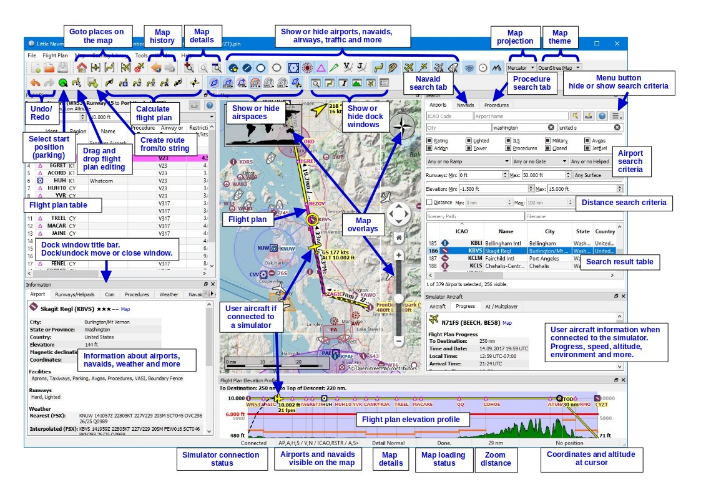

Refer to the picture above (Click to see large version) _Little Navmap_ for a quick overview showing the most important functions.

## General Remarks {#general-remarks}

### User Interface {#user-interface}

The user interface of _Little Navmap_ consists of several dock windows that are arranged around the main window which contains the map view.

The dock windows can be moved around in their docked position and can be detached from the main window by simply dragging them outside of the main window, by double clicking their title bar or clicking on the window symbol on the top left.

Double click onto the dock window&#039;s title bar or click on the window symbol again to move the windows back into their docked position.

All docks can be closed if they are not needed. You can even drop docks on each other to create a tabbed view (tabs will appear at the bottom of the dock stack in this case).

Toolbars are also movable if you click on the left handle and can be closed or undocked from the main window too.

Use the `Main Menu` -&gt; `Window` menu to bring dock windows or toolbars back.

The main window title indicates the currently selected flight simulator database (`FSX`, `FSXSE`, `P3DV2` or `P3DV3`), the flight plan file name and a trailing `*` if the flight plan was changed.

Almost all dialogs, text labels and all information windows in _Little Navmap_ support copy and paste. You can select the text using the mouse and then either use `Ctrl-C` or the context menu to copy it into the clipboard. The information windows even support copying of formatted text.

The table views for the flight plan or airport/navaid search results allow to copy the results in CSV format into the clipboard.

Picture above (Click to see large version): _Little Navmap_ with map and sourrounding docked windows. Currently selected simulator database is FSX, current changed flight plan is `IFR Les Eplatures (LSGC) to Dagali (ENDI).pln`.

### Translation and Locale {#translation-and-locale}

_Little Navmap_ is currently only available in English. I will happily support anybody who would like to translate the user interface into any other language. Despite using the English language in the user interface the locale settings of the operating system will be used. So, e.g. on a German Windows you will see comma as a decimal separator instead of the English dot.

To avoid confusion: The screenshots in this manual were taken using German locale. This means that comma is used as a decimal separator and dot as a thousands separator.

Units cannot be changed currently and are adapted to aviation needs. So feet, nautical miles and knots are used.

### Map Legend {#map-legend}

The legend explains all the map icons and the `Flight Plan Elevation Profile` icons. It is available in the `Information` dock window or as a web browser document: Little Navmap Legend.

### Naming Conventions used in this Manual {#naming-conventions-used-in-this-manual}

*   `Highlighted text` is used to denote window, menu, button, file or directory names.
*   Empty airport: An airport that has no taxiways, no parking positions or gates, no aprons and is not an add-on airport and is not a water airport.
*   Add-on airport: This is an airport that was found outside the Flight Simulator default scenery folder when loading the database.
*   Scenery Library Database: This is an internal database ([SQLite](http://sqlite.org)) that is created by _Little Navmap_ by reading all the flight simulator BGL files. It allows indexing, fast searching and map display.
*   Navaid: VOR, NDB or waypoint
*   Radio navaid: VOR or NDB
*   Parking: GA ramp, cargo ramp, fuel box or gate.
*   Start position: Used for departure in flight plans. Either runway, helipad, GA ramp, cargo ramp, fuel box or gate.
*   Rating: Airports get a zero to five star rating depending on facilities. Airports that have no rating are considered boring and will be displayed using a gray symbol below all other airports on the map (_Empty Airport_). This behavior can be switched off in the `Options` dialog on the `Map Display` tab. The criteria below are used to calculate the rating. Each item gives one star:
    1.  Add-on
    2.  Parking positions (ramp or gate)
    3.  Taxiways
    4.  Aprons
    5.  Tower building (only if at least one of the other conditions is met).

## First Start {#first-start}

The [Scenery Library Dialog](#load-scenery-library-dialog) dialog will be shown when starting _Little Navmap_ the first time. From there you can select all recognized Flight Simulators and load their scenery libraries into _Little Navmap_&#039;s internal database. One database is kept for each simulator and can be changed on the fly in the [Scenery Library](#scenery-library-menu) menu.

A warning dialog will be shown when starting _Little Navmap_ the first time on a system without any flight simulator installations. See chapter [Running without Flight Simulator Installation](#running-without-flight-simulator-installation) for more information on this.

It can happen that the scenery library database has to be updated when you install a new version of _Little Navmap_. A question dialog will pop up and ask if the incompatible database can be erased. You can reload the scenery in the [Scenery Library Dialog](#load-scenery-library-dialog) after erasing the database.

## Menus and Toolbars {#menus-and-toolbars}

This chapter describes all the menu items of _Little Navmap_. You will find most of this functionality on the toolbars as well which are not be described separately. Key combinations can be seen on the menu items and are not listed in this manual.

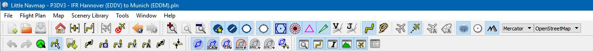

Picture above: Menu and toolbars docked in default positions.

### File Menu {#file-menu}

#### New Flight Plan {#new-flight-plan}

Erases current plan and creates a new one.

#### Open Flight Plan {#open-flight-plan}

Opens a Flight Simulator PLN file. FS9 flight plan files are not supported.

An opened flight plan file will be reloaded on start up (reload and centering can be switched off in the `Options` dialog on the `Startup` and `User Interface` tab).

#### Append Flight Plan {#append-flight-plan}

Adds departure, destination and all waypoints to the current flight plan.

Using `Append Flight Plan` allows to load or merge complete flight plans or flight plan snippets into a new plan. All waypoints are added at the end of the current flight plan. Then you can use the `Delete selected Legs` and `Move selected Legs up/down` context menu items to arrange the waypoints and airports as you like. See [Flight Plan Table View Context Menu](#flight-plan-table-view-context-menu).

#### Save Flight Plan {#save-flight-plan}

#### Save Flight Plan as {#save-flight-plan-as}

Saves the flight plan to a FSX PLN file (XML format).

_Little Navmap_ allows to create flight plans that unusable by the flight simulator. This is the case if a flight plan does not have an airport as departure or destination. A warning dialog will be shown when saving if this is the case.

A warning dialog will also show up if the departure airport has parking positions but no one is assigned to the flight plan.

#### Add Google Earth KML {#add-google-earth-kml}

Allows to add one or more Google Earth KML or KMZ file to the map display. All added KML or KMZ files will be reloaded on start up. Reload and centering can be switched off in the `Options` dialog on the `Startup` and `User Interface` tab.

#### Clear Google Earth KML from Map {#clear-google-earth-kml-from-map}

Removes all loaded KML files from the map.

#### Work Offline {#work-offline}

Stops loading of map data from the internet. This affects the _OpenStreetMap_, _OpenTopoMap_ and all the other online map themes as well as the elevation data.

You should restart the application after going online again.

### File -&gt; Quit {#file-quit}

Exits the application. Will ask for confirmation if there is a changed flight plan.

### Flight Plan Menu {#flight-plan-menu}

#### Undo/Redo {#undo-redo}

Allows to undo and redo all flight plan changes.

#### Select a Start Position for Departure {#select-a-start-position-for-departure}

A parking spot (gate, ramp or fuel box), runway or helipad can be selected as a start position at the departure airport. A parking position can also be selected in the map context menu item [Set as Flight Plan Departure](#set-as-flight-plan-departure) when right clicking on a parking position. If no position is selected the longest primary runway end is selected automatically as start.

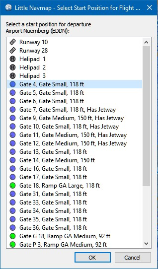

Picture above: The start position selection dialog for EDDN.

#### Edit Flight Plan on Map {#edit-flight-plan-on-map}

Toggles the flight plan drag and drop edit mode on the map. See [Flight Plan Editing](#map-flight-plan-editing).

#### Calculate Direct {#calculate-direct}

Deletes all intermediate waypoints and connects departure and destination using a great circle line.

You can calculate a flight plan between any kind of waypoints, even user defined waypoints (right click on the map and select `Add Position to Flight plan` to create one). This allows to create snippets that can be merged into flight plans. You can use this if you want to cross the North Atlantic with varying destinations on both sides, for example. This applies to all flight plan calculation modes.

#### Calculate Radionav {#calculate-radionav}

Creates a flight plan that uses only VOR and NDB stations as waypoints and tries to ensure reception of at least one station along the whole flight plan. Note that VOR stations are preferred before NDB and DME stations are avoided if possible. Calculation will fail if not enough radio navaids can be found between departure and destination. Buid the flight plan manually if this is the case.

This calculation can also be used to create a flight plan snipped between any kind of waypoint.

#### Calculate high Altitude {#calculate-high-altitude}

Uses Jet airways to create a flight plan.

The resulting minimum altitude is set into the flight plan altitude field. The flight plan altitude field is not changed if no altitude restrictions were found along the flight plan.

A simplified east/west rule is used to adjust the cruise altitude to odd/even values (this can be switched off in the `Options` dialog on the `Flight Plan` tab).

The default behavior is to jump from the departure airport to the next waypoint of a suitable airway and vice versa for the destination. This can be changed in `Options` dialog on the `Flight Plan` tab if VOR or NDB stations are preferred as transition points to airways.

The airway network of Flight Simulator is not complete (the north Atlantic tracks are missing for example - these change daily), therefore calculation across large ocean areas will fail. Create the airway manually as a workaround.

This calculation can also be used to create a flight plan snipped between any kind of waypoint.

#### Calculate low Altitude {#calculate-low-altitude}

Uses Victor airways to create a flight plan. Everything else is the same as in `Calculate high Altitude`.

#### Calculate based on given Altitude {#calculate-based-on-given-altitude}

Use the value in the altitude field of the flight plan to find a flight plan along Victor and/or Jet airways. Calculation will fail if the altitude value is too low. Everything else is the same as in `Calculate high Altitude`.

#### Reverse Flight Plan {#reverse-flight-plan}

Swaps departure and destination and reverses order of all intermediate waypoints. A default runway is assigned for the new departure start position.

### Map Menu {#map-menu}

#### Goto Home {#goto-home}

Goes to home area that was set using [Set Home](#set-home) using the saved position and zoom distance. The center of the home area is highlighted by a  symbol.

#### Go to Center for Distance Search {#go-to-center-for-distance-search}

Go to the center point used for distance searches. See [Set Center for Distance Search](#set-center-for-distance-search).The center for the distance search is highlighted by a  symbol.

#### Center Flight Plan {#center-flight-plan}

Shows the whole flight plan on the map.

#### Center Aircraft {#center-aircraft}

Zooms to the user aircraft if connected to a flight simulator using [Little Navconnect](https://albar965.github.io/littlenavconnect.html) and keeps the aircraft centered.

The centering of the aircraft can be changed in the `Options` dialog on the `Simulator Aircraft` tab.

#### Delete Aircraft Trail {#delete-aircraft-trail}

Removes the user aircraft trail. It is also deleted when connecting to a flight simulator. The trail is saved and will be reloaded on program startup.

#### Map Position Back/Forward {#map-position-back-forward}

Jumps forward or backward in the map position history. The complete history is saved and restored when starting _Little Navmap_.

#### More/Default/Less Details {#more-default-less-details}

Increases or decreases details on the map. More details mean more airports, more navaids, more text information and bigger icons.

Note that map information will be truncated to 3000 objects if too much detail is requested.

#### Projection {#projection}

##### Mercator {#mercator}

A flat projection that gives the most fluid movement and the sharpest map when using picture tile based online maps themes like _OpenStreetMap_ or _OpenTopoMap_.

##### Spherical {#spherical}

Shows earth as a globe which is the most natural projection. Movement can stutter slightly when using the picture tile based online maps themes like _OpenStreetMap_ or _OpenTopoMap_. Use the `Simple`, `Plain` or `Atlas` map themes to prevent this.

Online maps can appear slightly blurred when using this projection. This is a result from converting the image tiles to the spherical display.

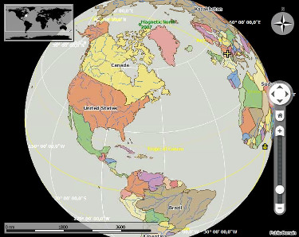

Picture above: Spherical map projection with `Simple` offline map theme selected.

#### Theme {#theme}

Be aware that all the online maps here are delivered from free services which cannot guarantee any download speed or availability. In any case it is easy to deliver and install a new online map description without creating a new _Little Navmap_ release. See [Creating or adding Map Themes](#creating-or-adding-map-themes) for more information on this.

##### OpenStreetMap {#openstreetmap}

This is an online raster (i.e. based on images) map that includes a hill shading option. Note that the _OpenStreetMap_ hill shading does not cover the whole globe.

_OpenStreetMap_ data is not loaded directly from the OSM servers but from the [MapTiles proxy service](https://maptiles.xyz).

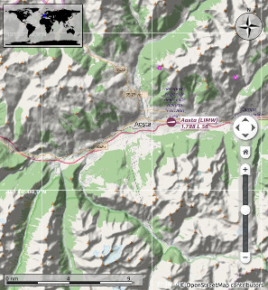

Picture above: View at a Italian airport using _OpenStreetMap_ theme and hill shading.

##### OpenMapSurfer {#openmapsurfer}

The [OSM Roads](http://korona.geog.uni-heidelberg.de) layer provided by [Heidelberg University](http://giscience.uni-hd.de). This theme includes optional hill shading which is available worldwide.

Note that hill shading option of this map is marked experimental.

Map data of this map is © [OpenStreetMap](http://osm.org) contributors, rendering [GIScience Research Group @ Heidelberg University](http://giscience.uni-hd.de), map styling Maxim Rylov.

[SRTM](http://srtm.csi.cgiar.org); ASTER GDEM is a product of [METI](http://www.meti.go.jp/english/index.html) and [NASA](https://lpdaac.usgs.gov/dataset_discovery/aster/aster_policies).

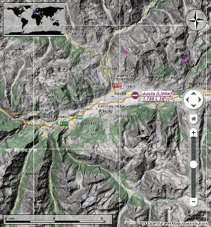

Picture above: View at a Italian airport using the _OpenMapSurfer_ theme and hill shading.

##### OpenTopoMap {#opentopomap}

An online raster map that mimics a topographic map. Includes hill shading and elevation contour lines at lower zoom distances.

The tiles for this map are provided by [OpenTopoMap](http://www.opentopomap.org).

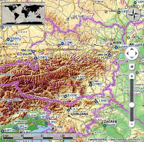

Picture above: View at the eastern Alps using _OpenTopoMap_ theme. A flight plan is shown north of the Alps.

##### Stamen Terrain {#stamen-terrain}

A terrain map featuring hill shading and natural vegetation colors. The hill shading is available worldwide.

Map tiles by [Stamen Design](http://stamen.com), under [CC BY 3.0](http://creativecommons.org/licenses/by/3.0). Data by [OpenStreetMap](http://openstreetmap.org), under [ODbL](http://www.openstreetmap.org/copyright).

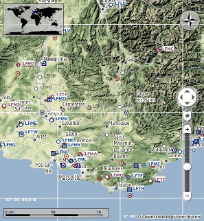

Picture above: View showing _Stamen Terrain_ theme.

##### Simple (Offline) {#simple-offline}

This is an political map using colored country polygons. Boundaries and water bodies are depicted coarse. The map is included in _Little Navmap_. Has an option to display city and country names.

##### Plain (Offline) {#plain-offline}

A very simple map. The map is and included in _Little Navmap_. Has an option to display city and country names. Boundaries and water bodies are depicted coarse.

##### Atlas (Offline) {#atlas-offline}

A very simple map including coarse hill shading and land colors. The map is and included in _Little Navmap_. Has an option to display city and country names. Boundaries and water bodies are depicted coarse.

#### Force Show Addon Airports {#force-show-addon-airports}

Add-on airports are always shown independent of the other airport map settings if this option is selected. This allows to view only add-on airports by checking this option and disabling display of hard, soft and empty airports.

#### Show Airports with hard Runways {#show-airports-with-hard-runways}

Show airports that have at least one runway with a hard surface.

#### Show Airports with soft Runways {#show-airports-with-soft-runways}

Show airports that have only soft surfaced runways or only water runways. This type of airport might be hidden on the map depending on zoom distance.

#### Show empty Airports {#show-empty-airports}

Shows empty airports. This button or menu item might not be visible depending on settings in the `Options` dialog on the `Map Display` tab. The status of this button is combined with the other airport buttons. This means, for example: You have to enable soft surfaced airport display and empty airports to see empty airports having only soft runways.

An empty airport is defined as one which has neither parking nor taxiways nor aprons and is no add-on. These airports are treated differently in _Little Navmap_ since they are the most boring of all default airports. Empty airports are drawn gray and behind all other airports on the map.

Airports having only water runways are excluded from this definition to avoid unintentional hiding.

#### Show VOR Stations {#show-vor-stations}

#### Show NDB Stations {#show-ndb-stations}

#### Show Waypoints {#show-waypoints}

#### Show ILS Feathers {#show-ils-feathers}

#### Show Jet Airways {#show-jet-airways}

#### Show Victor Airways {#show-victor-airways}

Shows or hides these facilities or navaids on the map. Navaids might be hidden on the map depending on zoom distance.

#### Show Flight Plan {#show-flight-plan}

Shows or hides the flight plan. The flight plan is shown independent of the zoom distance.

#### Show Aircraft {#show-aircraft}

Shows the user aircraft if connected to the simulator. The user aircraft is always shown independent of the zoom distance.

The aircraft centering will be switched off when using one of the following functions:

*   Double click into a table view or map display to zoom to an airport or a navaid.
*   Context menu item `Show on map`.
*   `Goto Home` or `Goto Center for Distance Search`.
*   `Map` link in `Information` dock window.
*   `Show Flight Plan`. Either manually in a menu item or after loading.
*   Centering a Google Earth KML/KMZ file after loading

This allows to have a quick look at an airport or navaid during flight. To get back to the aircraft use `Map Position Back` and enable `Show Aircraft` again.

#### Show Aircraft Trail {#show-aircraft-trail}

Shows the user aircraft trail. The trail is always shown independent of the zoom distance. It is saved and will be reloaded on program startup.

The trail is deleted when connecting to a flight simulator or it can be deleted manually by selecting `Main Menu` -&gt; `Map` -&gt; `Delete Aircraft Trail`.

The size of the trail is limited for performance reasons. Points will be removed from the beginning when it gets too long.

#### Show Map Grid {#show-map-grid}

Shows a latitude/longitude grid as well as the [meridian](http://en.wikipedia.org/wiki/Prime_meridian_(Greenwich)) and [anti meridian](http://en.wikipedia.org/wiki/180th_meridian) (near the date line) on the map.

#### Show Country and City Names {#show-country-and-city-names}

Show county, city and other points of interest. Availability of these options depends on the selected map theme. See [Theme](#theme).

#### Show Hillshading {#show-hillshading}

Shows hill shading on the map. Availability of these options depends on the selected map theme. See [Theme](#theme).

### Scenery Library Menu {#scenery-library-menu}

#### Flight Simulators {#flight-simulators}

One menu item is created for each Flight Simulator installation or database found. These menu items allow switching of databases on the fly. The menu item is hidden if only one Flight Simulator was found.

This menu is synchronized with simulator selection in the [Load Scenery Library Dialog](#load-scenery-library-dialog). Once a database is successfully loaded, the display, flight plan and search will switch over to the newly loaded simulator data.

#### Show Database Files {#show-database-files}

This opens _Little Navmap_&#039;s database directory in a file manager. See [Running without Flight Simulator Installation](#running-without-flight-simulator-installation) for more information on copying database files between different computers.

#### Load Scenery Library {#load-scenery-library}

Opens the `Load Scenery Library` dialog. See [Load Scenery Library Dialog](#load-scenery-library-dialog) for more information. This menu item is disabled if no flight simulator installations are found.

### Tools Menu {#tools-menu}

#### Flight Simulator Connection {#flight-simulator-connection}

Opens the `Connect` dialog that allows to connect to a Flight Simulator using the [Little Navconnect](https://albar965.github.io/littlenavconnect.html) agent. See [Connecting to a Flight Simulator](#connecting-to-a-flight-simulator) for more information.

#### Reset all Messages {#reset-all-messages}

This will re-enable all dialogs that were disabled by selecting `Do not show this dialog again` or similar messages.

#### Options {#options}

Opens the [Options dialog](#options-dialog).

### Window Menu {#window-menu}

#### Search {#search}

#### Flight Plan {#flight-plan}

#### Information {#information}

#### Flight Plan Elevation Profile {#flight-plan-elevation-profile}

#### Simulator Aircraft {#simulator-aircraft}

Opens or closes these dock windows.

#### Main Toolbar, Map Toolbar, Map Options Toolbar, Flight Plan Toolbar, Dock Window Toolbar, Statusbar {#main-toolbar-map-toolbar-map-options-toolbar-flight-plan-toolbar-dock-window-toolbar-statusbar}

Shows or hides these toolbars and the statusbar.

### Help Menu {#help-menu}

#### Contents {#contents}

Shows this help in the default web browser.

#### NavMap Legend, Map Legend {#navmap-legend-map-legend}

Shows the map legend in the `Information` dock window. You can also access the navmap legend here: Little Navmap Legend

#### About Little Navmap {#about-little-navmap}

Shows version and revision number for _Little Navmap_, also contains links to the database directory, configuration file, log file and the author&#039;s e-mail address.

#### About Marble {#about-marble}

Information about the [Marble widget](https://marble.kde.org) that is used to download and show the maps.

#### About Qt {#about-qt}

Information about the [Qt application framework](https://www.qt.io) that is used by _Little Navmap_.

## Statusbar {#statusbar}

The statusbar shows various indications (from left to right):

*   Last action or short help to explain a menu item or toolbar button.
*   Indicator that shows airport types and navaids currently visible on the map. The tooltip gives more details.
*   Map detail level.
*   Online map download progress indicator. This shows the state of the current map download:
    *   `Done.`:All map data loaded successfully.
    *   `Waiting for Data ...`:Map data is missing in the cache and was requested. Now waiting for reply.
    *   `Waiting for Update ...`:Map data is already loaded but expired after two weeks. Waiting for new data after requesting an update.
    *   `Incomplete.`:Download failed.Note that the progress indicator can look like it is stuck in the message `Waiting for Data ...` if no hill shading is available for a _OpenStreetMap_ region.
*   Zoom distance (viewpoint to earth surface) in nautical miles.
*   Cursor position on map in degrees/minutes/seconds latitude and longitude.

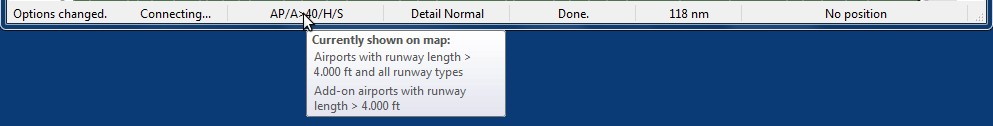

Picture above: Status bar with message about the last action on the left side and a tooltip that indicates what is currently shown on the map. The map shows only airports with runways longer than 4000 feet. No navaids are shown. The map detail level was increased once and the map coordinates are not shown since cursor is not inside the map window. The online map download progress indicator is empty.

## Map Display {#map-display}

### Moving {#moving}

Use click and drag to move the map and the mouse wheel to zoom in or out. You can also use the overlay buttons on the right side of the map.

Alternatively use the cursor keys to scroll the map and `+` and `-` to zoom in and out. `Alt+Left` and `Alt+Right` goes forward or backward in the map position history. Do not forget to activate the map window by clicking into it before using any keys for movements.

### Mouse Clicks {#mouse-clicks}

A single click on an airport, navaid or an airway line shows details in the `Information` dock window.

A double click zooms in showing either the airport diagram or the navaid closely and also shows details in the `Information` dock window.

The double and single click functionality does not work for flight plan waypoints or airports if the flight plan edit mode is enabled. The edit mode can be disabled using the toolbar or `Main Menu` -&gt; `Flight Plan` -&gt; `Edit Flight Plan on Map`.

The mouse click sensitivity can be adjusted in the `Options` dialog on the `Map Display` tab.

### Tooltips {#tooltips}

Hovering the mouse over the map will show tooltips for all map objects like airports, VOR, NDB, airways, parking, fuel box and towers. The tooltip is truncated and shows a message `More...` if it gets too long. In that case reduce details or zoom in.

The sensitivity for tooltip display can be adjusted in the `Options` dialog on the `Map Display` tab.

Picture above: Tooltip with information for a French airport.

### Highlights {#highlights}

Airports or navaids that are selected in the flight plan table or in the search result table are highlighted on the map with a green/black or a yellow/black ring respectively.

These highlight rings provide all functionality of visible map objects, even if the objects are not shown at the current zoom distance (ring is empty). That covers double click for zoom in, single click for information dock window and all context menu entries.

### Airport Diagram {#airport-diagram}

The display will change from a single icon to an airport diagram if you zoom in deep enough to an airport. The diagram shows all taxiways, parking positions, gates, runways and much more.

The airport diagram provides more information through tooltips for parking and tower positions. A right click on a parking position allows to set this as a start position for a flight plan.

See the Nav Map Legend for details about the airport diagram.

Picture above: High level view of the airport diagram of EDDH.

Picture above: Detailed view of the airport diagram. Shows blue gates on the right and a few green general aviation ramp parking on the left. Long displaced threshold of runway 33 is visible.

### Map Context Menu {#map-context-menu}

The map context menu can be activated using right click or the menu key.

#### Show Information {#show-information}

Shows detailed information in the `Information` dock window for the nearest airport, airways or all navaids near the cursor.

See the [Information Dock Window](#information-dock-window) for details.

#### Measure GC Distance from here {#measure-gc-distance-from-here}

Starts a measurment line on the first click. Second click ends measuring and keeps the line. All measurement lines are saved and will be restored on next start up.

You can use the keyboard, mouse wheel or the map overlays to scroll and zoom while dragging a line.

Right click, pressing the escape key or any click outside of the map window cancels the measurment line editing.

Measurement lines use nautical miles as unit. Feet will be added as unit if they are short enough so one can measure e.g. takeoff distance for crossing takeoffs and more around an airport.

A great circle gives the shortest distance from point to point on earth but does not use a constant course. For that reason the measurement line will show two course values. One for the start and one for the end position.

Course is indicated in degrees true. Additional information like ident or frequency will be added to the line if the measurement starts at a navaid or an airport.

See the Nav Map Legend for details on measurement lines.

#### Measure Rhumb Distance from here {#measure-rhumb-distance-from-here}

A rhumb line is a line of constant course and used between the waypoints of an airway or when approaching a VOR or NDB station. Distance between points is longer that the great circle route.

The course for a rhumb line is normally indicated in degrees true. Course will be indicated in degrees magnetic if the measurement starts at a navaid or an airport that have magnetic variation. Additional information like ident and frequency will be added to the line in this case.

#### Remove Distance measurement {#remove-distance-measurement}

This menu item is active if you right click at the end of a distance measurement line (small cross). Removes only the selected line.

#### Show Range Rings {#show-range-rings}

Shows multiple red range rings around the clicked position. Number and distance of the range rings can be changed in the `Options` dialog on the `Map Display` tab. A label indicates the radius of each ring in nautical miles.

#### Show Navaid range {#show-navaid-range}

Shows a ring around the clicked radio navaid (VOR or NDB) indicating the navaid&#039;s range. A label shows ident and frequency and the ring color indicates the navaid type.

#### Remove Range Ring {#remove-range-ring}

Menu item is active if you right click is at the center point of a range ring (small circle). Removes the rings from the map.

#### Remove all Range Rings and Distance measurements {#remove-all-range-rings-and-distance-measurements}

Removes all rings and distance measurement lines from the map.

#### Set as Flight Plan Departure {#set-as-flight-plan-departure}

This is active if the click is at an airport, an airport parking position or a fuel box. It will either replace the current flight plan departure or add a new departure if the flight plan is empty.

The default runway will be used as starting position if the clicked object is an airport. The airport and parking position will replace both the current departure and start position if a parking position is clicked within an airport diagram.

#### Set as Flight Plan Destination {#set-as-flight-plan-destination}

This is active if the click is at an airport. It will either replace the flight plan destination or add the airport if the flight plan is empty.

#### Add Position to Flight Plan {#add-position-to-flight-plan}

Inserts the clicked object into the nearest flight plan leg. The object will be added before departure or after destination if the clicked position is nearby the flight plan ends.

The name of the navaid or airport is shown in the menu item.

A user defined position is added to the flight plan if no airport or navaid is near the clicked position.

#### Delete from Flight Plan {#delete-from-flight-plan}

Deletes the clicked airport, navaid or user position from the flight plan.

#### Show in Search {#show-in-search}

Shows the nearest airport or navaid in the search dialog. The current search parameters are reset.

#### Set Center for Distance Search {#set-center-for-distance-search}

Sets the center point for the distance search function. See [Distance search](#distance-search). The center for the distance search is highlighted by a  symbol.

#### Set Home {#set-home}

Sets the home position and zoom distance. The center of the home area is highlighted by a  symbol.

## Map Flight Plan Editing {#map-flight-plan-editing}

The flight plan drag and drop editing mode is switched on per default but can be disabled using the toolbar or `Main Menu` -&gt; `Flight Plan` -&gt; `Edit Flight Plan on Map`.

You can use the keyboard, the mouse wheel or the map overlays to scroll and zoom while editing the route.

Note that the flight plan drag and drop editing is based on the assumption that a direct connection between departure and destination already exists.

Always select departure and destination first if you like to build you flight plan manually. This will connect both with a great circle line. Based on this line you can start to add navaids to your flight plan.

The following functionality is available:

*   Click on a flight plan leg: Starts editing and adds a new waypoint depending on where the next click is done:
*   *   On a single airport and navaid: Object is inserted into the flight plan segment.
    *   On multiple airports or navaids: A menu pops up that allows to select the object to be inserted.
    *   No airport and no navaid: A user defined position is inserted to the flight plan.
*   Click on waypoint: Starts editing and replaces the clicked waypoint with an object depending on where the next click is done:
*   *   On a single airport and navaid: Object replaces the clicked waypoint.
    *   On multiple airports or navaids: A menu pops up that allows to select the object that should replace the clicked waypoint.
    *   No airport and no navaid: A user defined position replaces the waypoint.
*   Click on departure or destination: Replaces the departure or destination with an object depending on where the next click is done:
*   *   On a single airport: Airport replaces the departure or destination. A default runway is assigned as start position if the departure is replaced with a new airport.
    *   On a navaid: Object replaces departure or destination which results in an invalid flight plan. The flight plan can be saved and loaded (a warning will be shown) but is unusable by Flight Simulator.
    *   On multiple airports or navaids: A menu pops up that allows to select the object that replaces departure or destination.
    *   No airport and no navaid: A user defined position replaces the waypoint resulting in an invalid flight plan.
*   Right click, pressing the escape key or any click outside of the map window: Cancel current operation.

Picture above: Inserting a navaid into a flight plan leg by clicking and moving the leg line. A tool tip for the navaid is shown.

Picture above: Replacing VOR TRA in the flight plan with another one by simply clicking and moving the waypoint TRA onto KLO. A selection menu pops up for disambiguation.

## Search Dock Window {#search-dock-window}

### General {#general}

Two search tabs are available for airport and navaid (VOR, NDB and waypoints) search.

These tabs contain multiple rows of search filters that can be switched on and off with the drop down menu on the hamburger button  on the top right.

The drop down menu prefixes menu items with a change indicator `*` to show that the related filter row has modifications. You can use this to find out why a search does not give the expected results.

Filters are defined by various controls which are mostly self explaining. Only text filters and the tri state checkboxes like `Lighted`, `Approach` or `Closed` need a few extra remarks below.

All filters can be used together where all conditions have to be met (`and` operator). All filters except the distance search filter are applied immediately. The distance search is applied after a short delay for each change.

A tooltip on the blue button on the top right shows a quick help about searching.

#### Text filters {#text-filters}

The standard is to search for entries that start with the entered text.

The placeholder `*` stands for any text. Once a `*` is included in the term, the standard search (match start of text) is no longer used. In that case you might have to add a `*` at the end of the search term as well to get the expected result.

The search is negated (find all entries that do not match) if the first character in a search box is a `-`.

Note that all of the above does not apply to numeric fields like `Runways: Min` or `Altitude: Max`.

#### Tri state checkboxes {#tri-state-checkboxes}

These are used to filter airports by presence of certain facilities or properties.

*   Gray: Condition is ignored.
*   Checked: Condition must match.
*   Unchecked: Condition must not match.

Colors and look of these checkboxes vary with theme and operation system. So instead of gray another color might be used (red fill on Linux or a `-` for macOS).

#### Distance search {#distance-search}

This function allows you to combine all other search options with simple spatial search.

The checkbox `Distance` has to be selected to enable this search. The result will include only airports or navaids that are within the given minimum and maximum range of nautical miles from the search center. This allows you to quickly search for a destination that is within the range of your aircraft and fulfills other criteria like having lighted runways and fuel.

The center for the distance search is highlighted by a  symbol.

To restrict the search further you can select a direction (North, East, South and West).

Check the drop down menu for the change indicator `*` and the search fields for any remaining text if the distance search does not give any or unexpected results.

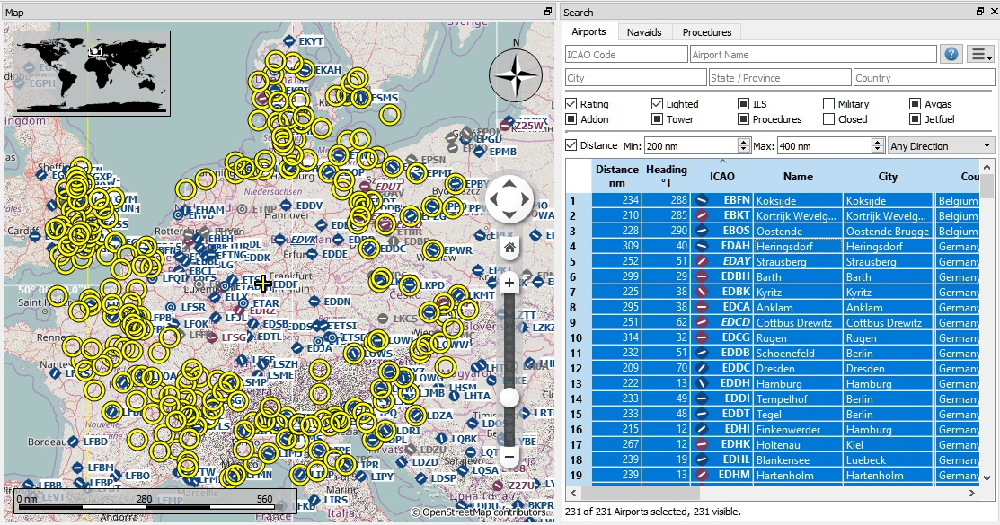

Picture above (Click to see large version): A complex search: Find all airports within a distance between 200 and 400 nautical miles from Frankfurt (EDDF). Airports should have a rating greater than 0 and should have at least one lighted runway. Military and closed airports are excluded. The resulting airports are highlighted on the map by selecting them in the search result table.

### Search Result Table View {#search-result-table-view}

All selected elements in the table view will be highlighted on the map using a black/yellow circle. See [Highlights](#highlights) for more information. Multi selection using `Shift-Click` or `Ctrl-Click` is possible.

The header of all table views allows the following manipulation:

*   Click on the top left corner of the column header:Select all result rows.
*   Click on a column header:Sort ascending or descending (only for search result tables - not for flight plan table).
*   Click and drag on the column header:Change column order.
*   Double click on column border:Automatically fit column size to content.
*   Click and drag on column border:Change column width.

The above applies to all table views in the program.

The program saves the sort order, column widths and positions until `Reset View` is selected in the context menu.

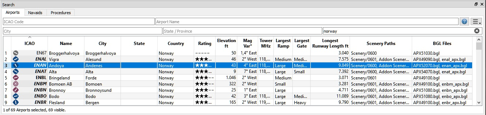

Picture above: Airport search result table. All additional search options are hidden by using the drop down menu of the hamburger button on the top right.

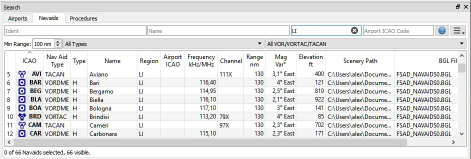

Picture above: Navaid search. All search options are visible. Search is limited to ICAO region `LI` (Italy) and VOR and NDB stations.

### Mouse Clicks {#mouse-clicks-0}

A double click on an entry in the table view shows either an airport diagram or zooms to the navaid. Additionally, details are shown in the `Information` dock window. Single click selects and object and highlights it on the map using a black/yellow circle.

### Search Result Table View Context Menu {#search-result-table-view-context-menu}

#### Show Information {#show-information-0}

Same as the [Map Context Menu](#map-context-menu).

#### Show on Map {#show-on-map}

Shows either the airport diagram or zooms to the navaid on the map.

#### Filter by Entries including/excluding {#filter-by-entries-including-excluding}

Takes the text of the field under the cursor and sets the search filter for an including or an excluding search. This only enabled for text columns.

#### Reset Search {#reset-search}

Clears search filters and shows all entries again in the search result table view.

#### Show All {#show-all}

The table view does not show all entries initially for performance reasons. This menu item allows to load and show the whole search result. The view switches back to the limited number of entries after a search filter is modified or the sort order is changed. The number of all, visible and selected entries is shown at the bottom of the tab.

Be aware that showing all navaids and airports can take some time especially if they are highlighted on the map when selecting all in the search result. The program does not crash but needs a few seconds to highlight all on the map.

#### Show Range Rings {#show-range-rings-0}

#### Show Navaid range {#show-navaid-range-0}

#### Remove all Range Rings and Distance measurements {#remove-all-range-rings-and-distance-measurements-0}

#### Set as Flight Plan Departure {#set-as-flight-plan-departure-0}

#### Set as Flight Plan Destination {#set-as-flight-plan-destination-0}

#### Add Position to Flight Plan {#add-position-to-flight-plan-0}

Same as the [Map Context Menu](#map-context-menu).

#### Copy {#copy}

Copies the selected entries in CSV format into the clipboard. This will consider changes to the table view like column order and sort order. The CSV will include a header line.

#### Select All {#select-all}

Selects all visible entries. To select all available entries the function `Show All` has to be used first.

#### Reset View {#reset-view}

Resets the sort order, the column order and column widths back to default.

#### Set Center for Distance Search {#set-center-for-distance-search-0}

Same as the [Map Context Menu](#map-context-menu).

## Flight Plan Dock Window {#flight-plan-dock-window}

### Upper Part {#upper-part}

The top shows a label that contains departure, departure position (parking, runway or helipad), destination, flight plan distance, traveling time and flight plan type.

Besides the label there are three input fields on top of this dock window:

*   Speed (kts): The value of this field is used only for calculating traveling times in the table view: `Leg Time` and `ETA` (estimated time of arrival at a waypoint given 0:00 as start time). It is not saved with the flight plan and not used for simulator user aircraft calculations.
*   Cruise altitude (ft): This value is saved with the flight plan and is also used to calculate an airway flight plan based on given altitude. This field receives the minimum altitude for a flight plan if a plan along Victor or Jet airways is calculated and altitude restrictions were found. See [Calculate based on given Altitude](#calculate-based-on-given-altitude).
*   Flight Plan Type (IFR or VFR): This is saved with the flight plan.

### Flight Plan Table {#flight-plan-table}

The table view allows the same operations as the search table view except sorting. See [here](#tableviewops).

All selected elements in the flight plan table view will be highlighted on the map using a black/gree circle. See [Highlights](#highlights) for more information. Multi selection using `Shift-Click` or `Ctrl-Click` is possible.

Note on the table columns `Course °M` and `Direct °M`:

*   `Direct °M:` This is the constant course of the rhumb line connecting two waypoints of a leg. Depending on route and distance it can differ from the course of the great circle line. Use this course if you travel along airways or towards VOR or NDB stations. Opposed to the course shown by the flight simulator GPS unit this will give you the precise radial when approaching a VOR or NDB on a flight plan.
*   `Course °M:` This is the start course of the great circle route connecting the two waypoints of the leg. Use this course at departure if you travel long distances without navaids. Be aware that you have to change you course constantly when travelling along a great circle line.

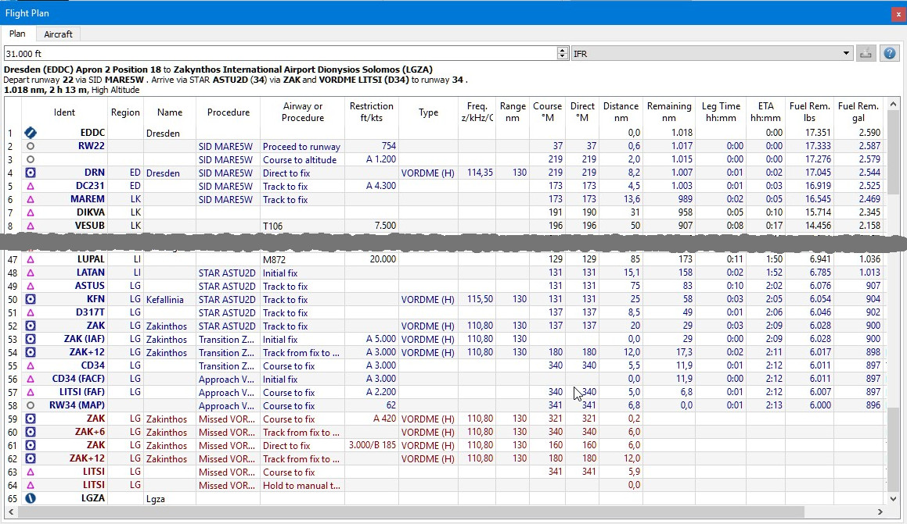

Picture above: The `Flight Plan` dock window.

### Mouse Clicks {#mouse-clicks-1}

A double click on an entry in the table view shows either an airport diagram or zooms to the navaid. Additionally, details are shown in the `Information` dock window. Single click selects and object and highlights it on the map using a black/green circle.

### Flight Plan Table View Context Menu {#flight-plan-table-view-context-menu}

#### Move Selected Legs up/down {#move-selected-legs-up-down}

Moves all selected flight plan legs up or down in the list. This works also if multiple legs are selected.

Airway names will be removed when waypoints in the flight plan are moved or deleted. That is because the new flight plan legs will not follow any airway but rather use direct connections.

#### Delete Selected Legs {#delete-selected-legs}

Deletes all selected flight plan legs. Use `Undo` if you deleted legs accidentally.

#### Show Information {#show-information-1}

Same as the [Map Context Menu](#map-context-menu).

#### Show on Map {#show-on-map-0}

Shows either the airport diagram or zooms to the navaid on the map.

#### Show Range Rings {#show-range-rings-1}

Same as the [Map Context Menu](#map-context-menu).

#### Show Navaid range {#show-navaid-range-1}

Will show the range rings for all selected radio navaids in the flight plan. You will get a range circle for each radio navaid on the flight plan if you simply select all legs of the flight plan and use this function.

Otherwise, the same as the [Map Context Menu](#map-context-menu).

#### Remove all Range Rings and Distance measurements {#remove-all-range-rings-and-distance-measurements-1}

Same as the [Map Context Menu](#map-context-menu).

#### Copy {#copy-0}

Copies the selected entries in CSV format into the clipboard. The CSV will include a header. This will consider changes to the table view like column order.

#### Select All {#select-all-0}

Selects all flight plan legs.

#### Reset View {#reset-view-0}

Resets the column order and column widths back to the default view.

#### Set Center for Distance Search {#set-center-for-distance-search-1}

Same as the [Map Context Menu](#map-context-menu).

## Information Dock Window {#information-dock-window}

This dock window contains text information about airports in several tabs as well as information for one or more navaids or airways in another tab. Also, included are the legend for the navigation symbols and the general map legend which depends on the selected map theme.

All information can be copied into the clipboard as formatted text. Use the context menu of the text fields or use `Ctrl-A` to select all and `Ctrl-C` to copy the content to the clipboard.

Note that the airport and airport related tabs are preferred. So, when you click on an airport and a navaid, the airport tab is shown. The navaid tab is also filled in this case but the airport tab is pulled to the foreground.

A link `Map` allows jumping to the shown airport or navaid on the map.

Picture above: Airport information overview. Additional tabs show information for runways, COM frequencies and approaches.

Picture above: Navaid information. Two navaids were close to the cursor when clicked.

## Simulator Aircraft Dock Window {#simulator-aircraft-dock-window}

This dock window shows information similar to a flight management computer about the user aircraft. _Little Navmap_ has to be connected to the simulator to enable this functionality. The dock window contains one tab that shows general aircraft data like gross weight and another tab that displays flight data, flight plan progress, weather and ambient parameters.

See [Connecting to a Flight Simulator](#connecting-to-a-flight-simulator) for more information on this topic.

Picture above: Aircraft information when connected to a Flight Simulator.

Picture above: Progress and ambient information of the current flight situation. Some fields or tables like `Next Waypoint` are only available when a flight plan is loaded.

## Flight Plan Elevation Profile Dock Window {#flight-plan-elevation-profile-dock-window}

This dock window shows the ground elevation and flight plan cruise altitude together will all flight plan waypoints. It is only available when a flight plan is loaded. The user aircraft will be shown too if _Little Navmap_ is connected to the simulator.

Elevation processing is done in the background since data has to be downloaded and computation is CPU intense. Therefore, the udpdate of the elevation display can take from a few seconds up to half a minute. This background update is started after creating or changing the flight plan or when new elevation data was downloaded. The display will be updated accordingly whenever new data is available.

Close the `Flight Plan Elevation Profile` window if you think this causes performance problems or stutters. All updates will stop once the window is closed.

Be aware that the elevation display covers only the flight plan and will not change the depiction if you get off flight plan with your simulator aircraft. Also, aircraft climb is not shown (no aircraft profiles yet). The flight plan is only shown at cruise level, although you will see your user aircraft and trail climbing and descending.

Note that the elevation data does not cover all countries and currently ends at 60 degrees north.

Additional information is shown in a label on top of the window if the mouse is hovered over the diagram. The corresponding position within the flight plan is highlighted on the map too.

Following information is shown in the top label when hovering the mouse over the diagram:

*   From and to waypoint
*   Distance from departure and to destination
*   Ground elevation
*   Flight plan cruise altitude above ground
*   Safe altitude for the current flight plan leg at the hovering position

For more information see the `Navmap Legend` tab in the `Information` dock window or the Little Navmap Legend.

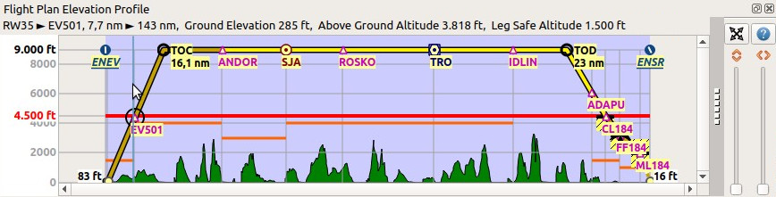

Picture above: Flight plan elevation profile with line indicating the mouse hovering position.

## Weather {#weather}

_Little Navmap_ can display METARs from four sources:

*   [NOAA](http://www.weather.gov) online weather service
*   [VATSIM](http://www.vatsim.net) network online weather service
*   [HiFi Simulation Technologies](http://www.hifisimtech.com) _Active Sky Next_
*   [HiFi Simulation Technologies](http://www.hifisimtech.com) _AS16_

You can define in the `Options` dialog on the `Weather` tab which sources are used to display the METAR information in tooltips or the `Information` dock window.

Both Active Sky programs are recognized automatically on startup for each simulator. The `current_wx_snapshot.txt` file is loaded and monitored for changes.

You can also select the `current_wx_snapshot.txt` file manually. In that case the METARs from this file are displayed for all installed flight simulators.

## Options Dialog {#options-dialog}

Most options are self explaining and tooltips contain more detailed explanations if applicable. Therefore, a more detailed description is not needed here.

The button `Restore Defaults` only restores the options of this dialog back to default. Other settings like map display, table views or dock window positions are not affected. To reset all saved settings completely see [Troubleshoot](#troubleshoot).

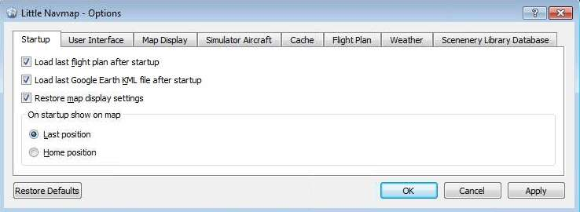

Picture above: `Startup` tab of the options dialog.

## Load Scenery Library Dialog {#load-scenery-library-dialog}

This dialog allows to load the scenery library data from all four supported flight simulators into the _Little Navmap_ internal database. The scenery library to load can be selected in the `Simulator:` drop down box.

The dialog shows information about the currently selected database like number of loaded airports, database version and more.

The base path and the `scenery.cfg` path will be shown in two text edit fields for the currently selected simulator. These fields are populated automatically, but can be changed to any other valid location. All values are saved for each flight simulator type.

Loading a scenery library can take three to six minutes depending on your setup and amount of scenery add-ons. You can speed this up by excluding directories containing neither airport nor navigation data in the `Options` dialog on the `Scenery Library Database` tab.

The previous scenery library database will be restored if you cancel the loading process or if the loading process fails.

All airports that are not located in the default `Scenery` directory are considered add-on airports and will be highlighted appropriately. Directories can be excluded from this behavior in the `Options` dialog on the `Scenery Library Database` tab. This can be useful if add-ons only correct airport elevation and these airports should not be hightlighted on the map using underline and italic text.

The menu `Scenery Library` -&gt; `Flight Simulators` is synchronized with the simulator selection in the dialog. Once a database is successfully loaded, the display, flight plan and search will switch over to the newly loaded simulator data.

The program tries to find the base paths and `Scenery.cfg` files automatically. The typical locations of the `Scenery.cfg` for Windows 7/8/10 are:

*   Flight Simulator X: `C:\ProgramData\Microsoft\FSX\Scenery.cfg`
*   Flight Simulator - Steam Edition: `C:\ProgramData\Microsoft\FSX-SE\Scenery.cfg`
*   Prepar3D v2: `C:\Users\YOUR_ACCOUNT_NAME\AppData\Roaming\Lockheed Martin\Prepar3D v2\Scenery.cfg`
*   Prepar3D v3: `C:\ProgramData\Lockheed Martin\Prepar3D v3\Scenery.cfg`

An error dialog is shown after loading if any BGL files could not be read. In this case you should check if the airports of the affected sceneries display correctly and show the correct information.

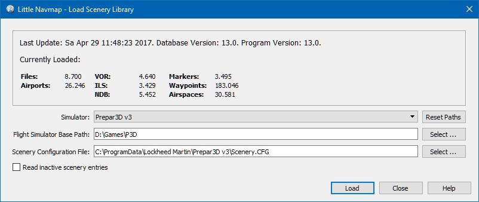

Picture above: Load Scenery Dialog. Nothing is loaded yet for FSX.

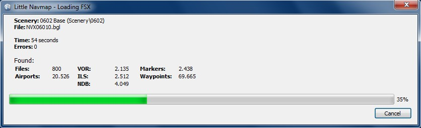

Picture above: Progress dialog shown while loading the scenery library into _Little Navmap_&#039;s internal database.

Note that the number of airports, navaids and other objects shown in the `Load Scenery Library` might differ to the numbers shown in the progress dialog. This is the case since all stock and add-on airports are counted in the progress dialog. Add-on airports usually replace stock airports which results in a different number in the `Load Scenery Library` dialog. Also duplicate navaids are removed after loading.

## Running without Flight Simulator Installation {#running-without-flight-simulator-installation}

You can follow these steps if you want to install _Little Navmap_ on a computer not containing any flight simulator installation. No functionality is affected except scenery database loading which is not needed in this case.

The same procedure applies if you want to install _Little Navmap_ on a Linux or macOS system.

This is typically used when connecting to the flight simulator to watch the progress of a flight. Flight plans can be created, loaded and saved on the client computer. You only have to make sure that these are transfered to the flight simulator computer using Windows shares or by other means.

1.  Install _Little Navmap_ on both your flying computer and the client computer without simulator.
2.  Start it on the flying computer and generate the scenery library databases. See [Load Scenery Library Dialog](#load-scenery-library-dialog) above for more information.
3.  Select `Main Menu` -&gt; `Scenery Library` -&gt; `Show Database Files` on the flying computer. This will open the directory containing the database files in a file manager. You will find one or more database file like `little_navmap_fsx.sqlite` or `little_navmap_p3dv3.sqlite`.
4.  Exit _Little Navmap_ on the flying computer.
5.  Start _Little Navmap_ on the client computer and select `Scenery Library` -&gt; `Show Database Files`.
6.  Exit _Little Navmap_ on the client computer.
7.  Copy the database files to your client computer using network shares, USB sticks or whatever you like. Use the file manager windows opened by the procedures above.
8.  Start _Little Navmap_ on the client computer. The menu `Scenery Library` should contain an entry for each copied database file or no entry at all if only one file was copied. Airport icons should be visible on the map in either case.

See next chapter about connecting to the flight simulator.

## Connecting to a Flight Simulator {#connecting-to-a-flight-simulator}

User aircraft information is transfered to _Little Navmap_ by using the [Little Navconnect](https://albar965.github.io/littlenavconnect.html) agent on the flying computer which saves the error prone setup of a remote SimConnect connection.

The setup procedure is the same for both remote connections and local connections. In the latter case all programs run on the same computer which is both flying and client computer.

_Little Navmap_ cannot connect to the flight simulator directly. The _Little Navconnect_ agent is always needed, even if all programs run on the same computer.

1.  Install [Little Navconnect](https://albar965.github.io/littlenavconnect.html) on the computer that is running the flight simulator. Start it and take note of the message that is printed on the logging window. You only need the colored values. You can use the IP address or the hostname. _Little Navconnect_ can print multiple IP addresses or hostnames depending on your network configuration. This can happen if you have ethernet plugged in and are connected using wireless LAN too, for example. You have to try if you are unsure which one to use. `localhost` and `127.0.0.1` will be used if you are not connected to a network.

    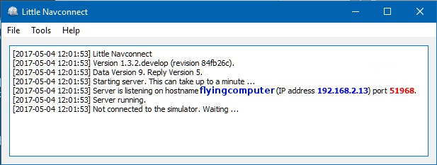

    Picture above: [Little Navconnect](https://albar965.github.io/littlenavconnect.html) is running and waiting for a Flight Simulator.

    Change the port in _Little Navconnect_ &#039;s `Options` dialog if you see an error message like shown below:

    <pre>[2016-07-27 16:45:35] Unable to start the server: The bound address is already in use.
    </pre>

2.  Start _Little Navmap_ on the client computer.
3.  Open the connection dialog in _Little Navmap_ by selecting `Main Menu` -&gt; `Tools` -&gt; `Flight Simulator Connection`.

    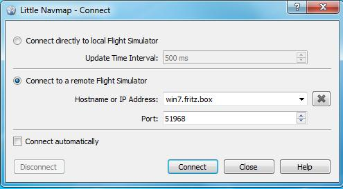

    Picture above: Connect dialog with correct values to access the [Little Navconnect](https://albar965.github.io/littlenavconnect.html) shown above.

4.  Add the value for hostname. This can be either the hostname or the IP address printed by _Little Navconnect_. You can use `localhost` if all programs are running on the same computer.
5.  Check the value for the port. `51968` is the default value and does not need to be changed usually.
6.  Click connect. The dialog will close and _Little Navmap_ will try to establish a connection in the background which can take some time, depending on your network. Your aircraft will show up on the map and on the `Simulator Aircraft` dock window once a flight is set up and loaded on the simulator. You will see the message `Connected. Waiting for update.` in the `Simulator Aircraft` dock window if no flight is loaded yet (i.e. the simulator still shows the opening screen). Note that it sometimes can take a while until an error is shown if you used the wrong values for hostname or port.

## Creating or adding Map Themes {#creating-or-adding-map-themes}

To add an arbitrary online of offline map to _Little Navmap_ simply add the map directory from a downloaded or self created map theme to the `data\maps\earth` directory.

The full path to the DGML file (see links below for more details about DGML) describing the map must be `c:\Own Programs\Little Navmap\data\maps\earth\opencyclemap\opencyclemap.dgml` if you like to add the [OpenCycleMap](http://www.opencyclemap.org) for example. The DGML file can refer to an online map service or to included offline map data. Usually a map theme contains many more files than only the DGML.

The menu `Main Menu` -&gt; `Map` -&gt; `Theme` and the toolbar drop down box will receive an entry for each additional map theme.

The options `Show Country and City Names` and `Show Hillshading` are enabled for all additional map themes but might not work depending on properties defined in the map&#039;s DGML file.

More maps and information about map configuration and DGML files can be found here on the Marble/KDE pages:

*   Download more maps for the Marble widget (only Earth maps are supported in `Little Navmap`): [Additional Maps](https://marble.kde.org/maps.php)
*   A tutorial that shows how to create a map theme based on tiled images: [Marble/CustomMaps](https://techbase.kde.org/Marble/CustomMaps)
*   A tutorial showing how to create a map theme based on [OSM Slippy Maps](http://wiki.openstreetmap.org/wiki/Slippy_map_tilenames): [How to create map themes based on OSM slippy maps](https://techbase.kde.org/Marble/OSMSlippyMaps)
*   How to create a historical map for Marble: [Historical Maps for Marble](https://techbase.kde.org/Marble/HistoricalMaps)

## Troubleshoot {#troubleshoot}

*   Delete the settings and the database files if the program crashes during start up. In Windows 7, 8 or 10 these can be found in `c:\Users\YOURUSERNAME\Appdata\Roaming\ABarthel`. Delete the files `little_navmap.ini`, `little_navmap.track`, `little_navmap.history` and the directory `little_navmap_db`.
*   Hiding the map screen overlays cannot be undone in the GUI. Restart _Little Navmap_ to get the overlays back.
*   Zoom can be too fast when using a touchpad with _OpenStreetMap_, _OpenTopoMap_ or one of the other online map themes. Use the `Plain`, `Simple` or `Atlas` map themes or use the overlay zoom buttons or the keyboard (`+` and `-`).
*   Online maps like _OpenStreetMap_ or _OpenTopoMap_ maps can end up blurred when using functionality like `Center Flight Plan` or `Go to Home`. Zoom once in and out using the mouse wheel, overlay zoom buttons or keyboard to fix this.
*   _OpenStreetMap_ shows a dark gray background on some places without hill shading coverage (for example New Zealand). Use another map theme or switch off hill shading for the _OpenStreetMap_.
*   You can exclude scenery directories in the `Options` dialog on the `Scenery Library Database` tab if loading of an add-on BGL causes the program to crash. Do not restart the program after the crash and instead load the log file `C:\Users\YOURUSERNAME\AppData\Local\Temp\abarthel-little_navmap.log`. The path may vary depending on your Windows installation. Search for the last line in the log-file that looks like:

    <pre>[2016-10-14 22:58:21.903 default INFO ]  unknown: ==== &quot;404 of 521 (77 %)&quot; &quot;APX41080.bgl&quot;
    </pre>

    Search for `APX41080.bgl` and exclude its directory from loading in the `Options` dialog.

## Known Problems {#known-problems}

*   Some airport add-ons do not modify the stock airports but only add new scenery and buildings. These add-ons will not be recognized as such and are therefore not highlighted on the map (italic and underlined text).
*   Add-on developers have to use all kind of workarounds to avoid FSX&#039; limitations. So the display and information given for add-on airports is not always correct. Typical examples are: Airports without runways, airports with runway dimensions 0 by 0 ft or 0 ft runway width, taxiways with 0 ft width, seemingly closed taxiways, duplicate airports and more.
*   Some KML/KMZ files do not show up on the map. Adding a centerpoint pushpin to the KML/KMZ file can fix this.
*   World coverage for elevation and _OpenStreetMap_ hill shading data is limited and currently ends at 60 degree north. Use the _OpenTopoMap_, _OpenMapSurfer_ or _Stamen Terrain_ map themes which have world wide coverage for hill shading.
*   There are errors in the elevation source data (like in northern Italy, Po Valley) which will show up in the flight plan elevation profile.
*   The Mercator projection shows occasional display problems depending on zoom distance like horizontal lines near the anti meridian or missing flight plan segments.
*   _OpenTopoMap_ has garbled names in some asian countries.
*   The Marble floating map overlays on the map can be configured but do not save all settings.
*   Flight plan and airways are drawn using great circle lines instead of rhumb lines. Distance and course are not affected by this.
*   Magnetic variance is partially not set (for example VORDME Cambridge Bay YCB). This is an error in the source data and can be fixed with a workaround in the future.
*   Airports are misplaced compared to the background maps. This is an error in the source data and cannot be fixed.
*   Flight plan calculation along airways can result in unusable plans when using the [FSX/P3D Navaids update](http://www.aero.sors.fr/navaids3.html)s. Everything else should work as expected.
*   macOS: Dock windows cannot be resized when undocked from main window.
*   macOS: Start position on the map is not restored properly. Use home as start position instead.
*   macOS: KML files are not centered after loading.

## How to report a Bug {#how-to-report-a-bug}

If something goes wrong send me any involved files like KML, PLN or BGL (if copyright permits), _Little Navmap_&#039;s log file and configuration file which both can be located in the about dialog. My e-mail address is shown in the about dialog of _Little Navmap_ as well.

Please add all steps that are neccessary to reproduce the error.

When an error occurs during loading of the scenery library send me the offending BGL file if possible. The full name and path of the file is shown on top of the error dialog if a specific BGL is the cause.

If you&#039;re concerned about privacy when sending log files: The log files will contain all system paths (like your `Documents` directory) which will also include your username as a part of the path. They might also contain your computer&#039;s name IP address in your network.

In no case file names from anything else than flight simulator paths/files or configuration files are included. No names or content of personal files is included in the log files.

I&#039;d suggest to remove this information if you&#039;re concerned about it.

I strongly recommend to send the log files by PM or by email and not attach them to forum posts where they are publicly visible.

## Files {#files}

Log files of _Little Navmap_ for Windows 7/8/10 are typically stored in the directory:

`C:\Users\YOURUSERNAME\AppData\Local\Temp`

The program keeps three log files and rotates these on each startup. So you can find up to three logs:

`abarthel-little_navmap.log`, `abarthel-little_navmap.log.1` and `abarthel-little_navmap.log.2`.

All configuration files of my programs for Windows 7/8/10 are typically stored in the directory:

`C:\Users\YOURUSERNAME\AppData\Roaming\ABarthel`

There are three configuration files for this program:

*   `little_navmap.ini`: INI style configuration file. Text file.
*   `little_navmap.history`: The map position history. Binary file.
*   `little_navmap.track`: The user aircraft track. Binary file.

The disk cache that is used to store all the downloaded online map tile images can be found here:

`C:\Users\YOURUSERNAME\AppData\Local\.marble\data`

The scenery library databases are stored in the directory:

`C:\Users\YOURUSERNAME\AppData\Roaming\ABarthel\little_navmap_db`

There can be up to five files depending which simulators you have installed and which scenery libraries you&#039;ve loaded.

All these databases are [SQLite](http://sqlite.org) files than can be viewed with e.g. [DB Browser for SQLite](https://github.com/sqlitebrowser/sqlitebrowser/releases) if you&#039;re interested in relational databases.

The files are:

*   `little_navmap_.sqlite`:An empty dummy database.
*   `little_navmap_fsx.sqlite`:Flight Simulator X
*   `little_navmap_fsxse.sqlite`:Flight Simulator - Steam Edition
*   `little_navmap_p3dv2.sqlite`:Prepar3D v2
*   `little_navmap_p3dv3.sqlite`:Prepar3D v3

## Acknowlegments {#acknowlegments}

A big thank-you for all people supporting me throughout the beta phase, sending me their log files, screen shots, ideas for improvements, friendly messages and more.

A very special thank-you to Roberto S. from Switzerland for his valuable input and also helping with his capability to find the most obscure bugs.

Thanks to all in the forums who patiently supported me and gave invaluable feedback during the public beta:

[AVSIM](http://www.avsim.com), [SimOuthouse](http://www.sim-outhouse.com), [FlightX.net](http://flightx.net) and [FSDeveloper.com](http://www.fsdeveloper.com).

This project and my library [atools](https://github.com/albar965/atools) would not exist without the fabulous documentation of the BGL files in the [FSDeveloper Wiki](http://www.fsdeveloper.com/wiki). So, here a huge thank-you to all the contributors.

Without the open source [Marble](https://marble.kde.org) widget that allows me to access and display all the maps I would still be busy doing that myself for years.

No [Qt application framework](https://www.qt.io) and I could not even draw a simple button.

Let&#039;s not forget about all the services that provide us all the online maps for free:

[Stamen Design](http://maps.stamen.com), [MapTiles](http://maptiles.xyz) and [OpenTopoMap](http://www.opentopomap.org).

A thank-you to the [GIScience / Geoinformatics Research Group](http://www.geog.uni-heidelberg.de/gis/index_en.html) of Heidelberg University for kindly giving me permission to use their map [OpenMapSurfer](http://korona.geog.uni-heidelberg.de).

And last but not least: If there were no [OpenStreetMap](http://www.openstreetmap.org) and its thousands of contributors nobody of us would have any map at all.

## License {#license}

This program is free software: you can redistribute it and/or modify it under the terms of the GNU General Public License as published by the Free Software Foundation, either version 3 of the License, or (at your option) any later version.

This program is distributed in the hope that it will be useful, but WITHOUT ANY WARRANTY; without even the implied warranty of MERCHANTABILITY or FITNESS FOR A PARTICULAR PURPOSE. See the GNU General Public License for more details.

You should have received a copy of the GNU General Public License along with this program. If not, see &lt;[http://www.gnu.org/licenses/](http://www.gnu.org/licenses/)&gt;.

Last update 2016-10-18