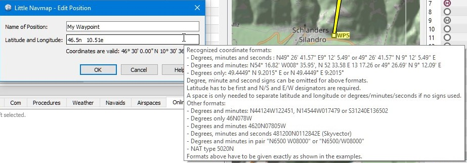

##Koordinaten-Formate {#coordinates-formats}

Dieses Kapitel beschreibt kurz die erkannten Koordinatenformate in Flugplanpositions- und Userpoint-Dialogen.

Das Eingabefeld zeigt eine Meldung an, ob die Koordinaten erkannt wurden und zeigt die übersetzten Koordinaten im voreingestellten Format, wie im Dialog `Optionen` auf der Registerkarte `Einheiten` gewählt. Im Fehlerfall wird eine rote Meldung angezeigt.

Überprüfen Sie die angezeigten übersetzten Koordinaten, um sicherzustellen, dass Ihre Eingabe korrekt geparst wurde.

_**Bild oben:** Bearbeiten einer benutzerdefinierten Flugplanposition. Tooltip gibt eine schnelle Hilfe zu Koordinatenformaten._

### Allgemeines

Der Breitengrad muss der erste und der Längengrad der zweite sein.

N/S- und E/W-Kennungen sind erforderlich. Groß-/Kleinschreibung spielt keine Rolle.

Grad-, Minuten- und Sekundenzeichen können weggelassen werden, wenn Zahlen durch Leerzeichen getrennt sind.

Ein Leerzeichen ist nur erforderlich, um Breiten- und Längengrad oder Grad/Minuten/Sekunden zu trennen, wenn keine Einheitszeichen verwendet werden.

Dezimaltrennzeichen kann der Punkt \(Englisch\) oder das ortsabhängige Trennzeichen wie z.B. Komma \(Deutsch\) sein.

###Andere Formate

Diese müssen genau wie in den Beispielen angegeben werden.

* Grad und Minuten: `N44124W122451`, `N14544W017479` oder `S31240E136502`.
* Grad nur `46N078W`
* Grad und Minuten `4620N07805W`
* Grad, Minuten und Sekunden `481200N0112842E` \(Skyvector\)
* Grad und Minuten im Paar `N6500 W08000` oder `N6500/W08000`.
NAT-Typ `5020N`

### Beispiele

* Grad, Minuten und Sekunden: `N49° 26' 41.57" E9° 12' 5.49"` oder `49° 26' 41.57" N 9° 12' 5.49". E`
* Grad und Dezimalminuten: `N54* 16.82' W008* 35.95'`, `N 52 33.58 E 13 17.26` oder `49° 26.69' N 9° 12.09' E`.
* Nur Dezimalgrade: `49.4449° N 9.2015° E` oder `N 49.4449° E 9:2015°`.

