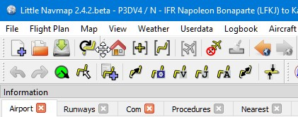
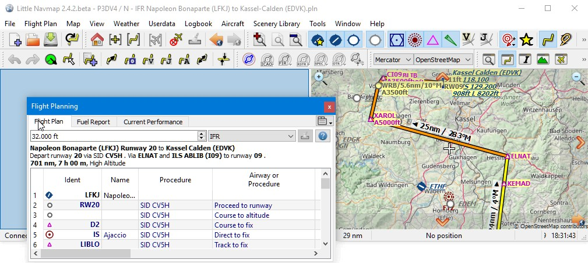
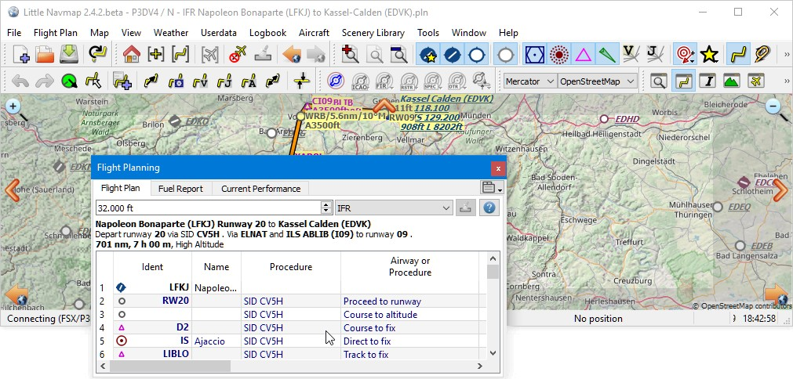
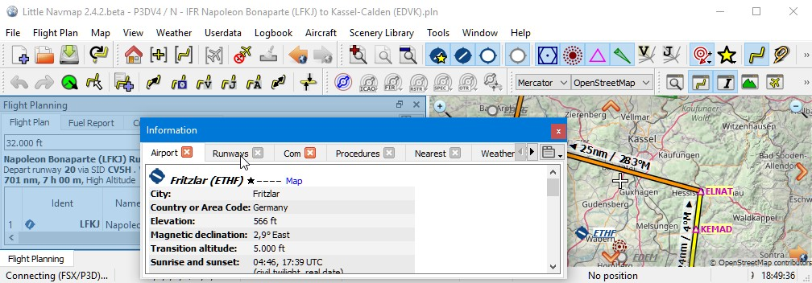
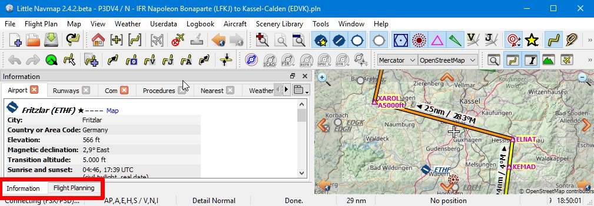

## Dockfenster

Die Benutzeroberfläche von _Little Navmap_ besteht aus einem Hauptfenster und mehreren Dockfenstern, die vom Hauptfenster getrennt oder innerhalb des Hauptfensters angeordnet werden können.

Die angedockten Fenster können in ihrer angedockten Position bewegt und vom Hauptfenster gelöst werden, indem man sie einfach außerhalb des Hauptfensters zieht (zum Ziehen auf die Titelleiste klicken), auf ihre Titelleiste doppelklickt oder auf das Fenstersymbol oben rechts klickt.

Doppelklicken Sie auf die Titelleiste des angedockten Fensters oder klicken Sie erneut auf das Fenstersymbol, um die Fenster wieder in ihre angedockte Position zu bringen.

Alle angedockten Fenster, mit Ausnahme des Kartenfensters, können geschlossen werden, wenn sie nicht benötigt werden. Sie können auch angedockte Fenster aufeinander legen, um eine Tabbed View zu erstellen. Die Registerkarten erscheinen in diesem Fall am unteren Rand des Dockstapels.

Beachten Sie, dass sich die Dockfenster automatisch öffnen, wenn Sie Funktionen wie `Informationen anzeigen` oder z.B. das Benutzerflugzeug anklicken.

Halten Sie beim Anklicken der Fenstertitelzeile `Strg` gedrückt, um zu verhindern, dass ein Fenster im Hauptfenster in den angedockten Zustand zurückkehrt und schwebt.

Symbolleisten sind auch durch Klicken auf den linken Griff verschiebbar und können ähnlich wie die Dockfenster geschlossen oder vom Hauptfenster gelöst werden. Symbolleisten können auch im Hauptmenü `Fenster` geöffnet und geschlossen werden.

_**Bild oben:** Cursor über der Symbolleiste, die angeklickt werden muss, um die Symbolleiste zu verschieben oder abzukoppeln._

**Verwenden Sie das Menü **` Fenster`** im Hauptmenü, um geschlossene Fenster, Symbolleisten und Registerkarten wiederherzustellen.**

**Mit dem Menüpunkt ** ` Fenster` -> `Fensteranordnung zurücksetzen`** im Hauptmenü können Sie den Zustand und die Positionen aller Dockfenster und Symbolleisten wieder auf den Standard zurücksetzen.**

_**Bild oben:** Titelleiste eines Dockfensters rot markiert._

_**Bild oben:** Bewegen eines Dockfensters umher. Der blaue Hintergrund öffnet sich, um ein Feld im Hauptfenster anzuzeigen, in dem das Dock abgelegt werden kann._

_**Bild oben:** Dockfenster im Floating-Status._

_**Bild oben:** Ein Dockfenster auf ein anderes ziehen, um einen Stapel zu erstellen._

_**Bild oben:** Ein Stapel von zwei Dockfenstern. Die Tab-Leiste ist am unteren Rand der gestapelten Dockfenster rot markiert._
