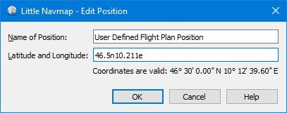

## Edit Flight Plan Position {#edit-flightplan-position}

In diesem Dialog können Sie eine benutzerdefinierte Flugplanposition bearbeiten, die Sie über  [Position zum Flugplan hinzufügen](MAPDISPLAY.md#add-position-to-flight-plan) oder  [Position an den Flugplan anhängen](MAPDISPLAY.md#append-position-to-flight-plan) hinzugefügt haben.

### Name

Sie können eine beliebige Zeichenfolge eingeben, aber alle ungültigen Zeichen werden beim Speichern als FSX / P3D PLN-Datei entfernt. Andere Dateiformate haben mehr Einschränkungen.

Erlaubt sind Groß- und Kleinschreibung, Ziffern, Unterstrich `_` und Leerzeichen. Alle anderen Zeichen werden entfernt, wenn der Flugplan gespeichert wird und lange Namen werden auf 10 Zeichen gekürzt.

### Koordinaten

Sie können die Koordinaten auch direkt in diesem Dialog bearbeiten, indem Sie die Drag & Drop-Funktion  [Flugplan auf der Karte bearbeiten](MAPFPEDIT.md) verwenden. Dieses kann nützlich sein, wenn Sie Wegpunkte mit bekannten Koordinaten wie visuellen Berichtspunkten hinzufügen möchten.

Der Tooltip des Koordinateneingabefelds zeigt die verfügbaren Formate an.

Für weiere Informationen siehe auch [Koordinatenfromate](COORDINATES.md).

_**Bild oben:** Bearbeiten einer benutzerdefinierten Flugplanposition._

