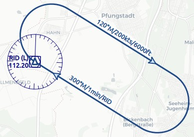

##  Holding {#holdings}

_Little Navmap_ kann ein Holdingschema an beliebiger Stelle oder Navaid auf der Karte anzeigen.

Holdings können an jeder beliebigen Kartenposition platziert werden. Das Andocken einer Holdings an eine Navaid nutzt die magnetische Missweisung der Navaid und zeigt ihre Kennung auf dem Holding-Label an.

Klicken Sie mit der rechten Maustaste in die Ergebnistabelle der Karte, der Flugplantabelle, der Flughafen-, Navigations- oder Benutzerpunkt-Suche und wählen Sie [Holding anzeigen](MAPDISPLAY.md#show-holding).

Es erscheint ein Dialog, in dem Sie eine Start- und Landebahn auswählen und das Holding anpassen können.

Beachten Sie, dass der Menüpunkt deaktiviert ist, wenn Holdings auf der Karte ausgeblendet sind (Menü `Ansicht` -> `Benutzerfunktionen`). Der Menüpunkt wird in diesem Fall mit dem Text `auf der Karte versteckt` versehen.

_Little Navmap_ zeigt einen Tooltip mit Informationen über das Halten, wenn Sie mit der Maus über den Hotspot (weiß gefülltes Dreieck) am Holdingfix fahren.

### Holding Dialog

**Eingabe- und Auswahlfelder des Dialogs:**

* Dialogheader: Zeigt den Navaid-Namen und die ICAO-Identität oder Koordinaten an, wenn das Holding nicht an eine Navaid gebunden ist.
* `Runways`: Liste der verfügbaren Start- und Landebahnen für den Flughafen. Zeigt den Namen der Start- und Landebahn, Länge, Breite, Magnetkopf, Oberfläche und Beleuchtungszustand an.
* `Drehrichtung`: Wählen Sie diese Option, um zwischen Links- und Rechtskurve zu wählen.
* `Kurs`: Magnetischer Verlauf des ankommenden (zur Fixierung hin) Schenkels des Holdings im magnetischen Grad.
* `Geschwindigkeit`: Vorgesehene Holdinggeschwindigkeit. Wird zusammen mit der Zeit zur Berechnung der Holdinggröße verwendet.
* `Zeit`: Zeit der geraden Strecken im Holding. Wird zusammen mit der Geschwindigkeit zur Berechnung der Holdinggröße verwendet.
* Label `Gerade Streckenlänge`: Länge der geraden Eingangs- und Ausgangsabschnitte.
* Label `Gesamtzeit bis zum Abschluss`: Gesamtzeit für die Fertigstellung einer Holding.
* ` Höhenlabel`: Höhe, die im Holding angezeigt werden soll.
* `Linienfarbe`: Farbe der Holdinglinien und Etiketten.

Holdings können entfernt werden, indem Sie entweder `Karte` -> `Alle Distanzkreise, Distanzmessungen, Platzrunden und Warteschleifen entfernen` auswählen oder indem Sie mit der rechten Maustaste auf den Hotspot (Dreieck) am Holdingfix klicken.

Siehe [Legend - Holding](LEGEND.md#holding) für Details zu den angezeigten Nummer im Diagramm.

_**Bild oben:** Holding Dialog für VORDME `RID`._

_**Bild oben:** Holding am VORDME `RID`. Das Inbound-Label zeigt den inbound magnetischen Kurs, die Holdingzeit und die navaidische Kennung an. Die Outbound-Track hat einen Outbound-Magnetkurs, Geschwindigkeit und Höhe als Label. Während das gefüllte Dreieck der Hotspot und Holdingfix ist._

