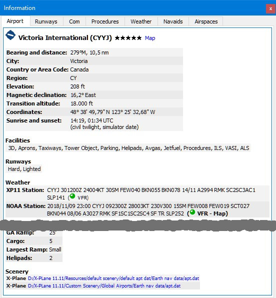
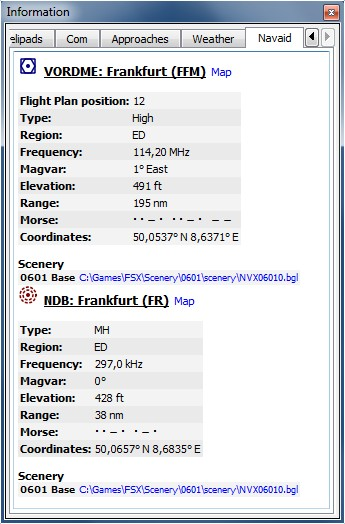
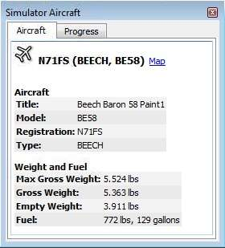
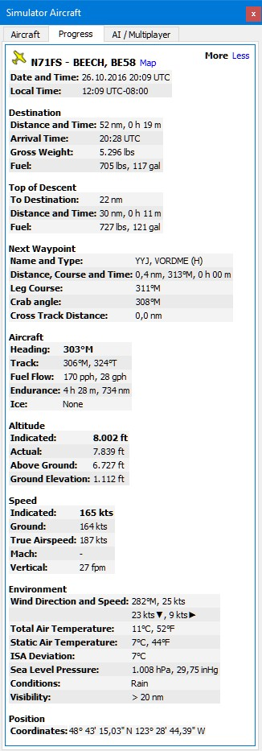
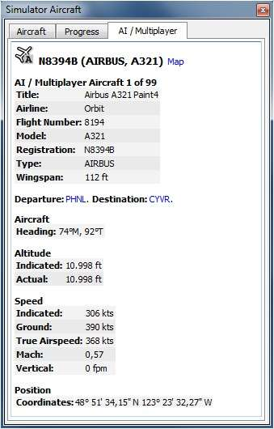
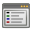

##  Dockingfenster Information {#information-dock-window}

Dieses Dock-Fenster enthält auf mehreren Registerkarten Textinformationen über Flugplätze sowie Informationen zu einer oder mehreren Navigationshilfen, Airways sowie eine zusätzliche Registerkarte mit Informationen zum Luftraum.

Eine Registerkarte `Wetter` enthält auch decodierte Wetterinformationen für den ausgewählten Flughafen.

Alle Informationen können als formatierter Text in die Zwischenablage kopiert werden. Verwenden Sie das Kontextmenü der Textfelder oder verwenden Sie `Ctrl+A`, um alles auszuwählen und `Ctrl+C`, um den Inhalt in die Zwischenablage zu kopieren.

Information werden als  `Zeige Informationen für ...` angezeigt, wenn Sie eines der Kontextmenüelemente in der Karte, Flugplan-Dock-Fenster oder die Suchergebnis-Tabelle auswählen.
Ein Flughafen und alle Navigationshilfen werden in das Informationsdisplay geladen, wenn sich mehrere Objekte in der Nähe befinden, wo Sie mit der rechten Maustaste auf die Karte geklickt haben.

Ein blauer Link `Karte` erlaubt den Sprung zum angezeigten Flughafen oder Navigationshilfe auf der Karte.
Zusätzliche Links für Helipads sind auf der Registerkarte `Runways/Helipads` verfügbar.

Ein Airway wird immer mit allen Wegpunkten angezeigt. Klicken Sie auf einen blauen Wegpunkt-Link, um die Karte um den Wegpunkt zu zentrieren.

Die Informationen zu Flughäfen und Navigationshilfen enthalten einen oder mehrere Links am Ende der Objektinformationen im Abschnitt `Szenerie`. Diese Links verweisen auf den passenden BGL- (FSX, P3D) oder DAT- (X-Plane) Dateien, die Informationen über den Flughafen oder die Navigationshilfen enthalten. Klicken Sie auf die Links, um den entsprechenden Ordner in Ihrem Dateimanager zu öffnen \(z.B. Windows Explorer\). Wenn möglich, wird die passende Datei automatisch ausgewählt.

Für Flughäfen können mehrere Links angezeigt werden, da diese durch mehrere BGL- oder DAT-Dateien aus verschiedenen Add-On-Szenerien oder Navdata-Updates geändert werden können.

_**Bild oben:** Übersicht Flughafeninformationen. Zusätzliche Registerkarten zeigen Informationen zu Start- und Landebahnen, COM-Frequenzen, Anflugszielen und Wetterbedingungen an._

_**Bild oben:** Informationen über Navigationshilfen. Zwei Navigationshilfen waren beim Klicken nahe am Cursor._

##  Dockingfenster Simulatorflugzeug {#simulator-aircraft-dock-window}

Dieses Dock-Fenster zeigt Informationen über das Benutzerflugzeug und in mehreren Registerkarten Informationen über AI- oder Multiplayer-Flugzeuge. Um diese Funktion zu aktivieren muss _Little Navmap_ mit dem Simulator verbunden sein.
Für weitere Informationen zu diesem Thema siehe [Verbinden mit dem Flugsimulator](CONNECT.md#connecting-to-a-flight-simulator) .

### Registerkarte Flugzeug

Gibt einen Überblick über das Benutzerflugzeug und zeigt Informationen zu Typ, Gewicht und Treibstoff an.

_**Bild oben:** Flugzeuginformationen bei Verbindung mit einem Flugsimulator._

### Registerkarte Fortschritt

Zeigt Informationen, ähnlich einem Flugmanagementcomputer, über das Benutzerflugzeug an. Dies umfasst den Flugplanfortschritt, Höhe, Geschwindigkeit und Umgebungsparameter.

_**Bild oben:** Fortschritts- und Umgebungsinformationen der aktuellen Flugsituation. Einige Felder oder Tabellen wie _`Nächster Wegpunkt`_ sind nur verfügbar, wenn ein Flugplan geladen ist._

### Registerkarte AI / Multiplayer

Informationen über ein AI oder Multiplayer-Flugzeug aus dem Simulator \(nicht Online-Netzwerke\) oder Schiff wird in dieser Registerkarte angezeigt, wenn auf der Karte ein Fahrzeug angeklickt wird.

Dazu gehören auch die Abflug- und Zielflughäfen, die auf der Karte durch Klicken auf die blauen Links angezeigt werden können \(gilt nur fürr FSX oder P3D und wenn ein Flugplan geladen ist\).

Beachten Sie, dass Informationen zu KI-Flugzeugen von X-Plane begrenzt sind. Nur Position, Höhe und Kurs können angezeigt werden.

_**Bild oben:** Informationen über ein AI-Flugzeug._

##  Dockingfenster Legende  {#legend-dock-window}

Enthält zwei Registerkarten: Eine Registerkarte  `Navigationskarte` erklärt die verschiedenen Flughafen- und Navigationshilfensymbole und eine Registerkarte `Karte`, die die allgemeine Legende für die Basiskarte wie zum Beispiel  _OpenStreetMap_ zeigt.

Der Inhalt der Beschreibungen von `Navigationskarte` ist auch im Online-Handbuch verfügbar: [Legende Navigationskarte](LEGEND.md).

Note that the general map legend is not available for all map themes.

