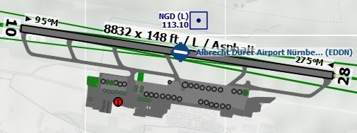
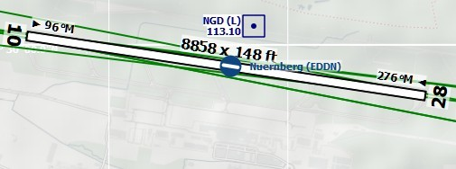

# Navigationsdatenbanken

_Little Navmap_ kann bis zu zwei Datenbanken paralell nutzen:

1. **Simulator Datenbank:** Erstellt durch das Lesen der Szenerie-Bibliothek von FSX, P3D oder X-Plane.
2. **Navigation database:** Zur Verfügung gestellt von Navigraph. Muss nicht kompiliert werden und kann durch den Navigraph _FMS Data Manager_ aktualisiert werden.

_Little Navmap_ wird mit einer Navigationsdatenbank aus einem aktuellen AIRAC-Zyklus ausgeliefert, der standardmäßig aktiviert ist.

**Informationen zur Aktualisierung siehe auch [Navigraph Updates installieren](https://albar965.github.io/littlenavmap_navigraph.html) auf meiner Homepage **_Little Navmap_**'s Navigationsdaten.**

**Achten Sie darauf, dass der Navigraph FMS Database Manager die Datenbanken nicht aktualisiert, während **_Little Navmap_** aktiv ist. **_Little Navmap_** könnte abstürzen, das Update könnte fehlschlagen oder unvollständig bleiben.**

Aus dem Menü `Scenery Library` können drei Anzeigemodi, wie unten gezeigt, ausgewählt werden.

## Navigraph für alle Funktionen benutzen {#navigraph-all}

Verwendet nur Informationen aus der Navigraph-Datenbank.

Beachten Sie, dass die Flughafeninformationen in diesem Modus eingeschränkt sind. Dies bedeutet, dass Vorfelder, Rollwege, Parkpositionen, Oberflächeninformationen der Start- und Landebahn und Kraftstoffinformationen nicht verfügbar sind. Außerdem könnten kleinere Flughäfen fehlen.

Das Start- und Landebahnlayout stimmt möglicherweise nicht mit dem Start- und Landebahnlayout im Simulator überein, wenn Sie Standard- oder ältere Flughafenlandschaften verwenden.

Ein Vorteil dieses Modus ist, dass die Anflugverfahren immer dem Layout der Start- und Landebahn des Flughafens entsprechen.

_**Bild oben:** Flughafendiagramm für _`EDDN`_ aus der Simulator Szenery \(X-Plane\) in den Modi _`Navigraph Datenbank nicht benutzen`_ oder _`Nutze Navigraph für Navigationshilfen und Prozeduren`._

_**Bild oben:** Flughafen `EDDN` aus der Navigraph-Datenbank, während  _`Navigraph für alle Funktionen benutzen`_ aktiviert ist. Beachten Sie fehlende Oberflächeninformationen der Start- und Landebahn, Vorfelder, Rollwege und Parkpositionen._

## Navigraph Datenbank nicht benutzen {#navigraph-none}

Ignoriert vollständig die Navigraph-Datenbank und zeigt nur Informationen an, die aus der Simulator-Szenerie gelesen wurden.

## Nutze Navigraph für Navigationshilfen und Prozeduren {#navigraph-navaid-proc}

Standardmodus nach der Installation oder Aktualisierung von _Little Navmap_.

Dieser Modus mischt Navaids und andere Funktionen aus der Navigraph-Datenbank mit der Simulator-Datenbank. Dies betrifft die Kartendarstellung, alle Informationsfenster und alle Suchfenster.

Die folgenden Funktionen werden aus der Simulator-Datenbank übernommen, wenn Sie diesen Modus verwenden:

* Flughäfen (auch `Suche` Dockfenster, Registerkarte `Flughafen`)
* Aprons
* Taxiways
* Parkpositionen
* COM Frequenzen
* ILS

Die folgenden Funktionen werden aus der Navigraph-Datenbank übernommen:

* Navaids (waypoints/intersections, VOR, NDB, marker) die sich auf:
 * `Suche` Dockfenster, Registerkarte `Navaid`
 * Flugplanberechnung
 * Routenbeschreibung
* Prozeduren (approaches, SIDs and STARs). Dies betrifft:
 * `Suche` Dockfenster, Registerkarte `Prozeduren`
 * Laden und Anzeigen von Prozeduren aus Flugplänen.
* Luftstraßen
* Lufträume

### Einschränkungen in diesem Modus

* _Little Navmap_ ignoriert alle Abweichungen zwischen Prozeduren und Start- und Landebahnen aufgrund von Flughafen-Updates und zeigt keine Warnung an. Aktualisieren Sie einen Flughafen in Payware- oder Freeware-Szenarien, wenn Sie feststellen, dass ein An- oder Abflugverfahren nicht an einem Ende der Start- und Landebahn eines Flughafens beginnt.
* Prozeduren können bei der Auswahl in dem Menu  `Zeige Prozeduren` nicht erkannt werden, wenn ein Flughafen seine ICAO-Identifikation geändert hat. \(z.B. `Kulik Lake`: Identifikation geändert von `LKK` nach `PAKL`\). Wenn Sie einen solchen Fall vermuten, verwenden Sie den Modus `Navigraph für alle Funktionen benutzen`, um die Prozeduren für den Flughafen zu bekommen.
* Die Flughafensuche `Verfahren` berücksichtigt nur die im Simulator verfügbaren Verfahren. Wechseln Sie zu `Navigraph für alle Funktionen benutzen`, um nach Flughäfen zu suchen, die Verfahren aus der Navigraph-Datenbank verwenden.
* Die ILS-Platzierung oder Präsenz stimmt möglicherweise nicht mit den Anflugverfahren überein, wenn ein Flughafen ein neues ILS hat, das nicht in der Bestandsszenerie oder einem alten Szenerie-Add-on vorhanden ist. Wenn Sie auf einen ILS-Ansatz ohne ILS-Station stoßen, wechseln Sie zu `Navigraph für alle Funktionen benutzen`,  um diese Limitierung zu überwinden.

Die Verwendung des _fsAerodata_ Navdata-Updates mindert oder beseitigt sogar alle oben genannten Einschränkungen, da es die Simulator-Szenerie mit der Navigraph-Datenbank synchronisiert.

_**Bild oben:** Ein Extrembeispiel für Runway/Procedure Mismatch. Der Anflug aus dem Navigraph-Datenbankzyklus 1707 endet an der nicht sichtbaren Start- und Landebahn 09, wohingegen die veraltete Szenerie des FSX den Flughafen an der falschen Position zeigt. EDVK wurde 2013 nördlich von Calden wieder aufgebaut. Der OpenStreetMap-Hintergrund zeigt den neuen Flughafen._

