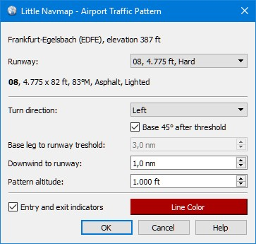
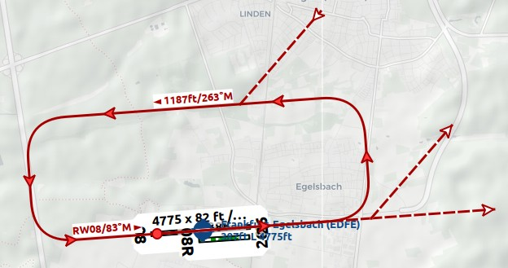

##  Platzrunde {#traffic-pattern}

_Little Navmap_ kann ein Flughafen-Platzrunde als Orientierungshilfe auf der Karte anzeigen.

Klicken Sie mit der rechten Maustaste auf einen Flughafen in der Karte, Flugplattentabelle oder Flughafen-Suchergebnistabelle und wählen Sie [ Platzrunde anzeigen](MAPDISPLAY.md#show-traffic-pattern).

Beachten Sie, dass der Menüpunkt deaktiviert ist, wenn Platzrunden auf der Karte ausgeblendet sind (Menü `Ansicht` -> `Nutzerobjekte`). Der Menüpunkt wird in diesem Fall mit dem Text `auf der Karte versteckt` versehen.

_Little Navmap_ zeigt einen Tooltip mit Informationen über die Platzrunde, wenn Sie mit der Maus über den Hotspot (weißer gefüllter Kreis) an der Pistenschwelle fahren.

### Platzrunden-Dialog

**Eingabe- und Auswahlfelder des Dialogs:**

* Dialoüberschrift: Zeigt den Flughafennamen und seine ICAO-Identität sowie die Feldhöhe an.
* `Runways`: Liste der verfügbaren Start- und Landebahnen für den Flughafen. Zeigt den Namen der Start- und Landebahn, Länge, Breite, Magnetkopf, Oberfläche und Beleuchtungszustand an.
* `Richtung`: Wählen Sie diese Option, um zwischen einem Links- oder Rechtsdrehmuster zu wählen. Diese wird bei der Auswahl einer Start- und Landebahn aus dem FSX oder P3D automatisch aktualisiert.
* `Queranflug 45° zum Runway-Ende`: Berechnet bei Überprüfung automatisch die endgültige Streckenlänge.
* `Endabschnitt`: Länge der letzten Etappe. Gemessen von der Wende bis zur Endphase bis zur Schwelle der Runway.
* `Gegenanflug zum Runway`: Paralleler Abstand vom Gegenanflug zur Start- und Landebahn.
* `Höhe der Platzrunde`: Höhe der Platzrunde über der Flughafenhöhe. Diese wird bei der Auswahl einer Start- und Landebahn aus dem FSX oder P3D automatisch aktualisiert.
* `Ein- und Ausgabepfeile:`  Zeigt gestrichelte Linien und Pfeile, die Hinweise auf Ein- und Ausstiegspunkte geben.
* `Linienfarbe`: Farbe der Musterlinien und Beschriftungen.

Platzrunden können entfernt werden, indem Sie entweder `Karte` -&gt; `Alle Bereiche, Messungen und Muster entfernen` wählen oder indem Sie mit der rechten Maustaste auf den Hotspot \(Kreis\) an der Startbahnschwelle klicken.

Ein Klick auf `OK` oder ein Doppelklick in die Liste `Runways` schließt den Dialog und erzeugt die Platzrunde.

Siehe [Legende - Flughafen-Platzrunde](LEGEND.md#airport-traffic-pattern) für Details zu den angezeigten Zahlen in der Vorlage.

_**Bild oben:** Platzrundendialog für _`EDFE`_ Runway 08 in 1000 ft über der Flughafenhöhe._

_**Bild oben:** Einstellungen für die Platzrunde im obigen Dialog. Der Gegenanflug zeigt die Profilhöhe über MSL und die Kurs- und Schlussetappe zeigt den Namen der Runway und den Kurs._

