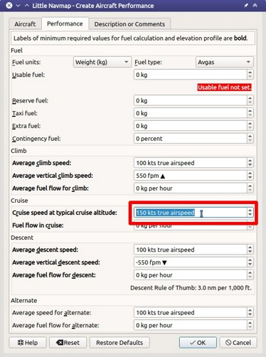

## Erstellen eines IFR-Flugplans mit Anflugverfahren {#tutorial-ifr}

Dieses Tutorial zeigt Ihnen, wie ein komplexerer IFRFlugplan einschließlich Anflugverfahren zu erstellen ist. Es erklärt die erweiterte Flughafensuchfunktion und die automatische Flugplanberechnung.

Der Flugplan befindet sich  im Verzeichnis _Little Navmap_: `.../Little Navmap/etc/Tutorial IFR Bembridge (EGHJ) to Wick (EGPC).pln`.

Während dieses Tutorial recht umfangreich aussieht, ist es normalerweise eine Frage von einer halben Minute, um einen Flugplan zu bekommen, wenn man weiß, wohin man gehen muss. Der hier gezeigte Planungsaufwand ist größer, um einige der erweiterten Funktionen des Programms hervorzuheben.

Sie sollten zumindest das VFR-Tutorial [Erstellung eines VFR-Flugplans](TUTORIALVFR.md) durchlesen, bevor Sie dieses Tutorial durcharbeiten.

Der Flugplan wird mit einem IFR-fähigen Flugzeug durch das Vereinigte Königreich gehen. Die maximale Reichweite sollte mehr als 600 Seemeilen einschließlich Reserven und einer Reiseflughöhe von 10000 Fuß betragen.

Voraussetzungen für dieses Tutorial:

* Ende des letzten Fluges haben sie ihr Flugzeug in `Bembridge (EGHJ)` verlassen oder sie behandeln EGHJ als Heimatbasis.
* Sie wissen nicht, wohin sie heute fliegen wollen.
* Sie kennen die Anforderungen für Ihr Flugzeug:
 * Mindestreichweite
 * Mindestpistenlänge
 * Feste Pisten
 * Benötigen einen Parkplatz am Ziel
 * Kraftstoff für den Rückweg

### Flug vorbereiten

Ich würde empfehlen, vor jedem Flug `Flug` -> `Alles für einen neuen Flug zurücksetzen`  zu verwenden, um eine saubere Basis für Treibstoffberechnung und andere Funktionen zu erhalten. Deaktivieren Sie im Dialog die Option `Neuen und leeren Flugplan erstellen`, wenn Ihr Plan bereits geladen ist.

### Standardflugzeugleistung

Dieses Tutorial behandelt nicht das Erstellen oder Sammeln von Flugzeugleistungsdateien. Siehe [Erstellen einer Flugzeugleistungsdatei](TUTORIALPERF.md), wenn Sie dies tun möchten.

Daher verwenden wir einfach ein leicht modifiziertes Flugzeugleistungsprofil, das einen Steig- und Sinkwinkel von drei Grad ermöglicht.

* Wählen Sie `Flugzeug` -> `Neue Flugzeugleistung ...` .
* Optional: Ändern Sie den Wert für `Geschwindigkeit in typischer Reiseflughöhe` so, dass er ungefähr dem gewählten Flugzeug entspricht. Dies hilft, eine genaue Schätzung der Reisezeit zu erhalten.
* Optional: Passen Sie die Sink- und/oder Steigwerte nach Bedarf an.
* Akzeptieren Sie durch Drücken von `OK` im Dialogfeld.

Im Kraftstoffbericht werden mehrere Warnungen angezeigt. Ignorieren Sie diese vorerst, da die Flugzeugleistung ausreicht, um die Sink- und Steighöhe für das Höhenprofil zu berechnen.



### Suche zurücksetzen {#tutorial-ifr-cleanup}

Gehen sie zum Dock Fenster  `Suche` und machen sie die  folgenden Schritte:

* Rechtsklick in die Ergebnistabelle und `Alle Filter zurücksetzten` wählen  um alle Suchkriterien zu löschen, die die Abfrage beeinflussen können. 
* Auf den Menuebutton   klicken und stellen sie sicher, dass die Suchgruppen  `Ausstattungen`, `Runway`, und `Entfernung von Markierung` aktiviert sind. Deaktivieren sie alle anderen, die sie nicht benötigen.


### Abflughafen zuweisen {#tutorial-ifr-assign-departure}

Nun schauen wir uns den Abflughafen an:

* Geben sie EGHJ  in das `ICAO Code` Suchfeld oben links ein (egal, was passiert).
* Klicken sie in der Ergebnistabelle mit der rechten Maustaste auf den Flughafen.
* Wählen sie mit der rechten Maustaste `Als Flugplanstart setzen` . Damit wird eine Standard-Runway als Startposition zugewiesen.


Ihr Flugplan hat jetzt einen Eintrag. Dieses ist bereits ausreichend, wenn sie ein Pattern fliegen und die Entfernung, Geschwindigkeit und Zeitinformation zum Flughafen sehen möchten.

Der Start von einer Startbahn ist nicht ganz realistisch. Wir suchen eine Parkingposition:

* Gehen sie zu `Flugplan` -> `Startposition für den Abflug auswählen` .
* Wählen sie eine der Parkpositionen GA klein.
* Klicken sie auf `OK` und die Position wird auf der Karte hervorgehoben.


Alternativ dazu können sie die Startposition auch direkt im Kontextmenü auswählen, wie in der Karte im VFR-Tutorial beschrieben. [VFR tutorial](TUTORIALVFR.md).

Siehe auch [Als Abflugflughafen setzen](MAPDISPLAY.md#set-as-flight-plan-departure)

### Zielflughafen suchen {#tutorial-ifr-search-dest}

Nun suchen wir nach einem geeigneten Zielflughafen:

* Im Suchergebnis wieder Rechtsklick auf `EGHJ`.
* Wählen sie `Zentrum für Distanzsuche setzen` . Sie können dies auch in der Karte tun. Dies ist der Mittelpunkt für die räumliche Suche.
* Löschen sie nun das Suchfeld `ICAO Code`. Es ist ein häufiger Fehler, die Textfelder bei der Entfernungssuche nicht zu leeren, was dann zu einer leeren Ergebnistabelle führt.

Wir werden nun nach Flughäfen suchen, die sich in Reichweite des Flugzeugs befinden, aber nicht zu nah sind. Außerdem müssen bestimmte Kriterien erfüllt sein, wie z.B. eine Start- und Landebahn, die lang genug ist und die richtige Oberflächenbeschaffenheit aufweist.

Sie können auch Flughäfen im Flugzeugbereich finden, indem sie mit der rechten Maustaste auf den Abflugflughafen klicken die Entfernungsringe `Zeige Entfernungsringe` , auf der Karte aktivieren, obwohl diese Funktion die detaillierten Flughafenfilter nicht zulässt.


Wir werden die spatiale Suche anstelle von Entfernungsringen verwenden, da wir nur geeignete Flughäfen für unser Fugzeug sehen möchten.

Überprüfen sie Folgendes auf dem Tab "Flughafensuche":

1. `Bewertung`: Wir möchten Flughäfen, die entweder Add-ons sind oder grundlegende Landschaftsanforderungen haben, wie Rollwege, Parkplätze und mehr. Alles andere ist langweilig. Wählen Sie den mit mindestens vier Sternen. Sie können auch `3D` auswählen, wenn Sie X-Plane fliegen.
2. `Prozeduren`: Zeigen Sie nur Flughäfen an, die über Prozeduren verfügen, um einen interessanteren Ansatz zu erhalten.
3. Deaktivieren Sie die Optionen `Militär` und `Geschlossen` (klicken Sie zweimal auf die Kontrollkästchen): Dadurch werden nur zivile Flughäfen zurückgegeben und Flughäfen vermieden, die alle Start- und Landebahnen geschlossen haben.
4. In der Auswahlliste `Beliebige Oberfläche` select `Beliebige Oberfläche, befestigt` , um zu vermeiden, dass Flughäfen gewählt werden, die nur über unbefestigte Start- und Landebahnen verfügen.
5. Wählen sie für ihr Flugzeug eine minimale Startbahnlänge von 2,500 Fuß oder was auch immer ihr gewähltes Flugzeug benötigt in dem Feld `Runways:` `Min:`.

Sieh auch [Suchfenster - Flughäfen und Navaids](SEARCH.md).

Man kann auch die maximale Start- und Landebahnlänge begrenzen, wenn man eine kurze Landungsherausforderung sucht, aber nicht jetzt.

Das Suchergebnis ändert sich im laufenden Betrieb während all dieser Anpassungen, obwohl wir noch nicht da sind:

* Prüfen sie `Distanz:` um die räumliche Suche zu aktivieren.
* Ändern sie die maximale Entfernung auf 600 und das Minimum auf 400 nautische Meilen (um kurze Hüpfer zu vermeiden). Die Ergebnistabelle wird nun mit einer kleinen Verzögerung aktualisiert, da die Abstandssuche komplexer ist.
* Um nur Flughäfen nördlich von Ihrer Position zu finden, wählen sie `Norden` in der Auswahlliste `Beliebige Richtung`. Beachten sie, dass das Suchergebnis nach Entfernung zum nächstgelegenen Flughafen sortiert ist.
* Wählen sie einen Flughafen für ihren Flug. Wir vewenden `Wick (EGPC)` für dieses Tutorial.
* 
* Klicken sie mit der rechten Maustaste auf Wick in der Ergebnistabelle.
* Wählen sie `Informationen anzeigen` . Dies füllt die Registerkarten im Dock-Fenster `Informationen`.
* Wählen Sie die Registerkarte `Wetter` und suchen Sie den Abschnitt `Beste Start- und Landebahnen für Wind`, um sich ein Bild von der zu erwartenden Landebahn zu machen. Starten Sie Wetterprogramme von Drittanbietern, wenn Sie diese nutzen.


Für dieses Tutorial gehen wir davon aus, dass aufgrund der Windverhältnisse die Runway 13 bevorzugt wird.

Siehe auch [Wetter](WEATHER.md).

### Ein Anflugverfahren wählen {#tutorial-ifr-select-approach}

Wir werden nun ein Anflugverfahren wählen:
* Zurück zum Suchergebnis.
* Klicken sie erneut mit der rechten Maustaste auf den Flughafen Wick. Wählen sie `Zeige alle Prozeduren` . Dies öffnet die Registerkarte für Prozedursuche.
* Wählen sie `Runway 13` in `Alle Prozeduren` um nur Anflugprozeduren für die Runway 13 zu erhalten.
* Wählen sie `Alles ausklappen` in dem Kontextmenu \(rechte Maustaste)\,  um die Tansitions für jeden Anflug zu erhalten.
* Wählen sie `Anflug VORDME 13 FD13` mit `Übergang (Voll) CHINN`, da wir erwarten, dass wir aus Süden kommen und auf der Runway 13 landen.

Das oberste Label in der Prozedursuche zeigt den  `Wick (EGPC) Anflug VORDME 13 FD13 Übergang (Voll) CHINN` für den ausgewählten Anflug und / oder Transition. Sie können auch eine Vorschau auf der Karte sehen.


Klicken sie mit der rechten Maustaste auf die Transition und wählen sie die Option  `Anflug und Übergang auf der Karte anzeigen` . Damit wird die Prozedur auf der Karte zentriert. Sie können auf die Legs im Prozedurenbaum klicken, um den Start- und Endpunkt einer Strecke zu sehen.


Das Verfahren sieht ausreichend kompliziert aus, um einen interessanten Anflug zu bieten.

Weitere Informationen zur Prozedursuche findet man im: [Suchfenster - Prozeduren](SEARCHPROCS.md). Siehe auch [Prozeduren](APPROACHES.md) für allgemeine Informationen zu Prozeduren.

Wenn Ihnen das gefällt, was sie sehen, klicken sie mit der rechten Maustaste erneut auf den Transitions und wählen sie `Nutze EGPC und Anflug und Übergang als Ziel` .

Dies wird zwei Dinge bewirken:

1. Wick als Zielflughafen zum Flugplan hinzugefügt. Jedes vorherige Ziel im Flugplan wird ersetzt.
2. Fügt den Anflug und seinen Übergang zum Flugplan hinzu. Die Prozedurwegpunkte verwenden eine dunkelblaue Farbe und die verfehlten Anflugwegpunkte verwenden eine dunkelrote Farbe in der Flugplantabelle. Wegpunkte auf der Flugplanroute sind schwarz. Auch hier wird jede vorherige Prozedur durch diese neue ersetzt.


**Über Hinzufügen von Übergängen und Anflüge:** Anflüge und Übergänge sind eng verwandt, was bereits durch die Baumstruktur auf der Registerkarte für die Prozedursuche angedeutet ist. Sie können einen Anflug alleine hinzufügen, aber ein Übergang gehört immer zu einem Anflug.

Sie müssen den Übergang auswählen, um sowohl Anflug als auch Übergang hinzuzufügen oder anzuzeigen.

### Einen Flugplan berechnen {#tutorial-ifr-calculate-flight-plan}

Nun haben wir den Abflug-Flughafen, ein Anflugverfahren und das Ziel alle durch eine gerade Linie verbunden. Als nächstes ist der Routenplan des Flugplans an der Reihe:

* Setzen sie `IFR` als Flugplantyp im Dockfenster `Flug planen`. Dies ermöglicht der automatischen Flugplanberechnung die Reiseflughöhe anzupassen.
* Klicken sie auf `Flugplan` -> `Niedrige Route berechnen`  um die automatische Flugplanberechnung für Victor airways zu starten. Die Berechnung erstellt eine Route von Ihrem Ausgangsflughafen zu der ersten Fixpunkt der Transition

Die Flugplan-Flughöhe wird automatisch entsprechend der hemisphärischen Regel angepasst  (die Regel kann geändert werden in: `Werkzeuge` -> `Einstellungen`  auf der Registerkarte `Flugplan`), die Höhenbeschränkungen der Fluglinien und die Flugplanart  (`VFR` oder `IFR`). Sie können die minimale Höhe für jedes Airwaysegment in der Flugplantabelle in der Spalte `Einschränkungen` sehen.

Die Höhe kann auch durch Klick entsprechend der hemisphärischen Regel eingestellt werden   `Flugplan` -> `Reiseflughöhe anpassen` .

Es kann vorkommen, dass die minimale Höhe des Resultates für das gewählte Flugzeug zu hoch sein kann.

Versuchen sie daher eine alternative Berechnungsmethode, die Ihre Reiseflughöhe begrenzt:

* Geben sie 10000 Fuss in das Feld `Flugplanhöhe` ein.
* Klicken sie auf `Flugplan` -> `Berechne für die gegebenen Höhe` . Dies führt zu einem Flugplan, der nur Luftwege verwendet, die eine Mindesthöhe von weniger als 10000 Fuß haben. Beachten sie, dass sie abhängig von der verwendeten Höhe eine Mischung aus Victor und Jet Airways erhalten können. Die Berechnung kann auch fehlschlagen, wenn sie die Reiseflughöhe zu niedrig einstellen.


Verwenden sie diesen Flugplan nun.

Speichern sie diesen Flugplan nun `Datei` -> `Flugplaan speichern` . Das Programm findet normalerweise das richtige Verzeichnis für die Flugpläne und vergibt standardmäßig einen sinnvollen Namen.

Die Wegpunkte des Anflugverfahrens sind nicht im Flugplan gespeichert. Sie müssen den Approach in ihrem GPS oder FMC im Simulator auswählen oder mit Funknavaids und einer Stoppuhr fliegen.

Was _Little Navmap_ in der PLN-Datei speichert sind die Prozedurnamen , mit denen das Programm den Anflug beim Laden wiederherstellen kann.

Die oberste Anzeige im Dock - Fenster der Flugplanung lautet jetzt:

```none
Bembridge (EGHJ) Runway 12 nach Wick (EGPC)
über WIK10 und VORDME FD13 (D13) auf Runway 13.
538 nm, 5 h 23 m, Niedrige Höhe
```
Passen Sie die Bodengeschwindigkeit im Flugplanungsdockfenster entsprechend dem verwendeten Flugzeug an, um eine bessere Zeitschätzung zu erhalten.

Der Plan sieht möglicherweise anders aus, je nachdem, ob sie Navigations- oder Navigationsdatenaktualisierungen verwenden.


Jetzt können sie prüfen, ob sie Lufträume passieren:

* Aktivieren sie Lufträume, indem sie  `Ansicht` -> `Lufträume` -> `Lufträume anzeigen`  auswählen, falls noch nicht geschehen.
* Prüfen sie `Ansicht` -> `Lufträume` -> `Auf Reiseflughöhe`  im Menü oder in der Symbolleiste Menü-Taste.


Dies zeigt nur Lufträume auf der Karte an, die für Ihre Reiseflughöhe relevant sind. Sie können auch `Nur unter 10000 ft` wählen, um alle relevanten Lufträume in der Steig- oder Sinkflug Phase zu sehen. Verwenden sie die QuickInfos auf der Karte, um Informationen über Lufträume wie Typ, minimale und maximale Höhe zu erhalten.


### Fliegen {#tutorial-ifr-flying}

Öffnen sie den Dialog `Verbinden` unter `Werkzeuge` -> `Flugsimulatorverbindung`  und prüfen sie, ob `Automatisch verbinden` gewählt ist. Wenn nicht, bitte aktivieren.

_Litte Navmap_ findet den Simulator unabhängig davon, ob er bereits gestartet ist oder später gestartet wird. Klicken sie auf `Verbinden`.

Siehe auch [Mit einem Flugsimulator verbinden](CONNECT.md).

Wählen sie unter `Ansicht` -&gt; `Flugzeug auf der Karte zentrieren` . Die Karte wird zum Simulatorflugzeug springen und es zentriert halten. Das passiert allerdings nur, wenn ein aktiver Flugplan geladen ist, d.h. der Simulator befindet sich nicht mehr im Eröffnungsbildschirm.

Starten sie den Simulator falls noch nicht geschehen, laden sie den Flugplan und fliegen sie weiter.

### Top of Descent {#tutorial-ifr-top-of-descent}

Eine Top-of-Descent-Anzeige wird auf der Karte und im Höhenprofil angezeigt, die auch die Entfernung vom Start Sinkflug zum Ziel anzeigt. Diese Zahl beinhaltet die Entfernung der Anflugverfahren  (ohne Hildings).

Höhenbeschränkungen in Verfahren werden bei der Abstiegsberechnung ganz oben berücksichtigt.


Der Tab `Fortschritt` im Kontextmenue `Simulatorflugzeug` zeigt die Entfernung zum Top of Descent in dem  `Flugplan Fortschritts` Abschnitt:

|Flight Plan Progress|
|---|---|
|To Destination: |74 nm|
|Time and Date: |21.05.17 12:33 UTC|
|Local Time: |14:33 CEST|
|**TOD to Destination:**|**64 nm**|
|**To Top of Descent:**|**10,1 nm**|

Der Abschnitt `Höhe` zeigt den vertikalen Pfad nach dem Top of Descent:

|Altitude|
|---|---|
|Indicated: |5,090 ft|
|Actual: |5,051 ft|
|Above Ground: |5,051 ft|
|Ground Elevation: |0 ft|
|**Vertical Path Dev.:**|**-511 ft below ▲**|

### Prozeduren ändern {#tutorial-ifr-changing-procedures}

Nun hat sich das Wetter geändert und es ist ein Anflug zur Piste 31 erforderlich:

* Rechtsklick auf den Zielflughafen am Ende der Flugplantabelle.
* Wählen sie `Zeige Ankunft Prozeduren` .
* Ändern sie den Filter für die Runway auf `Runway 31`.
* Erweitern sie den Anflug `VORDME 31` , um die Übergänge zu sehen.
* Wählen sie den Übergang.

Die Beschriftung oben im Fenster zeigt nun `Anflug VORDME 31 FD31 Übergang (Voll) CHINN`.

* Rechtsklick auf den ausgewählten Übergang.
* Wählen sie `Nutze EGPC und Anflug und Übergang als Ziel`  aus dem Kontextmenü, wodurch das aktuelle Verfahren in Ihrem Flugplan durch das neue Verfahren ersetzt wird.

Die Anezige oben im Flugplanungsfenster zeigt nun:

```none
Bembridge (EGHJ) Parkposition 1, Parkplatz GA klein nach Wick (EGPC)
Via CHINN und VORDME FD31 zum Runway 31
526 nm, 5 h 15 m, Niedrige Höhe
```

Um die Prozedur zu vervollständigen machen sie folgendes:

* Wählen sie einen beliebigen Teil des Verfahrens in der Flugplantabelle aus.
* Rechtsklick und wählen sie `Ausgewählten Abschnitt oder Prozedur löschen`  oder drücken Sie die Taste `Del`, um den gesamten Vorgang zu löschen.
* 
Wenn ATC ihnen die Freigabe zum initial Fix der Prozedur erteilt:

1. Löschen sie sofort alle Zwischenwegpunkte zwischen Ihrer aktuellen Flugzeugposition und dem ursprünglichen Fix der Prozedur: Klicken sie mit rechten Maustaste in der Flugplantabelle und wählen sie `Ausgewählten Abschnitt oder Prozedur löschen` , für alle Waypoints zwischen der aktuellen Position des Flugzeuges und dem initial Fix bzw. Prozedurstart. Vermeiden sie, ihren Anflug zu löschen (sie können auch mit einem Rechtsklick auf einen Waypoint im Kartenfenster über das Kontextmenue löschen).

2. Klicken sie dann mit der rechten Maustaste im Kartenfenster auf Ihr Flugzeug und wählen sie  `Position zum Flugplan hinzufügen` .

Damit wird eine direkte Verbindung von Ihrer aktuellen Flugzeugposition zum Start der Prozedur hergestellt, die sie verwenden können, um Kurs und Entfernung zum anfänglichen Initial Fix zu erhalten.

Unten: Nach dem Ändern des Anflugverfahrens und Hinzufügen eines benutzerdefinierten Wegpunktes an der Flugzeugposition im Flugplan. Jetzt erhalten wir Kurs- und Höhenangaben für eine direkte Strecke bis zum Beginn des Übergangs  \(43 nm und 314 Grad magnetischer Kurs\).


### Fehlanflug {#tutorial-ifr-going-missed}

Ich empfehle, die Fehlanflüge auf der Karte zu verbergen `Ansicht` -> `Zeige Fehlanflüge` . Dieses hilft, die Kartenanzeige übersichtlicher zu gestalten.

* **Wenn die Fehlanflüge nicht angezeigt werden:** Das Fortschrittsfenster zeigt die Distanz und Zeit zum Ziel. Das Aktivieren des nächsten Wegpunkt \(wird in Magenta angezeigt\) wird angehalten, wenn das Ziel (z.B. die Runwayschwelle) erreicht wird, oder die Runwayschwelle überschritten wird.
* **Wenn Fehlanflug angezeigt wird und das Flugzeug die Runwayschwelle passiert hat:**  Der erste Wegpunkt auf dem Fehlanflug ist aktiviert und das Simulatorflugzeug zeigt die verbleibende Entfernung bis zum Ende der Fehlanflugprozedur.
