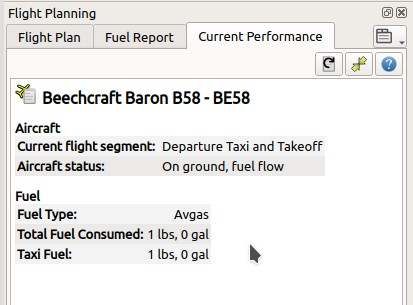
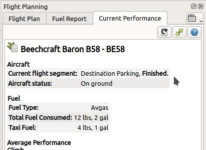

## Erstellen eines Leistungsprofils für Flugzeuge

Dieses Tutorial zeigt, wie Sie die Flugzeugleistung während des Fluges automatisch erfassen und wie Sie das Ergebnis erstellen, zusammenführen und verfeinern können.

Sie sollten bereits mit den Flugplanungsfunktionen von _Little Navmap_ vertraut sein.

### Flugplan

Sie können den Flugplan aus dem IFR-Tutorial verwenden, das im Verzeichnis _Little Navmap_  enthalten ist: `.../Little Navmap/etc/Tutorial IFR Bembridge (EGHJ) to Wick (EGPC).pln`.

Verwenden Sie das Hauptmenü `Datei` -> `Flugplan öffnen`, um den Flugplan zu laden.

Der Plan sollte die typische Reiseflughöhe und die Reiseentfernung für Ihr Flugzeug abdecken. Ein kurzer Flug von ein paar Meilen in niedriger Höhe reicht nicht aus.

Sie können auch ohne Flugplan fliegen und Leistung sammeln. Stellen Sie die beabsichtigte Reiseflughöhe im Flugplanfenster so ein, dass _Little Navmap_ die Reisephase erkennen kann.

### Flugzeugleistung

Beginnen Sie zunächst mit der Erstellung eines neuen und leeren Leistungsprofils, indem Sie im Hauptmenü `Flugzeuge` -> `Neue Flugzeugleistung`  auswählen.

Lassen Sie alles so, wie es im Dialog ist, und klicken Sie auf "OK".

Ignorieren Sie vorerst die verschiedenen Warnungen und Fehlermeldungen im Kraftstoffbericht. Dieses Leistungsprofil ist gut genug, um bei einem drei Grad Flugbahnwinkel Top of Steigen und Top of Sinken zu berechnen.

Ignorieren Sie auch die Nullwerte im Kraftstoffplan. Die Kraftstoffdurchflussdaten müssen in das Leistungsprofil eingegeben werden, um eine valide Kraftstoffvorhersage zu erhalten.

Starten und laden Sie einen Flug mit laufenden oder nicht laufenden Flugzeugtriebwerken. Verbinden Sie _Little Navmap_ mit dem Simulator.

Wählen Sie `Flug` -> `Alle zurücksetzen für einen neuen Flug`   im Menü. Entfernen Sie das Häkchen bei `Einen neuen und leeren Flugplan erstellen`, da bereits ein Plan geladen ist. Klicken Sie auf "OK", um eine saubere Basis für die Kraftstoffberechnung, das Logbuch und andere Funktionen zu erhalten.

Fliegen und verwenden Sie typische Einstellungen für die Steig- und Reiseflugleistung im Flugzeug. Die Zeitkompression ist kein Problem, wenn Sie einige Minuten auf dem Reiseflug bleiben, um _Little Navmap_ das Sammeln von Kraftstoffdaten zu ermöglichen.

Sie können den erfassten Flugzeugtyp, die erkannte Flugphase (Steigen, Reisen und mehr) sowie alle aktuellen Werte, die von _Little Navmap_ gesammelt und gemittelt wurden, auf der Registerkarte `Aktuelle Leistung` sehen.

Für weitere detaillierte Informationen siehe [Sammlung von Flugzeugleistungen](AIRCRAFTPERFCOLL.md).

Neue Flugphasen werden hinzugefügt, wenn sie erkannt werden. Beachten Sie, dass die Reiseflugphase nur beim Fliegen in Flugplan-Reiseflughöhe erkannt wird. Stellen Sie die Reiseflughöhe auf der Registerkarte Flugplan ein, zumindest wenn Sie Leistung ohne Flugplan sammeln möchten.

Nach der Landung und dem Abschalten der Triebwerke sehen Sie den Text `Aktuelles Flugsegment: Zielparkplatz, beendet` in der Registerkarte `Aktuelle Leistung`.

Sie haben eine komplette Sammlung von Flugzeugleistungen, sobald der Text `Fertig` angezeigt wird, der direkt nach der Landung am Zielort erscheint.

Wählen Sie nun im Hauptmenü `Flugzeug` -> `Ermittelte Flugzeugleistung zusammenführen` , um das leere Leistungsprofil mit den gesammelten Werten zu füllen.

Beachten Sie den Header `Neuer Wert` (gesammelte Daten) und `Aktueller Wert` (aktuell geladene oder erstellte Profilvorschlagswerte) mit den folgenden Werten.

Wir möchten alle Werte für das neue Profil verwenden. Stellen Sie daher alle Operationen im Dialogfeld auf `Kopieren` und klicken Sie auf `OK`.

Sie können die Operationen für jedes Feld auch einzeln ändern oder die Operation `Zusammenführen` verwenden, die den Durchschnitt des neuen und aktuellen Wertes verwendet. Sie können einen Zusammenschluss in jeder Flugphase durchführen. Zum Beispiel, wenn Sie die Werte während des Fluges feinabstimmen möchten.
Siehe [Flugzeugleistung zusammenführen](AIRCRAFTPERFMERGE.md) für weitere Informationen.

**Vergessen Sie nicht, genügend Reservekraftstoff hinzuzufügen. Andernfalls geht ihnen am Zielort der Treibstoff aus, wenn sie sich auf diesen Plan verlassen.**

Sie können auch nach dem Zusammenführen den nutzbaren Kraftstoff ändern in Kraftstoffdurchfluss. Wählen Sie dazu `Flugzeug` -> `Flugzeugleistung bearbeiten`. Beachten Sie, dass die erforderlichen Werte im Bearbeitungsdialog mit **fett** gekennzeichnet sind.

Es ist auch hilfreich, Hinweise zu Leistungseinstellungen in die Beschreibungsdatei eines Leistungsprofils aufzunehmen.

Im Kapitel [Flugzeugleistung bearbeiten](AIRCRAFTPERFEDIT.md) werden Details zur Bearbeitung erläutert.

**Verwenden Sie Leistungsdateien für verschiedene Reiseflughöhenbereiche, um genauere Ergebnisse für große oder komplexe Flugzeuge zu erhalten. Zum Beispiel eine Datei für FL300-FL350 und eine für FL350-FL400.**.

Verwenden Sie `Flugzeug` -> `Flugzeugleistung sichern`  und
Speichern Sie die neue Leistungsdatei an einem beliebigen Ort wie `Dokumente\Little Navmap\Performance`.

Sie können diese Datei an andere weitergeben oder mir zusenden, damit ich sie in den [Datei-Download-Bereich von littlenavmap.org](https://www.littlenavmap.org/downloads/Aircraft%20Performance/) aufnehmen kann.
