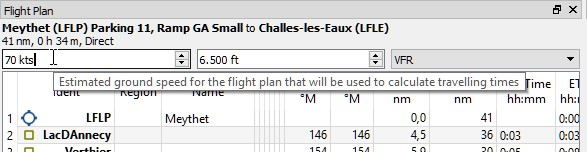

## Erstellen eines VFR-Flugplans

### Allgemeines

In diesem Tutorial wird erklärt, wie Sie anhand der Karte und des Kontextmenüs einen einfachen Flugplan erstellen können.

Der Flug führt uns durch die herrlichen Täler der französischen Alpen. Sie können diesen Flugplan für jedes kleine Flugzeug verwenden, wie die [Flight1 Cessna 162 SkyCatcher](http://www.flight1.com/view.asp?page=skycatcher) oder die kostenlose Standard-Cessna 172.

Der Flug wird nur in dem Luftraum der Klasse E durchgeführt. Es besteht keine Notwendigkeit, ATC zu kontaktieren.

Der Flugplan lautet: _Meythet \(LFLP\) Parking 11, Ramp GA Small direkt nach Challes-les-Eaux \(LFLE\), 41 nm, 0 h 24 m._

### Abflug Flughafen

Abflugflughafen suchen:

Klicken Sie auf die Karte und zoomen Sie auf die französischen Alpen. Sie können die folgenden Funktionen zum Navigieren verwenden:

* Das Kartenoverlay auf der linken Seite.
* Die Maus \((klicken und ziehen\) zum Bewegen und das Mausrad zum Zoomen
* Die Cursortasten zum Bewegen und die Tasten `+` und `-` zum Vergrößern und Verkleinern  \(klicken Sie in das Kartenfenster, um es vor der Verwendung der Tasten zu aktivieren\).

Verwenden Sie die Zurück-   und Vortasten , um in den Positionsverlauf wie in einem Webbrowser zu springen.

Siehe auch [Kartenanzeige](MAPDISPLAY.md).
Suche hier nach dem Abflug-Flughafen `Meythet (LFLP)`:

Gezoomt mit Hinweisen:

Dann:

* Vergrößern Sie das Flughafen-Diagramm, bis  Taxiways, Runwaydetails, Parkpositionen und vieles mehr angezeigt werden.
* Zoomen Sie weiter, bis Sie die weißen Parknummern sehen.
* Klicken Sie mit der rechten Maustaste auf die Mitte eines der grünen Parkplätze  \(in diesem Fall 11\).
* Wählen Sie im Kontextmenue `Flugplatz Meythet (LFLP) / Parking 11 als Startflugplatz setzen` .

Damit wird ihre Ablugparkposition ausgewählt, die durch einen schwarz/gelben Kreis hervorgehoben wird.
Der Flughafen wird dem Flugplan ebenfalls als Abflugflughafen hinzugefügt.

Sie können auch auf das Flughafensymbol klicken und ihn als Abflughafen auswählen. Eine Startbahn wird automatisch als Startposition zugewiesen.

### Routen Wegpunkte

Wir fügen jetzt die Wegpunkte hinzu:

* Scrollen Sie entlang des Tales im Südosten über den See Lac d'Annecy
* Klicke auf   `Position an den Flugplan anhängen` . Die angeklickte Position wird am Ende Ihres Plans als benutzerdefinierter Wegpunkt hinzugefügt

Klicke auf Rückgängig   oder Widerholen  wenn Sie dem gerade Hinzugefügten nicht einverstanden sind.

Eine weitere Funktion ist  `Position zum Flugplan hinzufügen`  welche die angeklickte Position in den nächsten Flugplanabschnitt einfügt. Damit kann man in der Mitte eines Flugplans benutzerdefinierte Positionen, Flughäfen oder Navigationshilfen hinzufügen. Das nächste Leg wird automatisch von  _Little Navmap_ ausgewählt.

_Little Navmap_ weist den benutzerdefinierten Wegpunkten automatisch Namen zu. Sie können diese belassen oder mit einem aussagekräftigeren Namen ersetzen.

Um einen Wegpunktnamen zu ändern, klicken sie mit der rechten Maustaste auf den Benutzerwegpunkt und wählen  `Flugplanposition bearbeiten` . Verwenden sie nahe gelegene Dörfer, Berge, Seen oder andere interessante Punkte.

Der Flugsimulator begrenzt den Namen auf eine bestimmte Länge und auf bestimmte Zeichen. Dem Namen wird nichts hinzugefügt, wenn er zu lang ist oder wenn falsche Zeichen eingeben werden.

Fügen Sie weitere Punkte hinzu und halten Sie sich von den Bergen fern, bis Sie in   `Challes-les-Eaux (LFLE)` sind.

### Zielflughafen

So fügt man einen Zielflughafen hinzu:

* Mit der rechten Maustaste auf `Challes-les-Eaux (LFLE)` klicken.
* Wähle `als Zielflugplatz setzen` als Zielflughafen .

Jetzt haben wir einen Flugplan; ihrer könnte eventuell ein bisschen anders aussehen

Sie können mit der Drag & Drop-Funktion auch Punkte verschieben oder neue hinzufügen. Aktivieren Sie es, indem Sie   `Flugplan` -&gt; `Flugplan auf der Karte bearbeiten`  wählen und klicken Sie auf einen Flugplan-Wegpunkt, um ihn zu verschieben. Klicken Sie auf einen Flugplanabschnitt, um diesem Zweig einen neuen Wegpunkt hinzuzufügen

Siehe [Anzeige Flugplan bearbeiten](MAPFPEDIT.md) für weitere Informationen.

### Reiseflughöhe

Ändern sie den Flugplan Typ auf `VFR` falls noch nicht geschehen.

Überprüfen Sie nun die Reiseflughöhe:

* Sehen Sie sich das Höhenprofil des Flugplans an. Es gibt eine rote Linie, die die minimale sichere Höhe anzeigt.
* Passen Sie die Flugreiseflughöhe an, bis Sie über der roten Linie sind.
* Wählen sie `Flugplan` -&gt; `Reiseflughöhe anpassen`  um die richtige Höhe nach der hemisphärischen Regel einzustellen.

Beachten Sie, dass die standardmäßige hemisphärische Regel für Frankreich nicht korrekt ist, ausser sie ändern sie im Optionsdialog;  aber ich werde dies aus Gründen der Einfachheit jetzt nicht machen.

Sie haben wahrscheinlich bemerkt, dass Sie nahe dem Ziel zu nahe am Boden sind. Bereiten Sie sich darauf vor, dort einige Berge zu umfliegen.

### Lufträume

Schauen Sie jetzt, ob Ihr Flugplan Lufträume tangiert.

Klicken Sie in einen der Lufträume in der Nähe von Start und Ziel und sehen Sie sich das Informationsdockfenster an. Es gibt mehrere Lufträume:

* `Geneva TMA Sector 8` der bei 9.500 Fuß über dem Meeresspiegel (MSL) beginnt. Dies ist höher als unsere Reiseflughöhe und wird uns nicht beeinflussen.
* Zwei Lufträume der Klasse E. Das Informationsfenster enthält folgende Hinweise: `Kontrolliert, IFR und VFR, ATC Freigabe nur für IFR benötigt`. Kein Problem, weil wir VFR fliegen werden.

Am Ziel ist die Situation ähnlich.

### Geschwindigkeit über Grund

Passen Sie nun die Geschwindigkeit nun an Ihre voraussichtliche Geschwindigkeit über Grund an. Dieses ermöglicht dem Programm, die Flugzeit für den gesamten Plan und für die Abschnitte zu schätzen.

Die Geschwindigkeit wird als Annotation in der PLN-Datei gespeichert. Wenn Sie den Plan in _Little Navmap_ Navmap laden , wird die angegebene Geschwindigkeit wiederhergestellt. Der Geschwindigkeitswert hat im Simulator keine Auswirkung..

Beachten Sie, dass der Plan statisch ist und sich während des Fluges nicht ändert.

Speichern Sie den Plan mit  `Datei` -&gt; `Flugplan speichern` . . Das Programm findet normalerweise das richtige Verzeichnis für die Flugpläne und vergibt standardmäßig einen sinnvollen Namen..

### Fliegen

Führen sie die folgenden Schritte durch, um eine Moving Map zu erhalten und um ihr Flugzeug in  _Little Navmap_ zu sehen:

* Öffnen Sie den Dialog `Verbinden` über `Werkzeuge` -&gt; `Flugsimulatorverbindung`  und prüfen sie, ob `Automatisch verbinden` ausgewählt ist. Aktivieren Sie es, wenn nicht. _Little Navmap_ findet den Simulator, unabhängig davon, ob er bereits gestartet ist oder später gestartet wird.

* Klicken Sie auf `Verbinden`, um das Dialogfeld zu schließen.
* Aktivieren Sie `Karte` -&gt; `Flugzeug zentrieren` . Das Simulatorflugzeug wird auf der Karte zentriert und es bleibt zentriert, wenn ein aktiver Flug geladen ist, d.h. der Simulator befindet sich nicht im Eröffnungsbildschirm.
* Starten Sie den Simulator falls noch nicht geschehen, laden Sie den Flugplan und fliegen sie.

Siehe auch [Verbinden mit dem Flugsimulator](CONNECT.md).

### Während des Fliegens Orte anschauen

Das Programm wird ihrem Flugzeug nicht mehr folgen, wenn Sie eine Aktion starten, die in zu einem Flughafen oder Navaid \(Doppelklick auf SymbolleisteSchaltfläche oder Link im Informationsfenster\) zoomt:

* Doppelt- Klicken Sie zum Beispiel auf den Zielflughafen, um auf das Flughafendiagramm zu zoomen.
* Wenn Sie fertig sind, klicken Sie auf die Zurück-Schaltfläche , bis Sie wieder an Ihrem Flugzeug sind.
* Aktivieren Sie dann wieder auf `Karte` -&gt; `Flugzeug zentrieren` , um das Flugzeug zentriert zu halten.
