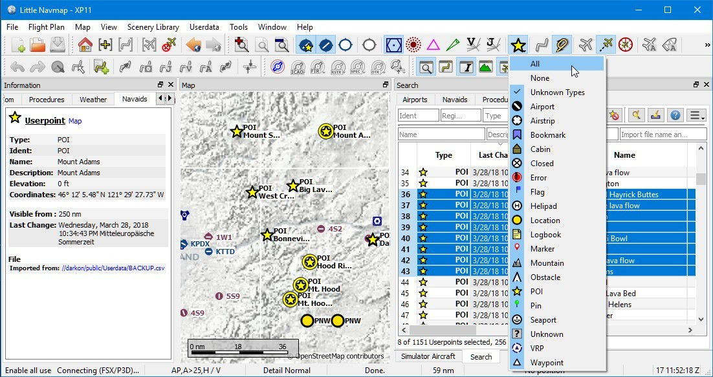
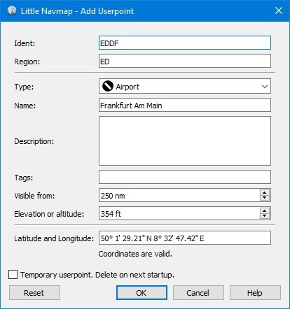
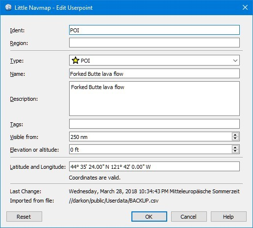

## Nutzerdefinierte Wegpunkte {#userpoints}

Nutzerdefinierte Wegpunkte \(oder Nutzerpunkte\) ermöglichen das Hinzufügen, Bearbeiten, Suchen, Exportieren und Importieren von Lesezeichen, Points of Interest, Wegpunkten und mehr. Sie können frei wählen, welche Typen Sie als Symbole auf der Karte sehen möchten.



_**Bild oben:** Eine Übersicht über die Nutzerpunktfunktionalität, die Informationen über das linke Dockfenster, hervorgehobene Nutzerpunkte auf der Karte, im Suchfenster rechts ausgewählte Nutzerpunkte und das Dropdown-Menü, das durch Anklicken des Nutzerpunkt-Symbols im Dockfenster geöffnet wird.._

## Nutzerdefinierte Wegpunkt-Suche {#userpoints-search}

Die Funktionalität der Suchfilter und der Ergebnistabelle ist ähnlich wie bei der Flughafen- und Navaidsuche. Siehe [Dockfenster Suche](SEARCH.md) für Informationen über Suchfilter und Schaltflächen.

Zusätzliche Kontextmenüelemente und Schaltflächen ermöglichen das Hinzufügen, Bearbeiten und Löschen von Benutzerpunkten.

### Top-Buttons und zusätzliche Menüpunkte {#userpoints-top-buttons}

Siehe [Suchergebnistabelle Ansicht Kontextmenü](SEARCH.md#search-result-table-view-context-menu) für eine Beschreibung der gemeinsamen Kontextmenüelemente über alle Suchdialoge hinweg.

####  Nutzerpunkt hinzufügen {#userpoints-add}

Fügt den Benutzerdaten einen nutzerdefinierten Wegpunkt hinzu.

Einige Felder des neuen Nutzerpunkt-Dialogs werden abhängig von einem ausgewählten Nutzerpunkt automatisch oder, wenn in der Suchergebnistabelle nichts ausgewählt ist, basierend auf früheren Ergänzungen ausgefüllt. Dies ermöglicht es, der Datenbank schnell ähnliche Benutzerpunkte hinzuzufügen, ohne dass alle Informationen erneut eingegeben werden müssen.

Beachten Sie, dass Sie die Koordinaten manuell hinzufügen müssen, wenn die Dialoge leer beginnen, d.h. in der Ergebnistabelle nichts ausgewählt wurde. Fügen Sie Nutzerpunkte über das Kontextmenü [Nutzerpunkt hinzufügen](MAPDISPLAY.md#add-userpoint) hinzu, um dies zu vermeiden und die Koordinaten automatisch erstellen zu lassen.

Im Folgenden finden Sie weitere Informationen zum Hinzufügen-Dialog.

####  Nutzerpunkte bearbeiten {#userpoints-edit}

Öffnet den Bearbeitungsdialog für einen oder mehrere Nutzerpunkte.

Der Bearbeitungsdialog zeigt auf der rechten Seite eine Reihe von Kontrollkästchen, wenn mehr als ein Benutzerpunkt ausgewählt ist. Diese ermöglichen es, die zu bearbeitenden Felder auszuwählen.

Im Folgenden finden Sie weitere Informationen zum Hinzufügen-Dialog.

####  Nutzerpunkt löschen {#userpoints-delete}

Entfernt die ausgewählten Benutzerpunkte nach einem Bestätigungsdialog.

####  Suche zurücksetzen {#userpoints-reset-search}

Löscht die Suchfilter und kehrt zur Anzeige aller Einträge in der Tabellenansicht der Suchergebnisse zurück.

####  Auswahl aufheben {#userpoints-clear-selection}

Deaktiviert alle markierten Einträge in der Tabelle und entfernt alle markierten Kreise aus der Karte.

####  Hilfe {#userpoints-help}

Zeigt eine Kurzhilfe im Tooltip an. Klicken Sie hier, um dieses Kapitel des Handbuchs im Standardbrowser zu öffnen.

####  Menü-Schaltfläche {#userpoints-menu}

Dropdown-Menü-Taste, mit der Sie Suchoptionen ein- oder ausblenden können.

Das Dropdown-Menü kennzeichnet Menüpunkte mit einer Änderungsanzeige `*`, um anzuzeigen, dass die zugehörige Filterzeile Änderungen aufweist.

### Dialogfeld Nutzerpunkte hinzufügen {#userpoints-dialog-add}

Der Dialog wird angezeigt, wenn Sie im Kontextmenü Karte [Nutzerpunkt hinzufügen](MAPDISPLAY.md#add-userpoint)  über die oberste Schaltfläche in der Registerkarte Nutzerpunkt-Suche oder über die Auswahl von `Nutzerpunkt hinzufügen` aus dem Kontextmenü in der Suchergebnistabelle wählen.

Der Dialog wird je nach ausgewähltem Kartenkontext, der Auswahl in der Suchergebnistabelle oder früheren Ergänzungen automatisch gefüllt.

`Type` kann aus einer Dropdown-Liste ausgewählt oder frei eingegeben werden.

Das Feld `Beschreibung` erlaubt mehrzeiligen Text und Sonderzeichen. Formatierungen wie kursiv oder fett werden nicht unterstützt.

Links werden im Feld `Beschreibung` erkannt und können im Dockfenster `Information` auf der Registerkarte `Navaids` geöffnet werden, die nach dem Anklicken eines Nutzerpunkts oder dem Auswählen von `Informationen anzeigen` in einem der Kontextmenüs angezeigt wird. Normale Weblinks wie  `http://www.example.com` oder `https://www.example.com` werden neben Verzeichnis- oder Dateilinks wie z.B. `file:///C:/Projekte/atools` unter Windows oder `file:///home/alex/Aircraft_Notes.txt` aus macOS oder Linux erkannt.

Das Feld `Sichtbar von` ermöglicht die Festlegung der Sichtbarkeit auf der Karte in Abhängigkeit von der Zoomdistanz. Der Zoomabstand \(Blickwinkelabstand zur Erdoberfläche\) für die aktuelle Kartenansicht wird in der [Statusleiste](MENUS.md#statusbar) angezeigt. Der Nutzerpunkt ist für alle Zoomabstände sichtbar, die kleiner sind als der Wert in `Sichtbar von`. Der Maximalwert beträgt 3000 nm und der Minimalwert 1 nm.

Zur Bestätigung des Dialogs sind gültige Koordinaten erforderlich. Eine detaillierte Beschreibung der erkannten Koordinatenformate finden Sie unter [Koordinatenformate](COORDINATES.md#coordinates-formats). Ein Label unter den Koordinaten zeigt die analysierten Koordinaten oder eine Fehlermeldung an, falls die Koordinaten nicht analysiert werden konnten.

Alle anderen Textfelder sind optional und können leer gelassen werden.

Der Benutzerpunkt wird beim nächsten Start von _Little Navmap_ entfernt, wenn `Temporärer Benutzerpunkt. Löschen beim nächsten Start` ausgewählte wurde.

Die Schaltfläche `Reset` löscht alle Felder mit Ausnahme der Koordinaten und setzt den Typ des Benutzerpunktes auf `Bookmark`.



_**Bild oben:** Fügt einen Dialog hinzu, der automatisch durch den Kontext gefüllt wurde. Der Benutzer hat mit der rechten Maustaste auf einen Flughafen geklickt und _`Füge Nutzerpunkt Flughafen Frankfurt am Main (EDDF) hinzu`_ausgewählt._

#### Dialog Nutzerpunkte bearbeiten {#userpoints-dialog-edit}

##### Ein einzelner Nutzerpunkt

Der Bearbeitungsdialog zeigt die gleichen Bearbeitungsfelder wie der Dialog zum Hinzufügen von Benutzerpunkten oben.

Zusätzliche Metadaten werden unten angezeigt:

* **Letzte Änderung:** Datum und Uhrzeit des Imports, der Erstellung oder Änderung.
* **Importiert aus Datei:** Datei und Pfad der Quelldatei aus dem CSV-, X-Plane- oder Garmin-Import. Sie können die Nutzerpunktsuche nach diesem Namen filtern.
* **Temporärer Nutzerpunkt - wird beim nächsten Start gelöscht.** Dies bedeutet, dass der Benutzerpunkt temporär ist.

Die Schaltfläche `Reset` macht alle manuellen Änderungen rückgängig und setzt alle Felder in ihren ursprünglichen Zustand zurück.



_**Bild oben:** Bearbeitungsdialog für einen einzelnen Nutzerpunkt._

##### Mehrere Nutzerpunkte

Wenn mehr als ein Nutzerpunkt zur Bearbeitung ausgewählt wurde, zeigt der Bearbeitungsdialog auf der rechten Seite eine Spalte mit Kontrollkästchen an.

Wenn diese Option aktiviert ist, wird das linke Feld entsperrt und der eingegebene Text wird in allen ausgewählten Benutzerpunkten dem jeweiligen Feld zugeordnet. Nicht angekreuzte Felder werden für keinen der Benutzerpunkte geändert.

In Kombination mit der leistungsstarken Suchfunktion ermöglicht dies Massenänderungen wie das Fixieren eines ungültigen Bereichs und die gleichzeitige Änderung des Sichtbarkeitsbereichs für die betroffenen Nutzerpunkte:

1. Suchen Sie nach allen Nutzerpunkten mit dem ungültigen Bereich.
2. Wählen Sie alle so entstandenen Nutzerpunkte aus, z.B. indem Sie auf einen der Nutzerpunkte in den Suchergebnissen klicken und Strg+A drücken oder indem Sie auf die linke obere Ecke der Spaltenüberschrift klicken.
3. Klicken Sie mit der rechten Maustaste auf einen der markierten Benutzerpunkte und wählen Sie im Kontextmenü `Nutzerpunkte bearbeiten`.
4. Klicken Sie auf das Kontrollkästchen rechts neben dem Feld `Region:` und ändern Sie die Region.
5. Klicken Sie auf das Kontrollkästchen rechts neben dem Feld `Sichtbar von:` und passen Sie den Wert an.
6. Klicken Sie auf `OK`.


_**Bild oben:** Bearbeitungsdialog für mehr als einen Nutzerpunkt. Die Felder _`Region`_ und _`Sichtbar von`_ werden für alle ausgewählten Punkte geändert. Alle anderen Felder bleiben unverändert._

### Typen {#userpoints-types}

Der Nutzerpunkttyp kann eine beliebige Textzeichenfolge sein. Wenn der Text mit einem Eintrag aus der Liste unten übereinstimmt, wird das entsprechende Symbol verwendet. Andernfalls wird das Symbol für `Unbekannt`  angezeigt.

Typen und Symbole können angepasst und neue Typen hinzugefügt werden. Weitere Informationen hierzu finden Sie unter [Nutzerpunk Kategorien Icons](CUSTOMIZE.md#customize-userpoint-icons).

Einige Typen werden als Standardeinstellungen beim Hinzufügen neuer Nutzerpunkte verwendet. Dies hängt vom Kontext ab, d.h. davon, was sich beim Rechtsklick auf die Karte unter dem Cursor befand.

**Beachten Sie, dass die Userpoint-Typen vorerst nicht in andere Sprachen übersetzt werden können..**

*  **Airport**: Standard beim Erstellen eines Nutzerpunktes auf einem Flughafen.
*  **Airstrip**
*  **Bookmark**: Standardtyp für neue Nutzerpunkte.
*  **Cabin**
*  **Closed airport**
*  **Error**
*  **Flag**
*  **Helipad**
*  **Location**
*  **Logbook**: Typ der automatisch hinzugefügten Logbucheinträge für Start und Landung. Siehe Menüpunkt [Logbucheintrag erstellen](MENUS.md#userdata-menu-create-logbook).
*  **Marker**
*  **Mountain**
*  **Obstacle**
*  **Pin**
*  **POI**
*  **Seaport**
*  **Unknown**: Typ namens `Unbekannt` und alle Typen, die nicht mit den Standardtypen in dieser Liste übereinstimmen.
*  **VRP**: Sichtbarer Meldepunkt.
*  **Waypoint**: Standard beim Erstellen eines Nutzerpunktes über einer Navaid.

### CSV Datenformat {#userpoints-csv}

Das CSV-Datenformat ist auf das Format abgestimmt, das bereits in der Flugsimulatorgemeinschaft und anderen Anwendungen verwendet wird.

Jede Zeile in der Datei repräsentiert einen benutzerdefinierten Wegpunkt.

Die Mindestfelder für den Import sind `Typ`, `Name`, `Ident`, `Breitengrad` und `Längengrad`. Nur `Breitengrad` und `Längengrad` müssen ausgefüllt werden, der Rest kann leer sein.

Alle zwölf Felder werden beim Export von Nutzerpunkten als CSV gespeichert. Außerdem wird das mehrzeilige Feld `Beschreibung` bei Bedarf in Anführungszeichen gesetzt und berücksichtigt Zeilenumbrüche.

Das englische Zahlenformat \(dot `.` als Dezimaltrennzeichen\) wird beim Import und Export verwendet, um den Austausch von Dateien auf Computern mit unterschiedlichen Sprach- und Ländereinstellungen zu ermöglichen.

_Little Navmap_ ntzt [UTF-8](https://en.wikipedia.org/wiki/UTF-8 ) Kodierung beim Lesen und Schreiben von Dateien. Dies ist nur von Bedeutung, wenn Sie Sonderzeichen wie Umlaute, Akzente oder andere verwenden. Andernfalls spielt die Kodierung keine Rolle.

Wenn eine Anwendung eine CSV-Datei, die von _Little Navmap_ exportiert wurde, nicht lädt, verwenden Sie [_LibreOffice Calc_](https://www.libreoffice.org), _Microsoft Excel_ oder eine andere Tabellenkalkulationssoftware, die CSV-Dateien lesen und schreiben kann, um die exportierte Datei an das von dieser Anwendung erwartete Format anzupassen.

Detaillierte Informationen zum Format finden Sie unter [Kommagetrennte Werte](https://en.wikipedia.org/wiki/Comma-separated_values) in der Wikipedia.

**Beispiel für einen absolut minimalen Benutzerpunkt, der nur aus Koordinaten besteht:**

```
,,,49.0219993591,7.8840069771
```
`Sichtbar von` wird auf den Standard von 250 nm gesetzt und der Benutzerpunkt wird nach dem Import mit dem Symbol `Unbekannt`  angezeigt.

**Beispiel für einen minimalen Nutzerpunkt-Datensatz mit Typ  **`Mountain`**, Identität und Name für den Import:**

```
Mountain,My Point of Interest,MYPOI,49.0219993591,7.8840069771
```
`Sichtbar von` wird nach dem Import auf den Standard von 250 nm gesetzt.

**Beispiel für einen exportierten Benutzerpunkt mit Typ **`Mountain`** und allen eingestellten Feldern:**

```
Mountain,My Point of Interest,MYPOI,49.0219993591,7.8840069771,1200,2.0085027218,"View,Interesting,Point","Interesting point ""Eselsberg"" - nice view",ED,250,2018-05-17T17:44:26.864
```

Beachten Sie die folgenden Einschränkungen beim Verarbeiten von CSV-Dateien: Im Feld `Tags` wird die Liste `"View,Interesting,Point"` in Anführungszeichen gesetzt, da sie Kommas enthält. Die Feldbeschreibung `"Interesting point ""Eselsberg"" - nice view "` ist in Anführungszeichen gesetzt, da der Text selbst ein Paar doppelter Anführungszeichen (`"Eselsberg"`) enthält, die wiederum durch jeweils ein weiteres doppeltes Anführungszeichen entkommen sind.

#### CSV Felder

| Position | Name                 | Erforderlich| Leer erlaubt|  Kommentar                                                                                                                                                                       |
| -------- | -------------------- | ------- | ------------ | ------------------------------------------------------------------------------------------------------------------------------------------------------------------------------ |
| 1        | Type                 | Ja     | Ja          | Einer der vordefinierten oder benutzerdefinierten Typen. Das Symbol für `Unbekannt` wird verwendet, wenn der Typ nicht mit einem der bekannten Typen übereinstimmt.                                                 |
| 2        | Name                 | Ja     | Ja          | Freies Feld. Wird für den Garmin-Export verwendet.                                                                                                                                     |
| 3        | Ident                | Ja     | Ja          | Nur für den Export von Garmin und X-Plane erforderlich. Muss ein eindeutiger gültiger Identifikator mit maximal fünf Zeichen für diese Exporte sein.                                          |
| 4        | Latitude             | Ja     | Nein           | Bereich von -90 bis 90 Grad mit Punkt `.` als Dezimaltrennzeichen                                                                                                                |
| 5        | Longitude            | Ja     | Nein           | Bereich von -180 bis 180 Grad mit Punkt `.` als Dezimaltrennzeichen.                                                                                                            |
| 6        | Altitude             | Nein      | Ja          | Muss eine gültige Zahl sein, wenn sie verwendet wird. Die Einheit ist immer feet.                                                                                                                          |
| 7        | Magnetic variance    | Nein      | Ja          | Wird beim Import ignoriert und beim Export auf einen gültigen berechneten Wert gesetzt.                                                                                                               |
| 8        | Tags                 | Nein      | Ja          | Freies Feld. GUI hat keine spezielle Stichwortsuche.                                                                                                                              |
| 9        | Description          | Nein     | Ja          | Frei verwendbares Feld, das Zeilenumbrüche erlaubt.                                                                                                                                    |
| 10       | Region               | Nein      | Ja          | ICAO-Region mit zwei Buchstaben für einen Nutzerpunkt oder Wegpunkt. Wird für den Export von X-Plane verwendet. Ersetzt durch den Standardwert `ZZ` beim X-Plane Export, wenn dieser leer ist.                                       |
| 11       | Visible from         | Nein      | Ja          | Definiert, ab welcher Zoomdistanz in Seemeilen \(angezeigt in [Statusleiste](MENUS.md#statusleiste)\) der Benutzerpunkt sichtbar ist. Wird bei leerem Import auf 250 nm eingestellt.                    |
| 12       | Last update timestamp| Nein      | Ja          | ISO-Datum und Uhrzeit der letzten Änderung. Das Format ist unabhängig von den Einstellungen des Systemdatumsformats. Format: `YYYY-MM-DDTHH:mm:ss`. Beispiel: `2018-03-28T22:06:16.763`. Nicht in der GUI editierbar.|

### X-Plane User_fix.dat Data Format {#userpoints-xplane}

Dies ermöglicht das Lesen und Schreiben der X-Plane `user_fix.dat` Datei für nutzerdefinierte Wegpunkte. Die Datei ist standardmäßig nicht vorhanden und muss unter `XPLANE/Custom Data/user_fix.dat` gespeichert werden.

Das Format wird von _Laminar Research_ in einer PDF-Datei beschrieben, die Sie hier herunterladen können: [XP-FIX1101-Spec.pdf](https://developer.x-plane.com/wp-content/uploads/2016/10/XP-FIX1101-Spec.pdf).

Die Datei besteht aus einem Header und einer Anzahl von Zeilen für die Benutzerfixes. Jede Zeile hat fünf Spalten, die durch Leerzeichen oder Tabulatorzeichen getrennt sind.

Es gibt fünf Datenspalten in der Datei:
1. Latitude
2. Longitude
3. Ident
4. Airport ident
5. Region

**Beispiel für **`user_fix.dat`**:**
```
I
1101 Version - data cycle 1704, build 20170325, metadata FixXP1101. NoCopyright (c) 2017 achwodu

 50.88166700  12.58666700 PACEC ENRT ZZ
-36.29987335 174.71089172 N0008 NZNI ZZ
99
```

**Beachten Sie, dass die nutzerdefinierten Wegpunkte zwar nicht auf der X-Plane Karte dargestellt werden, aber ausgewählt und verwendet werden können, um Flugpläne im X-Plane Bestands GPS und FMS zu erstellen.**

#### Import

**Beispielzeile aus **`user_fix.dat`** oben:**

` 50.88166700  12.58666700 PACEC ENRT ZZ`

* Die Koordinaten werden in die  _Little Navmap_  Nutzerpunkt-Koordinaten eingelesen.
* Die Fix-Id `PACEC` wird in das Feld **Ident** in _Little Navmap_ eingelesen.
* Der festgelegte Flughafen `ENRT` \(enroute: kein Flughafen hier\) wird in das Feld **Tags** in _Little Navmap_ eingelesen.
* Die Region `ZZ` \(ungültig oder keine Region\) wird in das Feld **Region** in _Little Navmap_ eingelesen.
* **Type** wird auf `Wegpunkt`   für alle importierten Korrekturen gesetzt.

#### Export

Das Mapping ist das Gleiche wie beim Import.

* Ident to fix ident.
* Tags to fix airport.
* Region to fix region.

Alle anderen Felder werden ignoriert.

Die Identität wird so eingestellt, dass sie einer bis zu fünfstelligen Buchstabenkombination entspricht. Eine generierte Identität wird verwendet, wenn dies nicht möglich ist oder die Identität leer ist.

Der Fix-Flughafen ist beim Export immer `ENRT`.

Der Bereich ist auf eine zweistellige Buchstabenzahl und eine Buchstabenkombination eingestellt. `ZZ` wird verwendet, wenn dies nicht möglich ist oder der Bereich leer ist.

**Die Identität muss in der **`user_fix.dat`** eindeutig sein. Daher wird empfohlen, für jeden Wegpunkt manuell eine eindeutige Identität festzulegen oder das Feld leer zu lassen, damit **_Little Navmap_** beim Export eine Identität erzeugen kann.**

### Garmin user.wpt Data Format {#userpoints-garmin}

Die Garmin-Nutzer-Wegpunktdatei ist eine CSV-Datei. Jede Zeile in der Datei repräsentiert einen eindeutigen Nutzer-Wegpunkt.

Es müssen vier Spalten mit Daten in der Datei vorhanden sein:

1. Waypoint ident
2. Waypoint name or description
3. Latitude
4. Longitude

*Beispiel für eine **`user.wpt`** Datei:**
```
MTHOOD,MT HOOD PEAK,45.3723,-121.69783
CRTRLK,CRATER LAKE,42.94683,-122.11083
2WTER,2NM WEST TERRACINA,41.28140000,13.20110000
1NSAL,1NM NORTH SALERNO TOWN,40.69640000,14.78500000
```

Die Wegpunkt-Identität kann aus bis zu 10 Ziffern oder Großbuchstaben bestehen, das GTN verkürzt aber den Namen auf die ersten 6 Zeichen. Es dürfen keine Sonderzeichen oder Symbole verwendet werden. _Little Navmap_ passt die Identität entsprechend an.

Der Name des Wegpunktes kann aus bis zu 25 Zahlen, Großbuchstaben, Leerzeichen oder Schrägstrichen bestehen. Der Name wird bei der Auswahl von Wegpunkten angezeigt, um dem Piloten einen zusätzlichen Kontext zu bieten. _Little Navmap_ passt den Namen entsprechend den Einschränkungen an.

#### Import

**Beispielzeile aus **`user.wpt`** oben:**

`MTHOOD,MT HOOD PEAK,45.3723,-121.69783`

* Die Identität `MTHOOD` wird in das Feld **Ident** in _Little Navmap_ eingelesen.
* Der Name `MT HOOD PEAK` wird in das Feld **Name** in _Little Navmap_ eingelesen.
* Die Koordinaten werden in die _Little Navmap_ Nutzerpunkt-Koordinaten eingelesen.
* **Type** wird auf `Wegpunkt`  für alle importierten Wegpunkte gesetzt.

#### Export

Die Zuordnung von Feldern ist identisch mit dem Import, aber alle Felder sind an die Beschränkungen angepasst.

Hinweis: Wenn ein importierter Wegpunkt innerhalb von 0,001° Breitengrad und Längengrad eines vorhandenen Nutzer-Wegpunktes im GTN liegt, wird der vorhandene Wegpunkt und Name wiederverwendet.

#### Export XML for FSX/P3D BGL Compiler {#userpoints-bgl}

Diese Exportoption erstellt eine XML-Datei, die in eine BGL-Datei mit Wegpunkten kompiliert werden kann.

Die Felder Region und Identität sind für diese Exportmöglichkeit erforderlich. Wenn der Bereich leer oder anderweitig ungültig ist, wird `ZZ` verwendet. Alle Wegpunkte sind vom Typ `NAMED`.

Weitere Informationen zum Kompilieren und Hinzufügen des BGL zum Simulator finden Sie in der Dokumentation Prepar3D SDK.

**Beispiel:**
``` xml
<?xml version="1.0" encoding="UTF-8"?>
<FSData version="9.0" xmlns:xsi="http://www.w3.org/2001/XMLSchema-instance" xsi:noNamespaceSchemaLocation="bglcomp.xsd">
    <!--Created by Little Navmap Version 2.0.1.beta (revision 2b14e14) on 2018 05 17T12:24:36-->
   <Waypoint lat="47.40833282" lon="15.21500015" waypointType="NAMED" waypointRegion="ZZ" magvar="4.02111530" waypointIdent="WHISK"/>
   <Waypoint lat="47.39666748" lon="15.29833317" waypointType="NAMED" waypointRegion="ZZ" magvar="4.01835251" waypointIdent="SIERR"/>
</FSData>
```

### Datenbank-Backup-Dateien {#userpoints-data-format}

_Little Navmap_ erstellt bei jedem Start ein vollständiges Datenbank-Backup, da die Undo-Funktionalität für Benutzerpunkte nicht verfügbar ist.

Sie können den CSV-Export auch verwenden, um Backups manuell zu erstellen, da CSV den Export des gesamten Datensatzes ermöglicht.

Weitere Informationen zu Datenbank-Backup-Dateien finden Sie unter [Benutzerdaten](FILES.md#userdata).
