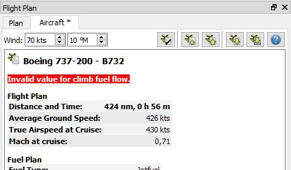
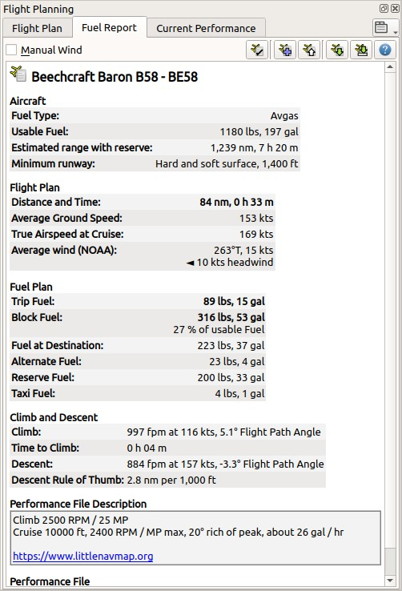

##  Aircraft
Performance {#aircraft-performance}

_Little Navmap_ provides functionality for editing, creating and collecting aircraft performance
profiles. This allows to determine needed fuel, flight time as well as climb and descent paths.

Average performance data like speed, vertical speed and fuel flow is used for the flight phases
taxi/takeoff, climb, cruise and descent to calculate fuel requirements.

A simple setting for wind at cruise altitude can be used to adjust the plan for weather.

**Aircraft performance is used for the functions below:**

* Calculation of the flight time which is shown in flight plan header.
* Calculation of top of climb and top of descent which are shown on the map and in the elevation profile. Note that altitude restrictions in procedures might affect the top of descent or top or climb distances.
* Fuel planning report in tab `Aircraft` of the dock window `Flight Plan`.
* Show remaining fuel at each leg in flight plan table.

Fuel is shown both as weight \(`lbs` or `kg`\) or as volume \(`gallons`, `liter`\) and can be
entered in either unit.

See [Top of Climb and Top of Descent Paths](PROFILE.md#toc-and-tod-paths) for details about the calculation of TOC and TOD.

Red warning messages are shown if aircraft performance contains wrong values that keep _Little Navmap_ from calculating fuel consumption, climb or descent.



_**Picture above:** Aircraft Performance tab showing an error._

A default profile with 3 nm per 1000 ft for descent and climb rules and no fuel consumption
is default. Red warning messages will be shown if used since the profile is not complete.

_Little Navmap_ has functionality to collect performance data for an aircraft automatically during
a typical flight.
This can be used to get a basic performance profile which can be fine tuned manually.
See below in chapter [Collect Performance for Flight](#aircraft-performance-collect) for more
information.

**Note that the fuel and time estimates in the dock window **`Simulator Aircraft`** on tab **`Progress`** are based on actual fuel consumption and speed and are not affected by the aircraft performance profile.**



_**Picture above:** Aircraft Performance tab with fuel planning and entered cruise wind on top. The
_`*`_ in the tab label shows unsaved changes and the performance file description contains a web link._

### Files {#aircraft-performance-files}

Performance profile files \(file extension `lnmperf`\) can be saved and loaded like flight plan files.
The performance files can be dragged from a file manager like Windows Explorer or macOS Finder and dropped into the _Little Navmap_ main window to load them.

**Do not save the files into the **_Little Navmap_** directory since it will might be deleted on next update. Neither save them in **`C:\Program Files`** or one of its sub-directories. Save the files into your **`Documents`** folder or a sub-directory in this folder.**

### Wind {#aircraft-performance-wind}

You can enter the estimated average wind speed and wind direction at cruise altitude. This will be
considered when calculating flight time and fuel consumption for each leg and the whole flight plan.

The fuel report is updated immediately when changing wind speed or direction.

The wind speed is interpolated from ground to cruise altitude for the climb and descent phases.

Note that the wind setting will not change the top of climb or top of descent points in _Little
Navmap_. It will only affect ground speed, thus flight time and fuel consumption.

### Buttons{#aircraft-performance-buttons}

The buttons on top have the same functionality as the items in the main menu [Aircraft](MENUS.md#aircraft-menu).

* 
`Edit Aircraft Performance`: Opens the edit dialog for the currently loaded profile.
*  `New
Aircraft Performance`: Creates a new performance profile with default values. A profile with 3 nm per
1000 ft for descent and climb rules and no fuel consumption
is default. Red warning messages will be shown since the profile is not complete.
* 
`Load Aircraft Performance`: Load a `lnmperf` file.
* 
`Save Aircraft Performance`: Save current profile to a `lnmperf` file.
*  `Save Aircraft Performance as`: Save current profile to a new `lnmperf` file.

### Performance Report {#aircraft-performance-report}

Note that the tab `Aircraft` in the dock window `Flight plan` is meant for fuel planning and does
not change during flight \(except when collecting performance data\).

A flight plan has to be loaded to see the fuel planning report.

A different report is displayed when collecting performance numbers.

The fuel planning report updates automatically if the flight plan, cruise altitude or wind are
changed.

See [Editing Aircraft Performance](AIRCRAFTPERFEDIT.md) for a detailed description of all fuel
numbers.

The text size of the report can be changed in dialog `Options` on `User Interface`.

#### Flight Plan {#aircraft-performance-flightplan}

* `Distance and Time`: Total flight plan distance and traveling time including procedures. Same
values as on top of the tab `Plan`.
* `Average Ground Speed`: Ground speed across all the flight phases climb, cruise and descent.
Calculated based on speeds as given and wind as entered on top the tab.
* `True Airspeed at Cruise`: Cruise speed as given in the edit dialog.
* `Mach at cruise`: Mach number at flight plan cruise altitude calculated based on given true airspeed and ISA atmospheric standard conditions.

#### Fuel Plan {#aircraft-performance-fuelplan}

* `Fuel Type`: `Jetfuel` or `Avgas`. Used to change numbers when switching between volume and
weight as fuel unit and to convert between units in the report.
* `Trip Fuel`: Fuel that is consumed while flying and covers all phases from takeoff at departure to touchdown at the destination. Does not include contingency fuel or any extra or reserve fuel.
* `Block Fuel`: Block fuel is the total fuel required for the flight. Includes trip, reserve, extra, taxi and contingency fuel.
* `Fuel at Destination`: Expected fuel at destination. Will be equal to reserve if contingency and
extra fuel are not set.
* `Reserve Fuel`: Reserve fuel as set in the edit dialog.
* `Taxi Fuel`: Taxi fuel as set in the edit dialog.
* `Extra Fuel`: Extra fuel as set in the edit dialog.
* `Contingency Fuel`: Contingency fuel calculated from the percentage given in the edit dialog and trip fuel.

#### Climb and Descent {#aircraft-performance-climb-descent}

* `Climb`: Speed and vertical speed as given plus the calculated flight path angle.
* `Time to Climb`: Calculated time to climb for the given cruise altitude.
* `Descent`: Speed and vertical speed in descent phase as given plus the calculated flight path angle.
* `Descent Rule of Thumb`: Calculated rule of thumb for descent.

Note that altitude restrictions in procedures might affect the top of descent or top or climb distances.

#### Performance File Description {#aircraft-performance-description}

This is a free plain text field for notes and links.

Links are recognized and can be opened here in the report. Normal web links like `http://www.example.com` or `https://www.example.com` are recognized besides directory or file links like
`file:///C:/Projekte/atools` on Windows or `file:///home/me/Aircraft_Notes.txt` on macOS or Linux.

#### File {#aircraft-performance-file}

Contains a link to the aircraft performance file. Opens the file or directory in the default file
manager like Windows Explorer or macOS Finder.

### Edit Aircraft Performance {#aircraft-performance-edit}

You can use the edit button  on top of the tab or the menu item `Aircraft` -&gt; `Edit Aircraft
Performance ...` to change the currently loaded performance data.

See [Editing Aircraft Performance](AIRCRAFTPERFEDIT.md) for a description of the edit dialog.

### Collect Performance for Flight {#aircraft-performance-collect}

The performance data collection mode can be used for a basic performance profile which can be
fine tuned manually. _Little Navmap_ will collect fuel flow and speed data and calculate average values for all flight phases.

Wind does not affect the calculation since all speeds are based on true airspeed.

A report of current average fuel and speed numbers is shown. You can save intermediate results at
any time.

When collecting data the elevation profile will show 3 nm per 1000 ft climb and descent slopes. You
have to estimate the needed top of descent yourself.

Follow the steps below to start the automatic performance collection mode.

1. Connect _Little Navmap_ to the simulator.
1. Fuel up your aircraft at best guess for the trip.
2. Place your aircraft on the parking spot at departure with engines shut down.
1. Select `Aircraft` -&gt; `Collect Performance for Flight`. A dialog will appear giving quick help
and the report will be replaced by one showing the recognized flight phases and other numbers.
3. Do a typical flight at typical cruise altitude and typical distance for the chosen aircraft. A
short hop at low altitude and low weight is not sufficient.
4. The collection is completed at touchdown and _Little Navmap_ will switch to the default fuel
report mode.

Now edit the aircraft performance data \([Editing Aircraft Performance](AIRCRAFTPERFEDIT.md)\) and
adjust the numbers to your liking.

**Do not forget to add at least sufficient reserve fuel. Otherwise you will run out of fuel at destination if
you rely on this plan.**


_**Picture above:** Report shown when collecting aircraft performance. The phases `Taxi and
Takeoff` and `Climb` are already finished. Current phase is `Cruise`._

You can move your airplane at cruise altitude, use warp tools to get quickly near top of descent
or adjust fuel and time manually. This will not affect performance calculation since _Little
Navmap_ reads the actual fuel flow from the simulator instead of using consumed fuel and time.

In any case stay a few minutes at cruise altitude so that _Little Navmap_ can get numbers for this
phase of flight.

### File Format {#aircraft-performance-file}

The `lnmperf` files are simple text files and use the Windows-`INI` style that has groups in square brackets and `key=value` lines. See [here](https://en.wikipedia.org/wiki/INI_file) for more information about this type of configuration files.

Speed units are always knots and feet per minute. Fuel units are gallons or lbs depending on the value of `FuelAsVolume`. `ContingencyFuelPercent` is percent which will be added to trip fuel.

`Description` has to be enclosed in double quotes. `\n` are interpreted as line feeds.

Note that comments starting with `#` or `;` will be replaced when saving the file in _Little Navmap_. You can add a dummy key like `Comment1=my remarks` to circumvent this. Unknown keys are not replaced when saving.

#### Example

``` INI
[Options]
AircraftType=B732
Description="Engine type JT8D-15A\n\nClimb: 92% N1, 280/0.7\nCruise: 0.74\nDescent:
0.74,300\n\nhttps://example.com/dokuwiki/doku.php?id=boeing_737-200_reference"
FormatVersion=1.0.0
FuelAsVolume=false
JetFuel=true
Metadata=Created by Little Navmap Version 2.2.0.beta (revision 16944ce) on 2018 11 02T20:23:52
Name=Boeing 737-200
ProgramVersion=2.2.0.beta

[Perf]
ClimbFuelFlowLbsGalPerHour=10000
ClimbSpeedKtsTAS=350
ClimbVertSpeedFtPerMin=1500
ContingencyFuelPercent=0
CruiseFuelFlowLbsGalPerHour=4800
CruiseSpeedKtsTAS=430
DescentFuelFlowLbsGalPerHour=400
DescentSpeedKtsTAS=420
DescentVertSpeedFtPerMin=2500
ExtraFuelLbsGal=0
ReserveFuelLbsGal=6000
TaxiFuelLbsGal=500
```
