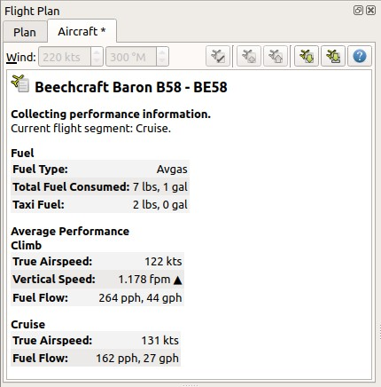

## Aircraft Performance Collection {#aircraft-perf-coll}

The performance data collection can be used to create a basic performance profile which can be fine tuned manually. _Little Navmap_ permanently collects fuel flow and speed data and calculates average values for all flight phases.

Wind does not affect the calculation since all speeds are based on true airspeed.

The collection begins automatically once _Little Navmap_ is started and connected to a simulator. You can reset the collection manually to get a clean base.

A report of current average fuel and speed numbers is shown on the tab `Current Performance` in the window. You can copy or merge intermediate results at any time into your currently loaded performance profile.

_Little Navmap_ will show 3 nautical miles per 1000 feet climb and descent slopes when collecting data based on an default or new elevation profile. You have to estimate the needed top of descent yourself.

**The flight plan cruise altitude is used to detect the cruise phase of the aircraft. Set the cruise altitude in the flight plan tab at least to the intended cruise altitude if you do not plan use a flight plan .**

### Quick How To

Follow the steps below to collect performance for an aircraft.

1. Connect _Little Navmap_ to the simulator.
1. Fuel up your aircraft at best guess for the trip.
1. Use a typical load for the aircraft.
1. Create and use a flight plan for the trip. Use a typical distance and cruise altitude for this aircraft. A short hop does not suffice.
1. Place your aircraft on the parking spot at departure with engines shut down or running.
1. Start and fly as precise as possible regarding speeds and performance settings of the aircraft.
1. The collection is completed once the field `Current flight segment:` in the report shows `Finished.`.
1. Select `Aircraft` -> `Merge collected Aircraft Performance` in the main menu and copy all values in the dialog. See [Aircraft Performance Merge](AIRCRAFTPERFMERGE.md) for more information on merging.
1. Edit the aircraft performance data ([Editing Aircraft Performance](AIRCRAFTPERFEDIT.md)) and adjust the numbers to your liking or flying habits.

**Do not forget to add at least sufficient reserve fuel. Otherwise you will run out of fuel at destination if you rely on this plan.**

Other recommended fields to edit are `Usable Fuel`, `Required Runway` and `Required Runway Type`.

You can move your airplane at cruise altitude, use warp tools to get quickly near top of descent or adjust fuel and time manually. This will not affect performance calculation since _Little Navmap_ reads the actual fuel flow from the simulator instead of using consumed fuel and time.

In any case stay a few minutes at cruise altitude so that _Little Navmap_ can get numbers for this phase of flight.

**You can create different performance profiles for different cruise altitude ranges to cover fuel flow variations.**

_**Picture above:** Report shown when collecting aircraft performance. All phases are already finished._

### Tab Current Performance {#aircraft-performance-collect}

#### Buttons {#aircraft-performance-buttons}

*  `Restart Aircraft Performance Collection`: Resets all collected fuel and speed parameters back to zero. Nevertheless performance collection will continue immediately even while in cruise, for example.
*  `Merge collected Aircraft Performance`: Opens a dialog allowing to merge the collected performance parameters into the currently loaded performance file. This can be used in all flight phases. See [Aircraft Performance Merge](AIRCRAFTPERFMERGE.md) for more information on merging.
*  Help: Click to open this chapter of the manual in the default browser.

#### Report {#aircraft-performance-report}

The text size of the report can be changed in dialog `Options` on `User Interface`.

##### Aircraft Section

* `Current flight segment`: Shows which flight phases (`Climb`, `Cruise` and more) are detected.
* `Aircraft status`: More information about aircraft status like fuel flow or on ground status.

##### Fuel Section

* `Fuel Type`: Fuel type as reported by simulator. This is calculated based on the volume/weight ratio. Correct this manually if add-on aircraft do not provide a correct fuel type.
* `Total Fuel Consumed`: Fuel consumed so far since the restart of _Little Navmap_ or the last reset of the collection function.
* `Taxi Fuel`: Fuel used from first detected fuel flow to lift off.

##### Average Performance Section - Climb, Cruise and Descent

Average values for the different flight phases. Sections for not yet started phases are omitted. Passed sections like e.g. climb will show zero values if you restart the collection mid flight in e.g. cruise.

* `True Airspeed`: True airspeed average.
* `Vertical Speed`: Average climb or descent speed. Not shown for cruise phase.
* `Fuel Flow`: Fuel flow average.
