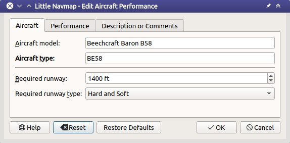

##  Edit Aircraft Performance {#aircraft-performance}

The dialog allows editing of all aircraft performance related parameters on three tabs. The labels for all values required for fuel calculation are highlighted **bold**.

The dialog is opened when clicking on the edit button in the tab `Fuel Report`, when selecting `Aircraft` -> `New Aircraft Performance ...` or `Edit Aircraft Performance ...` in the main menu.

### Buttons {#buttons}

* `OK`: Takes all changes made in the dialog but does not save the profile. The fuel report, top of climb and top of descent in the [Flight Plan Elevation Profile Dock Window](PROFILE.md) are adjusted immediately.
* `Cancel`: Disregards all changes and closes the dialog.
* `Reset`: Resets all changes made since opening the edit dialog.
* `Restore Defaults`: Resets back to the default profile.
* `Help`: Opens the online help in the default web browser.

### Tab Aircraft

* `Aircraft model`: Can be used freely. Determined from aircraft name when _Little Navmap_ collects data for a performance profile.
* `Aircraft type`: The ICAO aircraft type designator. See [List of ICAO aircraft type designators](https://en.wikipedia.org/wiki/List_of_ICAO_aircraft_type_designators) (Wikipedia). _Little Navmap_ will show a warning in the tab `Fuel Report` if the flown aircraft does not match the type. Detected automatically when collecting performance.
* `Required runway`: Only for information. Shown in the fuel report if bigger than zero.
* `Required runway type`: Only for information. Shown in the fuel report if it differs from default `Hard`.

_**Picture above:** Fist tab in aircraft performance edit dialog._

### Tab Performance

All speeds are entered in true airspeed. This makes the values independent of wind influence which would be the case of ground speed. It also makes the values independent of cruise altitude and deviation from ISA atmospheric conditions which would be the case when using the Mach number or indicated airspeed.

#### Fuel {#fuel}

* `Fuel Units`: Either `Volume` (gallons or liters) or `Weight` (lbs or kilograms). The numbers in the dialog will be converted using the weight of the selected `Fuel Type` when changing the unit. Rounding errors might occur when switching forth and back noticeable a small changes.
* `Fuel Type`: `Avgas` (default) or `Jetfuel`. Needed to convert fuel numbers between weight and volume. This is detected automatically when collecting aircraft performance.

See [Fuel - Flight Planning Definitions](https://www.skybrary.aero/index.php/Fuel_-_Flight_Planning_Definitions) (SKYbrary) for more information on the various fuel types.

#### Usable Fuel {#usable-fuel}

Used to calculate estimated range and to check if block fuel exceeds fuel capacity of aircraft.

A label `Estimated range with reserve` shows the maximum distance and time to fly with reserves.

#### Reserve Fuel {#reserve-fuel}

Final reserve fuel is the minimum fuel required to fly for 30 minutes at 1500 feet above the alternate airport or at the destination airport at holding speed if an alternate is not required. Some authorities require sufficient fuel for 45 minutes holding time.

Alternate fuel is the amount of fuel required to fly the missed approach at the destination airport and to the alternate airport.

`Reserve fuel` is the sum of alternate fuel and final reserve fuel.

You have to set this value to avoid running out of fuel at the destination when relying on this profile.

#### Taxi Fuel {#taxi-fuel}

`Taxi fuel` is the fuel used prior to takeoff and includes APU consumption, engine start and taxi fuel.

#### Extra Fuel {#extra-fuel}

Fuel that is added at the discretion of the captain or the dispatcher.

#### Contingency Fuel {#contingency-fuel}

Contingency fuel is carried to account for additional en-route fuel consumption caused by wind, routing changes or traffic management restrictions.

The value is given in percent of trip fuel.

#### Climb {#climb}

Values for climb are detected automatically when collecting performance.

* `Average climb speed`: Average true airspeed from takeoff to cruise altitude.
* `Average vertical climb speed`: Vertical speed in climb phase. Either feet per minute (`fpm`) or meter per second (`m/s`).
* `Average fuel flow in climb`: Fuel flow in climb phase. Either `gal`, `lbs`, `l` or `kg`.

Climb speed and vertical climb speed are used to calculate the top of climb which also varies with wind conditions.

#### Cruise {#cruise}

Values for the cruise phase are detected automatically when collecting performance.

* `Cruise speed at typical cruise altitude`: True airspeed at cruise.
* `Fuel flow in cruise`: Fuel flow in cruise phase.

#### Descent {#descent}

Descent values are detected automatically when collecting performance.

* `Average descent speed`: True airspeed in descent phase.
* `Average vertical descent speed`: Average vertical speed.
* `Average fuel flow for descent`: Average fuel flow on descent.

A label `Descent Rule of Thumb` shows the calculated rule of thumb for descent. The default is 3 nm per 1000 ft.

Descent speed and vertical descent speed are used to calculate the top of descent which also varies with wind conditions.

#### Alternate {#alternate}

* `Average speed for alternate`: True airspeed when flying to alternate.
* `Average fuel flow for alternate`: Average fuel flow when flying to alternate.

_Little Navmap_ uses the values from the cruise phase as a default. The flight to the alternate airport usually happens at a lower altitude than cruise altitude and therefore results in a higher fuel flow. Adjust the values accordingly here.

_**Picture above:** Aircraft performance edit dialog tab `Performance`._

### Tab Description or Comments {#description}

This tab contains a free plain text field for notes and links.

Normal web links like `http://www.example.com` or `https://www.example.com` are recognized besides directory or file links like `file:///C:/Users/me/Documents/Aircraft%20Notes.txt` on Windows or `file:///home/me/Aircraft%20Notes.txt` on macOS or Linux.

Note that you have to use the forward slash `/` instead of the backslash `\` on Windows as a path separator.

Replace spaces in links with `%20` since _Little Navmap_ recognizes links until the next space.

