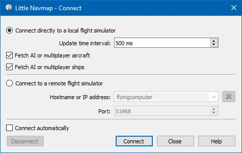

##  Connecting to a Flight Simulator {#connecting-to-a-flight-simulator}

The setup procedure is different for remote connections and local connections to a flight simulator.

_Little Navmap_ can connect directly if all programs are run on the same computer. The _Little Navconnect_ agent is needed if _Little Navmap_ is run on a remote computer.

### Local Connection {#local-connection}

1. Open the connection dialog in _Little Navmap_ by selecting `Main Menu` -&gt; `Tools` -&gt; `Flight Simulator Connection`.

   

   _**Picture above:** _[_Little Navmap_](https://albar965.github.io/littlenavconnect.html)_ connect dialog set up for a local connection that is manually established._

2. Select `Connect directly to local Flight Simulator`.

3. Click `Connect`. The dialog will close and _Little Navmap_ will try to establish a connection in the background.

Click `Close` to save all changes and close the dialog without establishing a connection.

Enable `Connect automatically` if you do not want to connect manually. The start order of programs does not matter if this is checked and _Little Navmap_ will find the simulator once it is started or when it is already running. This is a recommended setting.

Deselect `Fetch AI or multiplayer aircraft` or `Fetch AI or multiplayer ships` to disable the transfer of this information to the program. This can be useful for performance reasons if you use large amounts of AI but do not want to see it in _Little Navmap_.

### Remote Connection {#remote-connection}

User aircraft and weather information is transferred to _Little Navmap_ by using the _Little Navconnect_ agent on the flying computer which saves the error prone and tedious setup of a remote SimConnect connection.

You have to extract the ZIP archive that contains `littlenavmap.exe` and `littlenavconnect.exe` on both computers. Then load the scenery database on the flying computer and copy the database over to the remote computer. See [Running without Flight Simulator Installation](RUNNOSIM.md) for details.

Make sure that the major versions of _Little Navmap_ and _Little Navconnect_ match, otherwise you might get an error message. _Little Navmap_ 1.0.5 is compatible with _Little Navconnect_ 1.0.2 but not with 1.2 for example.

1. _Little Navconnect_ is bundled together with the _Little Navmap_ download archive. Start _Little Navconnect_ \(`littlenavconnect.exe`\) on the flying computer and take note of the message that is printed in the logging window. You only need the colored values. You can use the IP address or the hostname. _Little Navconnect_ can print multiple IP addresses or hostnames depending on your network configuration. This can happen if you have Ethernet plugged in and are connected using wireless LAN too, for example. You have to try if you are unsure which one to use. Also make sure to set up the Windows firewall properly to allow communication between `littlenavmap.exe` and `littlenavconnect.exe` on both computers.

   

   _**Picture above:** _[_Little Navconnect_](https://albar965.github.io/littlenavconnect.html)_ is running and waiting for a Flight Simulator._

   Change the port in _Little Navconnect_'s `Options` dialog if you see an error message like shown below:

   `[2016-07-27 16:45:35] Unable to start the server: The bound address is already in use.`

2. Start _Little Navmap_ on the client computer.

3. Open the connection dialog in _Little Navmap_ by selecting `Main Menu` -&gt; `Tools` -&gt; `Flight Simulator Connection`.

   

   _**Picture above:** Connect dialog with correct values to access the _[_Little Navconnect_](https://albar965.github.io/littlenavconnect.html)_ shown above._

4. Select `Connect to a remote Flight Simulator`.
5. Add the value for hostname. This can be either the hostname or the IP address printed by _Little Navconnect_.
6. Check the value for the port. `51968` is the default value and does not need to be changed usually.
7. Click connect. The dialog will close and _Little Navmap_ will try to establish a connection in the background which can take some time, depending on your network. Your aircraft will show up on the map and on the `Simulator Aircraft` dock window once a flight is set up and loaded on the simulator. You will see the message `Connected. Waiting for update.` in the `Simulator Aircraft` dock window if no flight is loaded yet \(i.e. the simulator still shows the opening screen\). Note that it sometimes can take a while until an error is shown if you used the wrong values for hostname or port.

Select `Connect automatically` if you do not want to connect manually. The start order of all three programs \(simulator, _Little Navconnect_ and _Little Navmap_\) does not matter if this is checked and the programs will find each other.

Deselect `Fetch AI or multiplayer aircraft` or `Fetch AI or multiplayer ships` in `Tools` -&gt; `Options` of _Little Navconnect_ to disable the transfer of this information across the network. This can be useful for performance reasons if you use large amounts of AI but do not want to see it in _Little Navmap_.

### Connect Dialog Options {#options}

* `Disconnect`: Disconnects the current session and stops automatic reconnect.
* `Connect`: Tries to connect. An error dialog will be shown if no connection can be established. _Little Navmap_ will constantly try again if `Connect automatically` is enabled.
* `Close`: Closes the dialog without any changes to the current connection status.
* `Connect automatically`: _Little Navmap_ will try to connect constantly if this is enabled. This is the recommended setting.
  * All connection attempts will stop immediately if you deselect this button.
  * You have to click `Connect` to start the automatic connection attempts after checking this button.
* `Update Time Interval`: Allowed range is 50 milliseconds up to 1 second. _Little Navmap_ fetches data from Flight Simulator using this time interval. Increase this value if you experience stutters or lag in the simulator. A lower value will result in more fluid map updates in _Little Navmap_.
* `Fetch AI or multiplayer aircraft` and `Fetch AI or multiplayer ships`: Disables fetching of AI vehicles. These settings are applied immediately.

