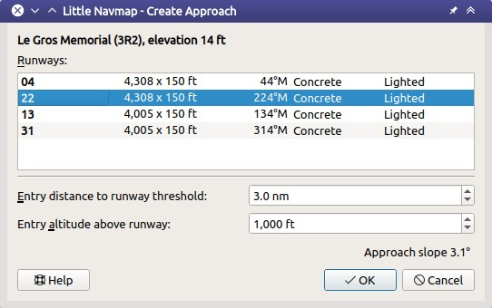
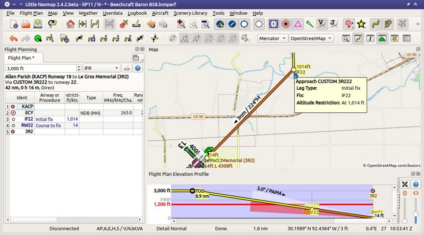

## User Defined Approach {#user-defined-approach}

An user defined approach can be created and applied to all airports, even small airstrips which do not provide approach procedures.

A defined approach consists of a final approach leg which can be customized by changing altitude and length. This enables vertical guidance in the elevation profile and allows to show ILS and/or VASI slopes at the destination.

The approach does not create an airport traffic pattern or a pattern like structure. Add user defined waypoints to the flight plan for lateral guidance around the destination.

User defined approaches are part of a flight plan unlike airport traffic patterns ([Traffic Pattern](TRAFFICPATTERN.md)) which are only map display features.

This type of approach can be removed like other procedures by deleting one of the legs in the flight plan table.

The approach is saved in the annotated PLN flight plan file (default format) like other approaches. User defined waypoints are used for the initial fix and runway threshold when exporting a custom approach to other flight plan formats than PLN.

### Waypoints

An user defined or custom approach consists of two waypoints which also indicate the runway name:

* `IF22`: The initial fix or start of the approach procedure. This point has an altitude restriction based on the entry altitude above the runway which is runway `22` in this example.
* `RW22`: The runway threshold for runway `22` here.

### Create Approach Dialog

Right click into the map, flight plan table or airport search result table on an airport and select `Create Approach for Airport and use as Destination` or `Create Approach for Airport and insert into Flight Plan`. The available options depend on whether the airport is already part of the flight plan.

* Dialog header: Shows airport name and its ICAO ident as well as field elevation.
* `Runways`: List of available runways for the airport. Shows runway name, length, width, magnetic heading, surface and lighting status.
* `Entry distance to runway threshold`: Distance from the initial fix to the runway. Default is 3 nautical miles.
* `Entry altitude above runway`: Altitude of the initial fix above runway elevation. Default is 1000 feet.
* `Approach slope`: Shows the slope angle calculated from the given distance and altitude. The default values for distance and altitude give a 3.1 degree slope.

A click on the `OK` button or a double click into the list `Runways` closes the dialog and creates the approach.

_**Picture above:** Dialog shown after right clicking on an airport and selecting `Create Approach for Airport and use as Destination` on airport `3R2`._

_**Picture above:** An user defined approach for airport `3R2` to runway `22`. Elevation profile shows approach slope and PAPI for vertical guidance._
