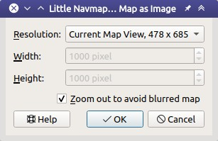

## Image Export {#image-export}

This dialog appears when saving the map view to an image file, for AviTab or copying it to the clipboard.

**Dialog input and selection fields:**

* `Resolution`: Select the desired resolution here. The following options are available:
  * `Current Map View`: Export the map view as shown. The current pixel size of this image is shown in the list entry.
  * `Custom Resolution`: Use the pixel size from the input fields `Width` and `Height`.
  * `720p, 1280 × 720, 16∶9`,
  * `1080p, 1920 × 1080, 16∶9`,
  * `1440p, 2560 × 1440, 16∶9`,
  * `2160p, 3840 × 2160, 16∶9` and
  * `4320p, 7680 × 4320, 16:9`: Pre-defined typical image and monitor resolutions.
* `Width` and `Height`: Use this to define the pixel size for the image if `Custom Resolution` is selected.
* `Zoom out to avoid blurred map`: Checking this option helps to get a sharp background image for online maps \(e.g. from OpenStreetMap\). This works best with the map projection `Mercator`. As a result the map might be zoomed out farther than expected in some cases.

Note that all options except `Current Map View` will change visible details. Navaids might appear which are not shown in the map on screen, for example.

_**Picture above:** Dialog show after choosing `Save Map as Image ...`._

