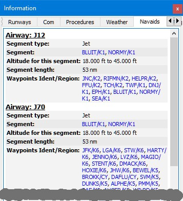
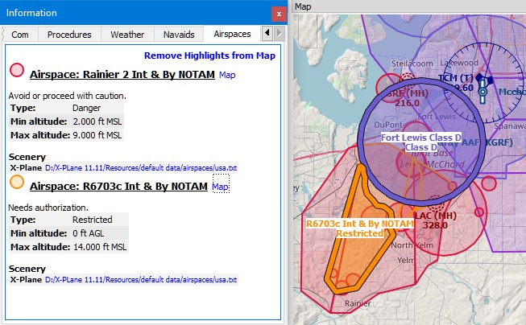

##  Information Dock Window {#information-dock-window}

### General {#general}

This dock window contains text information about airports in several tabs as well as information for one or more navaids, airways in another tab plus an additional tab showing airspace information.

All information can be copied to the clipboard as formatted text. Use the context menu of the text fields or use `Ctrl+A` to select all and `Ctrl+C` to copy the content to the clipboard. Note that the formatted clipboard content is removed when _Little Navmap_ is closed.

Bearing and distance \(rhumb line constant course\) to the user aircraft is shown for airports, navaids and userpoints if connected to a simulator and if the distance is below 500 NM.

The display of additional units for fuel and weight as well as true course can be enabled in the options dialog on tab `Units`.

### Dock Window and Tabs {#windows-tabs}

Information for only one airport, navaid or userpoint is shown when selecting one of the `Show Information for ...` context menu items in the map, flight planning dock window or the search result table.

All tabs are filled for airport, all navaids, all userpoints or all airspaces which are close to the cursor for a left click in the map.

_Little Navmap_ shows tabs based on priorities and selected objects and tries minimize tab changes.

Example: If you click on an airport, a VOR, a NDB and an userpoint at the same position:

1. _Little Navmap_ fills all airport (several tabs), navaid and userpoint tabs with information. The tab `Navaids` gets information for the NDB and the VOR.
2. The dock window `Information` is opened and raised if not visible.
3. The tab `Userpoints` is opened and raised if not visible. Userpoints are activated since user features like map highlights, logbook entries or userpoints have priority before airports, navaids and others.

### Links {#links}

A blue link `Map` in the information allows jumping to and/or highlighting the shown object on the map. A link `Remove Airway Highlights` or `Remove Airspace Highlights` can be used to remove the corresponding highlights on the map.

Other links open web pages with airport information in the web browser or a file manager like Windows Explorer with directories or files.

### Scenery Information {#scenery}

All information about airports and navaids includes one or more links at the bottom of the object information in section `Scenery`. These links point to the matching `BGL` \(FSX, P3D\) or `dat` \(X-Plane\) files that contain information about the airport or navaid. Click the links to open the containing folder in your file manager \(e.g. Windows Explorer\). If possible, the matching file will be selected automatically.

Multiple links can appear for airports since these can be updated by several files from different add-on sceneries or navdata updates.

### Tabs in Information Dock Window

#### Tabs Airport, Runways, Com, Procedures, Nearest and Weather {#airport}

These six tabs show information for one selected airport.

Sunrise and sunset for the airport are calculated based on current real date if no simulator is connected. Otherwise the simulator date is used. This is indicated by the text `(civil twilight, real date)` or `(civil twilight, simulator date)`.

Preferred runways depending on wind are shown after the METAR. More details about preferred runways are on the tab `Weather`.

The tab `Weather` shows decoded weather information for a selected airport. The flight rules icon \([Legend - Airport Weather](LEGEND.md#airport-weather)\) has a suffix ` - Map` if the shown weather source is the source for airport weather icons on the map. Also shown is detailed information for best runways for takeoff and landing based on wind conditions.

Additional links for helipads are available in the tab `Runways`.

The tab `Nearest` shows airports having procedures and closest navaids relative to the selected airport.

_**Picture above:** Airport information overview. Additional tabs show information for runways, COM frequencies, approaches and weather. Weather symbols user NOAA weather as source. Sunset and sunrise is based on real date since not connected to a simulator. Wind direction prefers runways 09 and 14._

#### Tab Navaids {#navaids}

More than one navaid or airway can loaded into this tab on left click. VOR, NDB, waypoint, airway and ILS information is shown in this tab.

An airway is always displayed with all its waypoints. Click any blue waypoint link to center the map around the waypoint.

Whole airways are highlighted and shown on the map when clicking the `Map` link in the information window.

Highlighted airways have their own tooltip which is also shown if all other airways are hidden.

Click the link `Remove Airway Highlights from Map` in the information window to remove them from the map.

| | |
| -- | -- |
|  |  |
| _**Picture above:** Navaid information. Two navaids were close to the cursor when clicked._ | _**Picture above:** Navaid information. Display of several airways with altitude restrictions and list of clickable waypoints. Clicking on the link `Map` highlights a whole airway._ |

#### Tab Airspaces {#airspaces}

Airspaces are highlighted on the map with their boundary and a text label when clicking the `Map` link in the information window.

Highlighted airspaces have their own tooltip which is also shown if all other airspaces are hidden.

Click the link `Remove Highlights from Map` in the information window to remove the highlights from the map.

_**Picture above:** Two airspaces that are shown in the information after clicking into the map. Two airspaces are highlighted on the map after clicking onto the _`Map`_ link in the information text._

#### Other Tabs {#other-tabs}

* `Userpoints`: Shows information about user defined waypoints or points of interest.
* `Logbook`: Details about logbook entries.
* `Online Clients`: Online network clients/aircraft.
* `Online Centers`: Online network centers/airspaces.

###  Tabs in Simulator Aircraft Dock Window {#simulator-aircraft-dock-window}

This dock window shows information about the user aircraft and about AI or multiplayer aircraft in several tabs. _Little Navmap_ has to be connected to the simulator to enable this feature. See [Connecting to a Flight Simulator](CONNECT.md#connecting-to-a-flight-simulator) for more information on this topic.

#### Tab Aircraft {#aircraft}

Gives an overview about the user aircraft and shows type, weight and fuel information.

_**Picture above:** Aircraft information when connected to a flight simulator. Alternate units (liter and kg) are enabled._

#### Tab Progress {#progress}

Shows information similar to a flight management computer about the user aircraft. This covers flight plan progress, altitude, speed, ambient and environment parameters.

The text information in the tab has a link `More Less` on the top left. You can use this to toggle between more detailed and less information.

The aircraft and progress tabs show warnings and errors by highlighting text in red or orange. These are:

* Fuel and time estimated since flight plan not valid.
* Fuel and time estimated since aircraft performance not valid.
* Gross weight exceeding max gross weight.
* Insufficient fuel at destination (if aircraft performance is valid).
* Speed limit of 250 knots exceeded below 10000 feet.
* Icing.

Note that the fuel and time estimates are based on the aircraft performance if valid. \([Aircraft Performance](AIRCRAFTPERF.md)\).

Fuel at destination is estimated by remaining fuel in tanks so far and consumption as predicted by aircraft performance for remaining distance.

_Little Navmap_ can show a warning about fuel at destination in the early flight phases (climb). This is normal since fuel flow is higher for takeoff and early climb.

_**Picture above:** Aircraft progress information when connected to a flight simulator and user aircraft airborne. Alternate weight and fuel units (kg and liter) are enabled as well as true course display._

#### Tab AI / Multiplayer

Information about an AI or multiplayer aircraft from the simulator \(not online networks\) or ship is displayed in this tab if a vehicle is clicked on the map.

This also includes the aircraft's departure and destination airports that can be shown on the map by clicking on the blue links \(only for FSX or P3D and if a flight plan is filed\).

Note that information on AI aircraft is limited on X-Plane. Only position, altitude and heading can be displayed.

_**Picture above:** Information about an AI aircraft._

##  Legend Dock Window {#legend-dock-window}

Contains two tabs: One tab  `Navmap` explaining the various airport and navaid symbols and a tab `Map` which shows the
general legend for the base map like the _OpenStreetMap_ for example.

The contents of the `Navmap` legend are also available in the online manual: [Nav Map Legend](LEGEND.md).

Note that the general map legend is not available for all map themes.

