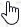
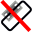

## Map Display {#map-display}

See the [Nav Map Legend](LEGEND.md) for details about the various symbols shown by the map.

### Moving {#moving}

Use click and drag to move the map and the mouse wheel to zoom in or out. Use `Shift+Wheel` to zoom in small steps. You can also use the overlay buttons on the right side of the map.

Alternatively use the keyboard to move around the map:

* Cursor keys: Scroll the map
* `+` and `-`: Zoom in and out
* `*` and `/`: Zoom in and out in small steps
* `Alt+Left` and `Alt+Right`: Go forward or backward in the map position history
* `Ctrl++` and `Ctrl+-`: Increase or decrease details
* `Ctrl+Home`: Go to home postion
* `Ctrl+End`: Go to center for distance search

Do not forget to activate the map window by clicking into it before using keys for movement.

### Mouse Clicks {#mouse-clicks}

A single click shows details about all map objects nearby the clicked position in the `Information` dock window. Windows and tabs are raised depending on clicked objects.

A single click on an user aircraft, AI aircraft or multiplayer aircraft shows details in the `Simulator Aircraft` dock window.

A double-click zooms in showing either the airport diagram or the navaid closely and also shows details in the `Information` dock window. The same applies for all AI or multiplayer aircraft or ships.

The double-click and single-click functionality does not work for flight plan waypoints or airports if the flight plan edit mode is enabled. The edit mode can be disabled using the toolbar or `Flight Plan` -> `Edit Flight Plan on Map` in the main menu.

The mouse click sensitivity can be adjusted in the `Options` dialog on the `Map` tab.

### Mouse Click Hotspots {#mouse-click-hotspots}

Map marks like range rings or measurement lines have hotspots to indicate that a modifier-click can remove them or an action is available in the context menu. The same applies to the flight plan drag and drop editing mode.

The mouse cursor changes into a hand  to indicate a click spot.

Click spots are:
* Center of range rings (small circle).
* End of a measurement line (cross).
* Runway threshold point (small circle) for airport traffic patterns.

### Mouse Clicks and Modifiers {#mouse-clicks-modifiers}

You can use the keyboard and mouse click to get quick access to the following functions:

* `Shift+Click`: Add or remove range rings or navaid range rings.
* `Ctrl+Click`: Start rhumb-line measurement or delete a measurement line.
* `Alt+Click`: Start great circle line measurement or delete measurement line.
* `Ctrl+Shift+Click`: Add or edit an userpoint.
* `Ctrl+Alt+Click`: Insert airport, navaid, userpoint or position into the nearest flight plan leg.
* `Shift+Alt+Click`: Append airport, navaid, userpoint or position to flight plan.

Clicking again on the hotspot removes the marks, measurement lines or flight plan waypoints.

### Aircraft {#aircraft}

The user aircraft and AI or multiplayer aircraft or ships will be shown on the map if the program is connected to a flight simulator. Color indicates user or AI or multiplayer vehicle and the symbol shape indicates if the aircraft is an piston/turboprop, jet, helicopter or a ship. The symbol outline changes to gray if an aircraft is on ground.

Little Navmap  limits the display of AI vehicles depending on size. Zoom close to see small aircraft or boats

AI and multiplayer aircraft on ground are shown only on small zoom distances to avoid cluttered airports. This means that an AI aircraft can disappear from the map when landing on an airport.

On the lowest zoom distance all aircraft are drawn to scale as are the parking spots which means you can easily check if your aircraft fits on an apron, parking spot or taxiway.

A yellow wind arrow and labels for the situation around the user aircraft can be displayed on the
top center of the map. The displayed labels for aircraft can be configured in the dialog `Options` on tab `Map Display`. No labels are shown for ship traffic.

See the [Nav Map Legend](LEGEND.md#aircraft) for details about the aircraft type.

### Tooltips {#tooltips}

Hovering the mouse over the map will show tooltips for all map objects including airports, VOR, NDB, airways, parking, fuel box, towers, aircraft and ships. The tooltip is truncated and shows a message `More...` if it gets too long. In that case reduce details or zoom in closer.

The sensitivity for the tooltip display can be adjusted in the `Options` dialog on the `Map` tab.

 

_**Pictures above:** Tooltip with information for an airport and a VOR and a tooltip with information about airspaces._

### Highlights {#highlights}

Airports, navaids or other features that are selected in the flight plan table or in a search result table are highlighted on the map with a green/black or a yellow/black ring respectively.

Waypoints that are selected in the procedure preview are highlighted with a blue/black ring.

These highlight circles provide all functionality of visible map objects, even if the objects are not shown at the current zoom distance (ring is empty). This allows double-click for zoom in, single-click for information dock window and all context menu entries.

You can use the button `Clear Selection`  on top of the flight plan and search windows to remove any map highlights.

### Airport Diagram {#airport-diagram}

The display will change from a single icon to an airport diagram if you zoom in deep enough to an airport. The diagram shows all taxiways, parking positions, gates, runways and more.

The airport diagram provides more information through tooltips for parking and tower positions. A right-click on a parking position opens the context menu and allows to select the start position for flight plan departure.

**Airspaces are hidden if the airport diagram is shown.**

See the [Nav Map Legend](LEGEND.md#airport-diagram) for details about the airport diagram.

_**Picture above:** High level view of the airport diagram of EDDH._

_**Picture above:** Detailed view of the airport diagram. Shows blue gates on the right and a few green general aviation ramp parking spots on the left. Long displaced threshold of runway 33 is visible. Dashed yellow lines indicate taxi paths._

### Map Context Menu {#map-context-menu}

The map context menu can be activated using right-click or the menu key. Menu items are enabled or disabled depending on selected object and some menu items contain the name of the selected map object for clarification.

####  Show Information {#show-information}

Show detailed information in the `Information` dock window for the nearest airport, airway, airspace or navaid which name is shown in the menu item.

If you like to see information on all objects nearby a click position do a single left click into the map.

See the [Information Dock Window](INFO.md#information-dock-window) for details.

####  Show Procedures {#show-procedures}

Open the procedure search tab of the search dock window and display all procedures for the airport.

See [Procedure Search](SEARCHPROCS.md) for more information.

####  Create Approach {#show-approach-custom}

Opens a dialog which allows to create a simple user defined final approach.

See [User Defined Approach](CUSTOMPROCEDURE.md) for more information.

####  Measure GC Distance from here {#measure-gc-distance-from-here}

Display distances from the selected origin as you move the mouse over the map. Left-click on the map to end measuring and keep the measurement line. All measurement lines are saved and will be restored on next start up.

You can use the keyboard, mouse wheel or the map overlays to scroll and zoom while dragging a line.

Right-click, press the escape key or click outside of the map window to cancel the measurement line editing.

Measurement lines use nautical miles, kilometers or statue miles as unit. Feet or meter will be added as unit if the lines are short enough. This allows to measure e.g. takeoff distance for crossing takeoffs.

A great circle gives the shortest distance from point to point on earth but does not use a constant course. For that reason the measurement line will show two course values. One for the start and one for the end position.

Course is always indicated in degrees true which is indicated by the suffix `°T`. Additional information like ident or frequency will be added to the line if the measurement starts at a navaid or an airport.

The width of distance measurement lines can be changed in the dialog `Options` on the tab `Map Display`.

See the [Nav Map Legend](LEGEND.md#map-marks) for details on measurement lines.

Note that the menu item is disabled if holdings are hidden on the map (menu `View` -> `User Features`). The menu item is suffixed with the text `hidden on map` if this is the case.

####  Measure Rhumb Distance from here {#measure-rhumb-distance-from-here}

A rhumb line is a line of constant course and used between the waypoints of an airway or when approaching a VOR or NDB station. Distance between points is slightly longer than the great circle route.

The course for a rhumb line is indicated in degrees magnetic and true (`°M`, `°T` or `°M/T` if both values are equal).

Note that the rhumb line connecting two points on earth is longer than the great circle path. Also, near the poles and for longer distances the rhumb line is not usable.

The magnetic declination to calculate the magnetic course will be taken from the global `magdec.bgl` file at the origin of the measurement.

The magnetic declination of an airport or navaid will be used if the measurement starts at a such a point. Additional information like ident and frequency will be added to the line in this case as well.

See [Magnetic Declination](INTRO.md#magnetic-declination) for remarks on that topic.

Note that the menu item is disabled if measurement lines are hidden on the map (menu `View` -> `User Features`). The menu item is suffixed with the text `hidden on map` if this is the case.

####  Remove Distance measurement {#remove-distance-measurement}

Remove the selected line. This menu item is active if you right-click on the end point of a distance measurement line (small cross).

####  Display Airport Traffic Pattern {#show-traffic-pattern}

This menu item is enabled if clicked on an airport. Shows a dialog that allows to customize and display an airport traffic pattern on the map.

See [Traffic Pattern](TRAFFICPATTERN.md).

Note that the menu item is disabled if traffic patterns are hidden on the map (menu `View` -> `User Features`). The menu item is suffixed with the text `hidden on map` if this is the case.

####  Remove Airport Traffic Pattern {#remove-traffic-pattern}

Enabled if clicked on the airport traffic pattern hotspot (white filled circle at runway threshold) which is indicated by a hand cursor. Removes the traffic pattern from the map.

See [Traffic Pattern](TRAFFICPATTERN.md).

####  Display Holding {#holding}

Allows to display a holding pattern at any position on the map. The hold may also be attached to navaids.
Opens a dialog for customization of the hold once selected.

See chapter [Holding](HOLD.md) for more information.

Note that the menu item is disabled if holdings are hidden on the map (menu `View` -> `User Features`). The menu item is suffixed with the text `hidden on map` if this is the case.

#### Remove Holding

Enabled if clicked on the hotspot (holding fix, white filled triangle) which is indicated by a hand cursor.
Removes the holding from the map.

See chapter [Holding](HOLD.md) for more information.

####  Show Range Rings {#show-range-rings}

Show multiple red range rings around the clicked position. The number and distance of the range rings can be changed in the `Options` dialog on the `Map Display` tab. A label indicates the radius of each ring in nautical miles.

The width of all range rings can be changed in the dialog `Options` on the tab `Map Display`.

Note that the menu item is disabled if range rings are hidden on the map (menu `View` -> `User Features`). The menu item is suffixed with the text `hidden on map` if this is the case.

####  Show Navaid range {#show-navaid-range}

Show a ring around the clicked radio navaid (VOR or NDB) indicating the navaid's range. A label shows ident and frequency and the ring color indicates the navaid type.

Note that the menu item is disabled if range rings are hidden on the map (menu `View` -> `User Features`). The menu item is suffixed with the text `hidden on map` if this is the case.

####  Remove Range Ring {#remove-range-ring}

Remove the selected rings from the map. This menu item is active if you right-click on the center point of a range ring (small circle).

####  Remove all Range Rings and Distance measurements {#remove-all-range-rings-and-distance-measurements}

Remove all rings and distance measurement lines from the map.

####  Set as Flight Plan Departure {#set-as-flight-plan-departure}

This is active if the click is at an airport, an airport parking position or a fuel box. It will either replace the current flight plan departure or add a new departure if the flight plan is empty.

The default runway will be used as starting position if the clicked object is an airport. The airport and parking position will replace both the current departure and start position if a parking position is clicked within an airport diagram.

####  Set as Flight Plan Destination {#set-as-flight-plan-destination}

This menu item is active if the click is at an airport. It will either replace the flight plan destination or add the airport if the flight plan is empty.

####  Set as Flight Plan Alternate {#set-as-flight-plan-alternate}

This menu item is active clicked at an airport. Selecting this item adds the airport as an alternate to the current flight plan.

More than one alternate can be added to the flight plan. Legs to the alternate airports originate all from the destination.

####  Add Position to Flight Plan {#add-position-to-flight-plan}

Insert the clicked object into the nearest flight plan leg. The object will be added before departure or after destination if the clicked position is near the flight plan end points.

The text `Position` is replaced with an object name if an airport, navaid or userpoint is at the clicked position.

An user-defined flight plan position is added to the plan if no airport or navaid is near the clicked point.

An userpoint is converted to an user-defined flight plan position if added to the plan.

####  Append Position to Flight Plan {#append-position-to-flight-plan}

Same as `Add Position to Flight Plan` but will always append the selected object or position after the destination or last waypoint of the flight plan.

####  Delete from Flight Plan {#delete-from-flight-plan}

Delete the selected airport, navaid or user flight plan position from the plan. This can be departure, destination, alternate airport or an intermediate waypoint.

####  Edit Flight Plan Position {#edit-name-of-user-waypoint}

Change the name or position of an user-defined waypoint. See [Edit Flight Plan Position](EDITFPPOSITION.html).

The length of the name is limited to 10 characters when saving to a PLN file. Other flight plan formats have stronger limitations on length and allowed characters.

You can also edit the coordinates directly instead of dragging the flight plan position ([Flight Plan Editing](MAPFPEDIT.md#map-flight-plan-editing)).

See [Coordinate Formats](COORDINATES.md) for a list of formats that are recognized by the edit dialog.

####  Add Userpoint {#add-userpoint}

Add an user-defined waypoint to the userdata. Some fields of the userpoint dialog are populated automatically depending on the selected map object.

Coordinates are always filled-in. If the selected object is an airport or navaid, an userpoint of type `Airport` or `Waypoint` respectively is created and the fields Ident, Region, Name and Altitude are filled-in.

If the selected position is empty map space, an userpoint of type `Bookmark` is created at this position. Altitude is filled-in if GLOBE offline elevation data is installed. See [Flight Plan Elevation Profile](OPTIONS.md#cache-elevation).

See [Add Userpoints](USERPOINT.md#userpoints-dialog-add) for more information.

####  Edit Userpoint {#edit-userpoint}

Open the edit dialog for an userpoint. Only enabled if the selected object is an userpoint.  See [Edit Userpoints](USERPOINT.md#userpoints-dialog-edit).

####  Move Userpoint {#move-userpoint}

Move the userpoint to a new position on the map. Only enabled if the selected object is an userpoint.

Left-click to place the userpoint at the new position. Right-click or press the escape key to cancel the operation and return the userpoint to its former position.

####  Delete Userpoint {#delete-userpoint}

Remove the user-defined waypoint from the userdata after confirmation. Only enabled if the selected object is an userpoint.

####  Edit Log Entry {#edit-log-entry}

Active when clicked on the blue great circle line or an airport of a logbook entry highlight.

Allows to edit the respective logbook entry. See [Edit Logbook Entry](LOGBOOK.md#logbook-dialog-edit).

####  Show in Search {#show-in-search}

Show the nearest airport, navaid, userpoint, online client or online center in the search dialog. The current search parameters are reset.

####  Set Center for Distance Search {#set-center-for-distance-search}

Set the center point for the distance search function. See [Distance search](SEARCH.md#distance-search). The center for the distance search is highlighted by a  symbol.

####  Set Home {#set-home}

Set the currently visible map view as your home view. The center of the home area is highlighted by a  symbol.

