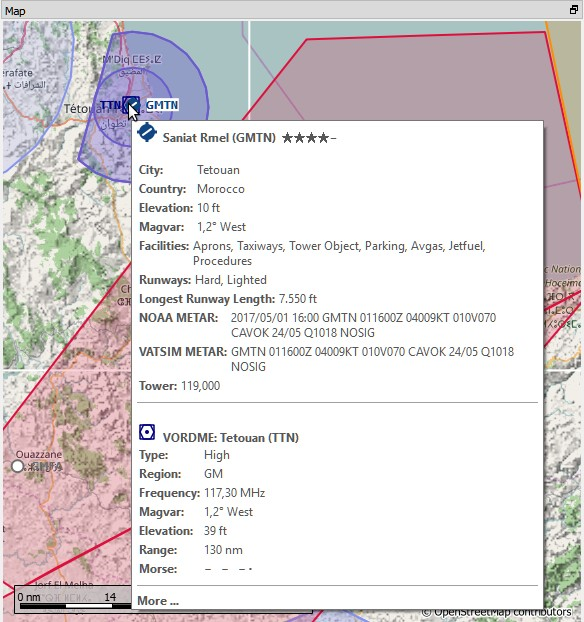
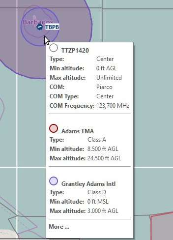
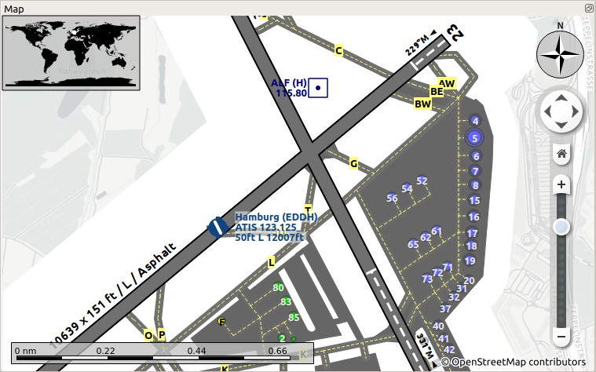

## Map Display {#map-display}

See the [Nav Map Legend](LEGEND.md) for details about the various symbols shown by the map.

### Moving {#moving}

Use click and drag to move the map and the mouse wheel to zoom in or out. You can also use the overlay buttons on the right side of the map.

Alternatively use the cursor keys to scroll the map and `+` and `-` to zoom in and out. `Alt+Left` and `Alt+Right` goes forward or backward in the map position history. Do not forget to activate the map window by clicking into it before using any keys for movement.

### Mouse Clicks {#mouse-clicks}

A single click on an airport, navaid, airway line or airspace shows details in the `Information` dock window.

A single click on an user aircraft, AI aircraft or multiplayer aircraft shows details in the `Simulator Aircraft` dock window.

A double click zooms in showing either the airport diagram or the navaid closely and also shows details in the `Information` dock window. The same applies for all AI or multiplayer aircraft or ships.

The double and single click functionality does not work for flight plan waypoints or airports if the flight plan edit mode is enabled. The edit mode can be disabled using the toolbar or `Main Menu` -> `Flight Plan` -> `Edit Flight Plan on Map`.

The mouse click sensitivity can be adjusted in the `Options` dialog on the `Map Display` tab.

### Aircraft {#aircraft}

The user aircraft and AI or multiplayer aircraft or ships will be shown on the map if the program is connected to a flight simulator. Color indicates user or AI or multiplayer vehicle and the symbol shape indicates if the aircraft is an piston/turboprop, jet, helicopter or a ship. The symbol outline changes to gray if an aircraft is on ground.

Little Navmap_ limits the display of AI vehicles depending on size. Zoom close to see small aircraft or boats

AI and multiplayer aircraft on ground are shown only on small zoom distances to avoid cluttered airports. This means that an AI aircraft can disappear from the map when landing on an airport.

On the lowest zoom distance all aircraft are drawn to scale as are the parking spots which means you can easily check if your aircraft fits on an apron, parking spot or taxiway.

A yellow wind arrow and labels for the situation around the user aircraft can be displayed on the
top center of the map. The displayed labels for aircraft can be configured in the dialog `Options` on tab `Map Display`. No labels are shown for ship traffic.

See the [Nav Map Legend](LEGEND.md#aircraft) for details about the aircraft type.

### Tooltips {#tooltips}

Hovering the mouse over the map will show tooltips for all map objects including airports, VOR, NDB, airways, parking, fuel box, towers and all aircraft. The tooltip is truncated and shows a message `More...` if it gets too long. In that case reduce details or zoom in closer.

The sensitivity for the tooltip display can be adjusted in the `Options` dialog on the `Map Display` tab.

 

_**Pictures above:** Tooltip with information for an airport and a VOR and a tooltip with information about airspaces._

### Highlights {#highlights}

Airports or navaids that are selected in the flight plan table or in the search result table are highlighted on the map with a green/black or a yellow/black ring respectively.

Waypoints that are selected in the procedure preview are highlighted with a blue/black ring.

These highlight rings provide all functionality of visible map objects, even if the objects are not shown at the current zoom distance (ring is empty). This allows double click for zoom in, single click for information dock window and all context menu entries.

### Airport Diagram {#airport-diagram}

The display will change from a single icon to an airport diagram if you zoom in deep enough to an airport. The diagram shows all taxiways, parking positions, gates, runways and more.

The airport diagram provides more information through tooltips for parking and tower positions. A right click on a parking position opens the context menu and allows to select the start position for flight plan departure.

See the [Nav Map Legend](LEGEND.md#airport-diagram) for details about the airport diagram.

_**Picture above:** High level view of the airport diagram of EDDH._

_**Picture above:** Detailed view of the airport diagram. Shows blue gates on the right and a few green general aviation ramp parking on the left. Long displaced threshold of runway 33 is visible._

### Map Context Menu {#map-context-menu}

The map context menu can be activated using right click or the menu key. Menu items are enabled or disabled depending on selected object and some menu items contain the name of the selected map object for clarification.

The map context menu contains the following menu entries.

####  Show Information {#show-information}

Shows detailed information in the `Information` dock window for the nearest airport, one or more airways, one or more airspaces or all navaids near the cursor.

See the [Information Dock Window](INFO.md#information-dock-window) for details.

####  Show Procedures {#show-procedures}

Opens the procedure search tab of the search dock window and display all procedures for the airport.

See [Procedure Search](SEARCH.md#procedure-search) for more information.

####  Measure GC Distance from here {#measure-gc-distance-from-here}

Starts a measurement line on the first click. Second click ends measuring and keeps the line. All measurement lines are saved and will be restored on next start up.

You can use the keyboard, mouse wheel or the map overlays to scroll and zoom while dragging a line.

Right click, pressing the escape key or any click outside of the map window cancels the measurement line editing.

Measurement lines use nautical miles, kilometers or statue miles as unit. Feet or meter will be added as unit if the lines are short enough. This allows to measure e.g. takeoff distance for crossing takeoffs.

A great circle gives the shortest distance from point to point on earth but does not use a constant course. For that reason the measurement line will show two course values. One for the start and one for the end position.

Course is indicated in degrees true. Additional information like ident or frequency will be added to the line if the measurement starts at a navaid or an airport.

See the [Nav Map Legend](LEGEND.md#map-marks) for details on measurement lines.

####  Measure Rhumb Distance from here {#measure-rhumb-distance-from-here}

A rhumb line is a line of constant course and used between the waypoints of an airway or when approaching a VOR or NDB station. Distance between points is slightly longer than the great circle route.

The course for a rhumb line is normally indicated in degrees true. Course will be indicated in degrees magnetic if the measurement starts at a navaid or at an airport that has a magnetic variation. Additional information like ident and frequency will be added to the line in this case.

####  Remove Distance measurement {#remove-distance-measurement}

This menu item is active if you right click at the end of a distance measurement line (small cross). Removes only the selected line.

####  Show Range Rings {#show-range-rings}

Shows multiple red range rings around the clicked position. The number and distance of the range rings can be changed in the `Options` dialog on the `Map Display` tab. A label indicates the radius of each ring in nautical miles.

####  Show Navaid range {#show-navaid-range}

Shows a ring around the clicked radio navaid (VOR or NDB) indicating the navaid's range. A label shows ident and frequency and the ring color indicates the navaid type.

####  Remove Range Ring {#remove-range-ring}

Menu item is active if you right click at the center point of a range ring (small circle). Removes the rings from the map.

####  Remove all Range Rings and Distance measurements {#remove-all-range-rings-and-distance-measurements}

Removes all rings and distance measurement lines from the map.

####  Set as Flight Plan Departure {#set-as-flight-plan-departure}

This is active if the click is at an airport, an airport parking position or a fuel box. It will either replace the current flight plan departure or add a new departure if the flight plan is empty.

The default runway will be used as starting position if the clicked object is an airport. The airport and parking position will replace both the current departure and start position if a parking position is clicked within an airport diagram.

####  Set as Flight Plan Destination {#set-as-flight-plan-destination}

This menu item is active if the click is at an airport. It will either replace the flight plan destination or add the airport if the flight plan is empty.

####  Add Position to Flight Plan {#add-position-to-flight-plan}

Inserts the clicked object into the nearest flight plan leg. The object will be added before departure or after destination if the clicked position is near the flight plan end points.

The name of the navaid or airport is shown in the menu item.

A user defined position is added to the flight plan if no airport or navaid is near the clicked position.

####  Append Position to Flight Plan {#append-position-to-flight-plan}

Same as `Add Position to Flight Plan` but will always append the selected object or position after the destination or last waypoint of the flight plan.

####  Delete from Flight Plan {#delete-from-flight-plan}

Deletes the clicked airport, navaid or user position from the flight plan.

####  Edit Name of User Waypoint {#edit-name-of-user-waypoint}

Allows to change the name of a user defined waypoint. The length of the name is limited to 10 characters.

####  Show in Search {#show-in-search}

Shows the nearest airport or navaid in the search dialog. The current search parameters are reset.

####  Set Center for Distance Search {#set-center-for-distance-search}

Sets the center point for the distance search function. See [Distance search](SEARCH.md#distance-search). The center for the distance search is highlighted by a  symbol.

####  Set Home {#set-home}

Sets the home position and zoom distance. The center of the home area is highlighted by a  symbol.

