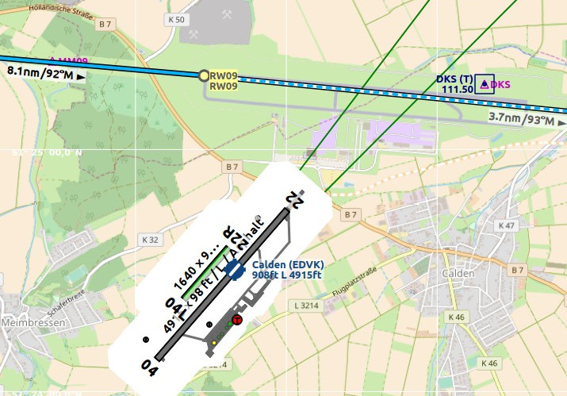

# Navigation Databases

_Little Navmap_ can use up to two databases in parallel:

1. **Simulator database:** Created by reading the scenery library of FSX, P3D or X-Plane.
2. **Navigation database:** Provided by Navigraph. Does not have to be compiled and can be updated by the Navigraph _FMS Data Manager_.

_Little Navmap_ is bundled with a navigation database from a recent AIRAC cycle that is enabled per default.

**See [Install Navigraph Updates](https://albar965.github.io/littlenavmap_navigraph.html) on my home page for information how to update **_Little Navmap_**'s navigation data.**

Three display modes can be selected from the menu `Scenery Library` as shown below.

## Use Navigraph for all Features {#navigraph-all}

Uses only information from the Navigraph database.

Note that airport information is limited in this mode. This means that aprons, taxiways, parking positions, runway surface information and fuel information are not available. Additionally, smaller airports might be missing.

Runway layout might not match the runway layout in the simulator if you use stock or older airport scenery.

An advantage of this mode is that approach procedures always match the airport runway layout.

## Do not use Navigraph Database {#navigraph-none}

Completely ignores the Navigraph database and shows only information read from the simulator scenery.

## Use Navigraph for Navaids and Procedures {#navigraph-navaid-proc}

Default mode after installation or update of _Little Navmap_.

This mode blends navaids and other features from the Navigraph database with the simulator database. This affects the map display, all information windows and and all search windows.

The following features are taken from the simulator database when using this mode:

* Airports \(also `Search` dock window, tab `Airport`\)
* Aprons
* Taxiways
* Parking positions
* COM frequencies
* ILS

The following features are taken from the Navigraph database:

* Navaids \(waypoints/intersections, VOR, NDB, marker\) which affects:
 * `Search` dock window, tab `Navaid`
 * Flight plan calculation
 * Route Description
* Procedures \(approaches, SIDs and STARs\). This affects:
 * `Search` dock window, tab `Procedures`
 * Loading and display of procedures from flight plans.
* Airways
* Airspaces

### Limitations in this mode

* _Little Navmap_ ignores any mismatches between procedures and runways due to airport updates and will not display a warning. Update an airport using payware or freeware scenery if you find that an approach or departure procedure does not start at a runway end of an airport.
* Procedures cannot be recognized when selecting `Show Procedures` in the menu if an airport has changed its ICAO ident \(e.g. `Kulik Lake`: ident changed from `LKK` to `PAKL`\). If you suspect such a case use the mode `Use Navigraph for all Features` to get the procedures for the airport.
* The airport search `Procedures` only considers procedures available in the simulator. Switch to `Use Navigraph for all Features` to look for airports that have procedures from the Navigraph database.
* ILS placement or presence might not match approach procedures if an airport has a new ILS which is not present in stock scenery or an old scenery add-on. In this case can see an ILS approach without ILS station. Switch to `Use Navigraph for all Features` to overcome this limitation.

Using the _fsAerodata_ navdata update will mitigate or even remove all of the limitations above since it will bring the simulator scenery into the same state as the Navigraph database.

_**Picture above:** An extreme example for runway/procedure mismatch. The approach from the Navigraph database cycle 1707 ends at the not visible runway 09 while the outdated scenery from FSX shows the airport at the wrong position. EDVK was rebuild north of Calden in 2013. The OpenStreetMap backgound shows the new airport._

