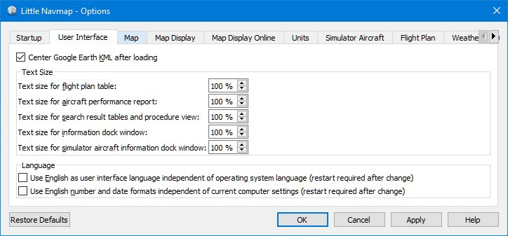
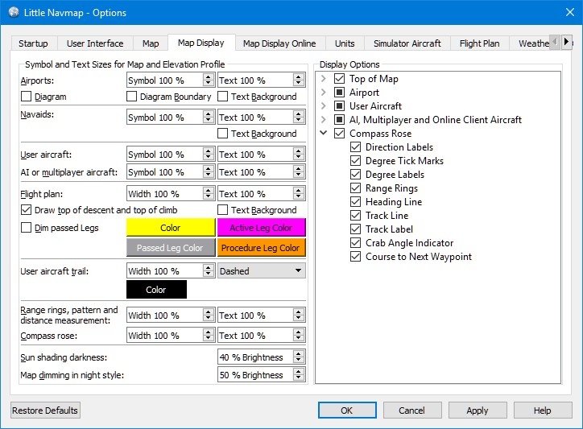
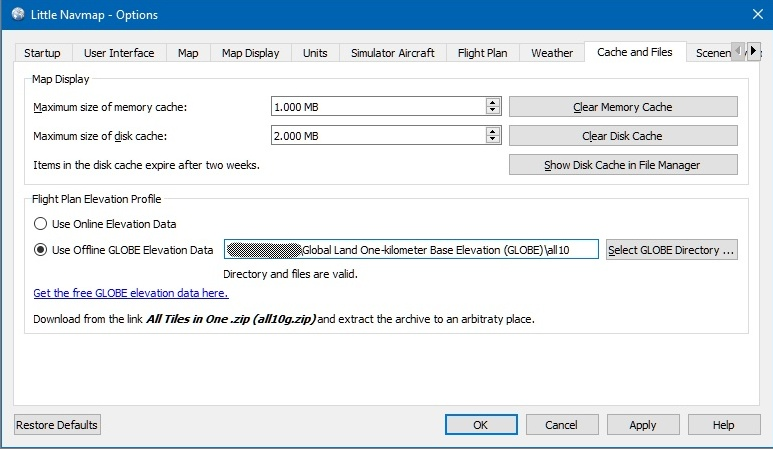
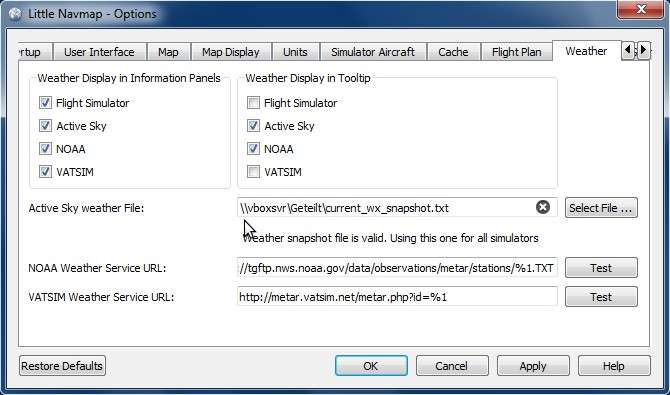
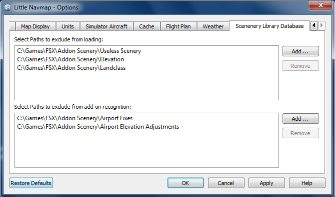

##  Options Dialog {#options-dialog}

Most options are self explaining and tooltips contain more detailed explanations if applicable.

You can immediately check the effect of your changes on the map display by moving the dialog
`Options` to the side and pressing `Apply`.

The button `Restore Defaults` only restores the options of this dialog back to default. Other
settings like map display, table views or dock window positions are not affected. To reset all
saved settings completely see [Troubleshoot](APPENDIX.md#troubleshoot).

### Startup {#startup}

Allows to customize what should be loaded and shown on startup of _Little Navmap_.

You can also configure the frequency of the automatic update check and channels. See [Checking for Updates](UPDATE.md) for more information.

### User Interface {#user-interface}

Has options for text sizes in information windows and flight plan as well as the search result table.

You can also change the overall style for the graphical user interface. The user interface styles
contain a `Night` mode that can be used for night flights in dark rooms. You can also dim the map and
elevation profile display.

A restart is not needed but recommended after changing a style.

The colors for the styles `Fusion` and `Night` can be changed by editing configuration files. See [Customize](CUSTOMIZE.md) for more information.

This tab also contains options to force the program language and locale settings \(number, date and time formats\) to English if you do not want to use a translated user interface.

_**Picture above:** Tab `User Interface` using the style `Night`._

### Map {#map}

Has map related customization options. Allows to set the click sensitivity, zoom distances and more.

### Map Display {#map-display}

This tab contains options for symbol and text sizes, flight plan and aircraft trail colors and more.

The right side of the tab contains a tree that allows to select the text labels that should be shown at
airports, user aircraft and AI/multiplayer aircraft.

_**Picture above:** Tab `Map Display`._

### Units {#units}

You can change all units that are used by _Little Navmap_ on this tab between nautical, imperial and metric.
Mixed settings like meter for altitude and nautical miles for distance are possible.

Note that any numbers used in the program are not converted when changing units. That means that you will
have a minimum altitude buffer of 1000 meter after changing the setting `Altitude and Elevation` from feet to meter.
This also applies to flight plan altitude. Therefore, do not forget to adapt these numbers after changing units.

### Simulator Aircraft {#simulator-aircraft}

Allows to change various aspects around the display of the user aircraft. All settings resulting in a more fluid aircraft display will use more CPU and can potentially induce stutters in the simulator.

### Cache and Files {#cache}

#### Map Display {#cache-map-display}

Here you can change the cache size in RAM and on disk. These caches are used to store the downloaded images tiles from the online maps like the _OpenStreetMap_, _OpenMapSurfer_  or _OpenTopoMap_.

All image tiles expire after two weeks and will be reloaded from the online services then.

Note that a reduction of size or erasing the disk cache is done in background and can take a while.

The RAM cache has a minimum size of 100 MB and a maximum size of 2 GB.

The disk cache has a minimum size of 500 MB and a maximum size of 8 GB.

#### Flight Plan Elevation Profile {#cache-elevation}

The lower part of this tab allows to install the the freely downloadable [GLOBE - Global Land One-km Base Elevation Project](https://ngdc.noaa.gov/mgg/topo/globe.html) elevation data.

Download the ZIP archive from the link in the dialog and extract it. Select the extracted directory using `Select GLOBE Directory ...` so, that it points to the files `a10g` to `p10g`. The label in the dialog will show an error if the path is invalid.

_**Picture above:** Tab `Cache and Files` with properly selected GLOBE elevation data._

### Flight Plan {#flight-plan}

Here you can set preferences for flight plan calculation or adjust the rule of thumb for the top of descent display.

### Weather {#weather}

You can select the various weather sources that should be shown in the `Information` dock window or in the map
tooltips.

The weather type `Flight Simulator` will either display weather from the FSX or P3D connection or from X-Planes `METAR.rwx` weather file.

_Active Sky_ can only be selected if either _Active Sky Next_, _AS16_ or _Active Sky for Prepar3D v4_ are installed or the weather file is selected directly. Selecting the _Active Sky_ weather file directly can be useful if you run a networked setup. Use Windows shares or a cloud service to get access to the file on the remote computer.

The URLs of the NOAA and VATSIM weather can be modified if you like to use another source or the services change the URLs.

The test buttons for the online weather services can also be used to find out if _Little Navmap_ can connect to Internet. Check your firewall settings if these fail.

_**Picture above:** Tab `Weather` with manually selected Active Sky weather file on a network share._

### Scenery Library Database {#scenery-library-database}

Allows to configure the loading of the scenery library database.

Note that these paths apply to all Flight Simulators, FSX, P3D and X-Plane.

You have to reload the scenery database in order for the changes to
take effect.

#### Select Paths to exclude from loading {#scenery-library-database_exclude}

All directories including sub-directories in this list will be omitted when loading the scenery
library into the _Little Navmap_ database. You can also use this list to speed up database loading
if you exclude directories that do not contain airports or navaids (landclass, elevation data and others).

#### Select Paths to exclude add-on recognition {#scenery-library-database_exclude-add-on}

All scenery data that is found outside of the base flight simulator `Scenery` directory is considered an add-on and will be
highlighted on the map and also considered during search for add-ons.

You can use this list to modify this behavior.

Add-ons, like _Orbx FTX Vector_ or _fsAerodata_ add scenery files that correct certain aspects
of airports like elevation, magnetic variance or others. All these airports will be recognized as add-on airports
since all their files are not stored in the base flight simulator `Scenery` directory.

Insert the corresponding directory into this list to avoid unwanted highlighting of these airports as add-ons.

_**Picture above:** Tab `Scenery Library Database` with three directories excluded from loading and two directories
excluded from add-on recognition._

#### Examples

Provided your simulator is installed in `C:\Games\FSX`.

##### ORBX Vector

Exclude the directories below from add-on recognition. Do not exclude them from loading since you will see wrong airport altitudes.

* `C:\Games\FSX\ORBX\FTX_VECTOR\FTX_VECTOR_AEC`
* `C:\Games\FSX\ORBX\FTX_VECTOR\FTX_VECTOR_APT`

##### Flight1 Ultimate Terrain Europe

Exclude these directories from loading to speed up the process:

* `C:\Games\FSX\Scenery\UtEurAirports`
* `C:\Games\FSX\Scenery\UtEurGP`
* `C:\Games\FSX\Scenery\UtEurLights`
* `C:\Games\FSX\Scenery\UtEurRail`
* `C:\Games\FSX\Scenery\UtEurStream`
* `C:\Games\FSX\Scenery\UtEurWater`

##### ORBX Regions

Exclude these directories from loading:

* `C:\Games\FSX\ORBX\FTX_NZ\FTX_NZSI_07_MESH`
* `C:\Games\FSX\ORBX\FTX_NA\FTX_NA_CRM07_MESH`
* `C:\Games\FSX\ORBX\FTX_NA\FTX_NA_NRM07_MESH`
* `C:\Games\FSX\ORBX\FTX_NA\FTX_NA_PNW07_MESH`
* `C:\Games\FSX\ORBX\FTX_NA\FTX_NA_PFJ07_MESH`
