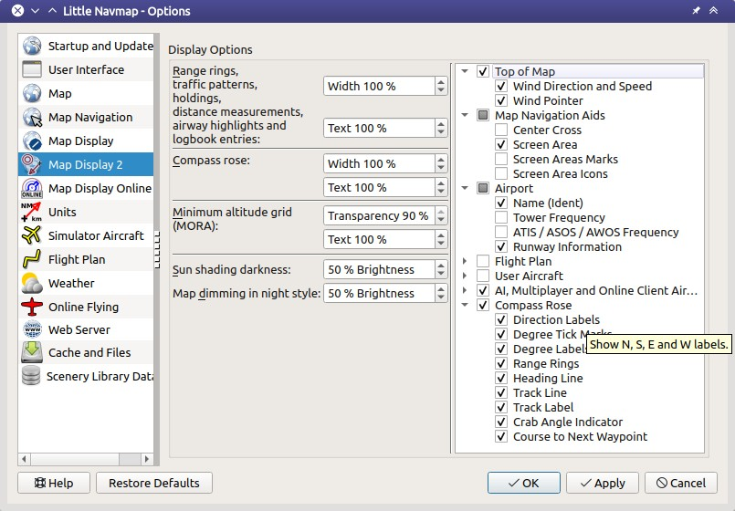
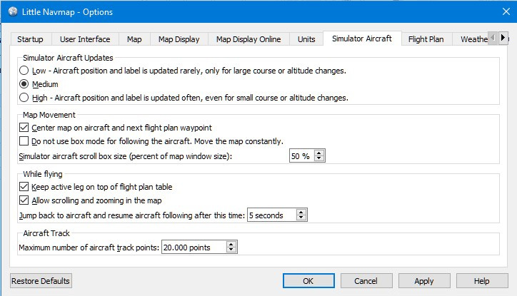

##  Options Dialog {#options-dialog}

This dialog consists of several pages with configuration options which can be selected in the list on the left side. Each entry in the page list has a tooltip for easier navigation.

**Most options are self-explaining and tooltips contain more detailed explanations if applicable.**

You can immediately check the effect of your changes on the map display by moving the dialog `Options` to the side and pressing `Apply`.

The button `Restore Defaults` restores only the options of this dialog back to default. Other settings like map display, table views or dock window positions are not affected. You can press `Cancel` to close the dialog and undo this action.

To reset all saved settings completely see [Reset all Settings and Restart](MENUS.md#reset-and-restart).

The following chapters give a brief description of each page.

###  Startup {#startup}

Allows to customize what should be loaded and shown on startup of _Little Navmap_.

You can also configure the frequency of the automatic update check and channels. See [Checking for Updates](UPDATE.md) for more information.
Change the settings here if you wish to get notifications about beta releases.

###  User Interface {#user-interface}

Has options for high DPI support, text sizes in information windows and flight plan as well as the search result table.

This page also contains options to force the program language and locale settings (number, date and time formats) to English if you do not want to use a translated user interface.


_**Picture above:** Page `User Interface`._

###  Map {#map}

Has map related customization options. Allows to set the tooltips, scroll performance and more.

###  Map Navigation {#map-navigation}

Contains all options for moving and zooming around in the map as well as click sensitivity and zoom distances.

Three navigation modes are available. Tooltips give more information about these.

#### Avoid blurred map display by zooming out to next best step {#blurred-map}

Checking this helps to get a sharp background image for online maps (e.g. from OpenStreetMap) when _Little Navmap_ zooms to or centers map features like airports, the active flight plan leg and others. This works best with the map projection `Mercator`.

As a result the map might be zoomed out farther than expected in some cases.

###  Map Display {#map-display}

This page contains options for symbol sizes, text sizes, flight plan, user aircraft trail colors and more.


_**Picture above:** Page `Map Display`._

###  Map Display 2 {#map-display-2}

More display options for user features like range rings and more.

The right side of the page contains a tree view that allows to select the text labels that should be shown at airports, user aircraft, AI/multiplayer aircraft and other map features.

Tooltips give explanations for the various settings in the tree.



_**Picture above:** Page `Map Display 2`._

###  Map Display Online {#map-display-online}

This page allows to change the default center circle sizes for online flying.

Two options below `Online Center Boundary Lookup in User Airspaces` can be used to assign OpenAir airspaces from the user airspace database to centers by matching filename or airspace name with the callsign of the center.

* `By airspace name vs. callsign`: Use the airspace name within a file to assign the geometry to a center by callsign.
* `By airspace &file name vs. callsign`: Use the airspace filename minus the `.txt` extension to assign the geometry to a center by callsign.

See [Online Airspaces](SCENERY.md#load-scenery-library-online-airspaces) for more information.

###  Units {#units}

You can change all units that are used by _Little Navmap_ on this page between nautical, imperial and metric.
Mixed settings like meter for altitude and nautical miles for distance are possible.

**Note that any numbers used in the program are not converted when changing units. That means that you will
get a minimum altitude buffer of 1000 meter after changing the setting `Altitude and Elevation` from feet to meter.
This also applies to flight plan altitude. Therefore, do not forget to adapt these numbers after changing units.**

* `Show other fuel units too`: Shows kilogram and liter as small text besides main units if lbs and gallon are selected and vice versa. This is applied only to the most important fuel values like block and trip fuel, for example.
* `Show true course and heading besides magnetic course in information displays`: Add true heading as small text besides magnetic heading displays. This applies to information, progress as well as map display (traffic patterns and holds).

**Note about coordinate formats **`Latitude and Longitude with sign` and `Longitude and Latitude with sign`**:**

* Latitude: Negative is south and positive is north.
* Longitude: Negative is west and positive is east values.

Choosing these display formats will also enable input of signed decimal values. The reading order for coordinates will also change depending on the chosen format above if entering signed numbers.

###  Simulator Aircraft {#simulator-aircraft}

Allows to change various aspects around the display of the user aircraft while flying. All settings resulting in a more fluid aircraft display will use more CPU and can potentially induce stutters in the simulator.

#### Center map on aircraft and next flight plan waypoint {#simulator-aircraft-center-wp}

The map is zoomed to show both the aircraft and the next active waypoint on the flight plan if this is enabled while flying. _Little Navmap_ uses several criteria to minimize map updates in this mode.

The map will fall back to the default mode of simply centering the aircraft if no flight plan is loaded, the aircraft is on ground or the flight plan is more than 50 nm away from the user aircraft.

#### Do not use box mode for following the aircraft. Move the map constantly.  {#simulator-aircraft-move-constantly}

Map will follow the aircraft constantly when checked. This is also used for `Center map on aircraft and next flight plan waypoint`.

This option will cause _Little Navmap_ to consume more CPU resources while flying.

#### Simulator aircraft scroll box size (percent of map window size)  {#simulator-aircraft-scroll-box}

Smaller values keep the aircraft centered and will move the map more often. Larger values will update the map only when aircraft reaches map boundary.

This setting is ignored when `Center map on aircraft and next flight plan waypoint` is checked and a flight plan is set.

#### Keep active leg on top of flight plan table {#simulator-aircraft-keep-active}

The active (magenta) leg will be shown on top of the flight plan table when a new leg is activated.

#### Allow scrolling and zooming in the map {#simulator-aircraft-allow-scroll-zoom}

The map will stop following the aircraft for the given time if the user does any interaction with the map like scrolling or zooming. You can quickly check out the destination or your overall progress, and after you stop moving around, _Little Navmap_ will return to following your aircraft.

This option is also used in the [Flight Plan Elevation Profile](PROFILE.md).

**Note if you use the default aircraft centering mode or if _Little Navmap_ falls back to this mode (see above):**

1. Using the mouse wheel or the `+` and `-` key to zoom will change and keep the zoom distance. The aircraft is still centered but the new zoom distance is used.
1. Starting to look around by moving the map with mouse drag or cursor keys: This will remember the last position **and** the zoom distance. You can do any map movements and _Little Navmap_ will jump back to the last position and zoom distance where you started the movement when time is over.

The same from point two applies if you jump to airports, navaids or other features by double click, context menu (`Show on Map`) or map link.

Toggle  `Center Aircraft` on and off if you find that the map jumps back to the wrong position.

This option is also used in the [Flight Plan Elevation Profile](PROFILE.md).

#### Jump back to aircraft and resume aircraft following after this time {#simulator-aircraft-jump-timeout}

Time until aircraft following is activated again after any map interaction like scrolling or zooming.



_**Picture above:** Page `Simulator Aircraft`._

###  Flight Plan {#flight-plan}

Here you can set preferences for flight plan calculation or change the default filename for saving flight plans.

###  Weather {#weather}

You can select the various weather sources to be shown in the `Information` dock window or in the map tooltips.

The weather type `Flight Simulator` will either display weather from the FSX or P3D connection or from X-Planes `METAR.rwx` weather file.

_Active Sky_ can only be selected if either _Active Sky Next_, _AS16_, _Active Sky for Prepar3D v4_ or _Active Sky XP_ are installed or the weather file is selected directly. Selecting the _Active Sky_ weather file directly can be useful if you run a networked setup. Use Windows shares or a cloud service to get access to the file on the remote computer.

The URLs of various weather services can be modified if you like to use another source. Usually there is no need to change these values.

You can change the path to the X-Plane weather file if you'd like to load it on a remote computer using a network share.

The test buttons for the online weather services can also be used to find out if _Little Navmap_ can connect to Internet. Check your firewall settings if these fail.


_**Picture above:** Page `Weather`._

###  Online Flying {#online-flying}

This page allows to change settings for online networks.

See [Online Networks](ONLINENETWORKS.md) for an overview.

#### Online Service {#online-service}

##### None {#online-service-none}

Disables all online services and hides all related window tabs, menu items and toolbar buttons. No downloads will be done.

##### VATSIM {#online-service-vatsim}

Uses the predefined configuration for the [VATSIM](https://www.vatsim.net) network. No other settings are needed.

The update rate depends on configuration and is typically three minutes.

##### IVAO {#online-service-ivao}

Uses the predefined configuration for the [IVAO](https://ivao.aero) network. No other settings are needed.

The update rate depends on configuration and is typically three minutes.

##### PilotEdge {#online-service-pilotedge}

Configuration for the [PilotEdge](https://www.pilotedge.net/) network.

##### Custom with Status File {#online-service-custom-status}

This option allows to connect to a private network and will download a `status.txt` file on startup which contains further links to e.g. the `whazzup.txt` file.

##### Custom {#online-service-custom-whazzup}

This option allows to connect to a private network and will periodically download a `whazzup.txt` file which contains information about online clients/aircraft and online centers/ATC.

#### Settings {#online-service-settings}

##### Status File URL {#online-service-settings-status-url}

URL of the `status.txt` file. You can also use a local path like `C:\Users\YOURUSERNAME\Documents\status.txt`.

This file is downloaded only on startup of the program.

A push button `Test` allows to check if the URL is valid and shows the first few lines from the downloaded text file. This does not work with local paths.

The status file format is explained in the IVAO documentation library: [Status File Format](https://doc.ivao.aero/apidocumentation:whazzup:statusfileformat).

##### Whazzup File URL {#online-service-settings-whazzup-url}

URL of the `whazzup.txt` file. You can also use a local path like `C:\Users\YOURUSERNAME\Documents\whazzup.txt`.

This file is downloaded according to the set update rate.

A push button `Test` allows to check if the URL is valid. The test does not work with local paths.

The whazzup file format is explained in the IVAO documentation library: [Whazzup File Format](https://doc.ivao.aero/apidocumentation:whazzup:fileformat).

**Example for a **`whazzup.txt` **file:**

```
!GENERAL
VERSION = 1
RELOAD = 1
UPDATE = 20181126131051
CONNECTED CLIENTS = 1
CONNECTED SERVERS = 41

!CLIENTS
:N51968:N51968:PILOT::48.2324:-123.1231:119:0:Aircraft::::::::1200::::VFR:::::::::::::::JoinFS:::::::177:::

!SERVERS
...
```

##### Update Every {#online-service-settings-update}

Sets the update rate that defines how often the `whazzup.txt` file is downloaded.

Allowed values are 5 to 1800 seconds, 180s being the default.

You can use smaller update rates for private online networks to improve map display updates.

**Do not use update rates smaller than two minutes for official online networks. They might decide to block the application or block you based on your internet address if downloads are excessive.**

##### Format {#online-service-settings-format}

`IVAO` or `VATSIM`. Depends on the format used by your private network. Try both options if unsure.

###  Web Server {#web-server}

Configuration options for the internal web server of _Little Navmap_.

* `Document root directory`: The root directory of the web server pages. Change this only if you would like to run a customized web server using your own style sheets and you own HTML templates.
* `Select Directory ...`: Select root directory. _Little Navmap_ will show a warning if no `index.html` file is found in the root directory.
* `Port number`: Default 8965. That means you have to use the address `http://localhost:8965/` in your browser to access the web page of _Little Navmap_, for example. Change this value if you get errors like `Unable to start the server. Error: The bound address is already in use.`.
* `Use encrypted connection (HTTPS / SSL)`: Encrypted connections use a pre-computed self-signed certificate which comes with _Little Navmap_. A browser will show an error message if using this certificate and requires to add a security exception. The encrypted address is `https://localhost:8965/`, for example. Creating a self signed certificate is quite complex. Look at the various web articles by searching for `How to create a self signed certificate`.
* `Start Server`: Start or stop the server to test the changes above. The server status (running or not running) is reverted to the previous state when pressing `Cancel` in the options dialog.

Label `Web Server is running at http://my-computer:8965 (IP address http://192.168.1.1:8965)`: Shows two links to the web server. Clicking on either opens the page in your default browser. You can always try the IP address link if the first link using the computer name does not work.

See [Web Server](WEBSERVER.md) for detailed information.

###  Cache and Files {#cache}

#### Map Display {#cache-map-display}

Here you can change the cache size in RAM and on disk. These caches are used to store the downloaded images tiles from the online maps like the _OpenStreetMap_ or _OpenTopoMap_.

All image tiles expire after two weeks and will be reloaded from the online services then.

Note that a reduction of size or erasing the disk cache is done in background and can take a while.

The RAM cache has a minimum size of 100 MB and a maximum size of 2 GB.

The disk cache has a minimum size of 500 MB and a maximum size of 8 GB.

#### Flight Plan Elevation Profile {#cache-elevation}

The bottom part of this page allows to install the freely downloadable [GLOBE - Global Land One-km Base Elevation Project](https://ngdc.noaa.gov/mgg/topo/globe.html) elevation data.

Look for posts in the [support forum at AVSIM](https://www.avsim.com/forums/forum/780-little-navmap-little-navconnect-little-logbook-support-forum/) if the original download is not available.

Download the ZIP archive from the link in the dialog and extract it. Select the extracted directory using `Select GLOBE Directory ...` so, that it points to the files `a10g` to `p10g`. The label in the dialog will show an error if the path is invalid.

#### User Airspaces {#cache-user-airspaces}

You can select the path to the user airspace and file extensions to read. _Little Navmap_ reads all OpenAir files with the given extension in the selected directory recursively into the user airspace database.

You can provide more than one file extension using a space separated list.

See also [User Airspaces](SCENERY.md#load-scenery-library-user-airspaces) and [Load User Airspaces](MENUS#load-user-airspaces).

###  Scenery Library Database {#scenery-library-database}

Allows to configure the loading of the scenery library database.

Note that these paths apply to all Flight Simulators, FSX, P3D and X-Plane.

You have to reload the scenery database in order for the changes to
take effect.

#### Select Paths to exclude from loading {#scenery-library-database_exclude}

All directories including sub-directories in this list will be omitted when loading the scenery
library into the _Little Navmap_ database. You can also use this list to speed up database loading
if you exclude directories that do not contain airports or navaids (landclass, elevation data and others).

You can also exclude `BGL` or `DAT` files if needed.

Note that you can select more than one entry in the file or directory dialogs.

Select one or more entries in the list and click on `Remove` to delete then from the list.

#### Select Paths to exclude add-on recognition {#scenery-library-database_exclude-add-on}

**FSX/P3D:** All scenery data that is found outside of the base flight simulator `Scenery` directory is considered an add-on and will be highlighted on the map as well as considered during search for add-ons.

**X-Plane:** All airports in the `Custom Scenery` directory are considered add-on airports and will be highlighted accordingly.

You can use this list to modify this behavior.

Add-ons, like _Orbx FTX Vector_ or _fsAerodata_ add scenery files that correct certain aspects
of airports like elevation, magnetic declination or others. All these airports will be recognized as add-on airports
since all their files are not stored in the base flight simulator `Scenery` directory.

Insert the corresponding directories or files into this list to avoid unwanted highlighting of these airports as add-ons.


_**Picture above:** Page `Scenery Library Database` with three directories and three files excluded from loading and two directories excluded from add-on recognition._

#### Examples

Provided your simulator is installed in `C:\Games\FSX`.

##### ORBX Vector

Exclude the directories below from add-on recognition. Do not exclude them from loading since you will see wrong airport altitudes.

* `C:\Games\FSX\ORBX\FTX_VECTOR\FTX_VECTOR_AEC`
* `C:\Games\FSX\ORBX\FTX_VECTOR\FTX_VECTOR_APT`


##### Flight1 Ultimate Terrain Europe

Exclude these directories from loading to speed up the process:

* `C:\Games\FSX\Scenery\UtEurAirports`
* `C:\Games\FSX\Scenery\UtEurGP`
* `C:\Games\FSX\Scenery\UtEurLights`
* `C:\Games\FSX\Scenery\UtEurRail`
* `C:\Games\FSX\Scenery\UtEurStream`
* `C:\Games\FSX\Scenery\UtEurWater`

##### ORBX Regions

Exclude these directories from loading:

* `C:\Games\FSX\ORBX\FTX_NZ\FTX_NZSI_07_MESH`
* `C:\Games\FSX\ORBX\FTX_NA\FTX_NA_CRM07_MESH`
* `C:\Games\FSX\ORBX\FTX_NA\FTX_NA_NRM07_MESH`
* `C:\Games\FSX\ORBX\FTX_NA\FTX_NA_PNW07_MESH`
* `C:\Games\FSX\ORBX\FTX_NA\FTX_NA_PFJ07_MESH`
