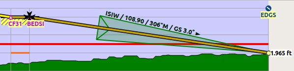
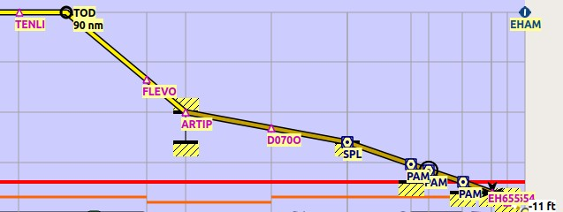

##  Flight Plan Elevation Profile Dock Window {#flight-plan-elevation-profile-dock-window}

This dock window shows the ground elevation, flight plan with cruise, climb, descent legs and altitude restrictions together with all flight plan waypoints. It is only available when a flight plan is loaded. The user aircraft will be shown if _Little Navmap_ is connected to the simulator.

Note that the elevation display covers only the flight plan and will not change the depiction if you get off the flight plan with your simulator aircraft. You need a valid flight plan (i.e. a departure and destination) to see the elevation profile.

The elevation profile also does not cover missed approaches and legs to alternate airports. Create a new flight plan from the destination to the alternate airport if you wish to use the elevation profile.

Movement of the aircraft in the elevation profile is tied to the active flight plan leg and will not be correct if flying away from the active leg.

### Top Label {#top-label}

Additional information is shown in a label on top of the window if the mouse is hovered over the diagram.
The corresponding position is highlighted on the map with a black/cyan circle.

Following information is shown in the top label if connected to a flight simulator:

* Distance from user aircraft to flight plan destination
* Distance to the top of descent

**Example:** `To Destination: 118 nm, to Top of Descent: 95 nm.`

In addition, the information below is shown in the top label when hovering the mouse over the diagram:

* From and to waypoint for the flight plan leg at the cursor position
* Distance from departure and to destination from the position of the mouse cursor.
* Ground elevation at cursor position.
* Flight plan altitude above ground considering cruise altitude as well as climb and descent slopes.
* Safe altitude for the flight plan leg at the cursor position corresponding to the orange line.
* Wind direction, speed and tail- (`►`) or headwind (`◄`).

**Example:** `ANDOR ► SJA, 38 nm ► 112 nm, Ground Elevation 984 ft, Above Ground Altitude 8,016 ft, Leg Safe Altitude 3,000 ft, Wind 227°M, 14 kts, ► 9 kts`

### Bottom Label {#bottom-label}

This is only shown if the profile could not be built due to errors in the flight plan or aircraft performance.

The error messages are the same as in the [Error Display](FLIGHTPLAN.md#flight-plan-table-error) in the flight planning window.

### Zoom Sliders {#zoom-sliders}

The right side of the elevation profile contains the zoom sliders. The following controls are available:

*  `Splitter`: You can resize the right part of the elevation profile window using this splitter button. The part containing the sliders will be collapsed if you drag it to the far right. You can open the collapsed part again by dragging the splitter to the left.
*  `Expand to Window`: Resets the view back to 100 percent showing the whole flight plan.
*  `Zoom Vertically`: Move the slider up to zoom in vertically. Maximum zoom results in 500 ft height for the whole profile window.
*  `Zoom Horizontally`: Move the slider up to zoom in horizontally. Maximum zoom results in about 4 nm distance for the whole profile window.

### Mouse Movement {#mouse}

* Hover: The corresponding position within the flight plan is highlighted on the map with a black/cyan circle.
* `Wheel`: Zoom in and out horizontally.
* `Shift+Wheel`: Zoom in and out vertically.
* `Left Click` and drag: Move map up, down, left or right.
* `Left Double Click`: Zoom to position on map.
* `Right Click`: Show context menu.

### Keyboard Movement {#keyboard}

Click on the elevation profile window to activate it before using the keyboard.

* Cursor keys: Move map up, down, left or right.
* `+` and `-`: Also on numpad. Zoom in and out horizontally.
* `*` and `/`: Also on numpad. Zoom in and out vertically.
* `0` or `Ins` : Reset view to 100 percent and show the whole flight plan.
* `Home` and `End`: Jump to departure or destination.
* `PageUp` and `PageDown`: Move forward or backward one page.

### Context Menu {#context-menu}

####  Show Position on Map {#show-pos-on-map}

Zooms to the corresponding position on the map. This is the same as double clicking into the elevation profile.

####  Expand to Window {#expand-to-window}

Resets the view back to 100 percent showing the whole flight plan.

####  Center Aircraft {#center-aircraft}

If this option is selected, the aircraft remains centered on the left of the altitude profile during flight.

The aircraft will be kept on the upper part of the window if the aircraft is descending and on the lower part if climbing.

See also for more information on jump back in the options dialog on tab [Simulator Aircraft](OPTIONS.md#simulator-aircraft).

####  Delete Aircraft Trail {#delete-aircraft-trail}

The aircraft trail is saved and will be reloaded on program startup.

This menu item removes the user aircraft trail from the elevation profile only. It does not remove the trail from the map. Use this if the trail appears in the wrong place or shape after creating of modifying a flight plan.

The trail in the elevation profile is of no relevance for the `GPX` file export.

####  Show VASI {#show-vasi}

Shows a VASI slope if an approach procedure with a runway \(not circle-to-land\) is selected in the flight plan and if the runway has a VASI.

The slope is drawn with the correct angle to be usable as an approach guide. The vertical opening angle is only meant for depiction and has no relation to the real VASI accuracy.

_**Picture above:** Display of VASI slope at destination airport. Slope is 3 degrees and VASI type is PAPI4. Final approach fix is marked with a Maltese cross._

####  Show ILS {#show-ils}

Shows an ILS glideslope if an approach with a runway is selected in the flight plan and if the runway has an ILS.

The slope is drawn with the correct angle to be usable as an approach guide. The vertical opening angle is only meant for depiction and has no relation to the real ILS accuracy.

A label on top shows name, frequency, heading, glideslope angle and DME indicator if available

_**Picture above:** Display of ILS at destination airport. Final approach fix is marked with a Maltese cross._

#### Follow on Map {#follow-on-map}

The map view will be centered - not zoomed in - on the position below the cursor if hovering above the elevation profile when this option is selected.

#### Show Zoom Sliders {#show-zoom-slider}

Show or hide the zoom sliders and buttons at the right side of the elevation profile. You can still zoom using the mouse or the keyboard.

#### Show Labels {#show-labels}

Show or hide the altitude labels at the right side of the elevation profile.

#### Show Scrollbars {#show-scrollbars}

Show or hide the scroll bars at the bottom and the right side of the elevation profile. You can still use the mouse or keyboard to navigate.

### Profile Display {#display}

The colors and symbols of the elevation profile follow the style of the main map as set in the options dialog on tab `Map Display`. Colors, patterns and symbols for airports, navaids, procedures, active and passed flight plan legs are the same. The profile display also follows other map settings like visibility of flight plan line, aircraft and aircraft trail.

Aircraft heading will turn if a backward movement relative to the active flight plan leg is detected.

For more information see the `Navmap` tab in the `Legend` dock window or the
[Elevation Profile Legend](LEGEND.md#elevation-profile-legend) for details.

The elevation profile uses actual altitude for display of restrictions, slope and cruise. You have to expect differences between actual and indicated altitude when flying above transition altitude using the standard altimeter setting of 29.92 inches.

**Note that the profile display depends on the correct sequencing of the active flight plan leg \(magenta line\). The aircraft will be displayed in the wrong position and the aircraft trail will be erratic if the active leg is not correct or manually changed.**

**The aircraft trail will be displayed incorrectly in the elevation profile if the flight plan is changed \(i.e. the flight plan length or geometry changes\).**
You can delete the profile aircraft trail in context menu [Delete Aircraft Trail](PROFILE.md#delete-aircraft-trail) while keeping the trail on the map.

_**Picture above:** Flight plan elevation profile with line indicating the mouse hovering position. Orange lines show minimum safe altitude for flight plan segments. Red line shows overall minimum safe altitude. Top of climb and top of descent points shown including slope. Orange flight plan lines show procedure legs. Waypoint _`EV501`_ has an overfly condition and there are several altitude restrictions shown for the approach procedure._

### Top of Climb and Top of Descent Paths {#toc-and-tod-paths}

The elevation profile will also display the top of climb and top of descent which are calculated based on the current [Aircraft Performance](AIRCRAFTPERF.md) profile and wind situation.

Note that the TOC and TOD calculation is influenced by altitude restrictions in procedures. _Little Navmap_ will calculate a climb or descent path always adhering to restrictions. The resulting path might use a higher or lower climb or descent speed than expected.

The path is also forced to the lowest allowed altitude at the final approach fix and the final approach course fix to avoid arriving above the ILS glide slope or too high at the destination runway.

You can safely follow the descent path as shown by _Little Navmap_, provided you can manage your aircraft speed at the same time. For large aircraft you might want to descent around 10 nm earlier to reduce speed to 250 knots below 10000 feet.

The climb and descent paths are affected by wind and are moved accordingly for strong head- or tailwinds. The climb path will be steeper in the elevation profile if you climb in a strong head wind, for example.

See chapter [Winds Aloft](WEATHER.md#wind) for more information.

The plan will switch to a flat display showing only a flight plan line at cruise altitude if the TOC and/or TOD cannot be calculated or if the plan violates altitude restrictions. A red warning message is displayed if this is the case.

_**Picture above:** An approach procedure which requires the aircraft to descent early due to a restriction between 7000 and 10000 ft at _`ARTIP`_._

### Elevation Data {#elevation-data}

Elevation processing is done in the background since data has to be downloaded and computation is CPU intensive. Therefore, the update of the elevation display can take from a few seconds up to half a minute. This background update is started after creating or changing the flight plan or when new elevation data was downloaded. The display will be updated accordingly whenever new data is available.

Close the `Flight Plan Elevation Profile` window if you think that it causes performance problems or stutters. All updates will stop once the window is closed.

#### Online Elevation Data {#flight-plan-elevation-profile-online}

Note that the online elevation data does not cover all countries and currently ends at 60 degrees north. The data contains several known errors.

The calculation of online elevation points is limited to flight plan segments not longer than 2000 nautical miles to avoid overloading. Add more waypoints or calculate a flight plan to avoid this limitation.

#### Offline Elevation Data {#flight-plan-elevation-profile-offline}

Using the recommended freely downloadable [GLOBE - Global Land One-km Base Elevation Project](https://ngdc.noaa.gov/mgg/topo/globe.html) elevation data has several advantages:

* Faster updates
* World wide coverage
* No known errors
* Display of altitude below the cursor in the status bar

See the dialog [Cache and Files](OPTIONS.md#cache-elevation) in the options dialog for instructions how to download and install the GLOBE data.

