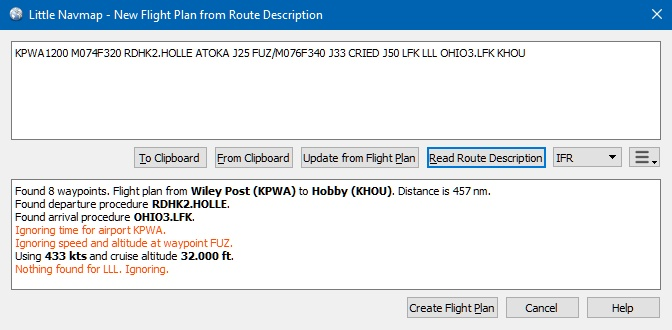

## Flight Plan Route Description {#flight-plan-from-route-description}

This dialog allows you to create a flight plan from a route description as they are generated or provided
by various online services.

When opened it will show the route description for the current flight plan which also contains information
about speed and cruise altitude.

The upper part of the dialog shows the route description input field and the lower part shows any messages,
warnings or errors that occur during reading.

The description parser will try to use as much of the route as possible even if parts of the flight plan
like waypoints or airways cannot be found or names are ambiguous. You will see warnings in the lower output field if that is the case.

For long flight plans it can happen that far away waypoints are added if names are not unique. Remove these manually if needed.

Many waypoints and airways will not be found if route descriptions from the latest AIRAC sources are
used together with flight simulator stock data from 2005. It is recommended to use a navigation data update for the
stock scenery when reading route descriptions from online sources like [RouteFinder](http://rfinder.asalink.net/),
[Online Flight Planner](http://onlineflightplanner.org/), [SimBrief](https://www.simbrief.com) or [SkyVector](https://skyvector.com).

Otherwise, use an AIRAC cycle from the online services that is closest to the flight simulator navigation data age at the end of 2005 if a navigation data update is not an option.

Note that even flight plans calculated in _Little Navmap_ cannot be converted back exactly in some cases.
This happens due to navaid ambiguities like NDB and VOR stations having the same names
or errors in the source data.

The cruise speed and altitude are used to create the flight plan if given.

_**Picture above:** A route description that was read successfully with a few warnings about ignored elements. Speed and altitude were recognized._

### Buttons {#buttons}

* **`To Clipboard`:** Copies the current description as plain text to the clipboard.
* **`From Clipboard`:** Inserts text from clipboard to the input field. The inserted text is converted to
  upper case and all invalid characters are removed from the text.
* **`Read Route Description`:** Reads the route description and prints any messages, warnings and errors in the
  lower output field. The current flight plan is not affected by this action.

* **`Create Flight Plan`:** Creates a new flight plan for the parsed route description and replaces the current plan.
  You have to click `Read Route Description` before.

### Format {#format}

The route description has to follow the format rules below:

`FROM[ETD] [SPEEDALT] [SID] [ENROUTE] [STAR] TO[ETA] [ALTERNATES]`

All elements in square brackets are optional.

`FROM` and `TO`: These are the required 3 or 4 letter idents for departure and destination airports.

Examples: `KEAT`, `CYPU`, `S16`.

`ALTERNATES`: Alternate airports are optional and are simply appended to the flight plan.

`SPEEDALT`: An optional entry that contains the cruise speed and altitude. See below for a details.

`ENROUTE`: This is a list of either `WAYPOINT` or a `AIRWAYWAYPOINT` forming the actual flight plan. The first entry
has to be an airport, waypoint, VOR or NDB.

`WAYPOINT`: A waypoint, VOR, NDB, airport or user defined coordinates. See below for a details about coordinates. A waypoint
can be prefixed with `DCT` to indicate a direct connection not using an airway.

Examples: `TAU`, `BOMBI`, `AST`, `CL`, `EDDF`.

`AIRWAYWAYPOINT`: Airway and end waypoint on the airway separated by a space.

Examples: `V495 CONDI`, `V338 YVR`, `V330 TRENA`.

#### Ignored Entries:

`ETD` and `ETA`: Four digit departure and arrival time.

`SID` and `STAR`: Currently ignored and replaced by `DCT`.

#### Speed and Altitude {#speed-and-altitude}

Cruising ground speed and cruising level not separated by a space.

Speed is prefixed with:

`K`: Kilometers per hour followed by a four digit value.

`N`: Knots followed by a four digit value.

`M`: Mach followed by a three digit value. The mach value is converted to knots ground speed assuming standard atmosphere conditions at the give flight altitude.

Altitude is prefixed with:

`F` :Flight level in three digits.

`S`: Metric flight level in three digits of tens of meters.

`A`: Altitude in hundreds of feet in three digits.

`M`: Altitude in tens of meter in four digits.

Examples:

`N0410F310` 410 knots at flight level 310.

`M071F320` Mach 0.71 at flight level 320.

`K0790M0710` 790 kilometers per hour at 7100 meters.

#### Coordinates {#coordinates}

Coordinates can be supplied in different formats:

**Degrees** only \(7 characters\): Two digits and north/south indicator plus three digits and east/west indicator.

Example: `51N010E`

**Degrees and minutes** \(11 characters\): Two digits degrees, two digits for minutes and north/south indicator.
Then three digits for degrees, two digits for minutes and east/west indicator.

Example: `4010N03822W`.

**Degrees, minutes and seconds** \(15 characters\): Two digits degrees, two digits for minutes, two digits for seconds and north/south indicator.
Then three digits for degrees, two digits for minutes, two digits for seconds and east/west indicator. This format is used by
[SkyVector](https://skyvector.com) for example.

Example: `481200N0112842E`.

**North atlantic track points** \(NAT\). Two digits degrees north and two digits degrees west followed by character `N`.

Example: `5010N`.

**Coordinate waypoint pairs** with degrees and minutes as above and prefixed with north/south and east/west indicator.

Examples: `N4200 W02000` or `N4200/W02000`.

**Garmin GFP format** \(13 characters\) north/south indicator, two digits degrees, three digits for minutes by 10. Then east/west indicator, three digits degrees, three digits minutes by 10. This format is used by the _Flight1 GTN 650/750_.

Example: `N48194W123096`

### Flight Plan Description Examples {#examples}

Frankfurt Main \(EDDF\) to Fiumicino \(LIRF\):

**Direct connection:**

`EDDF LIRF` or `EDDF DCT LIRF`.

**VOR to VOR:**

`EDDF FRD KPT BOA CMP LIRF`.

**Same as above with departure time \(`ETD`\) and arrival time \(`ETA`\) which both will be ignored:**

`EDDF1200 FRD KPT BOA CMP LIRF1300`.

**Same as above on flight level 310 at 410 knots:**

`EDDF N0410F310 DCT FRD DCT KPT DCT BOA DCT CMP DCT LIRF`

**Using Jet airways:**

`EDDF ASKIK T844 KOVAN UL608 TEDGO UL607 UTABA UM738 NATAG Y740 LORLO M738 AMTEL M727 TAQ LIRF`

**Same as above on flight level 310 at mach 0.71 with an additional speed and altitude at `NATAG` which will be ignored:**

`EDDF M071F310 SID ASKIK T844 KOVAN UL608 TEDGO UL607 UTABA UM738 NATAG/M069F350 Y740 LORLO M738 AMTEL M727 TAQ STAR LIRF`

**User defined waypoints with degree/minute notation and an alternate airport `LIRE`:**

`EDDF N0174F255 4732N00950E 4627N01019E 4450N01103E LIRF LIRE`

