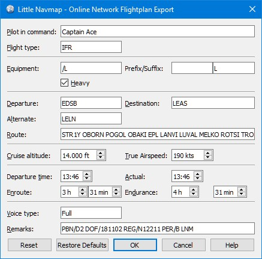

## Flight Plan Online Export {#flight-plan-online-export}

This dialog appears when exporting a flight plan for the online network clients using the export menu items
[FPL \(IvAp or X-IvAp\)](MENUS.md#flight-plan-formats-ivap) or [VFP \(vPilot\)](https://www.vatsim.net/pilots/software).

Some input fields might hidden depending on format.

Note that IvAp and X-IvAp use a slightly different format.

Fields that contain information which cannot be extracted from the current flight plan are saved between
sessions \(e.g. `Pilot in command` or `Equipment`).

Other input fields in this dialog are extracted from the current flight plan. These fields can be adjusted manually and are not saved between sessions.
These are:

* `Flight Rules`: From the current flight plan. `IFR` or `VFR` for VFP and `I` or `V` for FPL. Change manually if needed.
* `Aircraft type`: From the current aircraft performance \([Aircraft Performance](AIRCRAFTPERF.md)\).
* `Departure`: First waypoint in flight plan. \([Flight Plan - Dock Window](FLIGHTPLAN.md)\).
* `Destination`: Last waypoint in flight plan.
* `Route`: Generated from the flight plan waypoints, airways, SID and STAR. \([Flight Plan Route Description](ROUTEDESCR.md)\).
* `Cruise altitude`: Taken from flight plan. Cruise altitude in feet.
* `True Airspeed`: From the current aircraft performance cruise speed.
* `Departure time`: Uses current UTC time as default. Adjust as needed.
* `Actual`: Actual departure time. Uses same default time as above. Adjust as needed.
* `Enroute`: Traveling time as calculated by flight plan and current aircraft performance.
* `Endurance`: Uses same default as above. Adjust as needed.

### Buttons

* `OK`: Saves relevant fields for the next session and opens the `Save as` dialog.
* `Cancel`: Discards all changes and closes dialog.
* `Reset`: Undoes all changes that were made since opening the dialog.
* `Help`: Shows this online help page.

_**Picture above:** Flight Plan Online Export Dialog for VATSIM vPilot._
