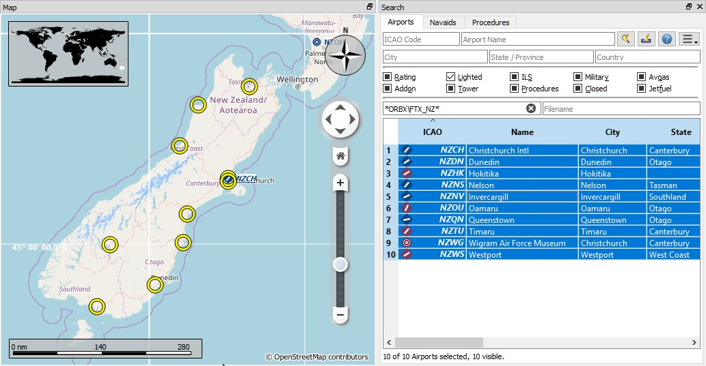

##  Search Dock Window {#search-dock-window}

The search dock window contains several tabs with similar functionality that allows to search for features by name, ident or other criteria.

Airport, navaid, userpoint and online search tabs contain multiple rows of search filters. These rows can be switched on and off with the drop down menu on the menu button  on the top right in the airport, navaid and userpoint search tabs.

The drop down menu prefixes menu items with a change indicator `*` to show that the related filter row has modifications. You can use this to find out why a search does not give the expected results.

**If you do not get the expected results or no results at all use the `Reset Search` menu item, button  or press `Ctrl+R` to clear all search criteria.**

Filters are defined by various controls which are mostly self explaining. Only text filters and the tri-state checkboxes like `Lighted`, `Approach` or `Closed` need a few extra remarks below.

All filters can be used together where all conditions have to be met \(`and` operator\). All filters except the distance search filter are applied immediately. The distance search is applied after a short delay for each change.

A tooltip on the blue help button on the top right shows information about searching.

### Text filters {#text-filters}

The standard is to search for entries that start with the entered text.

The placeholder `*` stands for any text. Once a `*` is included in the term, the standard search \(match start of text\) is no longer used. In that case you might have to add a `*` at the end of the search term as well to get the expected result.

The search is negated \(find all entries that do not match\) if the first character in a search box is a `-`.

Note that all of the above does not apply to numeric fields like `Runways: Min` or `Altitude: Max`.

### Tri state checkboxes {#tri-state-checkboxes}

These are used to filter airports by presence of certain facilities or properties.

Below are the states as they are shown in Windows 10:

* **Black Box:** Condition is ignored.
* **Checked:** Condition must match.
* **Empty Box:** Condition must not match.

Colors and look of these checkboxes vary with theme and operation system. So instead of gray another color might be used \(red fill on Linux or a `-` for macOS\).

### Distance search {#distance-search}

This function is only available in the airport and navaid search.

This function allows you to combine all other search options with a simple spatial search.

The checkbox `Distance` has to be selected to enable this search. The result will include only airports or navaids that are within the given minimum and maximum range of nautical miles from the search center. This allows you to quickly search for a destination that is within the range of your aircraft and fulfills other criteria like having lighted runways and fuel.

The center for the distance search is highlighted by a  symbol.

To restrict the search further you can select a direction \(North, East, South and West\).

Check the drop down menu for the change indicator `*` and the search fields for any remaining text if the distance search does not give any or unexpected results. Use `Reset Search` in the context menu of the result table or press `Ctrl+R` to clear all search criteria.

_**Picture above A complex distance search:** Find all airports within a distance between 200 and 400 nautical miles from Frankfurt \(EDDF\). Airports should have a rating greater than 0 and should have at least one lighted runway. Military and closed airports are excluded. The resulting airports are highlighted on the map by selecting them in the search result table._

_**Picture above A complex search for scenery:** This example shows how to find specific add-on scenery by using the _`Scenery Path`_ search field. This shows all airports of the Orbx New Zealand South Island add-on scenery that have lighted runways._

### Search Result Table View {#search-result-table-view}

All selected elements in the table view will be highlighted on the map using a black/yellow circle. See [Highlights](MAPDISPLAY.md#highlights) for more information.

Multi selection using `Shift+Click` or `Ctrl+Click` is possible.

#### Header {#table-view}

The header of all table views allows the following manipulation:

* **Click on the top left corner of the column header:** Select all result rows.
* **Click on a column header:** Sort ascending or descending \(only for search result tables - not for flight plan table\).
* **Click and drag on the column header:** Change column order.
* **Double click on column border:** Automatically fit column size to content.
* **Click and drag on column border:** Change column width.
* **Click into the empty space below all rows:** Deselect all entries and remove highlights on the map.

The above applies to all table views in the program and partially also to the tree view of the procedure search.

The program saves the sort order, column widths and positions until `Reset View` is selected in the context menu.

_**Picture above:** Airport search result table. All additional search options are hidden by using the drop down menu of the menu button on the top right._

_**Picture above:** Navaid search limited to ICAO region _`LI`_ \(Italy\) and VOR, VORTAC and TACAN stations that have a range of more than 100 nautical miles._

#### Mouse Clicks {#mouse-clicks-0}

A double click on an entry in the table view shows either an airport diagram or zooms to the navaid or other feature. Additionally, details are shown in the `Information` dock window. Single click selects an object and highlights it on the map using a black/yellow circle.

### Top Buttons {#top-buttons}

Available buttons and menu items depend on search tab.

####  Reset Search {#reset-search}

Clears search filters and shows all entries again in the search result table view.

####  Clear Selection {#clear-selection}

Deselects all entries in the table and also removes any highlight rings from the map.

####  Help {#help}

Show a quick help in the tooltip and opens this help chapter in the default browser on click.

####  Menu Button {#menu}

Drop down menu button that allows to hide or show search options.

The drop down menu prefixes menu items with a change indicator `*` to show that the related filter row has modifications. You can use this to find out why a search does not give the expected results.

### Search Result Table View Context Menu {#search-result-table-view-context-menu}

Available menu items depend on search tab.

####  Show Information {#show-information-0}

Same as the [Map Context Menu](MAPDISPLAY.md#map-context-menu).

####  Show Procedures {#show-procedures}

Opens the procedure search tab of the search dock window and display all procedures for the airport.

See [Procedure Search](SEARCHPROCS.md) for more information.

####  Show on Map {#show-on-map}

Shows either the airport diagram or zooms to the navaid, userpoint or other features on the map.

#### Follow Selection {#follow-selection}

The map view will be centered - not zoomed in - on the selected feature when this function is enabled.

####  Filter by Entries including/excluding {#filter-by-entries-including-excluding}

Takes the text of the field under the cursor and sets the search filter for an including or an excluding search. This is only enabled for text columns.

####  Reset Search {#reset-search}

Clears search filters and shows all entries again in the search result table view.

####  Show All {#show-all}

The table view does not show all entries initially for performance reasons. This menu item allows to load and show the whole search result. The view switches back to the limited number of entries after a search filter is modified or the sort order is changed. The number of all, visible and selected entries is shown at the bottom of the tab.

Be aware that showing all navaids and airports can take some time especially if they are highlighted on the map when selecting all in the search result. The program does not crash but needs a few seconds to highlight everything on the map.

####  Show Range Rings {#show-range-rings-0}

####  Show Navaid range {#show-navaid-range-0}

####  Remove all Range Rings and Distance measurements {#remove-all-range-rings-and-distance-measurements-0}

####  Set as Flight Plan Departure {#set-as-flight-plan-departure-0}

####  Set as Flight Plan Destination {#set-as-flight-plan-destination-0}

####  Add Position to Flight Plan {#add-position-to-flight-plan-0}
####  Append Position to Flight Plan {#append-position-to-flight-plan-0}

Same as the [Map Context Menu](MAPDISPLAY.md#map-context-menu).

####  Copy {#copy}

Copies the selected entries in CSV format into the clipboard. This will consider changes to the table view like column order and sort order. The CSV includes a header line.

#### Select All {#select-all}

Selects all visible entries. To select all available entries the function `Show All` has to be used first.

####  Clear Selection {#clear-selection}

Deselects all entries in the table and also removes the highlight rings from the map.

####  Reset View {#reset-view}

Resets the sort order, the column order and column widths back to default.

####  Set Center for Distance Search {#set-center-for-distance-search-0}

Same as the [Map Context Menu](MAPDISPLAY.md#map-context-menu).
