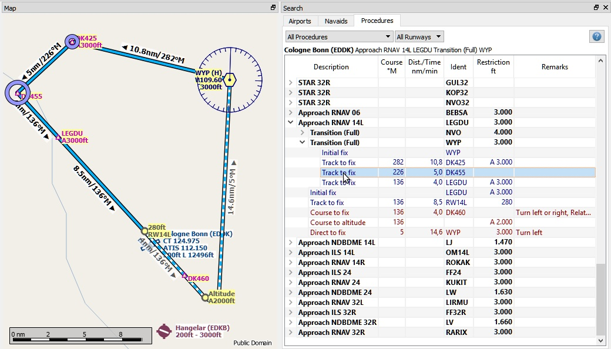

##  Search Dock Window - Procedures {#search-dock-window}

### General {#general}

Three search tabs are available for airport, navaid and procedure search.

#### Procedure Search {#procedure-search}

The tab `Procedures` allows to preview and add approach and departure procedures to the flight plan. Procedures of a selected airport are arranged in a tree which indicates the dependencies between approaches and transitions.

**See the [Procedures](APPROACHES.md#delete-selected-legs) chapter of this manual for more details.**

Procedure legs are shown when a procedure node is expanded in the tree. Procedures can be filtered by runway and type.

Right click on a procedure to get more options in the context menu. This allows to center the map or add the procedure to you flight plan.

Use the context menu of the flight plan table to remove procedures like any other waypoint. See [Delete Selected Legs or Procedure](FLIGHTPLAN.md#delete-selected-legs).

Procedure legs are highlighted in red if the one or more navaids could not be resolved. A warning dialog will show up if you try to add this procedure to a flight plan.

_**Picture above:** Showing a transition and a RNAV approach. Start and endpoint of a transition leg are highlighted on the map._

##### Filter {#procedure-filter}

The **runway filter** is always available and helps to find procedures for a certain departure or arrival runway.

The **type filter** is not available for a default database. A navdata update is needed to get SID and STAR procedures. 

The type filter allows the selections below:

* **`All Procedures`:** SID, STAR and approaches
* **`Departure Procedures`:** Only SID
* **`Arrival Procedures`:** STAR and approaches
* **`Only Approaches and Transitions`:** No SID and no STAR

The respective transitions are always shown.

##### Procedure Tree {#procedure-tree}

Legs are shown in dark blue while missed approach legs are shown in dark red color.

Bold red text indicates an error in the leg. The procedure is incomplete and should not be used in a flight plan.

* **`Description`:** Either description of the procedure or flight instruction for procedure legs.
* **`Course °M`:** Magnetic course for a leg.
* **`Dist./Time`:** Distance of flying time for a leg. Holds can have a leg time in minutes or a leg distance in nautical miles.
* **`Ident`:** Ident of the initial fix or name of the procedure. Fix name for legs.
* **`Restriction`:** For procedures first altitude restriction or altitude restriction of a leg. The following altitude restrictions exist:
 * **Number only:** Fly at altitude. Example: `5.400`.
 * **Prefix **`A`**:** Fly at or above altitude. Example: `A 1.800`.
 * **Prefix **`B`**:** Fly at or below altitude. Example: `B 10.000`.
 * **Range:** Fly at or above altitude one and at or below altitude two. Example: `A 8.000 B 10.000`.
* **`Remarks`:** Shows fly-over, turn direction or related navaid for a procedure leg.

##### Procedure Tree Context Menu {#procedure-context-menu}

#####  Show on Map {#procedure-show-on-map}

Centers the map on the selected procedure.

#####  Insert into Flight Plan / Use as Destination / Use as Departure {#procedure-insert}

Text and functionality of this menu item depends on the selected procedure type and if the procedure's airport is already the departure or destination airport of the current flight plan.

Use the context menu of the flight plan table to remove procedures. See [Delete Selected Legs or Procedure](FLIGHTPLAN.md#delete-selected-legs).

The corresponding procedure \(approach, SID and STAR\) is added or replaced too if a transition is selected.

`Insert ... into Flight Plan`:

This menu item will add the selected procedure to the current flight plan. A procedure of the same type \(SID, STAR or approach with or without transition\) will be replaced if already present in the flight plan.

`Use ... as Destination` or `Use ... as Departure`:

This will add or replace the destination or departure airport and add the selected procedure.

The departure or destination airport are added to the flight plan too if the flight plan is empty.

##### Expand All / Collapse All

Expands all procedures so that their legs and transitions are shown or collapses the tree.

#####  Reset Search {#reset-search}

Clears search filters and shows all procedures again in the tree.

#####  Clear Selection {#clear-selection}

Deselects the currently selected procedure and also removes the preview from the map.

#####  Reset View {#reset-view}

Resets the the column order and column widths back to default.
