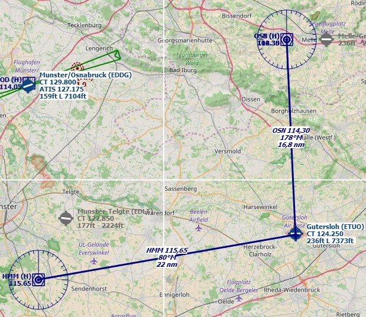
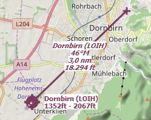
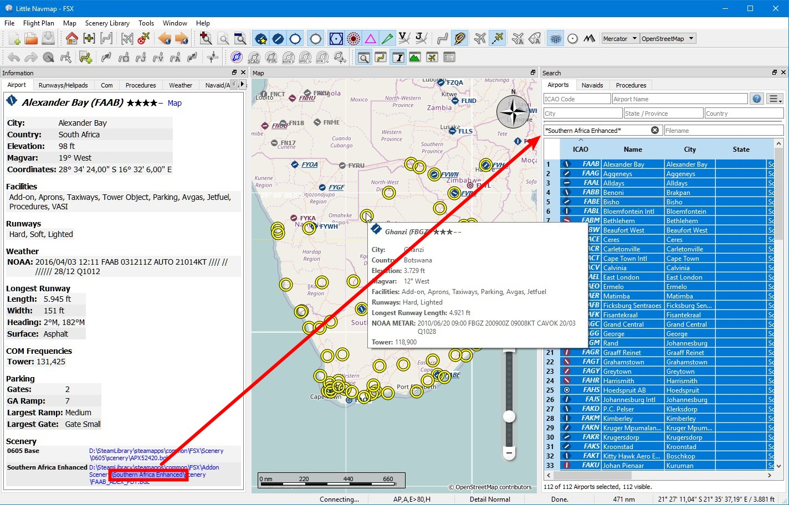
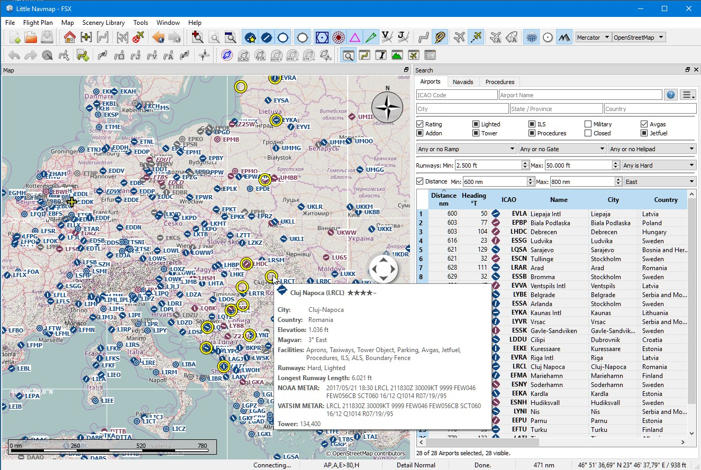

## Tips and Tricks {#tips-and-tricks}

### Show all Navaid Ranges of a Flight Plan {#tips-and-tricks-navaid-range}

Select all legs in the flight plan table, then right click on any leg and select `Show Navaid Range` . This will place a range ring around every radio navaid in the flight plan.

See also [Show Navaid range](MAPDISPLAY#show-navaid-range).

Remove the range rings by selecting `Remove all Range Rings and Distance Measurements` .

### Use the measurment lines to get a VOR Radial Intersection {#tips-and-tricks-vor-radials}

Measurment lines can start at airports or navaids where they use the magnetic variation if available. You can use them to find an airport by radial and distance if you like to navigate the old fashioned way.

Below is an example that gets radial and distance from two VORs for `ETUO`. Measurement lines can also start at NDBs or waypoints. Note the suffix `M` which indicates magnetic course.

See also [Measure GC Distance from here](MAPDISPLAY#measure-gc-distance-from-here) and [Measure Rhumb Distance from here](MAPDISPLAY#measure-rhumb-distance-from-here).

The same can be used when flying airways without GPS. In the example below fly 323 degrees magnetic to VOR `SFD` \(radial 143\). You are at `WAFFU` when the DME shows 13.7 nautical miles. Then turn left to 280°M until you intercept 302° to `GWC`.

### Use the measurment lines for Approach Guidance {#tips-and-tricks-approach-guidance}

Right click on the airport and choose `Measure Rhumb Distance from here` . Pull the line using the opposing course to 3 nautical miles out to get guidance for the final approach.

### Search for Add-On Airports {#tips-and-tricks-addon-airports}

You can use the scenery path to look for add-on airports of a certain developer. Click on one of the add-on airports and copy the relevant part of the path from the information window. Insert this path fragment into the `Scenery Path` input field in the airports tab of the search dock window. Add `*` at the beginning and at the end since it only a part of the path.

See also [Text Filters](SEARCH.md#text-filters).

Select all in the result table to get all airports highlighted on the map.

### Use the Search Function to plan an Around the World Trip {#tips-and-tricks-rtw}

The spatial search function is useful to plan a round the world tour.
Assume you'd like to go east:

1. Got to the dock window `Search`, right click into the result table and select `Reset Search`  to get rid of all search criteria that may affect the query.
2. Set your departure airport.
2. Right click on your departure airport in the search or on the map and select `Set Center for Distance Search` . This is the center point for the spatial search.
3. Add any additional criteria in the search like lighted runways, procedures, fuel, minimum runway length and more.
4. Adjust the minimum and maximum distance, set direction to `East` and click the checkbox before `Distance`.
5. Select all in the result table to see the airports on the map.
5. Choose your next destination airport.
6. Add as destination.
7. Calculate plan.
8. Fly.
9. Back to 2. until you are done around the world.

Picture below shows a query result for airports in the east. Note that the black/yellow highlight circles have tooltips too, no matter if the airport is visible or not.

