## Building an IFR Flight Plan with Approach Procedures {#tutorial-ifr}

This tutorial will show you how to create a more complex IFR flight plan including approach procedures. It introduces the advanced airport search functionality and the automatic flight plan calculation.

While this tutorial looks quite lengthy it is normally a matter of half a minute to get a flight plan if you know where to go. The planning effort shown here is bigger to highlight some of the more advanced features of the program.

You should at least read through the VFR tutorial [Building a VFR Flight Plan](TUTORIALVFR.md).

The flight plan will go across the UK using an IFR capable aircraft. Its maximum range should be more than 600 nautical miles including reserves and a cruise altitude of 10,000 feet. 

I will not go into detailed fuel planning procedures in this tutorial. That is another story for another time.

Assuming you left your aircraft at `Bembridge \(EGHJ\)` at the end of the last flight or treat this as you home base.

Furthermore you don't know where you want to fly today.

All you know are the requirements for your aircraft: Range, minimum runway length and hard runways. You also need some parking spots at the destination. Fuel would be nice too.

### Cleanup Search {#tutorial-ifr-cleanup}

Go to the dock window `Search`, right click into the result table and select `Reset Search`  to get rid of all search criteria that may affect the query. Then click the menu button   and make sure that the search groups `Facilities`, `Runway`, `Parking` and `Distance from Mark` are checked. Deselect all others you don't need.

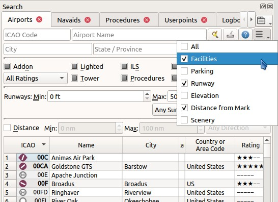

### Assign Departure {#tutorial-ifr-assign-departure}

Now enter `EGHJ` in the `ICAO Code` search field on the top left \(case does not matter\). Right click on the airport in the result table and choose `Set as Flight Plan Departure` . This will assign a default runway as a start position.

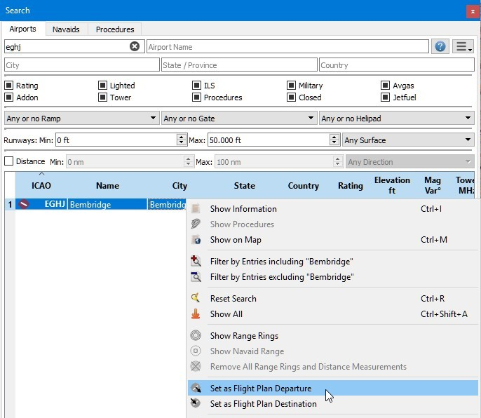

Your flight plan has one entry now. This is already sufficient if you want to fly a pattern and like to see distance, speed and time information to the airport.

Starting from a runway is not quite realistic. Let's select a parking position. Go to `Flight Plan` -&gt; `Select a Start Position for Departure`  and choose one of the GA small ramp positions. Click `Ok` and the position will be highlighted on the map.

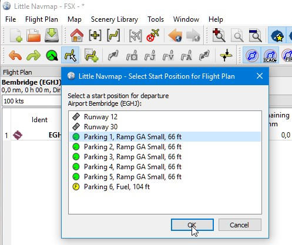

Alternatively you can also select the start position directly on the map's context menu as described in the [VFR tutorial](TUTORIALVFR.md). 

See also [Set as Flight Plan Departure](MAPDISPLAY.md#set-as-flight-plan-departure)

### Search for Destination {#tutorial-ifr-search-dest}

Right click on `EGHJ` in the search result again and select `Set Center for Distance Search` . You can also do this in the map. This is the center point for the spatial search.

See also [Search Dock Window - Airports and Navaids](SEARCH.md).

Clear the `ICAO Code` search field now \(it is a common mistake to leave the text fields filled when doing distance searches which will give you an empty result table\).

We will now look for airports that are in range of the aircraft but not too close and have certain criteria fulfilled, like having parking spots that fit our aircraft and a runway long enough.

You can also find airports in aircraft range by using the range rings where you can right click into the map on your departure airport and select `Show Range Rings` , although this function does not allow the detailed airport filters.

Range rings are too easy, we'll do it the hard way now.

Now check the following in the airport search tab:

1. `Rating`: We'd like to get airports that are either add-ons or have basic scenery requirements, like taxiways, parking spots and more. Everything else is boring.
2. `Procedures`: Show only airports that have procedures to spice up the approach a bit.
3. Deselect `Military` and `Closed` \(click the checkboxes twice\): This will return only civilian airports and avoid airports that have all runways closed.
4. Also check `Avgas` so we can fill up for our return trip and don't have beg for fuel at a nearby road.
5. In the combo box `Any or no Ramp` select `At least Ramp GA small`. This will include only airports in the result that have suitable parking spots.
6. In the combo box `Any Surface` select `Any is Hard` to avoid airports having only soft surfaced runways. Gear and tires are expensive.
7. Select a minimum runway length of 2,500 feet for your aircraft in the field `Runways:` `Min:`.

You can also limit the maximum runway length if you are looking for a short landing challenge, but not now.

The search result changes on the fly while doing all these adjustments, though we are not there yet.

Now check `Distance:` to activate the spatial search. Change the maximum distance to 600  and the minimum to 400 nautical miles \(to avoid short hops\). The result table will now update with a short delay since the distance search is more complex.

To find only airports north of your position select `North` in the combo box `Any Direction`. North usually means lousy weather and that's what we're looking for. Note that the search result is sorted by distance with the closest airport first.

Now you can choose an airport for your trip. We use `Wick \(EGPC\)` for this tutorial.

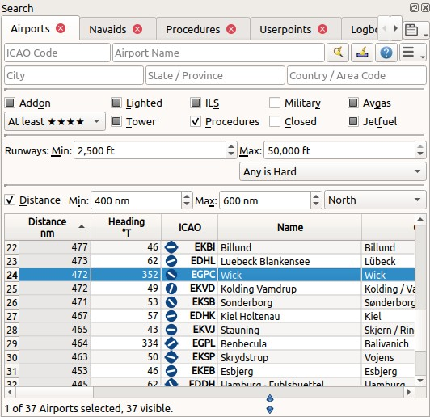

Right click on Wick in the result table and select `Show Information` . This will fill the tabs in the dock window `Information`. Select the tab `Weather` and look for the wind direction to get an idea of the expected landing runway. Start AS16 or Active Sky next if you are using these. For this tutorial we assume that the winds favor runway 13.

See also [Weather](WEATHER.md).

### Select an Approach Procedure {#tutorial-ifr-select-approach}

Now go back to the search result and right click on the airport Wick again. Select `Show Procedures` . This will pop up the procedure search tab.

More information on procedure search: [Search Dock Window - Procedures](SEARCHPROCS.md). Also see [Procedures](APPROACHES.md) for general information on procedures.

Choose `Runway 13` in the `All Runways` combo box to see only approaches for 13.

Select `Expand All` in the context menu to see also the transitions for each approach.
We will choose `Approach VORDME 13 FD13` using `Transition (Full) WIK10` since we expect to land on runway 13 and arrive from south.

The top label in the procedure search shows `Wick (EGPC) Approach VORDME 13 FD13 Transition (Full) WIK10` which is what you see in the blueish preview on the map if you select a procedure in the tree.

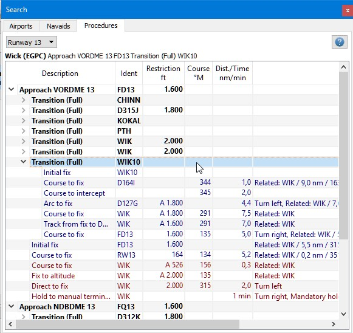

Right click on the transition and select `Show Approach and Transition on Map` . This will center the procedure on the map. You can hover the mouse over the waypoints of the approach to see more information in a tooltip. You can also click on the legs in the procedure tree to see the respective start and end points.

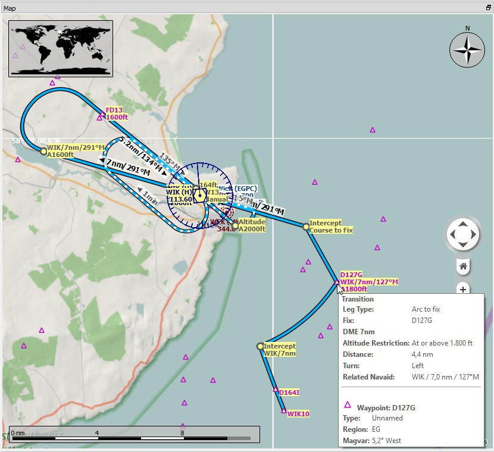

The procedure looks sufficiently complicated to make an interesting approach.

If you like what you see \(in this tutorial you have no choice, so you better like it\) right click again on the transition and select `Use EGPC and Approach and Transition as Destination` .

This will do two things:

1. Append Wick as the destination airport to the flight plan. Any previous destination in the flight plan will be replaced.
2. Add the approach and its transition to the flight plan. The procedure legs use a dark blue color and the missed approach legs use a dark red color in the flight plan table. Flight plan en route legs are black. Again, any previous procedure is replaced with this new one.

**About adding transition and approaches:** Approaches and transitions are closely related which is already indicated by the tree structure in the procedure search tab. You can add an approach alone but a transition belongs to an approach.

You have to select the transition to add or show both, approach and transition.

### Calculate a Flight Plan {#tutorial-ifr-calculate-flight-plan}

Now we have the departure airport, an approach procedure and the destination all connected by a boring, long line. Next is the en route part of the flight plan.

Set `IFR` as the flight plan type in the dock window `Flight Plan`. This allows the automatic flight plan calculation to adjust the cruise altitude.

Click `Flight Plan` -&gt; `Calculate low Altitude`  to start the automatic flight plan calculation for Victor airways. The calculation will create a route from your departure airport to the start of the transition.

The flight plan cruise altitude is automatically adjusted according to the hemispherical rule \(the rule can be changed in `Tools` -&gt; `Options` on tab `Flight Plan`\), the altitude restrictions of the airways and the flight plan type \(`VFR` or `IFR`\). You can see the restriction for each airway segment in the flight plan table in the column `Restriction`.

The altitude can also be adjusted according to the hemispherical rule by clicking `Flight Plan` -&gt; `Adjust Flight Plan Altitude` .

Now the minimum altitude of 16,000 feet is a tiny bit too high.

Therefore, try an alternate calculation method which limits your cruise altitude.

Enter 10,000 feet in the `Flight plan altitude` field and then click on `Flight Plan` -&gt; `Calculate based on given Altitude` . This will result in a flight plan that uses only airways having a minimum altitude below or equal to 10,000 feet. Note that you can get a mix of Victor and Jet airways depending on used altitude. The calculation might also fail if you set the cruise altitude too low.

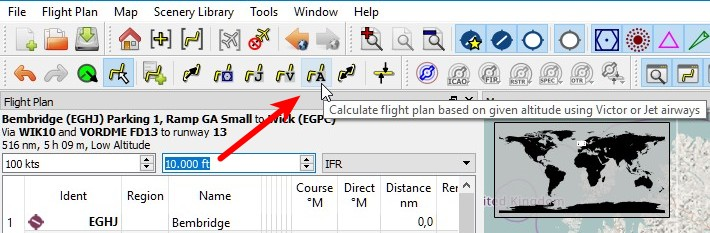

Use this flight plan for now.

Save the plan using `File` -&gt; `Save Flight Plan` . The program usually finds the right directory for the flight plans and gives a sensible name by default.

The waypoints of the approach procedure are not saved in the flight plan. You have to select the approach in your GPS or FMC in the simulator or fly it by radio navaids and a stopwatch.

What _Little Navmap_ saves in the PLN, are the procedure names which allows the program to restore the approach when loading the PLN file.

The top label in the flight plan dock window reads now:

```none
Bembridge (EGHJ) Parking 1, Ramp GA Small to Wick (EGPC)
Via WIK10 and VORDME FD13 to runway 13
517 nm, 5 h 10 m, Low Altitude
```
Adjust the ground speed in the flight plan dock window according to the used aircraft to get a better time estimate.

The flight might look different, depending if you use stock navaids or navdata updates.

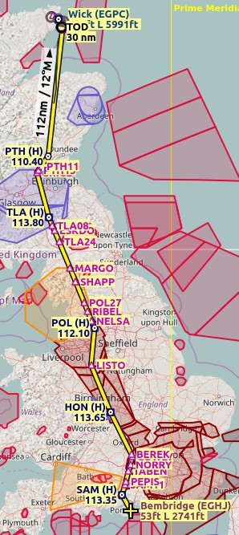

Now you can check if you pass through any airspaces. Enable airspaces by selecting `Map` -&gt; `Airspaces` -&gt; `Show Airspaces`  if not already done.

Check `Map` -&gt; `Airspaces` -&gt; `At flight plan cruise altitude`  in the menu or the toolbar menu button.

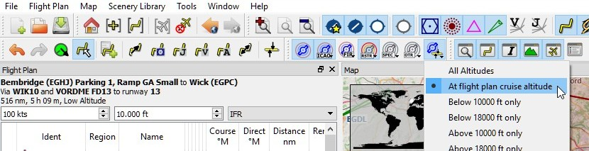

This will display only airspaces on the map that are relevant for your cruise altitude. You can also select `Below 10000 ft only` to see all relevant airspaces in the climb or descent phase. Use the tooltips on the map to get information about airspaces like type, minimum and maximum altitude.

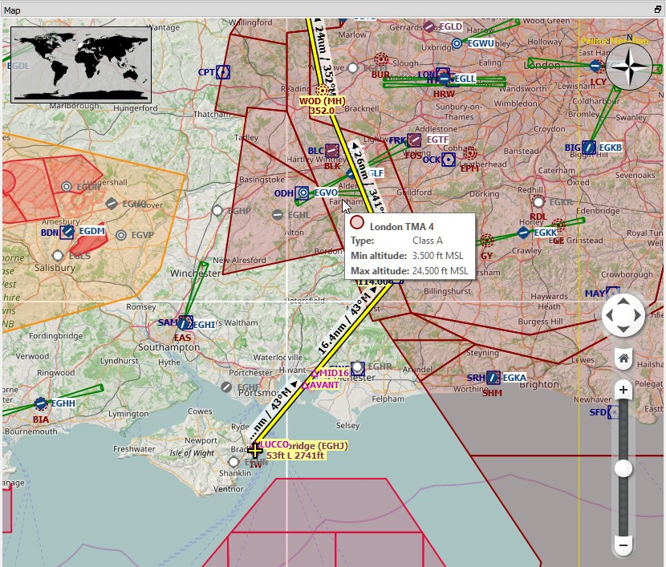

### Flying {#tutorial-ifr-flying}

Open the dialog `Connect` using `Tools` -&gt; `Flight Simulator Connection`  and check if `Connect automatically` is selected. Enable, if not. _Litte Navmap_ will find the simulator, no matter if it is already started or if it is started later. Close the dialog.

See also [Connecting to a Flight Simulator](CONNECT.md).

Enable `Map` -&gt; `Center Aircraft` . The map will jump to the simulator aircraft and keep it centered. This will happen only if an active flight is loaded, i.e. the simulator is not in the opening screen.

Start the simulator if not already done, load the flight plan and go flying.

The program will stop following your aircraft if you start any action that zooms in to an airport or navaid \(double click, toolbar button or link in the information window\).

When done click the back button  until you are back at your aircraft. Then enable `Map` -&gt; `Center Aircraft`  again.

### Top of Descent {#tutorial-ifr-top-of-descent}

A top of descent indication is displayed on the map and in the elevation profile which also shows the distance from top of descent to the destination. This number includes the distance of approach procedures \(excluding holds\). 

Note that altitude restrictions are not considered yet in the top of descent calculation.

You can change the descent rule in `Tools` -&gt; `Options`  on the tab `Flight Plan`. The default is 3 nautical miles for 1,000 feet.


The tab `Progress` in the dock window `Simulator Aircraft` will show the distance to the top of descent in the `Flight Plan Progress` section:

|Flight Plan Progress|
|---|---|
|To Destination: |74 nm|
|Time and Date: |21.05.17 12:33 UTC|
|Local Time: |14:33 CEST|
|**TOD to Destination:**|**64 nm**|
|**To Top of Descent:**|**10,1 nm**|

The section `Altitude` will show the vertical path deviation after passing the top of descent:

|Altitude||
|---|---|
|Indicated: |5,090 ft|
|Actual: |5,051 ft|
|Above Ground: |5,051 ft|
|Ground Elevation: |0 ft|
|**Vertical Path Dev.:**|**-511 ft below ▲**|

### Changing Procedures {#tutorial-ifr-changing-procedures}

Now the weather has changed requiring an approach to runway 31 and the guy in the tower is not open for discussions.

Right click on the destination airport at the bottom the flight plan table. Choose `Show Procedures` .

Then change the runway filter to `Runway 31`, expand the approach VORDME 31 to see the transition, select the transition. The label on top of the window shows now `Approach VORDME 31 FD31 Transition (Full) CHINN`.

Right click on the selected transition and choose `Use EGPC and Approach and Transition as Destination`  from the context menu which will replace the current procedure in your flight plan with the new one.

The top label in the flight plan dock window reads now:

```none
Bembridge (EGHJ) Parking 1, Ramp GA Small to Wick (EGPC)
Via CHINN and VORDME FD31 to runway 31
526 nm, 5 h 15 m, Low Altitude
```

To completely get rid of a procedure select any leg of the procedure in the flight plan table, right click and choose `Delete selected Leg or Procedure`  to delete the whole procedure. Alternatively press the `Del` key.

If ATC clears you to the initial fix of the procedure:

1. Delete any intermediate waypoints between your current aircraft position and the initial fix of the procedure: Right click in the flight plan table and select `Delete selected Leg or Procedure`  for all waypoints between your current aircraft position and the initial fix or start of the procedure. Avoid deleting you approach \(you can also right click on a flight plan waypoint on the map and delete it from the context menu\).
3. Then right click on your aircraft on the map and select `Add Position to Flight Plan` .

This will give a direct connection from your current aircraft position to the start of the procedure which you can use to get course and distance to the intial fix.

Below: After changing the approach procedure and adding a user defined waypoint at the aircraft position to the flight plan. Now we get course and altitude indications for a direct leg to the start of the transition \(43 nm and 314 degrees magnetic course\).

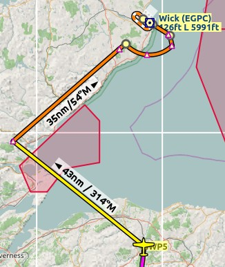

### Going Missed {#tutorial-ifr-going-missed}

I recommend to hide missed approaches on the map by unchecking `Map` -&gt; `Show Missed Approaches` . This helps uncluttering the map display.

* **If the missed approach is not shown:** The progress window shows distance and time to destination. Activating the next leg \(shown in magenta color\) will stop if the destination \(i.e. the runway threshold\) is reached, even when passing the threshold.
* **If the missed is shown and the aircraft passes the runway threshold:**  The first leg of the missed approach is activated and simulator aircraft progress will display the remaining distance to the end of the missed procedure.
