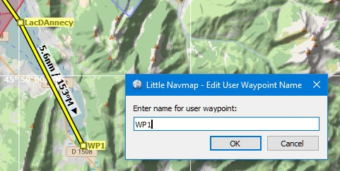
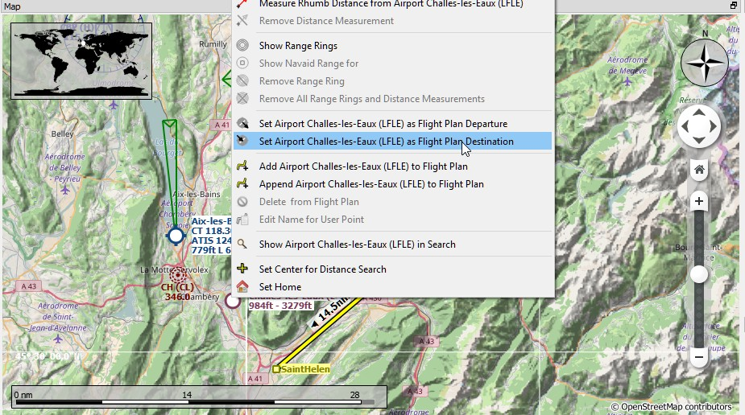
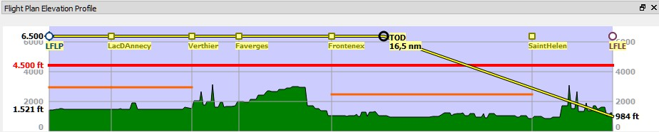
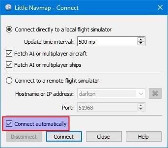

## Building a VFR Flight Plan

### General

This tutorial will show how to create a simple flight plan based on the map and its context menus.

The flight plan included in the _Little Navmap_ directory: `.../Little Navmap/etc/Tutorial VFR Meythet (LFLP) to Challes-les-Eaux (LFLE).pln`.

The airport names might differ depending on simulator.

The flight will take us through the valleys of the French alps. You can use this flight plan for any small aircraft like the free [Flight1 Cessna 162 SkyCatcher](http://www.flight1.com/view.asp?page=skycatcher) or the default Cessna 172 of X-Plane or Prepar3D.

The flight will only go through Class E airspace. There is no need to contact ATC.

The flight plan is: _Meythet (LFLP) Parking 11, Ramp GA Small to Challes-les-Eaux (LFLE), 41 nm, 0 h 24 m, Direct_

### Prepare Flight

I'd recommend to get use `Flight` -> `Reset all for a new Flight`  before each flight to get a clean base for fuel calculation and other functions. Uncheck `Create a new and empty flight plan` in the dialog if your plan is already loaded.

### Default Aircraft Performance

This tutorial does not cover creating or collecting aircraft performance files. See [Creating an Aircraft Performance File](TUTORIALPERF.md) if you like to do this.

Therefore, we will simply use the default which gives a three degree climb and descent angle as well as 100 knots cruise speed.

Select `Aircraft` -> `New Aircraft Performance ...` . Accept the default values by pressing `OK` in the dialog. You will see several warnings in the fuel report. Ignore these for now since the aircraft performance is sufficient to calculate the top of descent and top of climb for the elevation profile.

### Departure Airport

Find the departure airport:
Click into the map and zoom to the French Alps. You can use the following functions to navigate:

* The map overlay on the left.
* The mouse (click and drag) to move and the mouse wheel to zoom.
* The cursor keys to move and the keys `+` and `-` for zooming in and out (click into the map window to activate it before using the  keys).

Use the back  and forward  buttons to jump in the position history like a web browser.

See also [Map Display](MAPDISPLAY.md).

Look for the departure airport `Meythet (LFLP)` around here:

Closer with tooltip:

Now:

* Zoom in until you see the airport diagram showing taxiways, runway details, parking positions and more.
* Zoom in further until you see the white parking numbers.
* Right-click on the center of one of the green ramp parking spots (11 is used here).
* Choose `Select Airport Meythet (LFLP) / Parking 11 as Flight Plan Departure`  in the context menu.

This will select your departure parking position which will be highlighted by a black/yellow circle. The airport will be added to the flight plan as departure too.

You can also click on the airport icon and select it for departure. A runway will be automatically assigned as departure position.

### En-Route Waypoints

Add the waypoints now:

* Scroll along the valley to the south east across the lake Lac d'Annecy.
* Click `Append Position to Flight Plan` . The clicked position will be added as an user-defined waypoint to the end of your plan.

Click undo  or redo  if you don't like what you just added.

Another function is `Add Position to Flight Plan`  which will insert  the clicked position to the nearest flight plan leg. You can use this to add user-defined positions, airports or navaids in the middle of a flight plan. The nearest leg will be chosen automatically by _Little Navmap_.

_Little Navmap_ will automatically assign names to the user-defined waypoints. You can leave these as they are or replace them with a more meaningful name.

Right-click on the user waypoint and select `Edit Flight Plan Position WP1`  to change a waypoint name or its coordinates. Use nearby villages, mountains, lakes or other points of interest. Do not change the coordinates now.

The flight simulator limits the name to a certain length and to certain characters. Nothing will be added to the name if it is too long or if you type the wrong characters.

Keep adding points and stay away from the mountains until you're at `Challes-les-Eaux (LFLE)`.

### Destination Airport

To add the destination:

* Right-click on `Challes-les-Eaux (LFLE)`
* Select `Set Airport as Flight Plan Destination` .

Now there is a flight plan. Yours might look a bit different.

You can also use the drag and drop feature to move points or add new ones. Enable it by checking `Flight Plan` -> `Edit Flight Plan on Map`  and click on a flight plan waypoint to move it. Click on a flight plan leg to add a new waypoint into this leg.

See [Map Flight Plan Editing](MAPFPEDIT.md) for more information.

### Cruise Altitude

Change the flight plan type to `VFR` if not already done.

Now check the cruise altitude:

* Look at the flight plan elevation profile. There is a red line indicating the minimum safe altitude.
* Adjust the flight plan cruise altitude until you're above the red line.
* Select `Flight Plan` -> `Adjust Flight Plan Altitude`  to get the correct altitude adjusted by the hemispherical rule.

Note that the default hemispherical rule is not correct for France until you change it in the options dialog, but avoid this for the sake of simplicity now.

You probably noticed that you will get close to ground near the destination. Be prepared to circumvent some mountains there.

### Airspaces

Now look if your flight plan touches any airspaces.

Click into one of the airspaces nearby start and destination and have a look at the information dock window. There are several airspaces:

* `Geneva TMA Sector 8` which starts at 9500 feet above mean sea level (MSL). This is higher than our cruise altitude and won't affect us.
* Two Class E airspaces. The information window notes for these: `Controlled, IFR and VFR, ATC clearance required for IFR only`. No problem because we will fly using VFR.

The situation is similar at the destination.

Note that you might find different airspaces depending if you use the latest navdata or stock airspace data.

Save the plan using `File` -> `Save Flight Plan` . The program usually finds the right directory for the flight plans and gives a sensible name by default.

### Flying

Follow the steps below to get a moving map and see your aircraft in _Little Navmap_:

* Open the dialog `Connect` using `Tools` -> `Flight Simulator Connection`  and check if `Connect automatically` is selected. Enable it if not. _Little Navmap_ will find the simulator no matter if it is already started or will be started later.

* Click `Connect` which will close the dialog.
* Enable `Map` -> `Center Aircraft` . The map will jump to the simulator aircraft and keep it centered if an active flight is loaded, i.e. the simulator is not in the opening screen.
* Start the simulator if not already done, load the flight plan and go flying.

See also [Connecting to a Flight Simulator](CONNECT.md).

### Looking at Places while Flying

You can enable aircraft centering in `Map` -> `Center Aircraft` .

_Little Navmap_ will keep your aircraft and the next flight plan waypoint centered on the screen as a default setting. You can choose between three modes for keeping the aircraft on screen in `Tools` -> `Options` -> `Simulator Aircraft` ([Options - Page Simulator Aircraft](OPTIONS.md#simulator-aircraft)).

The program will stop following your aircraft for 10 seconds if you start any action that zooms in to an airport or navaid (double-click, toolbar button or link in the information window) or just simply move or zoom around in the map.

Double-click on the destination airport to zoom to the airport diagram, for example. When done click the back button  until you are back at your aircraft.

