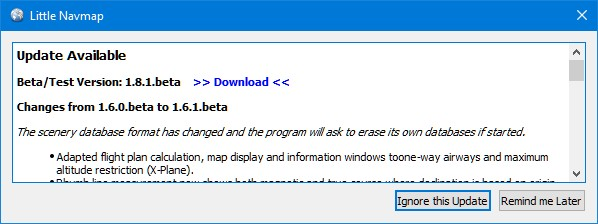
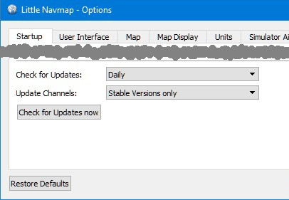

##  Checking for Updates {#checking-for-updates}

_Little Navmap_ will automatically check its [home page](https://albar965.github.io/) for available updates on startup. Frequency and update channels are configurable. See below for configuration options.

You can always check manually for updates by selecting `Main Menu` -&gt; `Help` -&gt; `Check for Updates`.

Note that the installation still has to be done manually.

### Notification

The dialog showing available updates contains a change log, various other messages and one or more download links.

#### Ignore this Update
Pressing this button will put the shown version on a black list. You will not see any reminders for this version again but for newer versions. 

This button is not visible when checking manually.

Note that manually checking for updates ignore the black listed updates.

#### Remind me Later

Dismisses the dialog. You will be notified again on next startup depending on selected frequency. You can also press `Esc` to trigger this action. 

This button is not visible when checking manually.

_**Picture above:** Update notification dialog showing an available beta version including change log and download link._

### Options

#### Check for Updates:
`Daily`, `Weekly` or `Manual`. 

Select `Main Menu` -&gt; `Help` -&gt; `Check for Updates` to search manually for new versions. 

Note that the daily or weekly check is only done when starting the program.

#### Update Channels:
`Stable Versions only`: This will show only notifications for tested and stable versions also containing a complete manual.

`Stable and Beta Versions`: Will additionally check for beta/test versions. Beta versions are program releases that already contain all planned features for a stable release but are still not tested carefully. The manual might be incomplete.

`Stable, Beta and Development Versions`: _Little Navmap_ will also show notifications for development releases. These are neither complete nor well tested. Features might change over time and the manual is not updated for new functionality.

A backup of all settings is recommended before running a development version.

#### Check for Updates now
Checks for updates immediately. This will use the current settings as shown in the dialog. It will also show notifications for updates that were ignored by pressing the `Ignore this Update` on the notification dialog.

_**Picture above:** Update notification settings in dialog _`Options`_._
