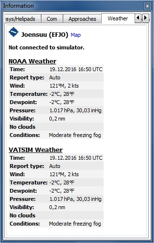

## Weather {#weather}

_Little Navmap_ can display METARs from several sources:

* FSX or P3D if connected. This also applies to network setups.
* X-Plane real time weather from the `METAR.rwx` file. Not when using network setups.
* [NOAA](http://www.weather.gov) online weather service
* [VATSIM](http://www.vatsim.net) network online weather service
* [HiFi Simulation Technologies](http://www.hifisimtech.com):
  * _Active Sky Next_ \(ASN\)
  * _AS16_
  * _Active Sky for Prepar3D v4_ \(ASP4\)

You can define in the `Options` dialog on the `Weather` tab which sources are used to display the METAR information in tooltips or the tab `Weather` in the `Information` dock window.

You have to set the base path for X-Plane in the `Load Scenery Library` dialog to enable reading of the weather file. Certain features like regions of manually created weather files are not supported.

METARs are shown in the airport tooltips and on the `Airport` overview tab. Decoded weather information for all sources is available in the tab `Weather`.

**Notes about X-Plane weather:**
*Little Navmap* can only read the X-Plane `METAR.rwx` file which contains downloaded online weather. The program cannot read custom weather situations from X-Plane. *Little Navmap* has only access to the local weather around the aircraft if you use a custom weather situation. This can result in the situation that you use custom weather and *Little Navmap* still displays information from an old downloaded weather file.

_**Picture above:** Decoded weather information from two online sources. Flight simulator is not connected._

### Flight Simulator

Weather information from a flight simulator or the X-Plane `METAR.rwx` file can be displayed in three kinds for METARs and decoded weather which depends on
the selected airport:

* `Station`: The airport has a weather station. This is the most precise weather indication.
* `Nearest`: The clicked airport has no weather station and the nearest weather was fetched. The ident of the nearest station is shown in the METAR and on the decoded weather tab. Note that the nearest weather station is not necessarily an airport.
* `Interpolated` \(Not for X-Plane\): The weather is interpolated by the flight simulator using the three nearest stations. This is usually the only option available on airports that are far away from the user aircraft. The ident of the clicked airport is used in the METAR report for this kind of weather report. 

The flight simulator weather is updated every 15 seconds to catch changes in the weather theme.

*Little Navmap* watches the X-Plane `METAR.rwx` file for changes and will apply updates immediately.

### Online - NOAA and VATSIM

Online weather from both sources is updated every 10 minutes.

### Active Sky

All _Active Sky_ programs are recognized automatically on startup for each simulator.
The `current_wx_snapshot.txt` and `activeflightplanwx.txt` files are loaded and monitored for changes. Weather will be reloaded and updated in the
information display if necessary.

You can also select the `current_wx_snapshot.txt` file manually. In that case the
METARs from this file are displayed for all installed flight simulators. The `activeflightplanwx.txt` will be loaded from the same directory. 

Manual file selection can also be useful if a new _Active Sky_ version is not supported by _Little Navmap_ yet. 

Departure and destination weather will be displayed if a flight plan is loaded into one of the
_Active Sky_ programs. A suffix `Destination` or `Departure` will indicate the usage of Active Sky flight plan weather
on the tab `Weather`. This gives _Active Sky_ users the most precise weather indication for departure and destination.

Note that the indication of `Departure` or `Destination` depends entirely on the flight plan loaded into _Active Sky_ and not the flight plan in _Little Navmap_.

