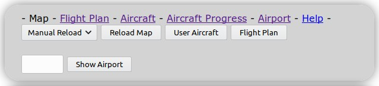
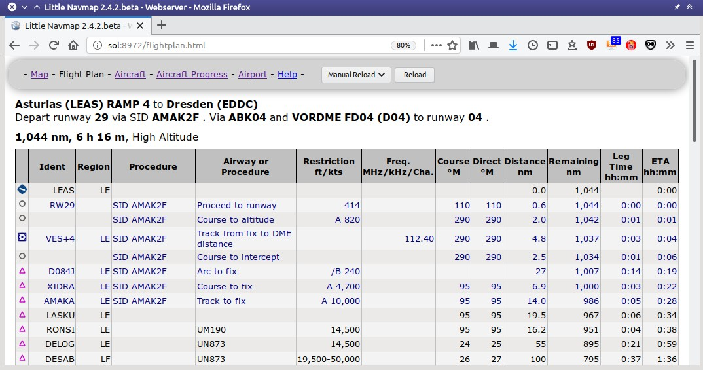

## Web Server {#webserver}

_Little Navmap_ includes an internal web server showing the map, aircraft progress and airport information with optional automatic refresh in a web browser. The page can be accessed from any computer, tablet or smartphone in the local network.

Note that the functionality is limited. You cannot change map display settings or calculate a flight plan, for example.

The web server is not running per default. You can start it in the `Tools` menu ([Run Webserver](MENUS.md#run-webserver) and then open its page by selecting [Tools - Open Webserver Page in Browser](MENUS.md#open-webserver).

Port and other settings can be changed in [Options - Web Server](OPTIONS.md#web-server).

You need to adjust you router settings to access it from the internet outside your local network. Check out your router manual how to do this. In general you have to change the firewall settings to forward the port 8965 from the router to the computer running _Little Navmap_. **Do not open the firewall completely.**

### Web Page

#### Page Links on Top of each Page

The top links `Map`, `Flight Plan`, `Aircraft`, `Aircraft Progress` and `Airport` switch the display to the respective pages. `Help` opens this page.

_**Picture above:** Top navigation bar as shown in web browser._

#### Map Page

Shows the map as currently configured, i.e. airports, navaids, theme and more features are shown as in the running application.

##### Top bar:

* `Manual Reload` or `1 Second` to `120 Seconds`: Triggers a reload of the map image for the given time. Note that this might drain the battery on smartphones or tablets.
* `Reload Map`: Reload the map manually.
* `User Aircraft`: Centers the user aircraft on the map.
* `Flight Plan`: Centers the flight plan on the map.
* `Show Airport`: Jumps the airport which ICAO ident is given in the input field to the left of this button. Press the `Return` key or this button to jump to the airport.

##### Map Navigation

The map is divided into a 3x3 field grid. Each field has an icon in the corner denoting its function:

*  : Zoom in and out
*    : Move map
* : Reload map

_**Picture above:** Web map display in browser with navigation icons._

#### Flight Plan Page

Shows the flight plan with columns visible and column order as in the application.
See [Flight Plan Table](FLIGHTPLAN.md#flight-plan-table).

Buttons `Manual Reload` or `1 Second` to `120 Seconds` and `Reload Map`: Same as on map page above. Use reload to see updates for the active flight plan leg.

_**Picture above:** Flight plan table in browser._

#### Aircraft

Shows aircraft information as [Tab Aircraft](INFO.md#aircraft).

Buttons `Manual Reload` or `1 Second` to `120 Seconds` and `Reload Map`: Same as on map page above.

#### Aircraft Progress Page

Shows aircraft progress information as [Tab Progress](INFO.md#progress).

Buttons `Manual Reload` or `1 Second` to `120 Seconds` and `Reload Map`: Same as on map page above.

#### Airport Information Page

Displays the same information as the [Tabs Airport, Runways, Com, Procedures, Nearest and Weather](INFO.md#airport) on one page.

Buttons and input fields:

* `ICAO`: Four or three letter airport ICAO ident. Press `Return` key or button `Submit` to show airport information.
* `Submit`: Loads airport information for given ICAO ident.
* `Reload`: Reload page manually to catch weather changes, for example.

The links `Runways`, `Com Frequencies`, `Procedures` and `Weather` jump to the respective sections below. Click the link `▲ Top` to go back.

### Web Developers

_Little Navmap_ can deliver map images, flight plan table and more my HTTP requests.

See directory `.../Little Navmap/web/test.html` or `http://localhost:8965/test.html` when running the webserver for examples.
