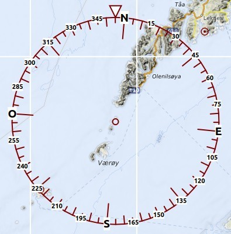

## Rosa de los Vientos {#compass-rose}

La rosa de los vientos indica el norte geográfico, el norte magnético, el rumbo y la trayectoria de la aeronave.

Si _Little Navmap_ está conectado al simulador se mostrará el rumbo de la aeronave, la trayectoria, los anillos de distancia y los marcadores. El compás estará centrado en la aeronave del usuario si está conectado.

Si no está conectado al simulador el compás se mantiene centrado en la vista actual.  La declinación magnética corresponde al punto central.

El tamaño de la rosa se adapta al tamaño de la vista del mapa, entre 4 mn como mínimo y 1.000 mn como máximo

El espesor de las líneas puede cambiarse en el dialogo `Opciones` de la pestaña `Mostrar Mapa`.

### Indicadores

 Norte geográfico.

 Norte magnético

 Círculos de distancia y marcas desde la aeronave usuaria si está conectada.

 Las lineas sólidas muestran la trayectoria de la aeronave en grados magnéticos si está conectada.

 Las líneas punteadas muestran el rumbo en grados magnéticos, si la aeronave está conectada.

### Ejemplos
| | |
| --- | --- |
|  |  |
| _**Imagen superior:** Rosa de los vientos sin simulador conectado._ | _**Imagen superior:** Rosa de los vientos centrada en la aeronave._ |
