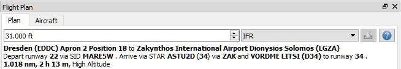
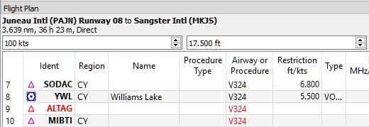

##  Ventana del Plan de Vuelo  {#flight-plan-dock-window}

### Parte Superior {#upper-part}

La parte superior muestra una etiqueta que contiene el aeropuerto de salida, la posición \(estacionamiento, pista o helipuerto \), el destino, la distancia del plan de vuelo, el tiempo de travesía, los procedimientos \(aproximaciones SID/STAR y transiciones\usados ) y también el tipo de plan de vuelo.

El tiempo de vuelo se muestra solo si se carga un perfil válido de la performance del avión.

El nombre AIRINC del procedimiento de aproximación que es necesario en algunos FMC se muestra entre paréntesis.

_**Imagen Superior:** Encabezamiento del plan de vuelo. _`VORDME LITSY`_ tiene _`D34`_ como nombre ARINC._

Además, hay tres campos de entrada en la parte superior de esta ventana:

* **Altitud de Crucero \(ft\):** Este valor se guarda en el archivo PLN y también se usa para calcular el plan de vuelo sobre aerovías, basándose en la altitud dada. Este campo se ajusta automáticamente a la altitud mínima de las aerovías Vitor y Jet, y a las restricciones de altitud si se encuentran. Ver [Cálculo basado en una altitud dada](MENUS.md#calculate-based-on-given-altitude).
* **Tipo de Plan de Vuelo \(IFR or VFR\):** Se guarda con el plan de vuelo.

### Tabla del Plan de Vuelo {#flight-plan-table}

Esta vista permite las mismas operaciones que la de búsqueda, excepto la ordenación. Ver [aquí](SEARCH.md#table-view) para más información.

Todos los elementos seleccionados en la vista del plan de vuelo serán resaltados en el mapa mediante un círculo negro/verde. Vea [Resaltes](MAPDISPLAY.md#highlights) para más información. Use `Shift+Clic` o `Ctrl+Clic` para seleccionar dos o más elementos  \(multi-selección\).

El tramo activo del plan de vuelo está resaltado en magenta cuando _Little Navmap_ está conectado a un simulador.

Los tramos de aproximación tienen un color azul oscuro, y los de aproximación perdida rojo oscuro.

Si un fijo de un plan de vuelo no se encuentra en la base de datos, se mostrará en rojo. Esto puede suceder si los ciclos AIRAC usados no coinciden. Lo mismo es válido para las aerovías. La posición en el mapa seguirá siendo correcta.

Las aerovías también se muestran en rojo si la altitud de crucero seleccionada viola las restricciones de altitud mínima o máxima de la aerovía.

_**Imagen Superior:** El fijo _`ALTAG`_  y partes de la aerovía _`V324`_ no se encuentran en la base de datos._

#### Columnas de la Tabla {#flight-plan-table-columns}

* `Ident`: Identificador ICAO de la ayuda o el aeropuerto. 

El identificador puede tener un sufijo tal como se muestra a continuación.
  
* `+` o `-` y un valor de distancia: Muestra waypoints en procedimientos relativos al fijo.
* `(IAF)`: Fijo inicial del procedimiento o de la transición.
* `(FAF)`: Fijo final de una aproximación. Dependiendo del procedimiento, tanto el FAF como el FACF se muestran con una cruz de Malta en el mapa y en el perfil de elevación.  
* `(FACF)`: Fijo final del curso de aproximación. 
* `(MAP)`: Punto de aproximación frustrada.
* `Región`: Código regional de dos letras de una ayuda.
* `Nombre`: Nombre del aeropuerto o radioayuda.
* `Procedimiento`: Ya sea una `SID`, `Transición SID`, `STAR`, `Transición STAR`, `Transición`, `Aproximación` o `Frustrada` más el nombre del procedimiento.
* `Aerovía o Procedimiento`: Contiene el nombre de la aerovía para tramos en ruta, o instrucciones de procedimiento.
* `Restricción`: Cada altitud mínima para un segmento en ruta de una aerovía, restricciones de altitud o velocidad de un procedimiento. Un `/` separa restricciones de altitud y velocidad. Existen las siguientes restricciones de altitud en los procedimientos:
  * **Sólo número:** Volar a altitud o velocidad. Ejemplo: `5.400` ó `210`.
  * **Prefijo** `A`: Volar a, o por encima de, altitud o velocidad. Ejemplo: `A 1.800`.
  * **Prefijo** `B`: Volar a, o por debajo de , altitud o velocidad. Ejemplo: `B 10.000` ó `B 220`.
  * **Rango:** Volar a, o por encima de, la primera altitud y a, o por debajo de, la segunda. Ejemplo: `A 8.000, B 10.000`.
  * **Límite de altitud y velocidad:** Valores separados por `/`. Ejemplo: `A 8.000, B 10.000/B220`.
  * **Sólo límite de velocidad:** Un `/` previo indica restricción de velocidad, no de altitud. Ejemplo: `/B250`.
* `Tipo`:  Tipo de radioayuda. Muestra `ILS` o `LOC` para aproximaciones ILS o localizador en el último tramo a pista.
* `Freq.`: Frecuencia o canal de la radioayuda. También muestra la frecuencia del ILS o localizador de las aproximaciones correspondientes en el último tramo a pista.
* `Rango`: Rango de la Radioayuda si está disponible.
* `Curso °M:`** Rumbo inicial de una ruta de gran círculo que conecta los dos puntos del tramo. Use este curso inicial si viaja largas distancias sin ayudas a la navegación. Recuerde que tiene que ir cambiando el curso constantemente cuando viaje a lo largo de una ruta de gran círculo.
* `Directo °M:`** Recorrido constante de la línea de rumbo que conecta dos puntos del tramo. Dependiendo del trazado y la distancia puede diferir de la linea de gran círculo. Use este curso si viaja por aerovías, o hacia estaciones VOR o NDB. Opuesto al curso mostrado por la unidad GPS del simulador de vuelo, tendrá la radial precisa cuando se aproxime a un VOR o NDB del plan de vuelo.
* `Distancia`: Distancia del tramo del plan de vuelo.
* `Restante`: Distancia restante al aeropuerto de destino, o al punto final del procedimiento \(normalmente la pista\).
* `Tiempo del tramo`: Tiempo de vuelo para este tramo. Cálculo basado en el perfil de performance del avión \(Ver [Prestaciones del Avión](AIRCRAFTPERF.md)\). Este es un valor fijo y no se actualiza durante el vuelo. No aparece si falló el cálculo de la performance.
* `ETA`: Tiempo estimado de llegada. Es un valor estático y no se actualiza durante el vuelo. Cálculo basado según el perfil de performance del avión. No aparece si falló el cálculo de la performance.
* `Fuel Rem.`: Combustible restante en el waypoint, por volumen y por peso. Es un valor estático y no se actualiza durante el vuelo. Cálculo basado según el perfil de performance del avión. No aparece si en el perfil de performance del avión no se configuró el consumo de combustible.
* `Observaciones`: Instrucciones de giro, sobrevuelos o ayudas relacionadas para los tramos de procedimiento.

_**Imagen Superior:** Ventana del _`Plan de Vuelo`_. El plan de vuelo tiene una SID para la salida, y una STAR una transición y una aproximación para la llegada._

### Clics del Ratón {#mouse-clicks}

Un doble clic en una entrada de la tabla muestra un diagrama del aeropuerto, o un zoom sobre una ayuda. Adicionalmente los detalles aparecen en la ventana `Información`. Un único clic selecciona un objeto y lo resalta en el mapa con un círculo negro/verde.

### Botón Superior {#top-button}

####  Borrar Selección {#clear-selection}

Deselecciona todas las entradas en la tabla y borra cualquier círculo resaltado en el mapa.

### Menú Contextual de la Vista Plan de Vuelo {#flight-plan-table-view-context-menu}

####  Mostrar Información {#show-information-1}

Igual que el [Menu Contextual del Mapa](MAPDISPLAY.md#map-context-menu).

####  Mostrar en el Mapa {#show-on-map}

Muestra el diagrama del aeropuerto, o hace zoom sobre una ayuda en el mapa. La distancia del zoom puede cambiarse en el diálogo `Opciones` de la pestaña `Mapa`.

####  Activar Tramo del Plan de Vuelo {#activate}

Convierte el tramo seleccionado en el tramo del plan de vuelo activo \(magenta\). El tramo activo podría cambiar si _Little Navmap_ está conectado al simulador y el avión del usuario se está moviendo.

#### Seguir Selección {#follow-selection}

La vista del mapa se centrará, sin ampliación, en el aeropuerto o radioayuda seleccionada, cuando esta función esté activa. 

####  Mover Tramo Seleccionado Arriba / Abajo {#move-selected-legs-up-down}

Mueve el tramo seleccionado del plan de vuelo arriba o abajo en la lista. También funciona si se seleccionan múltiples tramos.

Los nombres de aerovías se borran al mover o borrar fijos del plan de vuelo, si los nuevos tramos usan conexiones directas y no siguen ninguna aerovía.

Los procedimientos o tramos de procedimiento no se pueden mover, y los fijos tampoco se pueden mover dentro de un procedimiento.

####  Borrar Tramos o Procedimientos Seleccionados {#delete-selected-legs}

Borra todos los tramos seleccionados del plan de vuelo. Use `Deshacer` si borra tramos accidentalmente.

Si el tramo seleccionado es parte de un procedimiento, se borrará el procedimiento completo. Borrar un procedimiento borra también su transición.

####  Editar Posición {#edit-name-of-user-waypoint}

Permite cambiar el nombre o coordenadas de un punto definido por el usuario. La longitud del nombre está limitado a 10 caracteres cuando se guarda. Consultar [Editar Posición en el Plan de Vuelo](EDITFPPOSITION.md).

####  Insertar Plan de Vuelo Antes {#insert-flight-plan}

Inserta un plan de vuelo antes del tramo seleccionado en el plan de vuelo activo.

Utilizar `Insertar Plan de Vuelo antes` o `Adjuntar Plan de Vuelo`, permite cargar o combinar planes de vuelo completos o fragmentos de los mismos en un nuevo plan de vuelo. 

Los procedimientos se insertan desde el plan de vuelo cargado y se eliminan del actual dependiendo de la posición de inserción.

Si inserta un plan de vuelo después de la salida, todos los procedimientos del plan cargado se ignoran y los procedimientos actuales se mantienen.

La inserción antes de la salida toma los procedimientos de salida del plan de vuelo cargado y descarta los procedimientos de salida actuales.

Los tramos insertados se seleccionan después de cargar el plan de vuelo.

####  Adjuntar Plan de Vuelo {#append-flight-plan}

Agrega la salida, el destino y todos los waypoints de otro plan de vuelo al final del plan actual.

Todos los procedimientos de llegada seleccionados actualmente se eliminarán al anexar un plan de vuelo. Los procedimientos de llegada y aproximación del plan de vuelo adjunto se agregan al actual, si corresponde.

Los tramos adjuntos se seleccionan después de cargar el plan de vuelo.

#### Calcular para Tramos Seleccionados {#calculate-for-selected-legs}

Este es un submenú que tiene entradas para diversos métodos de cálculo:

[Calcular Radionav](MENUS.md#calculate-radionav), [Calcular Alta Altitud](MENUS.md#calculate-high-altitude), [Calculate Baja Altitud](MENUS.md#calculate-low-altitude) y [Calcular Basado en Altitud dada](MENUS.md#calculate-based-on-given-altitude).

Calcula un fragmento del plan de vuelo entre el primer y último fijo seleccionado. Los tramos intermedios se borran y reemplazan por el fragmento calculado.

Este menú solo estará activo cuando se seleccione más de un tramo del plan de vuelo, y ni el primero ni el último sean un procedimiento. Puede seleccionar el primer y el último tramo \(`Ctrl+Clic`\) , o todo el rango de tramos \(`Shift+Clic` y arrastrar\) antes de iniciar el cálculo.

Esta función puede ser útil si atraviesa tramos oceánicos carentes de aerovías.

1. Defina salida y destino.
2. Busque el último fijo sobre una aerovía antes de entrar en el océano. Escoja la aerovía más cercana a la linea del plan de vuelo. Añada el fijo al plan de vuelo.
4. Seleccione punto de partida y fijo, y calcule el fragmento del plan de vuelo.
3. Repita el proceso para el primer fijo sobre una aerovía cercana a la costa del continente de destino.
5. Seleccione este fijo y el destino, y calcule el fragmento del plan de vuelo.

Aunque no es enteramente realista, es un método alternativo razonable hasta que _Little Navmap_ soporte pistas NAT o PACOT.

####  Mostrar Anillos de Distancia {#show-range-rings-1}

Lo mismo que en el [Menú Contextual del Mapa](MAPDISPLAY.md#map-context-menu).

####  Mostrar Rango de Radioayuda {#show-navaid-range-1}

Muestra los anillos de distancia para todas las radioayudas seleccionadas en el plan de vuelo. Simplemente seleccione todos los tramos del plan de vuelo, y use esta función para mostrar los círculos de rango de cada radioayuda del plan de vuelo.

Por otra parte , igual que en el [Menu Contextual del Mapa](MAPDISPLAY.md#map-context-menu).

####  Visualizar Patrón de Tráfico del Aeropuerto{#show-traffic-pattern}

Este menú se activa al hacer clic en el aeropuerto. Muestra un diálogo que permite mostrar y configurar el patrón de tráfico del aeropuerto en el mapa.

Consultar [Patrón de Tráfico](TRAFFICPATTERN.md).

####  Copiar{#copy-0}

Copia las entradas seleccionadas en formato CSV al portapapeles. El CSV incluirá un encabezamiento y tendrá en cuenta los cambios en la tabla, como el orden de las columnas.

#### Seleccionar Todo {#select-all-0}

Selecciona todos los tramos del plan de vuelo.

#####  Borrar Selección {#clear-selection}

Deselecciona todos los segmentos seleccionados, y borra cualquier círculo resaltado en el mapa.

####  Reiniciar Vista {#reset-view-0}

Devuelve la anchura y el orden de las columnas a su valor por defecto.

####  Ajustar Centro para Búsqueda de Distancia {#set-center-for-distance-search-1}

Igual que en el [Menú Contextual del Mapa](MAPDISPLAY.md#map-context-menu).

