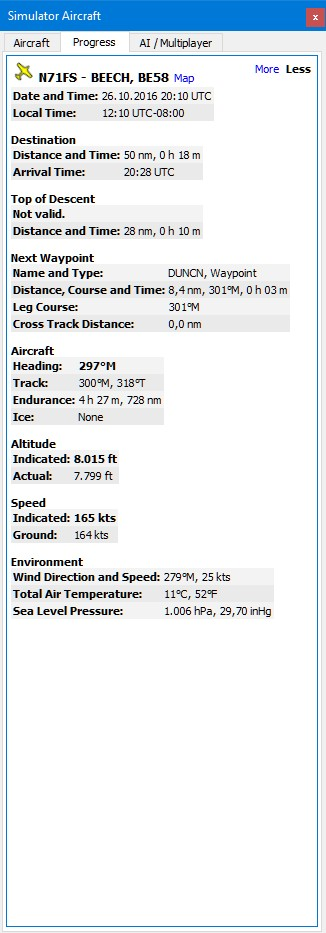

##  Panel de Información {#information-dock-window}

### General {#general}

Este panel contiene información de texto sobre aeropuertos en varias pestañas, así como información para una o más ayudas a la navegación, vías aéreas en otra pestaña, más una pestaña adicional que muestra la información del espacio aéreo.

Toda la información se puede copiar en el portapapeles en formato texto. Utilizar el menú contextual de los campos de texto o utilizar `Ctrl+A` para seleccionarlo todo y `Ctrl+C` para copiar el contenido al portapapeles.

La información de un aeropuerto, radioayuda o punto de usuario se muestra cuando se selecciona uno de los items en el mapa con la opción del menú contextual `Mostrar información para ...` , en el panel del plan de vuelo o en la tabla de resultados de la búsqueda.

Todas las pestañas se rellenan para un aeropuerto, todas las radioayudas, todos los puntos de usuario o todos los espacios aéreos que se encuentran cerca del cursor al hacer clic con el botón izquierdo en el mapa.

_Little Navmap_ muestra pestañas según las prioridades y objetos seleccionados e intenta minimizar los cambios de pestaña. 

Un enlace azul `Mapa` en la información permite saltar y/o resaltar el objeto mostrado en el mapa.

El rumbo y la distancia \(línea de rumbo \) al avión del usuario se muestran para aeropuertos y radioayudas si está conectado al simulador y la distancia es inferior a 500 NM.

### Información de Escenario {#scenery}

La información sobre aeropuertos y radioayudas incluye uno o más enlaces en la parte inferior del objeto en la sección `Escenario`. Estos puntos de enlaces coinciden con los archivos BGL (FSX, P3D) o DAT (X-Plane) que contienen información de radioayudas y aeropuertos. Hacer clic en los enlaces para abrir la carpeta en su explorador de archivos \(por ejemplo el Explorador de Windows\). Si es posible el archivo correspondiente se seleccionará automáticamente.

Pueden aparecer Enlaces Múltiples de aeropuertos ya que estos pueden modificarse en múltiples archivos BGL o DAT desde diferentes actualizaciones de add-ons de escenarios o datos de navegación.

### Pestaña Aeropuerto, Pistas, Comunicaciones, Procedimientos y meteorología {#airport}

Estas cinco pestañas muestran información sobre un aeropuerto seleccionado.

El amanecer y el atardecer se calculan en base a datos reales si no está el simulador conectado. Por el contrario se utilizarán los datos del simulador. Esto se indica mediante el texto `(crepúsculo , dato real)` o `(Crepúsculo, dato del simulador)`.

La pestaña `Meteorología` también incluye información decodificada del aeropuerto seleccionado. El icono de las reglas de vuelo \([Leyenda - Meteorología de Aeropuerto](LEGEND.md#airport-weather)\) tiene el sufijo ` - Mapa` si la fuente de meteorología mostrada es la fuente de los iconos de meteorología en el mapa.

En la pestaña `Pistas` están disponibles los enlaces para los helipuertos.

_**Imagen Superior:** Vista de información del Aeropuerto. Las pestañas adicionales muestran información de pistas aerovías, frecuencias COM, aproximaciones y meteorología. Se usan los símbolos de la fuente de datos NOAA. El amanecer y atardecer se basa en los datos del simulador. El rumbo y distancia del avión del usuario se muestran arriba._

### Pestaña Radioayudas {#navaids}

Se pueden cargar una o más ayudas a la navegación, puntos de usuario o vías aéreas en esta pestaña haciendo clic con el botón izquierdo.

Una vía aérea siempre se muestra con todos sus puntos de referencia. Haga clic en cualquier enlace de punto de ruta azul para centrar el mapa alrededor del punto de ruta.

| | |
| -- | -- |
|  |  |

_**Imagen Superior:** Información de radioayudas. Dos radioayudas estaban cerca del cursor cuando se hizo clic. Visualización de varias vías aéreas con restricciones de altitud y lista de puntos de paso seleccionables._ |

### Pestaña de Espacios Aéreos {#airspaces}

Los espacios aéreos se resaltan en el mapa con su límite y una etiqueta de texto al hacer clic en el enlace `Mapa` en la ventana de información.

Haga clic en el enlace "Eliminar elementos destacados del mapa" en la ventana de información para eliminar los aspectos destacados del mapa.

_**Imagen Superior:** Dos espacios aéreos que se muestran en la información después de hacer clic en el mapa. Dos espacios aéreos se resaltan en el mapa después de hacer clic en el enlace _`Mapa`_ en el texto de información._

##  Panel de Aeronave del Simulador {#simulator-aircraft-dock-window}

Este panel muestra información en varias pestañas sobre el avión del usuario, de la AI o de los aviones de los jugadores.
_Little Navmap_ tiene que estar conectado al simulador para activar esta característica.
Ver [Conexión al Simulador de Vuelo](CONNECT.md#connecting-to-a-flight-simulator) para obtener más información sobre este asunto.

### Pestaña Aeronave {#aircraft}

Ofrece una descripción general del avión del usuario y muestra información sobre el tipo, el peso y el combustible.

_**Imagen Superior:** Información de la aeronave cuando está conectado al simulador de vuelo._

### Pestaña de Progreso {#progress}

Muestra información similar a una computadora de gestión del vuelo sobre el avión del usuario. Proporciona el progreso del plan de vuelo,
parámetros de altitud, velocidad, meteo y parámetros del entorno.

La información de texto en la pestaña tiene un enlace "Más menos" en la parte superior izquierda. Puede usar esto para alternar entre información más detallada y menos información.

**Tenga en cuenta que las estimaciones de combustible y tiempo en esta pestaña se basan en el consumo real de combustible y la velocidad. Estos no se ven afectados por el perfíl de prestaciones de la aeronave \ (** [Prestaciones de la Aeronave] (AIRCRAFTPERF.md)**\).**

| | |
| -- | -- |
|  |  |
| _**Imagen Superior:** Progreso e información de la meteo y situación del vuelo actual. Algunos campos o tablas como_`Próximo fijo`_ solo están disponibles cuando se ha cargado un plan de vuelo. | _**Imagen Superior:** Información del progreso plegado para mostrar los valores más importantes utilizados_, mediante el enlace `Más menos` |

_**Imagen superior:** Progreso e información de la meteo y situación del vuelo actual. Algunos campos o tablas como_`Próximo fijo`_ solo están disponibles cuando se ha cargado un plan de vuelo._

### Pestaña AI / Multijugador

La información sobre las aeronaves de la AI o multijugador desde el simulador \(no sobre redes online\) o naves, se muestran en esta pestaña si el vehículo se ha seleccionado en el mapa.

Esto incluye además la salida de la aeronave y el aeropuerto de destino que pueden mostrarse en el mapa seleccionando los enlaces azules \(solo para FSX o P3D y si el plan de vuelo se ha rellenado\).

Tenga en cuenta que la información de la aeronave AI está limitada en X-Plane. Solo puede mostrarse la posición, altitud y rumbo.

_**Imagen superior:** Información de la aeronave de la AI._

##  Panel Leyenda {#legend-dock-window}

Contiene dos pestañas `Navmap` donde se explican los símbolos de aeropuertos y radioayudas y la pestaña `Mapa` la cual muestra la leyenda general para la base del mapa como _OpenStreetMap_ por ejemplo.

El contenido de la leyenda `Navmap` está también disponible en el manual online: [Leyenda del Mapa de Navegación](LEGEND.md).

Tenga en cuenta que la leyenda general del mapa no está disponible para todos los tipos de mapa.

