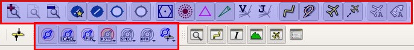

## Menús y barras de herramientas {#menus-and-toolbars}

Este capítulo describe todas las opciones de menú de _Little Navmap_. 
Encontrará la mayor parte de esta funcionalidad en las barras de herramientas, las cuales no están descritas por separado. Las combinaciones de teclas se pueden ver en los elementos del menú y no se enumeran en este manual.

_**Imagen superior:** Menú y barras de herramientas colocadas en sus posiciones predeterminadas._

### Menú Archivo {#file-menu}

####  Nuevo Plan de Vuelo {#new-flight-plan}

Borra el plan de vuelo actual.

Tiene que utilizar el diálogo [Menú Contextual de la tabla de resultados de búsqueda](SEARCH.md#search-result-table-view-context-menu), [Menú contextual del Mapa](MAPDISPLAY.md#map-context-menu) o el [Descripción de la Ruta del Plan de Vuelo](ROUTEDESCR.md) para crear un plan de vuelo.

####  Abrir el Plan de Vuelo {#open-flight-plan}

Abre el archivo de plan de vuelo PLN de FSX, PLN de FS9, PNL de FSC, FMS de X-Plane o FLP. El tipo de archivo se determina por el contenido, no por su extensión. Consultar [Formatos del Plan de Vuelo](FLIGHTPLANFMT.md) para  más información.

El plan de vuelo abierto se volverá a cargar de nuevo al inicio \(la recarga y el centrado se pueden desactivar en el diálogo `Opciones` dentro de las pestañas `Inicio` e `Interfaz de usuario`\).

La información de procedimientos y velocidad sobre el terreno se añadirá al plan de vuelo si se guarda el archivo como PLN en _Little Navmap_. La información adicional se ignorará en FSX o P3D , pero  _Little Navmap_ permitirá cargar toda la información. También puede **arrastrar y soltar archivos desde un gestor de archivos** como Windows Explorer o el Finder de macOS dentro de la ventana principal de _Little Navmap_ para cargarlos. 
Se aceptan planes de vuelo simples y todos los formatos permitidos para cargar (`FMS`, `FLP`, `PLN`\), así como archivos de prestaciones de aeronave \(`lnmperf`\). 

####  Adjuntar el Plan de Vuelo {#append-flight-plan}

Agrega salidas, llegadas y todos los waypoints del plan de vuelo actual.

El uso de `Adjuntar Plan de Vuelo` permite cargar o fusionar planes de vuelo completos, o fragmentos de un plan de vuelo, en otro nuevo plan de vuelo. Todos los waypoints se añaden al final del plan de vuelo actual. Entonces puede usar las opciones del menú contextual `Borrar tramos seleccionados` y `Mover los tramos seleccionaos arriba/abajo` para organizar los waypoints y aeropuertos como sea necesario. Consultar [Menú de Contexto de la Tabla de Planes de Vuelo](FLIGHTPLAN.md#flight-plan-table-view-context-menu).

Todos los procedimientos de salida se eliminan cuando se adjunta un plan de vuelo. Los tramos añadidos se seleccionan después de cargar el plan de vuelo. 

#### Plan de Vuelo Reciente {#recent-flight-plan}

Muestra los planes de vuelo cargados recientemente para un acceso rápido. Puede borrar la lista seleccionando `Borrar Menú`  

####  Grabar el Plan de Vuelo {#save-flight-plan}

####  Grabar el Plan de Vuelo como PLN {#save-flight-plan-as}

Graba el plan de vuelo como archivo para FSX/P3D \(formato XML\). 
Este formato de anotación permite guardar todos los atributos del plan de vuelo de *Little Navmap*.

`Grabar Plan de Vuelo en Formato PLN` cambia el tipo y nombre de archivo actual en *Little Navmap* lo que significa que todos los guardados siguientes irán con el nuevo formato de archivo PLN.

Es recomendable grabar todos los planes de vuelo en este formato para mantener toda la información del plan. Incluso cuando se utiliza el formato limitado FMS para X-Plane. Consultar [Formatos de Planes de Vuelo](FLIGHTPLANFMT.md) para obtener más información.

_Little Navmap_ permitirá la creación de planes de vuelo que puedan ser útiles, como un fragmento de plan de vuelo, pero que el simulador no puede usar. Esto ocurre si un plan de vuelo no tiene aeropuerto de salida o de destino. Se mostrará un cuadro de diálogo de advertencia al guardar un plan de vuelo incompleto.

Los procedimientos se grabarán como anotaciones en el archivo del plan de vuelo si contiene algunos. Esto no causa ningún problema en los simuladores ni en la mayoría de los demás programas. Utilice [Exportar en formato plano como PLN](MENUS.md#export-clean-flight-plan) si tiene problemas en la lectura de archivos PLN grabados con _Little Navmap_.

Tenga en cuenta que los waypoints de un procedimiento no se guardan con el plan de vuelo. Esto no es compatible con FSX o P3D. Use el GPS, FMC u otras formas de seleccionar un procedimiento en su aeronave.

La velocidad ajustada sobre el terreno también se guarda con el plan de vuelo.

**Tenga en cuenta que P3D v4.2 sobrescribe el plan de vuelo al cargar, lo que borra todas las anotaciones. Guarde una copia del plan en otra ubicación si desea mantener toda la información sobre procedimientos o velocidad.**

####  Grabar el Plan de Vuelo como X-Plane FMS 11 {#save-flight-plan-as-fms11}

Graba el plan de vuelo utilizando el nuevo formato de X-Plane FMS 11. **Este formato puede ser usado solo en X-Plane 11.10 y superior. No intente cargarlo en el FMS o GPS de X-Plane 11.05. Esto puede colgar el simulador.**

Se mostrará un cuadro de diálogo de advertencia con la advertencia anterior al guardar.

Consultar [Formatos del Plan de Vuelo](FLIGHTPLANFMT.md) para obtener más información sobre las limitaciones.

Esta opción cambia el tipo y nombre del archivo actual, lo que significa que todos los guardados futuros irán al nuevo archivo FMS y el archivo se volverá a cargar en el próximo inicio.

Almacene los archivos FMS en el directorio `Output/FMS plans` dentro del directorio de X-Plane, si desea utilizar el plan de vuelo en el GPS X-Plane, el G1000 o el FMS.

####  Grabar el Plan de Vuelo como FLP {#save-flight-plan-as-flp}

Exporta el plan de vuelo actual como archivo FLP utilizable por X-Plane FMS, Aerosoft Airbus y otros añadidos. Este formato está limitado, por lo que se mostrará un cuadro de diálogo si se detectan características no compatibles en el plan de vuelo actual.

Consultar [Formatos de Plan de Vuelo](FLIGHTPLANFMT.md) para más información sobre las limitaciones.

Esta opción cambia el tipo y nombre del archivo actual, lo que significa que todos los guardados futuros irán al nuevo archivo FLP y el archivo se volverá a cargar en el próximo inicio.

Almacene los archivos FMS en el directorio `Output/FMS plans` dentro del directorio de X-Plane si desea utilizar el plan de vuelo en el FMS de X-Plane.

####  Exportar como PLN Limpio {#export-clean-flight-plan}

Guarda un plan de vuelo sin ningún procedimiento o anotación de velocidad si los programas tienen problemas para leer los archivos PLN guardados por _Little Navmap_. Esto rara vez es necesario.

Como cualquier otra función de exportación, esto no cambia el nombre y tipo de archivo actual. Las copias guardadas seguirán usando el mismo nombre y formato de archivo que antes.

Consultar además [Formatos de Plan de Vuelo](FLIGHTPLANFMT.md).

####  Exportar el Plan de Vuelo como formato X-Plane FMS 3 {#export-flight-plan-as-fms3}

Guarda el plan de vuelo utilizando el anterior formato de X-Plane FMS 3, que es limitado pero puede ser cargado por X-Plane 10 y X-Plane 11.05. Se muestra un cuadro de diálogo de advertencia si se detectan características no compatibles en el plan de vuelo actual.

Consultar [Flight Plan Formats](FLIGHTPLANFMT.md) para obtener más información sobre las limitaciones.

Esta función de exportación no cambia el nombre y tipo de archivo actual. Las copias guardadas seguirán usando el mismo nombre y formato de archivo que antes.

Almacene los archivos FMS en el directorio `Output/FMS plans` dentro del directorio de X-Plane si desea utilizar el plan de vuelo en el GPS o FMS de X-Plane.

#### Exportar el Plan de Vuelo a otros Formatos (Sub-Menú) {#export-submenu}

Consultar [Formatos de Plan de Vuelo](FLIGHTPLANFMT.md) para información más detallada sobre los formatos de exportación disponibles.

Las funciones de exportación no modifican el nombre o tipo del actual archivo. Los guardados posteriores usarán el mismo nombre de archivo y formato anterior.

##### Exportar el Plan de Vuelo como Garmin GTN GFP {#save-flight-plan-as-gfp}

Exporta el plan de vuelo en el formato GFP usado por _Flight1 GTN 650/750_.

Los procedimientos no se incluyen en el archivo exportado.

Consultar [Formatos de Plan de Vuelo](FLIGHTPLANFMT.md#flight-plan-formats-gfp) para obtener más información sobre este formato de exportación y cómo trabajar alrededor de waypoints bloqueados.

##### Exportar el Plan de Vuelo como GFP para Reality XP GTN {#save-flight-plan-as-rxpgtn}

Guarda el plan de vuelo como archivo GFP utilizable por _Reality XP GTN 750/650 Touch_. Este formato permite guardar procedimientos y aerovías.

Consultar también [Notas sobre los Formatos de Garmin GFP y FPL](FLIGHTPLANFMT.md#garmin-notes) para información sobre rutas y otras observaciones.

##### Exportar el Plan de Vuelo a FPL para Reality XP GNS {#save-flight-plan-as-rxpgns}

Guarda el plan de vuelo como FPL utilizable por _Reality XP GNS 530W/430W V2_.

Los procedimientos y sus respectivos waypoints no se incluyen en el archivo exportado.

El directorio por defecto para guardar los planes de vuelo para las unidades GPS de todos los simuladores es
`C:\ProgramData\Garmin\GNS Trainer Data\GNS\FPL`. El directorio se creará automáticamente por _Little Navmap_ en la primera exportación si este no existe.

Consultar también [Notas sobre los Formatos GFP y FPL de Garmin](FLIGHTPLANFMT.md#garmin-notes).

##### Exportar el Plan de Vuelo como PMDG RTE {#export-flight-plan-as-rte}

Exporta el plan de vuelo como archivo PMDG RTE.

Los procedimientos y sus respectivos waypoints no se incluyen en el archivo exportado.

##### Exportar el Plan de Vuelo como TXT {#export-flight-plan-as-txt}

Exporta el plan de vuelo actual como archivo TXT utilizable en los aviones de JARDesign o Rotate Simulations.

Ni los procedimientos ni sus respectivos waypoints se incluyen en el archivo exportado.

##### Exportar el Plan de Vuelo com Majestic Dash FPR {#export-flight-plan-as-fpr}

Exporta del plan de vuelo actual para el software Majestic MJC8 Q400. 

Tenga en cuenta que la exportación se limita actualmente a una lista de waypoints.

El plan de vuelo debe guardarse en `FSXP3D\SimObjects\Airplanes\mjc8q400\nav\routes`.

##### Exportar el Plan de Vuelo como IXEG FPL {#export-flight-plan-as-fpl}

Exporta el plan de vuelo actual como archivo FPL utilizable por el Boeing 737 classic de IXEG.

SIDs, STARs o procedimientos de aproximación no se exportan.

El archivo se debe de guardar en `XPLANE\Aircraft\X-Aviation\IXEG 737 Classic\coroutes`. Tendría que crear este directorio manualmente si no existe.

##### Exportar el Plan de Vuelo a corte.in para el Airbus de Flight Factor {#export-flight-plan-as-fpl}

Adjunta el plan de vuelo al archivo de las rutas de compañía `corte.in` para el Airbus de Flight Factor.

El fichero se creará automáticamente si no existe. De lo contrario, el plan de vuelo se adjuntará al archivo. Debe eliminar el plan de vuelo manualmente del archivo `corte.in` con un simple editor de texto si desea deshacerse de él.
La ubicación del archivo depende del tipo de aeronave.

##### Exportar el Plan de Vuelo para iFly {#export-flight-plan-as-ifly}

Guarde el plan de vuelo como archivo FLTPLAN para iFly 737NG. El formato no permite guardar los procedimientos.

Guarde el archivo en `FSXP3D\iFly\737NG\navdata\FLTPLAN`.

##### Exportar el Plan de Vuelo para ProSim {#export-flight-plan-as-prosim}

Adjunta el plan de vuelo al archivo `companyroutes.xml` para el simulador [ProSim](https://prosim-ar.com). El formato no permite guardar los procedimientos.

Crear un archivo de backup llamado `companyroutes.xml_lnm_backup` antes de modificar el archivo.

##### Exportar el Plan de Vuelo como PLN para BBS Airbus {#export-flight-plan-as-bbs}

Guarda el plan de vuelo como archivo PLN para el Airbus de Blackbox Simulations. El formato no permite guardar los procedimientos.

Guarda el archivo en `FSXP3D\BlackBox Simulation\Airbus A330` o `FSXP3D\Blackbox Simulation\Company Routes` dependiendo del avión.

##### Exportar el Plan de Vuelo para UFMC {#export-flight-plan-as-ufmc}

Guarda el plan de vuelo como archivo [UFMC](http://ufmc.eadt.eu). El formato no permite guardar los procedimientos.

Guarda el plan de vuelo en `XPLANE\Custom Data\UFMC\FlightPlans`.

##### Exportar el Plan de Vuelo para X-FMC {#export-flight-plan-as-xfmc}

Guarda el plan de vuelo como archivo FPL utilizable por [X-FMC](https://www.x-fmc.com). El formato no permite guardar los procedimientos.

El archivo debe guardarse en la ruta `XPLANE\Resources\plugins\XFMC\FlightPlans`.

##### Exportar el Plan de Vuelo como GPX {#export-flight-plan-as-gpx}

Exporta el plan de vuelo actual en un archivo de formato de intercambio GPS que puede leer Google Earth y la mayoría de las aplicaciones SIG.

El plan de vuelo se exporta como una ruta y la aeronave sigue una trayectoria que incluye el tiempo y la altitud del simulador.

La ruta tiene la elevación de salida y destino, y la altitud de crucero establecidas para todos los waypoints. Los waypoints de todos los procedimientos están incluidos en el archivo exportado. Tenga en cuenta que los waypoints no permitirán reproducir todas las partes de un procedimiento como esperas o procedimientos de viraje.

**No olvide limpiar la trayectoria de la aeronave \([Borrar Trayectoria de Aeronave](MENUS.md#delete-aircraft-trail)\) antes del vuelo para evitar segmentos antiguos en el archivo GPX exportado, o deshabilite la recarga de la trayectoria en las opciones de diálogo de la página `Arranque`**.

##### Mostrar Plan de Vuelo en SkyVector {#export-flight-plan-as-skyvector}

Abre el navegador por defecto y muestra el plan de vuelo actual en [SkyVector](https://skyvector.com). Los procedimientos no se muestran.

Ejemplo: [ESMS NEXI2B NILEN L617 ULMUG M609 TUTBI Z101 GUBAV STM7C ENBO](https://skyvector.com/?fpl=ESMS%20NILEN%20L617%20ULMUG%20M609%20TUTBI%20Z101%20GUBAV%20ENBO). Observe que faltan las SID y STAR en SkyVector.

##### Guardar Waypoints para Aproximaciones {#export-flight-plan-approach-waypoints}
##### Guardar Waypoints para SID y STAR {#export-flight-plan-sid-star-waypoints}

Guarda waypoints de procedimientos en lugar de información de procedimiento si está marcada. Esto afecta a todos los formatos de exportación y guardado del plan de vuelo.

Utilice esto si su simulador, GPS, o FMC ,no admite la carga o visualización de procedimientos de aproximación, SID o STAR.

La información del procedimiento se reemplaza por los respectivos waypoints que permiten mostrar los procedimientos en unidades GPS o FMS limitadas.

Guardar los planes de vuelo con este método tiene varias limitaciones:

* Varios tipos de tramos de aproximación, como las esperas, los virajes y los procedimientos de viraje, no se pueden mostrar correctamente utilizando solo puntos de referencia/coordenadas.
* Las limitaciones de velocidad y altitud no se incluyen en los tramos exportados.
* La información del procedimiento se elimina del plan de vuelo guardado y no se puede volver a cargar correctamente en _Little Navmap_. Por lo tanto, verá los puntos de referencia de un SID o STAR, pero no la información detallada del procedimiento. Debe eliminar los puntos de ruta adicionales y volver a seleccionar los procedimientos después de la carga.

Debido a estas limitaciones, se recomienda guardar una copia del plan de vuelo con información completa antes de habilitar una de estas opciones.

####  Agregar Google Earth KML {#add-google-earth-kml}

Permite agregar uno o más archivos KML o KMZ de Google Earth a la visualización del mapa. Todos los archivos KML o KMZ agregados se volverán a cargar al inicio. La recarga y el centrado se pueden desactivar en el cuadro de diálogo `Opciones` en la pestaña `Inicio` e `Interfaz de usuario`.

Debido a la variedad de archivos KML no se puede garantizar que se visualicen correctamente en el mapa todos los archivos.

####  Borrar KML de Google Earth de la Carta del Mapa {#clear-google-earth-kml-from-map}

Elimina del mapa todos los archivos KML cargados.

####  Trabajar sin conexión {#work-offline}

Interrumpe la carga de datos en el mapa a través de internet. Esto afecta a  _OpenStreetMap_, _OpenTopoMap_ y a todos los otros temas online así como a los datos de elevación.
Una indicación `Sin conexión` en rojo, se muestra en la barra de estado si se activa este modo.

Debe reiniciar la aplicación después de volver a conectarse.

###  Guardar el Mapa como Imagen {#save-map-as-image}

Guarda la vista actual del mapa como archivo de imagen. Los formatos permitidos son JPEG, PNG y BMP.

###  Imprimir Mapa {#print-map}

Permite imprimir la vista actual del mapa. Consultar [Imprimir el mapa](PRINT.md#printing-the-map) para obtener más información.

###  Imprimir Plan de Vuelo {#print-flight-plan}

Abre el diálogo de impresión que le permite seleccionar información relacionada del plan de vuelo para ser impresa. Consultar [Imprimir el mapa del plan de vuelo](PRINT.md#printing-the-flight-plan) para obtener más información.

###  Salir {#file-quit}

Abandona la aplicación. Pedirá una confirmación si se ha modificado el plan de vuelo.

### Menú del Plan de Vuelo {#flight-plan-menu}

####  Deshacer/Rehacer {#undo-redo}

Permite deshacer y rehacer todos los cambios del plan de vuelo.

####  Seleccionar Punto de Inicio para la Salida {#select-a-start-position-for-departure}

Se puede seleccionar un lugar de estacionamiento \(puerta, rampa o estación de combustible\), pista o helipuerto como posición de inicio en el aeropuerto de salida. También se puede seleccionar una posición de estacionamiento con la opción de menú contextual en el mapa [Establecer como punto de partida del plan de vuelo] (MAPDISPLAY.md#set-as-flight-plan-departure) al hacer clic derecho en una posición de estacionamiento. Si no se selecciona ninguna posición, el extremo de la pista principal más larga se selecciona automáticamente como inicio.

_**Imagen Superior** Diálogo de selección de la posición de partida para EDDN._

####  Editar Plan de Vuelo en el Mapa {#edit-flight-plan-on-map}

Alterna el modo de edición de arrastrar y soltar el plan de vuelo en el mapa. Vea [Flight Plan Editing](MAPFPEDIT.md#map-flight-plan-editing).

####  Nuevo Plan de Vuelo desde Descripción de la Ruta {#new-flight-plan-from-description}

Abre un diálogo con la descripción de ruta del plan de vuelo actual que además permite modificar el actual plan de vuelo o introducir uno nuevo.
[Plan de Vuelo desde la Descripción de Ruta](ROUTEDESCR.md) da mejor información sobre este asunto.

####  Copia la Ruta del Plan de Vuelo al Portapapeles {#flight-plan-route-clipboard}

Copia la descripción de ruta del plan de vuelo actual al portapapeles usando los ajustes del diálogo [Plan de Vuelo desde descripción de ruta](ROUTEDESCR.md#flight-plan-from-route-description) .

####  Calcular Plan de Vuelo directo {#calculate-direct}

Elimina los waypoints intermedios y conecta salida y destino usando una linea de gran círculo.

Puede calcular un plan de vuelo entre cualquier tipo de waypoint, incluso puntos definidos por el usuario \(click derecho en el mapa y seleccionar `Agregar posición al plan de vuelo` para crear uno\). Esto permite la creación de fragmentos que pueden fusionarse en los planos de vuelo. Por ejemplo, puede usar esta característica para cruzar el Atlántico Norte con distintas salidas y destinos. Esto se aplica a todos los modos de cálculo del plan de vuelo.

####  Calcular Radionavegación {#calculate-radionav}

Crea un plan de vuelo que usa solo estaciones VOR y NDB como waypoints 
e intenta asegurar la recepción de al menos una estación a lo largo de todo el plan de vuelo. Tenga en cuenta que si es posible las estaciones VOR son preferidas antes que las NDB y DME. El cálculo fallará si no se encuentran suficientes radioayudas entre la salida y el destino. Construya el plan de vuelo manualmente si este es el caso.

Este cálculo además puede ser usado para crear un fragmento del plan de vuelo entre cualquier tipo de waypoint.

####  Calcular Gran Altitud {#calculate-high-altitude}

Utiliza aerovías para crear el plan de vuelo.

Los planes de vuelo calculados a lo largo de las aerovías obedecerán todas las restricciones de estas, como el mínimo y la altitud. El programa también se ajustará a las restricciones de altitud unidireccional y altitud máxima basado en el Navdata de X-Plane.

En el campo de altitud del plan de vuelo se establece la altitud mínima resultante. El campo de altitud del plan de vuelo no cambia si no se encuentran restricciones de altitud a lo largo del plan de vuelo.

Se usa la regla mnemotécnica Este/Oeste para ajustar la altitud de crucero a valores impares/pares \(esto puede desactivarse en el diálogo `Opciones` en la pestaña `Plan de Vuelo`\).

El comportamiento por defecto es saltar desde el aeropuerto de salida al siguiente waypoint por la aerovía adecuada y viceversa para el aeropuerto de destino. Esto puede modificarse en el diálogo `Options` en la pestaña  `Plan de Vuelo` si se prefieren las estaciones VOR o NDB como puntos de transición a las aerovías.

La red de aerovías del simulador de vuelo no está completa \(por ejemplo, faltan las rutas del Atlántico norte - estas cambian diariamente\), por lo tanto el cálculo en grandes áreas oceánicas puede fallar.

Cree una vía aérea manualmente como solución temporal, o use una herramienta de planificación en línea para obtener una secuencia de ruta, y use la opción `Nuevo Plan de Vuelo desde la Secuencia` para crear el plan de vuelo.

Este cálculo puede utilizarse además para crear un fragmento de plan de vuelo entre cualquier tipo de waypoint.

####  Calcular Baja Altitud {#calculate-low-altitude}

Calcula aerovías Victor de baja altitud para crear el plan de vuelo. Todo lo demás es igual al `Calcular Gran Altitud`.

####  Cálculo basado en una Altitud dada {#calculate-based-on-given-altitude}

Usa el valor del campo de altitud del plan de vuelo para encontrar un plan de vuelo a lo largo de aerovías de baja altitud (Victor) y/o gran altitud (Jet). El cálculo fallará si el valor de altitud es demasiado bajo. Todo lo demás es igual que en `Calcular Gran Altitud`.

####  Invertir Plan de Vuelo {#reverse-flight-plan}

Intercambia salida y destino, e invierte el orden de todos los waypoints intermedios. Se asigna una pista predeterminada para la nueva posición de inicio de salida.

Tenga en cuenta que esta función no considera las vías aéreas de un solo sentido en la base de datos de X-Plane y puede dar como resultado un plan de vuelo no válido.

####  Ajustar Altitud del Plan de Vuelo {#adjust-flight-plan-alt}

Modifica la altitud del plan de vuelo de acuerdo a la regla mnemotécnica Este/Oeste y al tipo de ruta actual \(IFR o VFR\). Redondea la altitud en 1000 pies \(o metros\) hasta el siguiente valor impar para planes de vuelo dirección Este o en 1000 pies \(o metros\) hasta el siguiente valor par para planes de vuelo dirección Oeste. Añade 500 pies para planes de vuelo VFR.

### Menú Mapa {#map-menu}

####  Ir a la Vista Principal {#goto-home}

Salta al área de inicio que se configuró usando [Definir partida](MAPDISPLAY.md#set-home) usando la posición y distancia de zoom guardada. El centro de la vista principal se resalta con el símbolo  .

####  Ir al Centro de la Distancia de Búsqueda {#go-to-center-for-distance-search}

Va al punto central utilizado para la distancia de búsqueda. Consultar [Definir centro para distancia de búsqueda](MAPDISPLAY.md#set-center-for-distance-search). El centro para la distancia de búsqueda queda resaltado con el símbolo  .

####  Centrar  Plan de Vuelo {#center-flight-plan}

Aleja el mapa \(si es necesario\) para mostrar el plan de vuelo completo en el mapa.

####  Borra todos los Resaltados y Selecciones  {#remove-highlights}

Deselecciona todas las entradas en la tabla del plan de vuelo, todas las tablas de resultados de búsqueda, y borra todas las marcas resaltadas en el mapa. Use esto para tener una vista limpia del mapa mientras vuela.  

####  Borrar todas las Distancias, Medidas y Patrones {#remove-marks}

Borra del mapa todos los anillos de distancia de las ayudas, lineas de medida y patrones de tráfico de aeropuerto. 

####  Centrar Aeronave {#center-aircraft}

Hace zoom sobre la aeronave del usuario si está conectado directamente a un simulador de vuelo, o se conecta de forma remota con [Little Navconnect](https://albar965.github.io/littlenavconnect.html) y mantiene la aeronave centrada en el mapa.

El centrado de la aeronave puede modificarse en el diálogo `Opciones` en la pestaña `Aeronave Simulada`.

####  Borrar Trayectoria de la Aeronave {#delete-aircraft-trail}

La trayectoria de la aeronave se guarda y puede recargarse al relanzar el programa. 

Este elemento del menú borra la trayectoria de la aeronave del usuario en el mapa y en el perfil de elevación.  

La trayectoria puede ser exportada junto con el plan de vuelo en un archivo `GPX` usando [Exportar Plan de Vuelo como GPX](MENUS.md#export-flight-plan-as-gpx).

####   Posición del Mapa Anterior/Posterior {#map-position-back-forward}

Salta hacia adelante o hacia atrás en el histórico de posición del mapa. El histórico completo se guarda y se restaura cuando se inicia _Little Navmap_.

### Menú Ver {#view-menu}

####  Reiniciar Configuración de Pantalla {#reset-display-settings}

Reinícia todos los ajustes de la pantalla de mapa a sus valores por defecto.

_**Imagen Superior:** Todos los botones de la barra de herramientas resaltados son afectados por _`Reiniciar Configuración de Pantalla`_._

#### Detalles

#####  Más Detalles {#more-details}

#####  Detalles por defecto {#default-details}

#####  Menos Detalles {#less-details}

Aumenta o disminuye el nivel de detalle del mapa. Más detalles significa más aeropuertos, más ayudas a la navegación, más información de texto e iconos más grandes.

Tenga en cuenta que la información del mapa se truncará si se eligen demasiados detalles. Aparecerá un mensaje de advertencia en rojo, en la barra de estado, si este es el caso.

El nivel de detalle se muestra en la barra de estado. El rango es desde -5 para el mínimo de detalles, a +5 para el máximo.

#### Aeropuertos

#####  Forzar Mostrar los Aeropuertos Agregados {#force-show-addon-airports}

Los aeropuertos agregados siempre se muestran independientemente de los otros ajustes del mapa de aeropuerto si se selecciona esta opción. Esto permite ver solo aeropuertos agregados y deshabilitar la visualización de aeropuertos con pistas de asfalto, de tierra o vacíos.

#####  Mostrar Aeropuertos con Pistas Duras {#show-airports-with-hard-runways}

Muestra aeropuertos que tengan al menos una pista con superficie dura.

#####  Mostrar Aeropuertos con Pistas Blandas {#show-airports-with-soft-runways}

Muestra aeropuertos que tienen solo superficies blandas o pistas de agua. Este tipo de aeropuertos podrían estar ocultos en el mapa dependiendo de la distancia de zoom.

#####  Mostrar Aeropuertos Vacíos {#show-empty-airports}

Mostrar aeropuertos vacíos. Este botón o elemento de menú podría no ser visible según la configuración en el cuadro de diálogo `Opciones` en la pestaña `Visualización del Mapa`. El estado de este botón se combina con los otros botones del aeropuerto. Esto significa por ejemplo, que debe habilitar la visualización de aeropuertos de superficie blanda y aeropuertos vacíos para ver los aeropuertos vacíos que tienen solo pistas blandas.

Un aeropuerto vacío se define como uno que no tiene estacionamientos ni calles de rodaje, ni areas, y tampoco es un añadido. Estos aeropuertos se tratan de manera diferente en _Little Navmap_ ya que son los más aburridos de todos los predeterminados. Los aeropuertos vacíos se representan en gris y después de todos los demás en el mapa.

Los aeropuertos que solo tienen pistas de agua están excluidos de esta definición para evitar el ocultamiento involuntario.

###### X-Plane y  Aeropuertos 3D

La función se puede extender a los aeropuertos de X-Plane que no están catalogados como `3D`. Esto puede hacerse seleccionando `Considerar todos los aeropuertos de X-Plane no 3D vacíos` en el diálogo `Opciones` dentro de la pestaña `Mapa`. Todos los que no estén marcados como `3D` se mostrarán en gris en el mapa y se pueden ocultar si están habilitados como se describe arriba.
Se considera un aeropuerto 3D si se encuentra en
`XPLANE/Custom Scenery/Global Airport Scenery/Earth nav data/apt.dat`.

La definición de `3D` es arbitraria sin embargo. Un aeropuerto `3D` puede contener un solo objeto como un poste de luz o un cono de tráfico o puede ser un aeropuerto principal totalmente construido.

#### Radioayudas

#####  Mostrar Estaciones VOR  {#show-vor-stations}

#####  Mostrar Estaciones NDB {#show-ndb-stations}

#####  Mostrar Waypoints {#show-waypoints}

#####  Mostrar Banderas ILS {#show-ils-feathers}

#####  Mostrar Aerovías Victor {#show-victor-airways}

#####  Mostrar Aerovías Jet {#show-jet-airways}

Muestra u oculta en el mapa estas instalaciones o radioayudas. Las radioayudas pueden estar ocultas en el mapa dependiendo de la distancia de zoom.

#### Espacios Aéreos {#airspaces}

Tenga en cuenta que los espacios aéreos están ocultos si se muestra el diagrama del aeropuerto.

#####  Mostrar Espacios Aéreos {#show-airspaces}

Permite habilitar o deshabilitar la visualización de todos los espacios aéreos con un solo clic. Utilice los elementos del menú debajo de éste, o los botones de la barra de herramientas para mostrar u ocultar los diversos tipos de espacio aéreo.

La barra de herramientas de espacios aéreos contiene botones que tienen cada uno un menú desplegable que permite configurar la pantalla del espacio aéreo para mostrar u ocultar ciertos tipos de espacio aéreo. Cada menú desplegable también tiene entradas `Todos` y `Ninguno` para seleccionar o anular la selección de todos los tipos en el menú.

#####  Mostrar Espacios Aéreos de Red en línea {#show-online-airspaces}

Este botón u opción de menú solo es visible si la red online está activada.

Permite ocultar o mostrar centro, torre, tierra, aproximación y otros espacios aéreos de la red en línea seleccionada actualmente, independientemente del simulador, o de los espacios aéreos de Navigraph.

Los espacios aéreos en linea también se pueden mostrar u ocultar por tipo, usando los elementos del menú de debajo.

Tenga en cuenta que los círculos del espacio aéreo visualizados no representan los límites reales del espacio aéreo, sino que son meramente un indicador de la presencia de un centro o torre activo.

Consultar [Redes Online](ONLINENETWORKS.md) y [Vuelo Online](OPTIONS.md#online-flying).

#####  Espacio Aéreo ICAO {#icao-airspaces}

Permite seleccionar espacios aéreos de Clase A hasta Clase E.

#####  Espacio Aéreo FIR {#fir-airspaces}

Permite la selección de espacios aéreos Clase F y Clase G, o regiones de información de vuelo.

#####  Espacios Aéreos Restringidos {#restricted-airspaces}

Muestra u oculta espacios aéreos MOA \(Area de operaciones militares\), restringidos, prohibidos y peligrosos.

#####  Espacios Aéreos Especiales {#special-airspaces}

Muestra u oculta espacios aéreos de advertencia, alerta y entrenamiento.

#####  Otros Espacios Aéreos {#other-airspaces}

Muestra centro, torre, categoría C y otros espacios aéreos.

#####  Espacios Aéreos con Limitación de Altitud {#airspace-altitude-limitations}

Permite filtrar la visualización del espacio aéreo por altitud. Ya sea por debajo o por encima de 10,000 pies o 18,000 pies, o solo espacios aéreos que conciernen a la altitud del plan de vuelo.

#### Puntos de Usuario

Permite ocultar o mostrar por tipo los waypoints definidos de usuario.

La opción del menú `Tipos Desconocidos` muestra u oculta todos los tipos que no pertenecen a un tipo conocido.

El tipo `Desconocido` 
muestra u oculta todos los puntos de usuario que son exactamente del tipo  `Desconocido`.

Consultar [Puntos definidos por el Usuario](USERPOINT.md) para obtener más información sobre los puntos definidos por el usuario.

####  Mostrar Plan de Vuelo {#show-flight-plan}

Muestra u oculta el plan de vuelo. El plan de vuelo se muestra independiente de la distancia de zoom.

####  Mostrar Aproximaciones Frustradas {#show-missed-approaches}

Muestra u oculta aproximaciones frustradas del plan de vuelo actual. Esto no afecta la previsualización en la pestaña de búsqueda `Procedimientos`.

**Tenga en cuenta que esta función modifica la secuencia de tramos del plan de vuelo actual:** La secuencia del tramo activo se detendrá si se alcanza el destino y no se muestran las aproximaciones frustradas. De lo contrario, la secuencia continuará con la aproximación frustrada y el progreso de la aeronave del simulador mostrará la distancia restante hasta el final de la aproximación frustrada.

####  Mostrar Aeronave {#show-aircraft}

Muestra la aeronave del usuario y la mantiene centrada en el mapa si está conectado al simulador. La aeronave del usuario se muestra siempre independientemente de la distancia de zoom.

El color y la forma del icono indican el tipo de avión y si el avión está en tierra \(contorno gris\).

 Aeronave del usuario en vuelo.

Un clic sobre la aeronave del usuario muestra más información en el panel  `Aeronave del Simulador`.

Se puede encontrar más información para modificar el comportamiento mientras de vuela, en el diálogo `Opciones` dentro de la pestaña [Aeronave del Simulador](OPTIONS.md#simulator-aircraft).

El centrado de la aeronave se desconectará cuando se utilice una de las siguientes funciones. Tenga en cuenta que este comportamiento predeterminado se puede modificar en el cuadro de diálogo de opciones.

* Hacer doble-clic dentro de la vista de la tabla, o ventana del mapa para hacer zoom sobre un aeropuerto o radioayuda.
* Opción de menú contextual `Mostrar en mapa`.
* `Ir al Inicio` o `Ir al centro de la distancia de búsqueda`.
* `Mapa` enlace dentro del panel `Información`.
* `Mostrar Plan de Vuelo`, cuando se selecciona manualmente, o automáticamente después de cargar un plan de vuelo.
* Centrar un archivo KLM/KMZ de Google Earth KML/KMZ después de cargar

Esto permite una rápida inspección de un aeropuerto o radioayuda durante el vuelo. Para mostrar la aeronave de nuevo utilizar `Volver a posición en el Mapa` o activar de nuevo `Mostrar Aeronave`.

####  Mostrar Trayectoria de Aeronave {#show-aircraft-trail}

Muestra la trayectoria del avión del usuario. La trayectoria se muestra siempre independientemente de la distancia de zoom. Se guarda y se volverá a cargar al iniciar el programa.

La trayectoria se puede borrar manualmente seleccionando `Menú Principal` -&gt; `Mapa` -&gt; `Borrar Trayectoria de la Aeronave`.

La longitud se limita por razones de rendimiento. Si excede de la máxima, la trayectoria se parte y se pierden los segmentos antiguos.

La trayectoria se puede exportar, junto con el plan de vuelo, a un archivo `GPX` usando [Exportar Plan de Vuelo como GPX](MENUS.md#export-flight-plan-as-gpx).

####  Mostrar la Rosa de los Vientos {#show-compass-rose}

Muestra en el mapa la rosa de los vientos, que indica el norte verdadero y el norte magnético. El rumbo y ruta de la aeronave se indican si está conectado el simulador.

La rosa se centra en la aeronave del usuario si está conectado. De lo contrario se centra en la vista del mapa.

Consultar [Rosa de los Vientos](COMPASSROSE.md) para más detalles.

####   Mostrar Aeronaves AI y Multijugador {#show-map-ai-aircraft}

Muestra aeronaves o barcos multijugador en el mapa. Se pueden mostrar vehículos multijugador desde, por ejemplo, sesiones FSCloud, VATSIM or Steam.

El color y la forma del icono indican el tipo de aeronave y si esta está en tierra \(contorno gris\).

 Aeronave AI o multijugador desde el simulador. Esto incluye aeronaves cargadas desde varias redes de clientes online. Un clic en la aeronave o barco AI muestra más información en el panel  `Aeronave del simulador` dentro de la pestaña `AI / Multijugador`.

 Multiplayer aeronave/cliente desde una red online. Consultar [Redes Online](ONLINENETWORKS.md). Un clic sobre la aeronave en linea  muestra información en el panel `Información` dentro de la pestaña separada `Clientes Online`.

Tenga en cuenta que, en X-Plane, el tráfico de barcos no está disponible y la información AI es limitada.

Los vehículos mostrados están limitados por el sistema multijugador utilizado si _Little Navmap_ no está conectado en una red online como VATSIM o IVAO. La aeronave multijugador desaparecerá dependiendo de la distancia respecto la aeronave del usuario. Para el AI en FSX o P3D esto actualmente está alrededor de 100 millas náuticas o 200 kilómetros.

Los barcos pequeños solo se generan por el simulador dentro de un radio pequeño alrededor de la aeronave del usuario.

_Little Navmap_ limita la visualización de los vehículos AI dependiendo de su tamaño. Hacer un zoom para ver las aeronaves o barcos pequeños.

En la distancia de zoom mas baja, todos los aviones y barcos se dibujan a escala en el mapa.

Las etiquetas de las aeronaves se ven obligadas a mostrarse independientemente del nivel de zoom para las siguientes cinco aeronaves AI / multijugador más cercanas al usuario que estén a 20 millas de distancia y 5000 pies de altura.

Todos los iconos de las aeronaves pueden personalizarse: [Iconos de aeronaves AI y Multiplayer](CUSTOMIZE.md#customize-aircraft-icons).

####  Mostrar Cuadrícula en el Mapa {#show-map-grid}

Muestra la cuadricula latitud/longitud así como el [Meridiano](https://en.wikipedia.org/wiki/Prime_meridian) y [Antimeridiano](https://en.wikipedia.org/wiki/180th_meridian) \(cerca de la línea de fecha\) en el mapa.

####  Mostrar Nombre de Países y Ciudades {#show-country-and-city-names}

Muestra países, ciudades y otros puntos de interés. La disponibilidad de estas opciones depende del tema de mapa seleccionado. Consultar [Tema](MENUS.md#theme).

####  Mostrar Sombreado de Alturas {#show-hillshading}

Muestra el sombreado de los relieves en el mapa. La disponibilidad de estas opciones depende del tema de mapa seleccionado. Consultar [Tema](MENUS.md#theme).

####  Mostrar Altitud Minima  {#show-mora-grid}

Alterna la muestra en el mapa de la cuadrícula de altitud minima fuera de ruta.

La cuadrícula de altitud mínima fuera de ruta, provee la altitud mínimas de seguridad en cuadriculas de 1 grado. La altitud sobrepasa en 1000 pies todos los obstáculos del terreno en areas donde la mayor elevación sea de 5.000 pies MSL o menor. Donde la mayor elevación sea de 5000 pies o superior, la distancia de seguridad será de 2000 pies.   

_**Imagen Superior:**  Cuadrícula MORA : 3300, 4400, 6000, 9900 y 10500 pies._

####  Mostrar Meteo de Aeropuerto  {#show-airport-weather}

Muestra los iconos de meteo de aeropuerto, en aeropuertos que tengan estaciones de meteo disponibles. Seleccione la fuente con `Fuente Meteo Aeropuerto`. 

Vea [Leyenda - Meteo Aeropuerto ](LEGEND.md#airport-weather) para explicación de los símbolos, y
[Meteo Aeropuerto](WEATHER.md#airport-weather) para más información. 

#### Fuente Meteo Aeropuerto  {#airport-weather-source}

Seleccione la fuente para mostrar la meteo en el mapa. Están disponibles las siguientes opciones: 

##### Flight Simulator

FSX, Prepar3D o X-Plane. La visualización en las conexiones remotas es más lenta que en las conexiones directas del simulador. 

##### Active Sky

Usa Active Sky como fuente para mostrar la meteo. 

##### NOAA

Esta es más lenta que las otras opciones, ya que requiere enviar una petición de red para cada estación. 

##### VATSIM

Igual que NOOA, pero la información meteo puede ser más antigua que NOOA.

##### IVAO

La opción más rápida, pero la información puede ser más antigua que NOOA. 

####  Mostrar Sombra Solar  {#show-sun-shading}

Activa la muestra de la sombra del sol en el globo terrestre. Funciona con las proyecciones `Mercator` y `Esférica`.
Puede cambiar la fuente horaria con el menú `Hora Sombra Solar` aquí debajo. La opacidad de la sombra puede cambiarse en el diálogo `Opciones` de la pestaña  `Mostrar Mapa`  

Vea [Sombra Solar ](SUNSHADOW.md) para más información. 

#### Hora de la Sombra Solar {#show-sun-shading-time}

Puede escoger entre tres fuentes horarias para la sombra del sol. 

##### Simulador

Usa la hora del simulador conectado y vuelve a la hora real si no está conectado. Actualiza la sombra solar si cambia la hora del simulador.  

##### Hora Real UTC 

Usa hora real.  

##### Hora definida por el Usuario 

Permite usar la hora definida por el usuario usando `Ajuste de Hora por el Usuario` aquí debajo. 

##### Ajuste de Hora definida por el Usuario. 

Abre un diálogo para ajustar la hora UTC definida por el usuario, como fuente para mostrar la sombra del sol.   

Vea [Sombra Solar- Ajuste de Hora definida por Usuario](SUNSHADOW.md#sun-shadow-user-defined) para más información. 

#### Proyección {#projection}

##### Mercator {#mercator}

La proyección plana proporciona un movimiento más fluido y nítido al usar temas basados en mapas en línea como _OpenStreetMap_ o _OpenTopoMap_.

##### Esférico {#spherical}

Muestra la tierra como un globo, que es la proyección más natural. El movimiento puede parpadear ligeramente cuando se utiliza el mosaico de imágenes basado en temas de mapas en línea como _OpenStreetMap_ o _OpenTopoMap_. Use los temas del mapa `Simple`,`Plano` o `Atlas` para evitar esto.

Los mapas online pueden aparecer ligeramente borrosos cuando se utiliza esta proyección. Es el resultado de convertir la imagen plana de mosaicos a una proyección esférica.

_**Imagen Superior:** Mapa con proyección esférica con el tema de mapa  _`Simple`_ seleccionado._

#### Tema {#theme}

Tenga en cuenta que todos los mapas en línea se entregan desde servicios gratuitos, por lo tanto, no se pueden garantizar altas velocidades de descarga y alta disponibilidad. En cualquier caso, es fácil entregar e instalar un nuevo origen de mapa en línea sin crear una nueva versión _Little Navmap_. Consulte [Crear o agregar temas de mapa] (MAPTHEMES.md) para obtener más información.

##### OpenStreetMap {#openstreetmap}

Este es un mapa de trama online \(es decir, basado en imágenes\) que incluye una opción de sombreado de montañas. Tenga en cuenta que el sombreado de montañas _OpenStreetMap_ no cubre todo el mundo.

_**Imagen Superior:** Vista de un aeropuerto Italiano usando el tema OpenStreetMap con sombreado de montañas._

##### OpenMapSurfer {#openmapsurfer}

Capa [OSM Roads](http://korona.geog.uni-heidelberg.de) proporcionada por [Heidelberg University](https://www.geog.uni-heidelberg.de/giscience.html). Este tema incluye un sombreado de montañas opcional disponible para el mundo entero.

Tenga en cuenta que la opción de sombreado de montañas de este tema está en fase experimental.

Los datos para este mapa son proporcionados por colaboradores de © [OpenStreetMap](https://www.openstreetmap.org), renderizados por [GIScience Research Group @ Heidelberg University](https://www.geog.uni-heidelberg.de/giscience.html) y el estilo de mapa por Maxim Rylov.

[SRTM](http://srtm.csi.cgiar.org); ASTER GDEM es un producto de [METI](http://www.meti.go.jp/english/index.html) y [NASA](https://lpdaac.usgs.gov/dataset_discovery/aster/aster_policies).

_**Imagen Superior:** Vista de un aeropuerto Italiano utilizando el tema  OpenMapSurfer y el sombreado de montañas._

##### OpenTopoMap {#opentopomap}

Un mapa online de trama que imita un mapa topográfico. Incluye sombreado de colinas y curvas de nivel de elevación a bajas distancias de zoom.

Los mosaicos para este mapa son proporcionados por [OpenTopoMap](https://www.opentopomap.org).

_**Imagen Superior:** Vista de la parte Oeste de los Alpes utilizando el tema OpenTopoMap. Aparece un plan de vuelo al norte de los Alpes._

##### Terreno Estambre {#stamen-terrain}

Un mapa del terreno con sombreado de montañas y colores de vegetación natural. El sombreado de montañas está disponible en todo el mundo.

Mosaicos del mapa de [Stamen Design](https://stamen.com), bajo [CC BY 3.0](https://creativecommons.org/licenses/by/3.0). Datos por [OpenStreetMap](https://www.openstreetmap.org), bajo [ODbL](https://www.openstreetmap.org/copyright).

_**Imagen Superior:** Vista mostrando el tema terreno Estambre._

##### CARTO Claro {#carto-light} \(New in version 1.4.4\)

Mapa muy brillante llamado *Positrón* que permite concentrarse en las características de aviación en la visualización del mapa. El mapa incluye la misma opción de sombreado de montañas que el _OpenStreetMap_.

Mosaicos del Mapa y estilo por [CARTO](https://carto.com/). Datos de [OpenStreetMap](https://www.openstreetmap.org), bajo [ODbL](https://www.openstreetmap.org/copyright).

##### CARTO Oscuro {#carto-light} \(New in version 1.4.4\)

Un mapa oscuro llamado *Dark Matter*. El mapa incluye la misma opción de sombreado de montañas que _OpenStreetMap_.

Mosaicos del Mapa y estilo por [CARTO](https://carto.com/). Datos por [OpenStreetMap](https://www.openstreetmap.org), bajo [ODbL](https://www.openstreetmap.org/copyright).

##### Simple \(Offline\) {#simple-offline}

Este es un mapa político que usa polígonos coloreados de países. Los límites y las masas de agua se representan gruesos. El mapa incluido en _Little Navmap_ tiene una opción para mostrar los nombres de ciudades y países.

##### Plano \(Offline\) {#plain-offline}

Un mapa muy simple. Está incluido en _Little Navmap_ y tiene una opción para mostrar los nombres de ciudades y países. Los límites y las masas de agua se representan gruesos.

##### Atlas \(Offline\) {#atlas-offline}

Un mapa muy simple que incluye sombreado grueso y colores del terreno. Está incluido en _Little Navmap_ y tiene una opción para mostrar los nombres de ciudades y países. Los límites y las masas de agua se representan gruesos.

### Menú de Biblioteca de Escenarios {#scenery-library-menu}

#### Simuladores de Vuelo {#flight-simulators}

Se crea un elemento de menú para cada instalación de Simulador de Vuelo o base de datos encontrada. Estos elementos de menú permiten el cambio de bases de datos en vuelo. El elemento del menú está deshabilitado si solo encontró un Simulador de Vuelo.

El ciclo de AIRAC se muestra solo en X-Plane y datos de Navigraph, ya que la información no está disponible para los simuladores FSX o P3D.

**Tiene que configurar primero la ruta base del directorio de X-Plane en **`Diálogo de Carga de la Biblioteca de Escenarios`** para activar la opción de menú para X-Plane.**

Este menú se sincroniza con la selección del simulador en [Diálogo de Carga de la Biblioteca de Escenarios](SCENERY.md#load-scenery-library-dialog). Una vez que una base de datos se carga con éxito, la pantalla, el plan de vuelo y la búsqueda cambiarán a los datos del simulador recién cargados.

**Tenga en cuenta que el programa no evita que utilice una base de datos de escenarios de X-Plane mientras está conectado a FSX / Prepar3D o viceversa. Obtendrá efectos no deseados como información meteorológica incorrecta si utiliza dicha configuración.**

El programa puede cambiar un plan de vuelo cargado si cambia entre diferentes bases de datos. Esto puede suceder si se establece una posición de salida en el plan que no existe en la otra base de datos. Haga clic en `Nuevo plan de vuelo` antes de cambiar para evitar esto.

#### Navigraph {#navigraph}

Este sub-menú también indica que el ciclo de AIRAC se agrega si se encuentra una base de datos de Navigraph en el directorio de la base de datos.

Consulte el capítulo [Bases de datos de navegación](NAVDATA.md) para obtener más información sobre estas bases de datos y los tres modos de visualización diferentes que se muestran a continuación.

##### Usar Navigraph para Todas las Características {#navigraph-all}

Ignora completamente la base de datos del simulador y toma toda la información de la base de datos de Navigraph.

##### Usar Navigraph para Radioayudas y Procedimientos {#navigraph-navaid-proc}

Este modo combina las radioayudas y más de la base de datos de Navigraph con la base de datos del simulador. Esto afecta a la visualización del mapa, toda la información y todas las ventanas de búsqueda.

##### No Usar la Base de Datos de Navigraph {#navigraph-none}

Ignora la base de datos de Navigraph y muestra solo la información leída desde los escenarios del simulador.

#### Mostrar Archivos de Base de Datos {#show-database-files}

Abre el directorio de la base de datos de _Little Navmap_ en un explorador de archivos. Consulte [Ejecutar sin instalación de Simulador de Vuelo](RUNNOSIM.md#running-without-flight-simulator-installation) para obtener más información sobre cómo copiar archivos de bases de datos entre diferentes ordenadores. Esto permite que _Little Navmap_ se ejecute en un ordenador remoto \(por ejemplo, Windows, Mac o Linux \) utilizando la misma base de datos que se creó en el ordenador que ejecuta el simulador de vuelo.

####  Cargar Biblioteca de Escenarios {#load-scenery-library}

Abre el diálogo `Cargar la Librería de Escenarios`. Consulte [Diálogo de Carga de Biblioteca de Escenarios](SCENERY.md#load-scenery-library-dialog) para obtener más información. Este elemento del menú está desactivado si no se encuentran instalaciones de simulador de vuelo.

####  Copiar Espacios Aéreos a la base de datos de X-Plane {#copy-airspaces-to-xplane}

Copia la información del espacio aéreo desde una base de datos de FSX o P3D a una base de datos X-Plane. Esto es necesario ya que X-Plane viene con información limitada del espacio aéreo.

Todos los espacios aéreos y cargados desde X-Plane se borran antes del copiado. Consultar [Espacios Aéreos de X-Plane](SCENERY.md#load-scenery-library-dialog-xp-airspaces) para obtener más información.

Primero debe cambiar a una base de datos del simulador FSX o P3D para habilitar este elemento del menú.

La información del espacio aéreo se elimina al volver a cargar la base de datos de X-Plane. Por lo tanto, debe copiar los espacios aéreos nuevamente después de volver a cargar.

### Menú Datos de Usuario {#userdata-menu}

Consulte [Puntos Definidos por Usuario](USERPOINT.md) para más información sobre waypoints definidos por el usuario.

#### Mostrar Búsqueda {#userdata-menu-show-search}

Despliega la ventana del panel `Búsqueda` y la pestaña` Puntos de Usuario` donde puede editar, agregar eliminar y buscar waypoints definidos por el usuario.

#### Importar CSV {#userdata-menu-import-csv}

Importa un archivo CSV que sea compatible con el formato ampliamente utilizado desde Plan-G y agrega todo el contenido a la base de datos.

Tenga en cuenta que el formato CSV es el único formato que permite escribir y leer todos los campos de datos admitidos.

Consulte [Formato de Datos CSV](USERPOINT.md#userpoints-csv) para una descripción más detallada.

#### Importar user_fix.dat de X-Plane {#userdata-menu-import-user-fix}

Importa waypoints definidos por el usuario desde el archivo `user_fix.dat`. El archivo no existe predeterminadamente en X-Plane y tiene que crearse manualmente o exportándolo desde _Little Navmap_.

La localización predeterminada es `XPLANE/Custom Data/user_fix.dat`.

Los puntos de usuario importados son del tipo `Waypoint`  y pueden ser modificados utilizando la funcionalidad de edición en masa.

El formato está descrito por Laminar Research aquí: [XP-FIX1101-Spec.pdf](https://developer.x-plane.com/wp-content/uploads/2016/10/XP-FIX1101-Spec.pdf).

Consulte [Formato de Datos user_fix.dat de X-Plane](USERPOINT.md#userpoints-xplane) para obtener más información.

#### Importar GTN de Garmin {#userdata-menu-import-garmin-gtn}

Lee puntos definidos por el usuario desde el archivo `user.wpt` de Garmin. Consulte el manual de la unidad Garmin que está utilizando para obtener más información sobre el formato y la ubicación del archivo.

Los puntos de usuario importados son del tipo `Waypoint`  y pueden ser modificados utilizando la funcionalidad de edición en masa.

Consulte [Formato de Datos user.wpt de Garmin](USERPOINT.md#userpoints-garmin) para obtener más información.

#### Exportar CSV {#userdata-menu-export-csv}

Crea o anexa puntos definidos por el usuario a un archivo CSV. Un cuadro de diálogo pregunta si solo se deben exportar los puntos de usuario seleccionados, y si los puntos de usuario deben anexarse a un archivo ya existente.

Tenga en cuenta que el archivo exportado contiene una columna adicional `Región` en comparación con el formato Plan-G. El campo de descripción admite más de una línea de texto y caracteres especiales. Por lo tanto, no todos los programas pueden importar este archivo. Si es necesario, adapte los puntos de referencia definidos por el usuario.

#### Exportar user_fix.dat de X-Plane  {#userdata-menu-export-user-fix}

Solo se pueden exportar los puntos de usuario seleccionados o todos. Los datos exportados pueden adjuntarse opcionalmente a un archivo ya presente.

No todos los campos de datos se pueden exportar a este formato. El campo de identificación es requerido para exportar.

Además, debe asegurarse de que el identificador de punto de referencia del usuario sea único dentro de `user_fix.dat`.

Consultar [Limitaciones del formato user_fix.dat de X-Plane](USERPOINT.md#userpoints-xplane) para obtener más información sobre las limitaciones.

#### Exportar GTN de Garmin {#userdata-menu-export-garmin-gtn}

Solo se pueden exportar los puntos de usuario seleccionados o todos. Los datos exportados pueden adjuntarse opcionalmente a un archivo ya presente.

No todos los campos de datos se pueden exportar a este formato. El campo de identificación es requerido para exportar.
Algunos campos como el nombre están adaptados a las limitaciones.

Consultar [Formato de Datos user_fix.dat de X-Plane](USERPOINT.md#userpoints-xplane) para obtener más información sobre las limitaciones.

#### Exportar XML de FSX/P3D BGL Compilado {#userdata-menu-export-bgl}

Esta opción de exportación crea un archivo XML que se puede compilar en un archivo BGL que contiene waypoints.

Los campos de región e identificación son necesarios para esta opción de exportación.

Consulte la documentación de Prepar3D SDK para obtener información sobre cómo compilar el BGL y cómo agregarlo al simulador.

#### Crear entradas al Libro de Registro Logbook {#userdata-menu-create-logbook}

Seleccionando esta opción de menú se activa la característica simple de logbook.

_Little Navmap_ creará el punto de usuario tipo `Logbook`  en cada despegue y aterrizaje cuando esté conectado al simulador.

Estas dos entradas del libro de registro contienen toda la información disponible, como plan de vuelo, tiempo, combustible consumido y mucho más.

#### Borrar Base de Datos {#userdata-menu-clear-database}

Elimina de la base de datos todos los los puntos definidos por el usuario.

Un archivo CSV de backup llamado `little_navmap_userdata_backup.csv` se crea en el directorio de ajustes `C:\Users\SUNOMBREDEUSUARIO\AppData\Roaming\ABarthel` antes de borrar todos los waypoints definidos por el usuario.

_Little Navmap_ además crea una copia de seguridad completa de la base de datos en cada arranque. Consultar [Archivos](FILES.md#userdata).

### Menú de Aeronave  {#aircraft-menu}

Este menú contiene funcionalidades para perfiles de prestaciones de aeronaves, que permiten hacer planes de consumo de combustible y estimaciones de tiempos de travesía. 
Vea [Prestaciones Aeronave](AIRCRAFTPERF.md) y [Editar Prestaciones Aeronave](AIRCRAFTPERFEDIT.md) para más información.

####  Nueva Prestación de Aeronave  {#aircraft-menu-new}

Crea un nuevo perfil de prestaciones con valores por defecto. El perfil de 3 mn por cada 1000 pies de descenso, normas de ascenso y de no consumo de combustible, está predeterminado. Aparecerá un mensaje de advertencia en rojo si el perfil no está completo. 

####  Carga Prestaciones de Aeronave  {#aircraft-menu-load}

Carga un perfil de prestaciones `lnmperf`. También puede cargar un perfil arrastrando el archivo desde el explorador de Windows a la ventana principal de _Little Navmap_.

####  Guardar Prestaciones de Aeronave.  {#aircraft-menu-save}

Guarda el perfil actual. Abre un archivo de diálogo si no se guardó antes. 

####  Guardar Prestaciones de Aeronave como {#aircraft-menu-save-as}

Permite guardar el perfil actual usando un nuevo nombre de archivo. 

####  Editar Prestaciones de Aeronave {#aircraft-menu-edit}

Abre el dialogo [Editar Prestaciones de Aeronave](AIRCRAFTPERFEDIT.md) para el perfil actual de prestaciones. 

#### Archivos Recientes de Prestaciones  {#aircraft-menu-recent}

Muestra todos los archivos de prestaciones cargados recientemente para un acceso rápido. Puede borrar la lista seleccionando el item del sub-menú `Borrar Menú`. 

#### Recopilar Prestaciones del Vuelo  {#aircraft-menu-collect}

Muestra un diálogo de confirmación con una ayuda rápida, e inicia la recopilación automática de prestaciones del avión mientras vuela.  

Vea [Recopilar Prestaciones del Vuelo](AIRCRAFTPERF.md#aircraft-performance-collect).

### Menú Herramientas {#tools-menu}

####  Conexión con el Simulador de Vuelo {#flight-simulator-connection}

Abre el diálogo `Conectar` que permite a _Little Navmap_ conectar directamente al Simulador de Vuelo con el plugin para X-Plane *Little Xpconnect*, o remotamente usando el agente [Little Navconnect](https://albar965.github.io/littlenavconnect.html). Consulte [Conectar al Simulador de Vuelo](CONNECT.md#connecting-to-a-flight-simulator) para más información.

#### Reiniciar todos los Mensajes {#reset-all-messages}

Rehabilita todos los cuadros de diálogo que se inhabilitaron seleccionando `No mostrar este cuadro de diálogo` o mensajes similares.

####  Opciones {#options}

Abre el cuadro de diálogo [Opciones](OPTIONS.md#options-dialog).

### Menú Ventana {#window-menu}

#### Capas del Mapa {#map-overlays}

Muestra u oculta las capas de mapas flotantes, como la vista general en la esquina superior izquierda, o la brújula en la esquina superior derecha de la ventana del mapa.

#### Estilos {#window-styles}

Permite cambiar el estilo de interfaz gráfica de usuario en vuelo. No se necesita reiniciar. 

Los estilos de interfaz de usuario contienen un modo `Noche` que puede usarse para vuelos en entornos oscuros. También puede atenuar el mapa y el perfil de elevación mostrados en este estilo, en el dialogo `Opciones` en la pestaña `Mostrar Mapa` \(`Atenuación del Mapa en Estilo Noche` en la parte inferior del diálogo\).

Los colores de los estilos `Fusion` y `Noche` pueden cambiarse editando los archivos de configuración. Vea [Personalización](CUSTOMIZE.md) para más información. 

Los estilos disponibles dependen del sistema operativo, salvo `Fusión` y `Noche` que están disponibles siempre.

#### Mostrar todas las Ventanas Flotantes  {#search}

Sube todas las ventanas no acopladas \(es decir, flotantes \) sobre la ventana principal. Esto puede ser útil si pierde alguna ventana. 

####  Búsqueda {#search}

####  Plan de Vuelo {#flight-plan}

####  Información {#information}

####  Perfil de Elevación del Plan de Vuelo {#flight-plan-elevation-profile}

####  Aeronave del Simulador {#simulator-aircraft}

####  Leyenda {#legend}

Abre y cierra estos paneles. El panel de mapa no se puede cerrar.

#### Menú Principal, Barra de Herramientas del Mapa, Barra de Herramientas de Espacios Aéreos, Barra de Opciones de Mapa, Barra de Plan de Vuelo, Barra de Paneles, Barra de Estado {#main-toolbar-options}

Muestra u oculta estas barras de herramientas y la barra de estado.

#### Reiniciar Diseño de Ventana {#reset-layout}

Restablece el diseño las ventanas a su valor predeterminado. Esto implica visibilidad, posición y estado de todas las ventanas, así como las barras de herramientas. Esta función puede ser útil si se pierde una ventana en configuraciones de monitores múltiples.

### Menu Ayuda {#help-menu}

#### ") Contenidos \(Online\) {#help-contents}

Muestra el manual de usuario online en el explorador predeterminado.

#### ") Tutoriales \(Online\) {#help-tutorials}

Muestra los tutoriales online en el navegador predeterminado. 

#### ") Preguntas más Frecuentes  \(Online\) {#help-faq}

Muestra las preguntas más frecuentes  en el navegador. 

#### ") Contenidos \(Offline, PDF\) {#help-contents-offline}

Muestra el manual PDF incluido en el visor PDF por defecto.

####  Leyenda del NavMap {#navmap-legend-map-legend}

Muestra la leyenda del mapa relacionada con la navegación en el panel `Leyenda`. También puede acceder a la leyenda desde [Leyenda Navmap](LEGEND.md).

####  Leyenda del Mapa para el Tema Actual {#navmap-legend-map-legend}

Muestra la leyenda del mapa dependiendo del tema de mapa en el panel `Leyenda`. Tenga en cuenta que la leyenda no está disponible para todos los temas de mapa.

####  Acerca de Little Navmap {#about-little-navmap}

Muestra versión y número de revisión de _Little Navmap_, contiene enlaces al directorio de la base de datos, archivo de configuración, archivo de registro y  dirección de correo electrónico del autor.

####  Acerca de Marble {#about-marble}

Muestra información sobre [Marble widget](https://marble.kde.org) usado para descargar y mostrar los mapas.

####  Acerca de Qt {#about-qt}

Muestra información sobre [Qt application framework](https://www.qt.io) que se usa en _Little Navmap_.

####  Donar para este Programa {#donate}

Abre la página web de donación en el navegador predeterminado.

Si desea mostrar su agradecimiento, puede donar utilizando PayPal.

Las donaciones son puramente opcionales pero muy apreciadas.

####  Buscar Actualizaciones {#check-updates}

Permite verificar manualmente las actualizaciones. Esto también mostrará actualizaciones que fueron ignoradas recientemente al presionar 'Ignorar esta actualización' en el cuadro de diálogo de notificación.

Consultar [Buscar Actualizaciones](UPDATE.md) para obtener más información.

## Barra de Estado {#statusbar}

La barra de estado en la parte inferior de la ventana principal muestra varias indicaciones \(de izquierda a derecha \):

* Última acción o ayuda rápida que explica un elemento del menú o un botón de la barra de herramientas.
* Estado de conexión para una conexión local o remota. La información sobre herramientas proporciona más detalles sobre el estado, como el nombre de host para conexiones remotas.  
  * `Conectando ...`: El programa está intentando establecer una conexión que se inició de forma manual o automática.
  * `Conectado`: se estableció una conexión.
  * `Desconectado`: el simulador o _Little Navconnect_ se desconectó.
* Indicador que muestra los tipos de aeropuertos, espacios aéreos, radioayudas o vehículos de IA actualmente visibles en el mapa. La información sobre herramientas proporciona más detalles.
  * Se mostrará un mensaje de advertencia rojo `Demasiados objetos` si se muestran demasiados objetos en el mapa debido a un nivel de detalle demasiado alto. La visualización del mapa estará incompleta si esto sucede.
  * Se mostrará un mensaje rojo de `Base de datos vacía` si la base de datos seleccionada actualmente no tiene contenido y necesita ser cargada.
* Nivel de detalle del mapa. El rango es -5 para el mínimo de detalles a +5 para el máximo de detalles.
* Indicador de progreso de descarga de mapas en línea. Esto muestra el estado de la descarga del mapa actual. El texto tiene un prefijo rojo con una indicación de `Fuera de línea` si el modo fuera de línea está habilitado.
  * `Listo.`: Todos los datos del mapa se cargaron con éxito.
  * `Esperando datos ...`: los datos del mapa faltan en el caché y se solicitó la descarga. Esperando ahora respuesta.
  * `Esperando actualización ...`: los datos del mapa ya están cargados pero caducaron después de dos semanas. Esperando nuevos datos después de solicitar una actualización.
  * `Incompleto`: Descarga fallida. Tenga en cuenta que el indicador de progreso puede parecer que está detenido en el mensaje `Esperando datos ...` si no hay sombreado disponible para una región _OpenStreetMap_ o si el zoom es demasiado cercano cuando usa ciertos mapas en línea.
* Distancia de zoom \ (distancia del punto de vista a la superficie de la tierra \) en millas o kilómetros náuticos.
* Posición del cursor en el mapa como latitud y longitud dependiendo de la unidad seleccionada en el diálogo `Opciones`.
  * Elevación del suelo debajo del cursor después de un breve retraso si se selecciona la información de elevación fuera de línea [GLOBE] (https://ngdc.noaa.gov/mgg/topo/globe.html).
  * Variación magnética en la posición del cursor en grados Oeste o Este.
* Fecha actual del mes y hora zulú/UTC `horas: minutos: segundos`. Este es el tiempo del mundo real y no el tiempo del simulador. La información sobre herramientas proporciona más información de fecha y hora.

_**Imagen Superior:** Barra de estado de la versión 1.8.5 con un mensaje de la última acción en el lado izquierdo \(_`Opciones Cambiadas.`_\), el estado de la conexión y la información sobre las herramientas que indica cual se muestra actualmente en el mapa. Se muestran todas las características del mapa. El nivel de detalle del mapa no se modifica y las coordenadas se muestran en la parte inferior derecha. La altitud en el cursor también se muestra ya que los datos de elevación están instalados. La barra de progreso de descarga de mapas online muestra _`Hecho.`_ indicando que todos los mosaicos del mapa se han descargado. La distancia de Zoom es de 7.8 millas náuticas._

