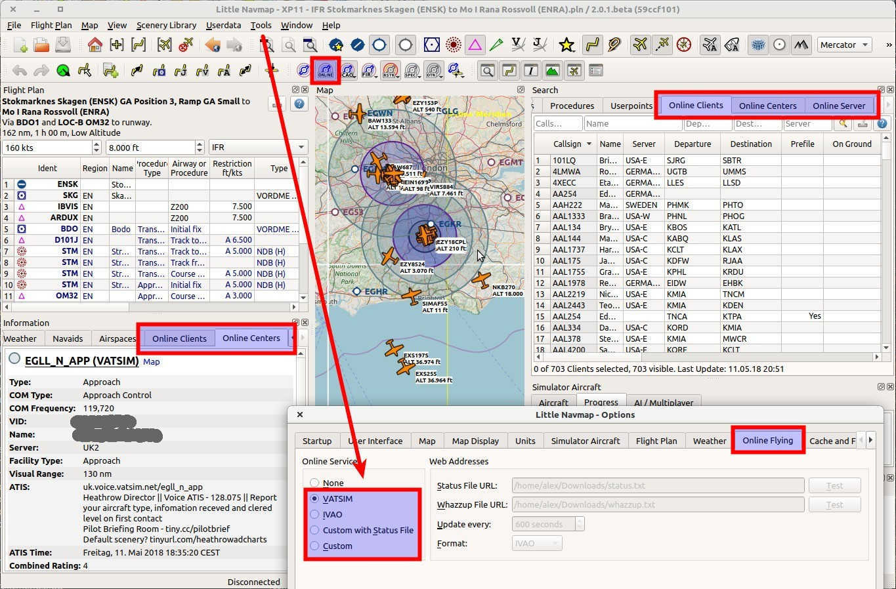
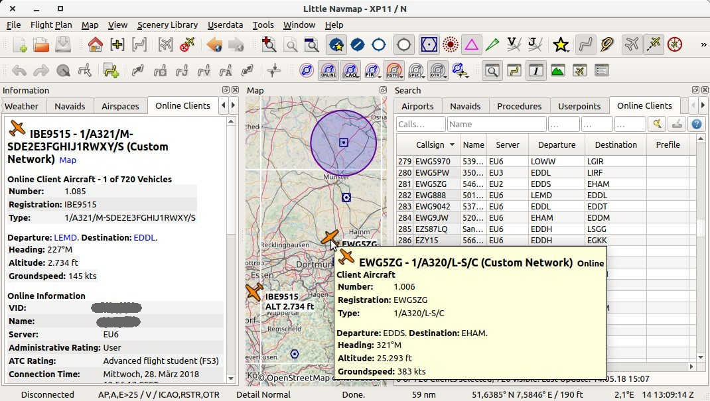
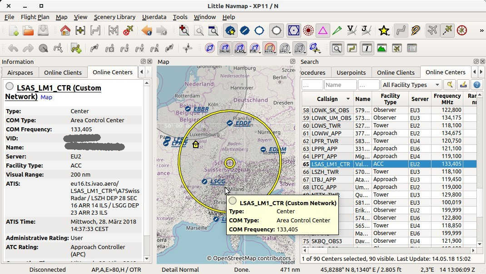

## Redes Online {#online-networks}

La funcionalidad de redes online permite conectarse a  [VATSIM](https://www.vatsim.net), [IVAO](https://ivao.aero) u otras redes online que publiquen archivos `whazzup.txt` . Esto cubre la visualización de información para centros de control, clientes y servidores en el mapa.

La información específica de red como nombres de usuario, centros de control y torre, frecuencias, planes de vuelo y mucho más se visualizan a lo largo del mundo sin límites de distancia con las aeronaves de los usuarios.

**Tenga en cuenta que todas las pestañas, elementos de menú y botones de la barra de herramientas relacionados están ocultos si las redes online están deshabilitadas, lo cual es el valor predeterminado. **

El acceso a las redes online pueden establecerse y configurarse en el cuadro de dialogo `Opciones` en la pestaña [Volando en Línea](OPTIONS.md#online-flying). Las opciones predefinidas para las redes conocidas están disponibles, así como las que se permiten configurar libremente.

_**Imagen superior:** Una descripción general de todas las ventanas, pestañas y botones relacionados con la red online._

### Simulator and Online Aircraft Duplicates {#online-networks-duplicates}

_Little Navmap_ obtiene datos de las redes online usando un intervalo de tres minutos, dependiendo de la configuración y la red.

El programa también obtiene la AI o los aviones multijugador del simulador que se actualizan aproximadamente dos veces por segundo. Estos aviones se introducen en el simulador por los diversos clientes en línea para que sean visibles dentro del simulador.

Por lo tanto, el avión del usuario y otros aviones del cliente pueden aparecer duplicados en el mapa.

_Little Navmap_ intenta eliminar estos duplicados haciendo coincidir el registro del avión \ (simulador \) y el indicativo del cliente \ (red online \). La aeronave puede aparecer duplicada si esta información no está disponible, que es el caso de X-Plane. Consulte la configuración de su herramienta de red online sobre cómo agregar esta información.

### Ventana del Mapa {#online-networks-mapdisplay}

#### Clientes {#online-networks-clients}

Los clientes de la red online o sus aviones se muestran en el mapa utilizando el símbolo  . Esto incluye las aeronaves del simulador que son reconocidas como clientes de la red online.

La aeronave del usuario se muestra siempre de color amarillo   o símbolo similar dependiendo del tipo de aeronave y simulador. Utilice el elemento de menú contextual del mapa `Mostrar en la búsqueda` para ver su propio avión en la lista de clientes online.

La información para aviones en línea se muestra en la pestaña `Clientes en línea` en la [Panel de información](INFO.md).

Todas las otras funcionalidades como el menú contextual, doble click, barras de herramientas, resaltados de mapas son las mismas que para las otras aeronaves.

Consulte [Aeronaves y Barcos](LEGEND.md#vehicles) en la leyenda para ver todos los símbolos.

_**Imagen superior:** Clientes / aviones de la red online en la pestaña de búsqueda, mapa, información sobre herramientas y ventana de información._

#### Centros de control {#online-networks-centers}

Los centros de control online se muestran como espacios aéreos circulares en _Little Navmap_ y proporcionan la misma funcionalidad que los otros espacios aéreos \ (información sobre herramientas, información y más \). Se pueden habilitar por separado de los otros espacios aéreos mediante el botón  o la opción de menú [Mostrar espacios aéreos online](MENUS.md#show-online-airspaces).

**Tenga en cuenta que los círculos no representan los espacios aéreos reales y solo se utilizan para indicar la presencia de un centro activo, torre, suelo u otra posición. **

La información detallada para los centros / espacios aéreos en línea se muestra en la pestaña `Centros Online` en [Panel de información](INFO.md).

Los siguientes tipos están disponibles y pueden habilitarse en los menús desplegables en la barra de herramientas del espacio aéreo o submenú [Espacios aéreos](MENUS.md#airspaces):

* **Observador:** El tamaño del círculo se toma del valor `Rango visual` del centro.
* **Información de vuelo \(Centro\):** Utiliza `Rango Visual`.
* **Delivery \(Clearance\):** Utiliza `Rango visual`.
* **Tierra:** Muestra un círculo de 10 nm. de diámetro.
* **Torre:** Círculo de 20 nm.
* **Aproximación:** Círculo de 40 nm.
* **ACC \(Centro\):** Utiliza `Rango visual`.
* **Salidas:** Utiliza `Rango visual`.

El tamaño de los círculos puede cambiarse en el archivo de configuración. Consulte [Centro control Online](CUSTOMIZE.md#customize-online-center).

_**Imagen superior:** Centro de red online / ATC en la pestaña de búsqueda, mapa, información sobre herramientas y ventana de información._

### Búsqueda Online de cliente en red {#search-client}
### Búsqueda Online de Centro en red {#search-center}

La funcionalidad de los filtros de búsqueda en estas dos pestañas y las tablas de resultados son similares a las búsquedas en el aeropuerto y en la navegación. Consulte [Panel de Búsqueda](SEARCH.md) para obtener información sobre filtros de búsqueda, botones y elementos del menú contextual.
### Búsqueda de Servidor Online {#search-server}

Muestra todos los servidores en línea en una tabla y no tiene funcionalidad de búsqueda. Puede utilizar el menú contextual para copiar partes de la tabla de resultados, como la dirección IP.

