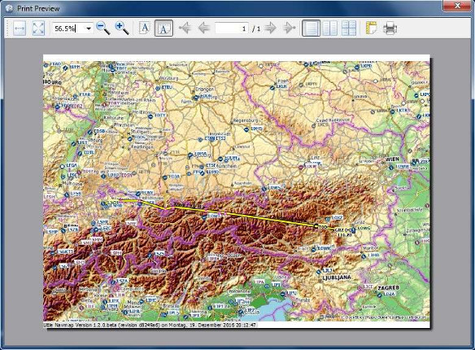
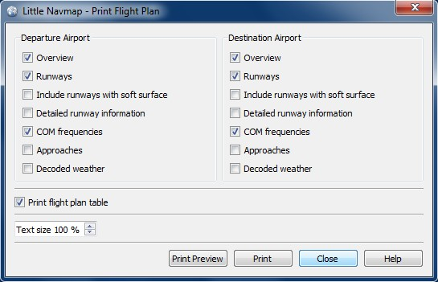

## Impresión  {#printing}

###  Imprimir Mapa  {#printing-the-map}

Abra el dialogo de impresión previa que muestra la vista del mapa actual.

_**Imagen superior:** Diálogo previo de impresión del mapa en pantalla._

###  Imprimir Plan de Vuelo  {#printing-the-flight-plan}

Imprime el plan de vuelo en curso con la información de aeropuerto de salida y destino.

#### Opciones 

* `Imprimir Encabezado de la Tabla`: Añade un encabezado que muestra salida, destino, y otra información como la etiqueta de la parte superior de la pestaña `Plan` de la ventana `Plan de Vuelo`.
* `Imprimir Informe de Combustible`: Imprime el informe de cálculo de combustible de la pestaña `Aeronave` de la ventana `Plan de Vuelo`. 
* `Nueva página después de cada capítulo`: Provee un avance de página tras el encabezado, plan de vuelo, informe de combustible e información de aeropuerto 
* `Tamaño de Texto`: permite aumentar o disminuir el tamaño de todos los textos, excepto la tabla del plan de vuelo. 

#### Plan de Vuelo 
* `Imprimir tabla de plan de vuelo`: Añade el plan de vuelo a la impresión.
* `Tamaño de texto`: Aumenta o disminuye el tamaño del texto de la tabla del plan de vuelo.
* `Selección de columnas del plan de vuelo para impresión`: Haga clic en el nombre de las columnas del plan de vuelo para incluirlas o excluirlas de la impresión.  

#### Opciones para Aeropuerto de Salida y Destino

* `Resumen`: Imprime el resumen del aeropuerto tal como se muestra en la ventana  `Información` de la pestaña `Aeropuerto`.
* `Pistas/ Helipuertos`: Imprime información de pistas y helipuertos.
* `Incluir pistas de superficie blanda`: Incluye pistas con superficies blandas como hierba, grava y otros.
* `Información detallada de la pista`: Incluye información detallada de los extremos de la pista , como luces de aproximación, tipos VASI , información de ILS y más.
* `Frecuencias COM`: Incluye frecuencias de comunicación como Torre , ATIS , UNICOM y otras.
* `Procedimientos`: Imprime información de procedimientos tal como se muestran en la pestaña `Procedimientos` en la ventana `Información`. 
* `Meteo`: Imprime la meteo descodificada para todas las fuentes activas, tal como se muestra en la pestaña ` Meteo` en la ventana `Información` 

#### Opciones Generales

* `Imprimir tabla del plan de vuelo`: Imprime el plan de vuelo tal como se ve en la tabla.
* `Tamaño del Texto`: Reduce el tamaño del texto para evitar saltos de linea innecesarios, o lo incrementa para mejorar la lectura.

_**Imagen superior:** Imprime el diálogo de opciones del plan de vuelo._

