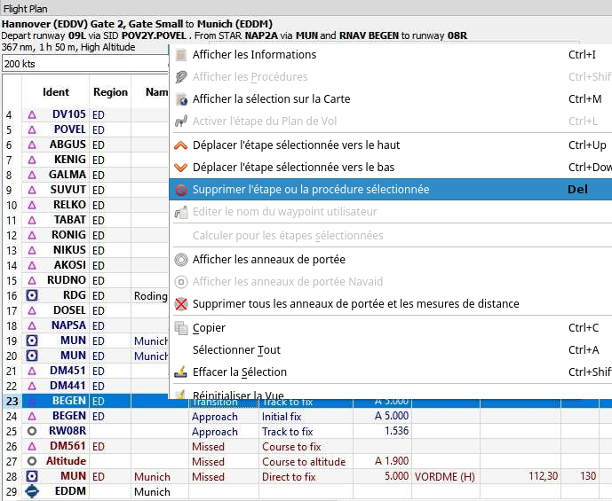

## Procédures {#procedures}

### Général {#procedures-general}

Les procédures de départ et d'arrivée seront utilisées lors du vol d'un aéronef de ligne, mais les petits aéronefs devront également utiliser au moins une procédure d'approche à destination lors du vol IFR.
Les données stockées dans les simulateurs de vol ne fournissent que des approches et des transitions. Les SID et les STAR ne sont pas disponibles sauf X-Plane Celles-ci peuvent être ajoutées par des mises à jour de navdata.

Un vol d'une compagnie aérienne contenant toutes les variantes peut utiliser les procédures ou segments suivants :

1. Aérodrome de départ
2. SID
3. SID Transition
4. Système de voies aériennes en route
5. STAR transition
6. STAR
7. Transition d'approche
8. Approche
9. Destination

Un vol IFR d'un petit aéronef peut utiliser les procédures ou les segments suivants:

1. Aérodrome de départ
2. Système de voies aériennes en route
3. Transition d'approche
4. Approche
5. Destination

Notez que les transitions nont de sens quavec une approche, un SID ou un STAR qui vous guidera vers la piste ou à partir de celle-ci. Vous ne pouvez sélectionner une transition qu'avec la procédure correspondante \(bien que le SID puisse être vide et ne comporter qu'une transition\).  Si vous supprimez une procédure du plan de vol sa transition sera également supprimée.

Les informations de procédure sont sauvegardées avec un plan de vol sous forme dannotation dans le fichier PLN et seront restaurées par _Little Navmap_ lors du chargement du plan de vol.
Les waypoints de procédure ne sont pas sauvegardés dans le plan de vol car le format PLN ne supporte pas tous les différents types de segments et le simulateur de vol ne pourrait pas les afficher correctement. Sélectionnez l'approche dans votre GPS ou FMC si vous en avez besoin.

### Insertion d'une Procédure dans un Plan de Vol {#procedures-insert}

Sélectionnez ` Afficher les Procédures ` lorsque vous cliquez avec le bouton droit de la souris sur un aérodrome dans la carte le tableau de recherche d'aérodrome ou le tableau des plans de vol. L'onglet  `Procédures` s'affiche dans la fenêtre de `Recherche`du menu contextuel.

L'insertion d'une procédure dans un plan de vol peut se faire simplement à l'aide du menu contextuel dans l'arborescence des procédures.

Voir [Recherche de Procédures ](SEARCHPROCS.md) pour plus d'informations.

### Suppression d'une Procédure d'un Plan de Vol {#procedures-delete}

La suppression d'une seule étape faisant partie d'une procédure supprimera l'ensemble de la procédure et sa transition. Supprimer une étape faisant partie d'une transition ne supprimera que la transition.

_**Photo ci-dessus:** Sur le point de supprimer la transition _`MUN`_ de l'approche _`RNAV BEGEN`_  du plan de vol._

### Limites lors de la modification d'un plan de vol avec procédures {#procedures-limitations}

* Supprimer une étape d'une procédure supprimera toute la procédure du plan de vol.
* Vous ne pouvez pas déplacer une étape de la procédure vers le haut ou vers le bas, ni déplacer ou ajouter une étape du plan de vol dans une procédure.
* Vous ne pouvez pas ajouter de waypoints entre les procédures \(par exemple un STAR et une approche\). Les waypoints ne peuvent être ajoutés qu'entre les procédures de départ et d'arrivée.
* Vous ne pouvez pas ajouter de waypoints entre la procédure d'arrivée et l'aérodrome de destination.
* Vous ne pouvez pas ajouter de waypoints entre l'aérodrome de départ et une procédure SID.
* Si vous supprimez ou remplacez l'aérodrome de destination, toutes les procédures d'approche et d'arrivée sont également supprimées.
* Si vous supprimez ou remplacez l'aérodrome de départ toutes les procédures SID sont également supprimées.

### Procédures de Vol {#procedures-flying}

Les étapes de la procédure sont pré-calculées, sauf les tours d'attentes et de procédures. Cela signifie que vous pouvez les piloter principalement comme ils sont dessinés sur la carte En cas de doute sur la façon de piloter une étape \(par ex. si trop de lignes se chevauchent\)  consultez le tableau des procédures dans la fenêtre du plan de vol.

#### Attentes {#procedures-holds}

Aucune procédure dentrée ou de sortie nest affichée. Vous devez trouver une procédure d'entrée correcte par vous-même. 

Si le temps vous est donné, vous pouvez voler dans l’attente comme d'habitude:

1. Entrez au correctif en utilisant une procédure d'entrée appropriée
2. Faire un virage standard
3. Voler l’étape droite pour le temps donné \(souvent une minute\)
4. Faites un virage standard
5. Voler pour fixer
6. Attente de sortie lorsque l'ATC a effectué ou donné des instructions à cet effet

Ne suivez pas les lignes exactement, elles ne sont qu'un indicateur pour savoir quoi voler. Une exception est faite pour les attentes où une distance est donnée pour l'étape droite La taille de l’attente correspondra dans ce cas à la distance.

_**Photo ci-dessus:** Une attente de 2 milles marins de longueur de segment droit. Entrez et sortez à _`ZUNAD`_  et volez à 2600 pieds ou plus. Le cap est de 61 degrés magnétique._

#### Sortie d'une Attente {#procedures-flying-exit-holds}

_Little Navmap_ détecte la fin d'une attente et fait avancer l'étape active au segment suivant si l'une des deux conditions est remplie:

1. **Si la prochaine étape se poursuit après ou au point de maintien:**  Lorsque vous approchez du point de maintien après  un circuit, continuez tout droit. La prochaine étape sera activée après un demi-mille nautique jusqu' à un mille nautique.
2. **Si l’étape suivante commence avant la prise fixe:** Quittez la prise à sa position fixe Sortir à droite tourner à gauche et vice versa \(c -à-d tourner à l'extérieur de l’attente\). Procéder au fixage de l’étape suivante qui sera activée.

Vous pouvez activer manuellement le segment suivant si vous ne quittez pas l’attente à son point fixe. Faites un clic droit dans le tableau des plans de vol de la prochaine étape et sélectionnez `Activer étape du plan de vol `.

#### Procédure de Virage {#procedures-turns}

Les données du simulateur de vol déplacent le point de virage d'un tour de procédure à 10 milles marins du repère qui est habituellement trop éloigné.

Faites le tour de la procédure comme d'habitude: au minimum une minute à partir de la position. Utilisez-en plus si vous avez besoin d'espace pour rattraper le prochain correctif après l'inversion de cap. Ensuite, tournez à l'aide d'une bretelle ou d'un virage standard de 45/180 degrés. Encore une fois: Suivez les procédures et non les lignes.

_**Photo ci-dessus:**  Un virage de procédure. Volez au moins une minute à 61°_`ABERN`_, tournez à gauche à 16°, volez une minute, tournez à 180° et volez jusqu' à_`LAMMB`_,  puis 242° jusqu' à _`ABERN`_._

#### Distances {#procedures-distances}

Les tours d'attente et de procédure ne comptent pas dans la distance de vol, contrairement à tous les autres. Cela signifie que la distance totale du plan de vol et le point de descente supérieur changeront lors du choix d'une approche ou d'une transition.

**Le calcul du point de descente ne tient pas compte des restrictions d'altitude dans les procédures.**

### Types de segments Spéciales {#procedures-leg-types}

Tous les types de segments de procédure \(`Route vers Fix`, `Approche Initiale` et plus\) qui sont montrés dans *Little Navmap*  sont basés sur le concept de terminaison de chemin ARINC 424. Une connaissance plus approfondie de ces types de segment n'est pas importante pour le pilote de simulateur, à l'exception de deux types qui sont ajoutés par *Little Navmap*.

* `Début de la procédure`:  Ce segment est ajoutée si une procédure ne commence pas par une correction initiale mais plutôt par un cap, un cap ou une piste vers une correction. Il indique la première position de la procédure et n'est pas lié à une position fixe.
* `Se rendre à la piste` dans le SID:  Le premier segment d'un SID pour indiquer la position de départ sur la piste. Le programme pourrait retomber sur le centre de l'aérodrome si la piste ne pouvait pas être trouvée. La restriction d'altitude indique l'altitude de la piste. 
* `Se rendre à la piste` en approche: Cette étape est ajoutée à une procédure d'approche pour montrer la ligne de parcours à partir d'un point d'approche interrompue \(CARTE\)  jusqu' à l'extrémité de la piste. Il est ajouté si une approche ne se termine pas par un repère de piste et que l'altitude est limitée à 50 pieds au-dessus du seuil.

* `Start of Procedure`: This leg is added if a procedure does not start with an initial fix but rather with a course, heading or track to a fix. It indicates the first position of the procedure.
* `Proceed to Runway` in a SID: The first leg of a SID to indicate the start position on the runway. The program might fall back to the airport center if the runway is not available. The altitude restriction indicates the elevation of the runway.
* `Straight In`: Added to an approach procedure to show the course from the missed approach point \(MAP\) to the runway threshold. It is added when an approach ends with a runway fix. The leg has an altitude restriction 50 feet above the threshold.
* `Circle to Land`: Added to an approach procedure to show the course from the missed approach point to the airport. It is added if an approach does not end with a runway fix.

### Fixer les Types dans une Procédure {#procedures-fix-types}

* **Waypoints:**  Points de cheminement terminaux ou aides radio. Certains sont marqués comme `survol` dans le tableau d'approche.
* **Radial et distance:** Exemple: `WIK/7nm/291°M`. Un repère défini par un cap ou un cap et une distance par rapport à une aide d'urgence.
* **Distance au DME:** Exemple: `WIK/9nm`. Ce repère est défini par un cap ou une piste qui se termine par l'atteinte d'une distance DME.
* `Cap d'interception à fixer`: Intercepter une trajectoire jusqu'au prochain repère à un angle d'environ 45 degrés.
* `Intercepter Segment`: Intercepter le prochain segment d'approche à environ 45 degrés.
* `Altitude`: Un segment ou une attente qui se termine en atteignant une certaine altitude et qui est surtout utilisée lors d'approches manquées. Comme la distance dépend de l'aéronef, 2 milles nautiques sont utilisés pour ce segment. Vous pouvez ignorer la ligne et passer au segment suivant une fois que les critères d'altitude sont remplis.
* `Manuel`: Prendre un cap, une trajectoire ou une attente jusqu' à ce que l'ATC termine manuellement.

Les repères de piste sont préfixés avec `RW`.  Ils ont habituellement une restriction d'altitude à quelques pieds au-dessus de 
la piste. Les restrictions d'altitude plus élevées \(c. -à-d. > 500 ft\) indiquent une approche indirecte..

### Restrictions d'Altitude et de Vitesse {#procedures-restrictions}

Les restrictions sont indiquées sur la carte et dans le tableau des plans de vol.

* **Nombre seulement:** Voler en altitude ou à vitesse. Exemples de cartes: `5400ft` ou `210kts`.
* **Préfixe** `A`:  Volez à ou au-dessus de l'altitude ou de la vitesse. Exemple de carte: `A1800ft`  ou `A200kts`.
* **Préfixe** `B`: Volez à une altitude ou à une vitesse inférieure ou égale à l'altitude. Exemple de carte: `B10000ft`  ou `B240kts`.
* **Distance:** Volez à une altitude supérieure ou égale à une altitude un et à une altitude inférieure ou égale à deux. Exemple de carte: `A8000B10000ft`. Pareil pour la vitesse.

### Navaids Similaires {#procedures-related}

Beaucoup de correctifs ont une aide navaid ou recommandée. Il peut s'agir d'un VOR, NDB, ILS ou d'un waypoint. L'aide navaid est fournie avec des valeurs radiales et de distance qui peuvent être utilisées pour localiser les waypoints lorsque vous volez sans GPS ou simplement pour une vérification croisée.

### Approches Manquées {#procedures-missed}

Les étapes d'approche interrompue sont activées lorsque l'aéronef du simulateur franchit le dernier point d'une approche. L'affichage de la distance restante du plan de vol passera à l'affichage de la distance restante jusqu' à la dernière étape d'approche interrompue.

**Aucun segment d'approche interrompue n'est activé si les approches interrompues ne sont pas montrées.**

### Faits Marquants des Segments sur la Carte {#procedures-highlights}

Jusqu' à trois points seront mis en surbrillance lorsque vous cliquez sur un segment de procédure dans l'arborescence de la fenêtre de recherche:

* Un petit cercle bleu indique le début du segment.
* Le début de l’étape est représenté par un grand cercle bleu.
* Un cercle fin indique l'emplacement de la correction recommandée ou associée si disponible.

### Données Invalides

Une entrée de segment sera dessinée en rouge si une aide à la navigation n' a pas été résolue pendant le processus de chargement de la base de données de scènes. Cela se produit uniquement lorsque les données sources ne sont pas valides ou incomplètes. La procédure résultante n'est pas utilisable dans ce cas et une boîte de dialogue d'avertissement s'affichera si des aides à la navigation essentielles sont manquantes.

