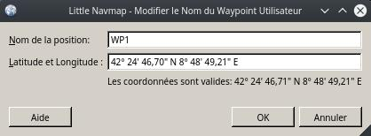

## Modifier Position du Plan de Vol {#edit-flightplan-position}

Cette boîte de dialogue permet d'éditer une position de plan de vol définie par l'utilisateur qui a été ajoutée avec la commande  [Ajouter la Position du Plan de Vol](MAPDISPLAY.md#add-position-to-flight-plan) et  [Joindre la Position du Plan de Vol](MAPDISPLAY.md#append-position-to-flight-plan).

### Nom

Vous pouvez entrer n'importe quelle chaîne de caractères, mais tous les caractères non valides seront supprimés lors de l'enregistrement sous forme de fichier FSX/P3D PLN. D'autres formats de fichiers ont plus de limitations.

Sont autorisés : A-Z, a-Z, a-Z, 0-9, soulignement `_` et espace. Tout le reste sera supprimé lors de l'enregistrement et la longueur sera tronquée à 10.

### Coordonnées

Vous pouvez également éditer les coordonnées directement dans cette boîte de dialogue en plus d'utiliser le glisser-déposer [Modifier Position du Plan de Vol](MAPFPEDIT.md). Ceci peut être utile si vous souhaitez ajouter des points de cheminement avec des coordonnées bien connues comme des points de compte rendu visuel.

L'info-bulle du champ de saisie des coordonnées indique les formats disponibles.

Voir [Formats des Coordonnées](COORDINATES.md) pour plus d'informations.

_**Image ci-dessus:** Modifier une position de plan de vol définie par l'utilisateur. Coordonnées._
