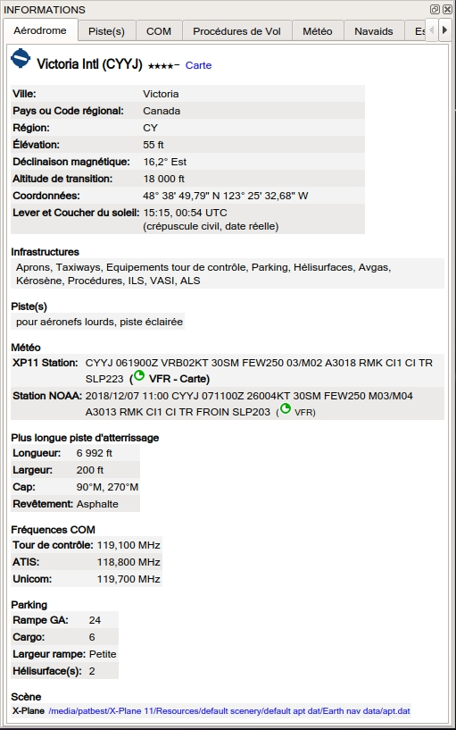
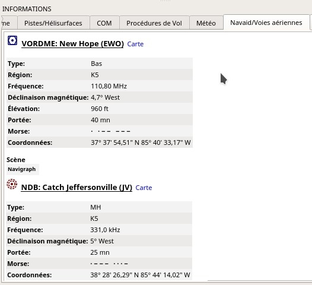
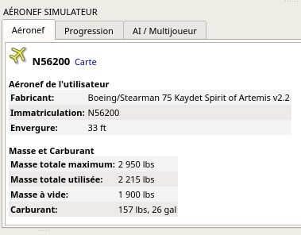
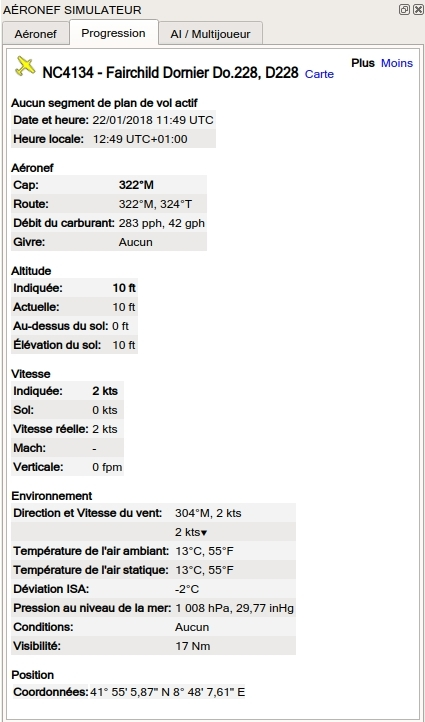

##  Fenêtre Informations {#information-dock-window}

Cette fenêtre contient des informations textuelles sur les aérodromes dans plusieurs onglets, ainsi que des informations sur une ou plusieurs aides à la navigation, les voies aériennes dans un autre onglet et un onglet supplémentaire affichant des informations sur l'espace aérien.

Un onglet `Météo` comprend également des informations météorologiques décodées pour l'aérodrome sélectionné.

Toutes les informations peuvent être copiées dans le presse-papiers sous forme de texte formaté. Utilisez le menu contextuel des champs de texte ou utilisez `Ctrl+A` pour tout sélectionner et `Ctrl+C` pour copier le contenu dans le presse-papiers.

Les informations sont affichées lorsque vous sélectionnez l'un des éléments du menu contextuel Afficher les `informations pour ...` dans la carte, dans la fenêtre du plan de vol ou dans le tableau des résultats de recherche.
Un aérodrome et toutes les navaids sont chargées dans l'écran d'information si plusieurs objets se trouvent à proximité d'un clic de souris.

Un lien bleu `Carte` permet de sauter à l'aéroport ou au navaid indiqué sur la carte.
Des liens supplémentaires pour les hélisurfaces sont disponibles dans l'onglet Pistes `Pistes/Hélisurfaces`.

Une voie aérienne est toujours affichée avec tous ses repères de balisage qui sont également liés à leur position respective sur la carte.

L'affichage pour tous les aérodromes et navaids contient un ou plusieurs liens en plus du titre de l'entrée scène du simulateur de vol au bas de la liste dans la section Scenery
Ces liens pointent vers les fichiers BGL respectifs. Un clic ouvrira l'Explorateur Windows avec le fichier correspondant sélectionné.

Plusieurs liens peuvent apparaître pour les aérodromes car ils peuvent être modifiés par plusieurs fichiers BGL à partir de scènes complémentaires ou de mises à jour de données navdata.

_**Photo ci-dessus:** Vue d'ensemble des informations aéroportuaires. Des onglets supplémentaires affichent des informations sur les pistes, les fréquences COM, les approches et les conditions météorologiques._

_**Photo ci-dessus:**  Informations sur les aides d'État à la navigation. Deux aides à la navigation étaient proches du curseur lorsqu'on cliquait dessus._

##  Fenêtre Aéronef Simulateur {#simulator-aircraft-dock-window}

Cette fenêtre flottante affiche des informations sur l'aéronef utilisateur et sur les aéronefs AI ou multijoueurs dans plusieurs onglets.
_Little Navmap_ doit être connecté au simulateur pour activer cette fonctionnalité.
Voir [ Connexion à un Simulateur de Vol](CONNECT.md#connecting-to-a-flight-simulator) pour plus d'informations à ce sujet.

### Onglet Aéronefs

Donne un aperçu de l'aéronef de l'utilisateur et affiche des informations sur le type, la masse et le carburant.

_**Photo ci-dessus:** Informations sur l'aéronef lorsqu'il est connecté à un simulateur de vol._

### Onglet Progression

Affiche des informations similaires à celles d'un ordinateur de gestion de vol sur l'aéronef de l'utilisateur. Il couvre la progression du plan de vol, l'altitude, la vitesse, les paramètres ambiants et environnementaux.

_**Photo ci-dessus:** Progression et informations ambiantes sur la situation actuelle du vol. Certains champs ou tables comme _`Waypoint Suivant `_ ne sont disponibles que lorsqu'un plan de vol est chargé. _

### Onglet AI / Multijoueur

Les informations sur un aéronef ou un navire multijoueur ou un aéronef AI sont affichées dans cet onglet si vous cliquez sur un véhicule sur la carte.

Ceci inclut également les aérodromes de départ et d'arrivée pour les aéronefs qui peuvent être affichés sur la carte en cliquant sur les liens bleus \(seulement pour FSX ou P3D et si un plan de vol est déposé\).

Notez que l'information sur les aéronefs AI est limitée sur les aéronefs X-Plane où seuls la position, l'altitude et le cap peuvent être affichés

_**Photo ci-dessus:** Informations sur un aéronef AI._

##  Fenêtre Légende {#legend-dock-window}

Contient deux onglets: Un onglet `Navmap` expliquant les différents aérodromes et navaid et un onglet `Carte`  Carte qui affiche la 
légende générale de la carte de base comme _OpenStreetMap_  par exemple.

Notez que la légende générale de la carte n'est pas disponible pour tous les thèmes de la carte.

