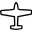
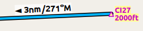
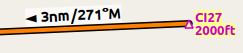
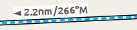
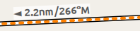

## Légende {#little-navmap-legend}

Toutes les vitesses sont par défaut en nœuds, les distances en milles nautiques, l'altitude en pieds. Les unités peuvent être changées en unités impériales ou métriques dans la boîte de dialogue `Options` de l'onglet `Unités`.

Les couleurs, la taille et les libellés de certains éléments de la carte peuvent être modifiés dans la boîte de dialogue `Options` de l'onglet ` Affichage de la Carte`. Cette légende montre les valeurs par défaut.

Le cap et la route sont suffixes avec `°T` pour le cap vrai ou `°M` pour le cap magnétique.

### Marques Cartographiques {#map-marks}

| Symbole | Description |
| --- | --- |
|  | Centre de la position d'origine. |
|  | Point central qui sera utilisé pour les recherches à distance.
|  | Plan de vol avec distance, direction et cap magnétique à chaque segment. |
|  | Segment de procédure de plan de vol avec les mêmes informations que ci-dessus.
|  | Segment du plan de vol actif |
|  | Position de départ du plan de vol sur l'aérodrome. Parking, réservoir à carburant, hélisurface, eau ou piste d'atterrissage. |
|  | Sommet du point de descente avec la distance jusqu'à la destination. |
|  | Anneaux de portée étiquetés avec la distance. |
|   | Anneaux de gamme VOR ou NDB étiquetés avec identification et fréquence. La couleur indique le type Navaid. |
|  | [Grand cercle](https://en.wikipedia.org/wiki/Great-circle_distance "Great circle") ligne de mesure de distance et de cap indiquant la longueur et le cap vrai au départ et à destination. Les deux valeurs de cap seront égales pour les petites distances. Pour les distances plus courtes, la longueur est également indiquée en pieds ou en mètres.. |
|  | [Ligne de rhumb](https://en.wikipedia.org/wiki/Rhumb_line) d'une mesure de distance de relèvement égale indiquant la distance et le cap vrai. Les lignes de rhumb sont utilisées pour s'approcher d'un VOR ou d'un NDB ou pour voyager le long des voies aériennes. Pour les distances plus courtes, la longueur est également indiquée en pieds. |
|  | Les lignes de mesure à partir d'un aérodrome ou d'un navaid ont la même couleur et des étiquettes d'identification et de fréquence supplémentaires. Le parcours des lignes de rhumb sera indiqué en magnétique si le navaid possède un attribut de variation magnétique. |
|  | Un aérodrome ou navaid sélectionné dans le tableau des résultats de la recherche. |
|  | Un aérodrome ou navaid sélectionné dans le tableau du plan de vol. |
|  | Positions en surbrillance d'un segment de procédure dans l'aperçu. Représentation en petit cercle _depuis_et en grand cercle _jusqu'à_ la position.|
| | Le cercle mince montre le navaid recommandé ou apparenté d'un segment d'intervention. Il peut s'agir d'un VORDME pour un segment d'approche en arc DME par exemple..|

### Compas Rose des vents

L'épaisseur des lignes peut être modifiée dans la boîte de dialogue `Options` sur l'onglet `Affichage de la Carte`.

| Symbole | Description |
| --- | --- |
|  | Nord réel. |
|  | Nord magnétique. |
|  | Cercles et marques de distance par rapport à l'aéronef utilisateur s'il est connecté. |
|  | La ligne continue indique la trajectoire de l`aéronef en degrés magnétiques si connecté.. |
|  | La ligne en pointillés indique le cap de l'aéronef s'il est connecté.. |

### Aéronefs et Navires {#vehicles}

| Symbole| Description |
| --- | --- |
|    | Véhicule utilisateur actuel s'il est connecté au simulateur de vol. Les étiquettes varient et peuvent être personnalisées dans `Options` sur l'onglet `Affichage de la Carte`. L'aéronef utilisateur dépend de l'aéronef sélectionné (jet, piston/turbopropulseur ou hélicoptère). En option, une aiguille noire dépassant du nez peut indiquer la trajectoire du parcours actuel.  |
|    | Aéronef ou navire utilisateur au sol. |
|  | Aiguille indiquant la trajectoire actuelle de l'aéronef. Le nez de l'aéronef montre le cap. |
|  | Trajectoire de l'aéronef utilisateur s'il est connecté au simulateur de vol. |
|  | Vent autour de l'aéronef utilisateur avec la direction en degrés magnétique et la vitesse.. |
|       | Aéronefs AI ou multijoueurs. Les étiquettes varient et peuvent être personnalisées dans `Options` sur l'onglet `Affichage de la Carte`. Le symbole dépend du type d'aéronef \(jet, piston/turbopropulseur, hélicoptère ou navire\). |
|   | Réseau connecté aéronef/client. Les étiquettes varient et peuvent être personnalisées comme ci-dessus.. |

### Aérodromes {#airports}

Les aérodromes ayant des tours de contrôle sont représentés en bleu foncé, les autres en magenta. Les noms et les identités des aérodromes sont indiqués en italique et soulignés. Les aérodromes qui font partie du plan de vol ont un fond jaune clair.

Le symbole est plus petit si un aérodrome n'a pas de piste. C'est le cas de certains aérodromes complémentaires qui utilisent une autre technique comme les paysages photographiques pour afficher les pistes d'atterrissage.

| Symbole | Description |
| --- | --- |
|   | Aérodromes avec des pistes en surface dure d'une longueur supérieure à 8 000 pieds ou 2 400 mètres. Toutes les pistes d'une longueur supérieure à 4 000 pieds ou environ 1 200 mètres sont représentées. Uniquement pour des distances de zoom inférieures. |
|   | Aérodromes avec pistes à surface dure. La ligne blanche indique le cap de la piste la plus longue. |
|   | Aérodromes avec pistes à surface souple. |
|   | Les aérodromes inoccupés sont affichés en gris. Pas de voies de circulation, pas de parking et pas d'aprons.. |
|   | Base d'hydravions n'ayant que des pistes d'atterrissage en eau. |
|   | Aérodrome militaire. |
|  | Héliport n'ayant que des hélisurfaces et pas de pistes d'atterrissage. |
|   | Aérodrome abandonné. Toutes les pistes sont fermées. |
|   | Aérodromes qui ont du carburant disponible. |
|   | Étiquette de l'aérodrome indiquant le nom, l'identité, la fréquence ATIS, l'altitude, les pistes éclairées \(`L`\) et la longueur de la piste la plus longue. Les étiquettes de texte d'un aérodrome peuvent être modifiées dans la boîte de dialogue `Options` sur l'onglet `Affichage de la Carte`. |

### Navaids {#navaids}

Navaids qui font partie du plan de vol ont un fond de texte jaune pâle.

| Symbole | Description |
| --- | --- |
|   | VOR DME incluant l'identifiant, le type \(Haut, Bas ou Terminal\) et la fréquence. La rose des vents montre une variation magnétique sur des distances de zoom plus faibles. |
|   | VOR, y compris l'identifiant, le type et la fréquence.. |
|  | DME, y compris l'identifiant, le type et la fréquence.. |
|   | TACAN y compris l'identifiant, type \(Haut, Bas ou Terminal\) et canal. La rose des vents montre une variation magnétique sur des distances de zoom plus faibles. |
|   | VORTAC incluant l'identifiant, le type \(Haut, Bas ou Terminal\) et la fréquence. La rose des vents montre une variation magnétique sur des distances de zoom plus faibles. |
|   | NDB incluant l'identifiant, le type \(HH, H, MH ou CL - localisateur de boussole\) et la fréquence |
|  | Waypoint avec nom. |
|  | Waypoint défini par l'utilisateur avec nom. |
|  | Aérodrome, waypoint, VOR ou NDB invalides qui font partie du plan de vol mais qui n'ont pas pu être trouvés dans la base de données des scènes. |
|    | Marqueur dont le type et le titre sont indiqués par la forme de la lentille. |
|  | Jet airway avec étiquette indiquant le nom, le type \(Jet ou les deux\), l'altitude minimale et maximale. Le texte dépend de la distance de zoom. Une flèche précédente indique la direction autorisée si la voie aérienne est unidirectionnelle. |
|  | Victor airway avec étiquette indiquant le nom, le type \(Victor ou les deux\), l'altitude minimale et maximale. Le texte dépend de la distance de zoom. Une flèche précédente indique la direction autorisée si la voie aérienne est unidirectionnelle. |
|   | ILS avec pente de descente. L'étiquette indique l'identification, la fréquence, le cap magnétique, le pas de l'alignement de descente et l'indication DME si disponible. |
|   | Localisateur. L'étiquette indique l'identification, la fréquence, le cap magnétique et l'indication DME si disponible. |

### Procédures {#procedures}

Voir chapitre [Procédures](APPROACHES.md) pour plus d'informations détaillées sur tous les segments.

| Symbole | Description |
| --- | --- |
|  | SID, STAR, segment d'approche ou de transition en prévisualisation avec la distance, la direction et le cap magnétique à chaque segment. |
|  | SID, STAR, approche ou segment de transition qui fait partie du plan de vol. |
|  | Le segment d'approche manquée dans la prévisualisation. |
|   | Le segment d'approche interrompue qui fait partie du plan de vol.|
|  | Un cercle rempli de jaune gris indique un point de procédure qui n'est pas un navaid, mais qui est défini par le cap et/ou la distance par rapport à un navaid, une restriction d'altitude ou une terminaison manuelle. |
|  | Un cercle noir indique un waypoint de survol. Il peut s'agir d'un point d'intervention ou d'un navaid. |
|  | Effectuer un cap, une route ou une mise en attente jusqu'à ce que l'ATC y mette fin manuellement.|
|  | Intercepter le prochain segment d'approche à un cap d'environ 45 degrés. |
|  | Segment de la procédure qui se termine lorsque l'altitude donnée est atteinte.  |
|  | Un repère défini par un cap ou un cap et la distance par rapport à un navaid.|
|  |  Ce repère est défini par un cap ou une piste qui se termine en atteignant une distance DME. |
|  | Intercepter un cap vers le prochain repère à un angle d'environ 45 degrés.  |

### Diagramme de l'Aérodrome {#airport-diagram}

Les couleurs de la piste, de la voie de circulation, de l'hélisurface et de l'aire de trafic indiquent le type de surface. Le blanc est utilisé pour un type de surface inconnu ou invalide donné par un développeur d'add-on.

| Symbole | Description |
| --- | --- |
|  | Piste avec longueur, largeur, indicateur lumineux \(`L`\) et type de surface. |
|  | Extrémité de piste avec identification et cap magnétique. |
|  | Seuil déplacé. Ne pas utiliser pour l'atterrissage. |
|  | Zone de dépassement. Ne pas utiliser pour le taxi, le décollage ou l'atterrissage. |
|  | Zone anti souffle. Ne pas utiliser pour le taxi, le décollage ou l'atterrissage. |
|  | Voie de circulation avec nom et ligne centrale. |
|  | Voie de circulation fermée. |
|  | Les aires de trafic et les voies de circulation en pointillés semi-transparents indiquent qu'aucune surface n'est dessinée. Il peut utiliser une texture de photo ou simplement le fond d'écran par défaut.  |
|   | Tour de contrôle. Rouge si une fréquence tour est disponible. Sinon, il suffit de visualiser la position. |
|  | Carburant |
|  | Rampe GA avec le numéro de parking et la marque de cap. |
|   | Porte avec un numéro et une marque d'en-tête à cocher. Le deuxième anneau indique la disponibilité de la jetway. |
|  | Rampe cargo |
|  | Parking militaire de combat ou rampe de chargement. |
|    | Des héliports. Le texte en rouge indique l'héliport médical. La couleur indique la surface. |

### Légende du Profil d'Elévation {#elevation-profile-legend}

| Symbole | Description |
| --- | --- |
|   | Terrain avec élévation de départ à gauche et élévation de l'aérodrome de destination à droite.  |
|  | Altitude du plan de vol. |
|  | Le sommet de la descente avec la distance à la destination. |
|  | Altitude minimale de sécurité pour le plan de vol. C'est l'altitude plus 1000 pieds arrondis aux 500 pieds suivants. La mémoire tampon de 1000 pieds peut être changée dans la boîte de dialogue `Options` sur l'onglet `Plan de Vol`. |
|  | Altitude minimale de sécurité pour un segment de plan de vol. Les mêmes règles s'appliquent à l'altitude minimale de sécurité pour le plan de vol. |
|  | Aéronefs utilisateurs s'ils sont connectés au simulateur. Les étiquettes indiquent l'altitude réelle et le taux de montée et de descente. |
|  | Trajectoire de l'aéronef utilisateur s'il est connecté au simulateur de vol.  |

