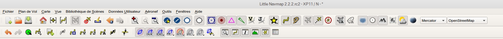
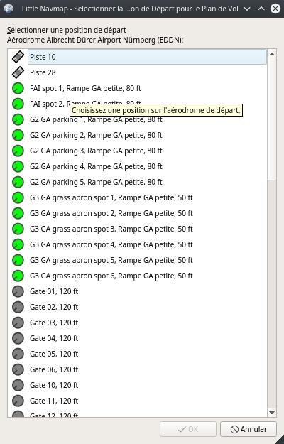

## Menus et Barres d'Outils {#menus-and-toolbars}

Ce chapitre décrit tous les éléments du menu de _Little Navmap_. Vous trouverez la plupart de ces fonctionnalités sur les barres d'outils qui ne sont pas décrites séparément. Les combinaisons de touches peuvent être affichées sur les menus et ne sont pas listées dans ce manuel.

_**Image ci-dessus:** Menu et barres doutils en position par défaut._

### Menu Fichier {#file-menu}

####  Nouveau Plan de Vol {#new-flight-plan}

Efface le plan de vol actuel.

Vous devez utiliser le menu contextuel [Tableau des résultats de recherche - Afficher le Menu Contextuel](SEARCH.md#search-result-table-view-context-menu),  le [Menu Contextuel de la Carte](MAPDISPLAY.md#map-context-menu) ou le dialogue [Description de l'Itinéraire du Plan de Vol](ROUTEDESCR.md) pour créer un plan de vol.

####  Ouvrir Plan de Vol {#open-flight-plan}

Ouvre un FSX PLN, un FS9 PLN, un X-Plane FMS ou un fichier de plan de vol FLP. Le type de fichier est déterminé par le contenu et non par l'extension du fichier. Voir [Formats de Plan de Vol](FLIGHTPLANFMT.md) pour plus d'informations.

Un fichier de plan de vol ouvert sera rechargé au démarrage \(le rechargement et le centrage peuvent être désactivés dans la boîte de dialogue `Options` sur l'onglet `Démarrer` et `Interface Utilisateur`).

Les informations de procédure et la vitesse sol seront ajoutées au plan de vol si un fichier PLN est sauvegardé par _Little Navmap_. L'information additionnelle sera ignorée par FSX ou P3D mais permet de recharger toute l'information en _Little Navmap_.

Vous pouvez également **glisser-déposer des fichiers d'un gestionnaire de fichiers** comme l'Explorateur Windows ou le Finder MacOS dans la fenêtre principale _Little Navmap_ pour les charger.
Les plans de vol uniques et tous les formats de chargement autorisés \(`FMS`, `FLP`, `PLN`\) ainsi que les fichiers de performances de l'aéronef \(`lnmperf`\) sont acceptés.

####  Joindre Plan de Vol {#append-flight-plan}

Ajoute le départ, la destination et tous les points fixes au plan de vol actuel.

L'utilisation de `Joindre Plan de Vol` permet de charger ou de fusionner des plans de vol complets ou des extraits de plans de vol dans un nouveau plan. Tous les waypoints sont ajoutés à la fin du plan de vol en cours. Ensuite, vous pouvez utiliser les éléments de menu contextuel `Supprimer les segments sélectionnés` et `Déplacer les segments sélectionnés vers le haut/bas` pour organiser les waypoints et les aérodromes selon les besoins. Voir [Menu Contextuel de l'Affichage du Plan de Vol](FLIGHTPLAN.md#flight-plan-table-view-context-menu).

Toutes les procédures darrivée seront supprimées lors de lajout dun plan de vol.

Les segments annexés sont sélectionnés après le chargement du plan de vol.

#### Plans de Vol Récent {#recent-flight-plan}

Affiche tous les plans de vol récemment chargés pour un accès rapide. Vous pouvez effacer la liste en sélectionnant   `Effacer la liste`.

####  Sauver Plan de Vol {#save-flight-plan}

####  Sauver Plan de Vol au format PLN {#save-flight-plan-as}

Sauvegarde le plan de vol dans un fichier FSX/P3D PLN \(format XML\). Ce format annoté permet de sauvegarder tous les attributs du plan de vol de *Little Navmap*.

`Sauver Plan de Vol au format PLN` change le type et le nom du fichier actuel dans *Little Navmap*, ce qui signifie que toutes les sauvegardes ultérieures iront dans le nouveau fichier PLN.

Il est recommandé de sauvegarder tous les plans de vol dans ce format pour conserver toutes les informations d'un plan. Même en utilisant le format FMS limité pour X-Plane. Voir [Formats de Plan de Vol]](FLIGHTPLANFMT.md) pour plus d'informations.

_Little Navmap_ permettra de créer des plans de vol qui peuvent être utiles comme extrait de plan de vol, mais qui sont inutilisables par le simulateur de vol. Cela se produit si un plan de vol n'a pas d'aérodrome de départ ou de destination. Une boîte de dialogue d'avertissement s'affiche lors de l'enregistrement d'un plan de vol incomplet.

Une boîte de dialogue d'avertissement s'affiche également si l'aérodrome de départ a des parkings mais qu'aucun n'est assigné dans le plan de vol.

Les procédures seront sauvegardées sous forme d'annotation dans le fichier du plan de vol si le plan de vol en contient. Cela ne pose aucun problème pour les simulateurs et la plupart des autres programmes. Utiliser [Exporter un Plan de Vol sans risque](MENUS.md#export-clean-flight-plan) si un programme a des problèmes de lecture des fichiers PLN enregistrés par _Little Navmap_.

Notez que les waypoints d'une procédure ne sont pas sauvegardés avec le plan de vol. Utilisez le GPS, le FMC ou d'autres moyens pour sélectionner une procédure dans votre aéronef.

La vitesse au sol réglée est également sauvegardée avec le plan de vol.

####  Sauver Plan de Vol au format X-Plane FMS 11 {#save-flight-plan-as-fms11}

Sauvegarde le plan de vol à l'aide du nouveau format X-Plane FMS 11.. **Ce format ne peut être utilisé qu'à partir de X-Plane 11.10. N'essayez pas de le charger dans le FMS ou le GPS de X-Plane 11.05. Il pourrait crasher le simulateur..**

Une boîte de dialogue d'avertissement s'affiche avec l'avertissement ci-dessus lors de l'enregistrement.

Voir [Formats de Plan de Vol](FLIGHTPLANFMT.md) pour plus d'informations sur les limitations.

Cette fonction change le type et le nom du fichier actuel, ce qui signifie que toutes les sauvegardes ultérieures iront dans le nouveau fichier FMS et que le fichier sera rechargé au prochain démarrage.

Stockez les fichiers FMS dans le répertoire `Output/FMS plans` à l'intérieur du répertoire source X-Plane si vous souhaitez utiliser le plan de vol dans le GPS X-Plane, le G1000 ou le FMS.

####  Sauver Plan de Vol au format FLP {#save-flight-plan-as-flp}

Exporte le plan de vol actuel sous la forme d'un fichier FLP utilisable par le FMS X-Plane, Aerosoft Airbus et d'autres aéronefs supplémentaires. Ce format est limité de sorte qu'une boîte de dialogue s'affiche si des caractéristiques non prises en charge sont détectées dans le plan de vol en cours.

Voir [Formats de Plan de Vol](FLIGHTPLANFMT.md) pour plus d'informations sur les limitations.

Cette fonction change le type et le nom du fichier actuel, ce qui signifie que toutes les sauvegardes ultérieures iront dans le nouveau fichier FLP et que le fichier sera rechargé au prochain démarrage.

Stockez les fichiers FLP dans le répertoire `Output/FMS plans` à l'intérieur du répertoire X-Plane si vous voulez le charger dans le FMS.

####  Exporter au format PLN simple (sans attributs) {#export-clean-flight-plan}

Sauvegarde un plan de vol sans procédure ni annotations de vitesse si les programmes ont des problèmes de lecture des fichiers PLN enregistrés par _Little Navmap_. Cela est rarement nécessaire.

Comme toute autre fonction d'exportation, cela ne change pas le nom et le type de fichier actuel. Les autres sauvegardes utiliseront toujours le même nom de fichier et le même format qu'auparavant.

Voir aussi [Formats de Plan de Vol](FLIGHTPLANFMT.md).

####  Exporter Plan de Vol au format X-Plane FMS 3 {#export-flight-plan-as-fms3}

Sauvegarde le plan de vol en utilisant l'ancien format X-Plane FMS 3 qui est limité mais peut être chargé par X-Plane 10 et X-Plane 11.05. Une boîte de dialogue d'avertissement s'affiche si des caractéristiques non prises en charge sont détectées dans le plan de vol en cours.

Voir [Formats de Plan de Vol](FLIGHTPLANFMT.md) pour plus d'informations sur les limitations.

Cette fonction d'exportation ne change pas le nom et le type de fichier actuel. Les autres sauvegardes utiliseront toujours le même nom de fichier et le même format qu'auparavant.

Stockez les fichiers FMS dans le répertoire `Output/FMS plans` à l'intérieur du répertoire source X-Plane si vous souhaitez utiliser le plan de vol dans le GPS X-Plane ou FMS.

#### Exporter le Plan de Vol vers d'autres Formats (Sous-Menu) {#export-submenu}

Voir [Formats de Plan de Vol](FLIGHTPLANFMT.md) pour obtenir des informations plus détaillées sur les formats d'exportation disponibles.

Les fonctions d'exportation ne modifient pas le nom et le type de fichier actuel. Les autres sauvegardes utiliseront toujours le même nom de fichier et le même format qu'auparavant.

##### Exporter Plan de Vol vers FPL pour le GNS Reality XP GNS {#save-flight-plan-as-rxpgns}

Sauvegarder le plan de vol sous forme de fichier FPL utilisable par l'utilisateur. _Reality XP GNS 530W/430W V2_.

Les procédures ou leurs points de cheminement respectifs ne sont pas inclus dans le fichier exporté.

Voir [Formats de Plan de Vol](FLIGHTPLANFMT.md) for more detailed information on the available export formats.

Les fonctions d'exportation ne modifient pas le nom et le type de fichier actuels. Les autres sauvegardes utiliseront toujours le même nom de fichier et le même format qu'auparavant.

##### Exporter Plan de Vol au format GFP pour Reality XP GTN {#save-flight-plan-as-rxpgtn}

Sauvegarder le plan de vol sous forme de fichier GFP utilisable par le _Reality XP GTN 750/650 Touch_. Ce format permet de sauvegarder les procédures et les voies aériennes.

Voir aussi [Notes sur les formats Garmin GFP et FPL](FLIGHTPLANFMT.md#garmin-notes) pour des informations sur les chemins et d'autres remarques.

##### Exporter Plan de Vol au format Garmin GTN GFP {#save-flight-plan-as-gfp}

Exporte le plan de vol au format GFP utilisé par le _Flight1 GTN 650/750_.

Les procédures ou leurs waypoints respectifs ne sont pas inclus dans le fichier exporté.

Voir [Formats de Plan de Vol](FLIGHTPLANFMT.md#flight-plan-formats-gfp) pour plus d'informations sur ce format d'exportation et sur la façon de contourner les waypoints verrouillés.

##### Exporter Plan de Vol au format PMDG RTE {#export-flight-plan-as-rte}

Exporte le plan de vol en cours comme fichier RTE PMDG.

Les procédures ou leurs waypoints respectifs ne sont pas inclus dans le fichier exporté.

Le répertoire par défaut pour sauvegarder les plans de vol des unités GNS est le suivant `C:\ProgramData\Garmin\GNS Trainer Data\GNS\FPL`
pour tous les simulateurs. Le répertoire sera créé automatiquement par _Little Navmap_ lors de la première exportation s'il n'existe pas.

Exporte le plan de vol actuel sous la forme dun fichier TXT utilisable par les aéronefs JARDesign ou Rotate Simulations.

Ni les procédures ni leurs waypoints respectifs ne sont inclus dans le fichier exporté.

##### Exporter Plan de Vol au format Majestic Dash FPR {#export-flight-plan-as-fpr}

Exporte le plan de vol actuel du Majestic Software MJC8 Q400. Notez que l'exportation est actuellement limitée à une liste de waypoints. 

Le plan de vol doit être sauvegardé dans  `VOTRE SIMULATEUR\SimObjects\Airplanes\mjc8q400\nav\routes`.

##### Exporter Plan de Vol au format IXEG FPL {#export-flight-plan-as-fpl}

Exporte le plan de vol actuel sous la forme d'un fichier FPL utilisable par le IXEG Boeing 737 classic.

Les SIDs, les STARs ou les procédures d'approche ne sont pas exportées.

Le fichier doit être sauvegardé dans  `XPLANE\Aircraft\X-Aviation\IXEG 737 Classic\coroutes`. Vous devrez peut-être créer le répertoire manuellement sil nexiste pas.

##### Exporter Plan de Vol dans le fichier "corte.in" pour FlightFactor Airbus {#export-flight-plan-as-fpl}

Joint le plan de vol à un fichier de routes de la compagnie ` corte.in` nouveau ou déjà présent pour l'aéronef FlightFactor Airbus.

Le fichier sera automatiquement créé sil nexiste pas. Sinon, le plan de vol sera joint au dossier. Vous devez supprimer manuellement le plan de vol du fichier `corte.in` avec un simple éditeur de texte si vous souhaitez vous en débarrasser.

L'emplacement du fichier dépend du type d'aéronef.

##### Exporter Plan de Vol au format FLTPLAN pour iFly {#export-flight-plan-as-ifly}

Sauvegarder le plan de vol au format FLTPLAN pour l'iFly 737NG. Le format ne permet pas de sauvegarder les procédures.

Sauvegarder le fichier dans `FSXP3D\iFly\737NG\navdata\FLTPLAN`.

##### Exporter Plan de Vol pour ProSim {#export-flight-plan-as-prosim}

Ajoute le plan de vol au fichier `companyroutes.xml` pour les simulateurs [ProSim](https://prosim-ar.com) . Le format ne permet pas de sauvegarder les procédures.

Crée un fichier de sauvegarde nommé `companyroutes.xml_lnm_backup` avant de modifier le fichier.

##### Exporter Plan de Vol au format PLN pour BBS Airbus {#export-flight-plan-as-bbs}

Sauvegarder le plan de vol au format PLN pour le Blackbox Simulations Airbus. Le format ne permet pas de sauvegarder les procédures.

Sauvegarder le fichier dans `FSXP3D\BlackBox Simulation\Airbus A330` ou `FSXP3D\Blackbox Simulation\Company Routes` en fonction de l'aéronef.

##### Exporter Plan de Vol au format UFMC {#export-flight-plan-as-ufmc}

Sauvegarder le plan de vol au format [UFMC](http://ufmc.eadt.eu) . Le format ne permet pas de sauvegarder les procédures.

Sauvegarder le plan de vol dans `XPLANE\Custom Data\UFMC\FlightPlans`.

##### Exporter Plan de Vol au format X-FMC {#export-flight-plan-as-xfmc}

Sauvegarder le plan de vol au format FPL utilisable par [X-FMC](https://www.x-fmc.com). Le format ne permet pas de sauvegarder les procédures.

Le fichier doit être enregistré dans ce chemin d'accès `XPLANE\Resources\plugins\XFMC\FlightPlans`.

Enregistrer le plan de vol dans le fichier [UFMC](http://ufmc.eadt.eu) . Le format ne permet pas de sauvegarder les procédures.

##### Exporter Plan de Vol au format GPX {#export-flight-plan-as-gpx}

Exporte le plan de vol actuel dans un fichier d'échange GPS qui peut être lu par Google Earth et la plupart des autres applications GIS.

Le plan de vol est exporté sous forme de route et le parcours de l'aéronef est exporté sous forme de route, y compris le temps et l'altitude du simulateur.

L'itinéraire a l'altitude de départ et de destination et l'altitude de croisière réglées pour tous les waypoints. Les waypoints de toutes les procédures sont inclus dans le fichier exporté. Notez que les repères de balisage ne permettent pas de reproduire toutes les parties d'une procédure comme les arrêts ou les tours de procédure.

**N'oubliez pas d'effacer le tracé de l'aéronef \([Supprimer Tracé de l'Aéronef](MENUS.md#delete-aircraft-trail)\) avant le vol pour éviter les anciens segments de piste dans le fichier GPX exporté. Ou, désactivez le rechargement du tracé dans la boîte de dialogue d'options de la page **`Démarrer`**.

##### Afficher le Plan de Vol dans SkyVector {#export-flight-plan-as-skyvector}

Ouvre le navigateur Web par défaut et affiche le plan de vol actuel dans [SkyVector](https://skyvector.com). Les procédures ne sont pas affichées.

Exemple: [ESMS NEXI2B NILEN L617 ULMUG M609 TUTBI Z101 GUBAV STM7C ENBO](https://skyvector.com/?fpl=ESMS%20NILEN%20L617%20ULMUG%20M609%20TUTBI%20Z101%20GUBAV%20ENBO). Notez qu'il manque SID et STAR dans SkyVector.

##### Sauvegarder les Waypoints pour les Approches {#export-flight-plan-approach-waypoints}
##### Sauver les Waypoints pour SID et STAR {#export-flight-plan-sid-star-waypoints}

Sauvegarder les waypoints des procédures au lieu de l'information sur les procédures si coché. Ceci affecte tous les formats d'exportation et de sauvegarde des plans de vol.

Utilisez cette option si votre simulateur, GPS ou FMC ne prend pas en charge le chargement ou l'affichage des procédures d'approche, SID ou STAR.

Les informations de procédure sont remplacées par des waypoints respectifs qui permettent d'afficher les procédures dans des unités GPS ou FMS limitées.

* Plusieurs types de segments d'approche, comme les prises, les virages et les virages conventionnels, ne peuvent pas être affichés correctement en utilisant uniquement les waypoints et les coordonnées.
* Les limitations de vitesse et d'altitude ne sont pas incluses dans les segments exportés.
* Les informations de procédure sont supprimées du plan de vol sauvegardé et ne peuvent pas être rechargées correctement dans _Little Navmap_. Ainsi, vous verrez les waypoints d'un SID ou d'un STAR mais pas les informations détaillées de la procédure. Vous devez supprimer les waypoints ajoutés et re-sélectionner les procédures après le chargement.

En raison de ces limitations, il est recommandé de sauvegarder une copie du plan de vol avec des informations complètes avant d'activer l'une des options suivantes

####  Ajouter Google Earth KML {#add-google-earth-kml}

Permet d'ajouter un ou plusieurs fichiers Google Earth KML ou KMZ à l'affichage de la carte. Tous les fichiers KML ou KMZ ajoutés seront rechargés au démarrage. Le rechargement et le centrage peuvent être désactivés dans la boîte de dialogue `Options` de l'onglet  `Démarrage` et `Interface utilisateur`.

En raison de la variété des fichiers KML, il n'est pas garanti que tous les fichiers apparaîtront correctement sur la carte.

####  Effacer Google Earth KML de la carte {#clear-google-earth-kml-from-map}

Supprime tous les fichiers KML chargés de la carte.

####  Travailler Hors Ligne {#work-offline}

Arrête le chargement de données cartographiques à partir dInternet. Ceci affecte  _OpenStreetMap_, _OpenTopoMap_ et tous les autres thèmes de cartes en ligne ainsi que les données délévation.

Si `Hors ligne` un signal rouge est affiché dans la barre détat si ce mode est activé.

Vous devez redémarrer l'application après avoir relancé la connexion.

###  Capture Écran de la Carte {#save-map-as-image}

Enregistre la vue de la carte actuelle en tant que fichier image. Les formats autorisés sont JPEG, PNG et BMP.

Arrête le chargement des données cartographiques à partir d'Internet. Ceci affecte  _OpenStreetMap_,  _OpenTopoMap_ et tous les autres thèmes de cartes en ligne ainsi que les données d'altitude.
Une indication rouge `Hors ligne.` est affichée dans la barre d'état si ce mode est activé.

###  Print Map {#print-map}

Permet d'imprimer la carte actuelle. Voir [Imprimer la Carte](PRINT.md#printing-the-map)  pour plus d'informations.

###  Imprimer Plan de Vol {#print-flight-plan}

Ouvre une boîte de dialogue d'impression qui vous permet de sélectionner les informations relatives au plan de vol à imprimer. Voir [Imprimer le Plan de Vol de la Carte](PRINT.md#printing-the-flight-plan) pour plus d'informations.

###  Quitter {#file-quit}

Quitte l'application. Demandera confirmation s'il y a un changement de plan de vol.

### Menu Plan de Vol {#flight-plan-menu}

####  Défaire/Refaire {#undo-redo}

Permet de défaire et de refaire toutes les modifications du plan de vol.

####  Sélectionner Position de Départ pour le Décollage {#select-a-start-position-for-departure}

Une place de parking \(porte, rampe ou citerne de carburant\), piste ou héliport peut être sélectionnée comme position de départ à l'aérodrome de départ. Une position de stationnement peut également être sélectionnée dans le menu contextuel de la carte [Définir comme Plan de Vol de Départ ](MAPDISPLAY.md#set-as-flight-plan-departure) lors d'un clic droit sur une position de parking.  Si aucune position n'est sélectionnée, l'extrémité de piste principale la plus longue est automatiquement sélectionnée comme départ.

_**Image ci-dessus:** La boite de dialogue de sélection de la position de départ pour EDDN._

####  Modifier Plan de Vol de la Carte {#edit-flight-plan-on-map}

Bascule le mode d'édition du plan de vol par glisser-déposer sur la carte. Voir [Modifier Plan de Vol](MAPFPEDIT.md#map-flight-plan-editing).

####  Nouveau Plan de Vol à partir de la Description de l'Itinéraire {#new-flight-plan-from-description}

Ouvre une boite de dialogue avec la description de l'itinéraire du plan de vol en cours qui permet également de modifier le plan de vol actuel ou d'en saisir un nouveau.

[Plan de Vol à partir de la Description de l'Itinéraire](ROUTEDESCR.md)  donne plus d'informations à ce sujet.

####  Copier l'Itinéraire du Plan de vol dans le Presse-Papiers {#flight-plan-route-clipboard}

Copie la description d'itinéraire du plan de vol actuel dans le presse-papiers à l'aide des paramètres de la boîte de dialogue [Plan de Vol à partir de la Description de l'Itinéraire](ROUTEDESCR.md#flight-plan-from-route-description).

Ouvre une boîte de dialogue avec la description de l'itinéraire du plan de vol actuel qui permet également de modifier le plan de vol actuel ou d'en saisir un nouveau.
[Plan de Vol à partir de la Description de l'Itinéraire](ROUTEDESCR.md) donne plus d'informations à ce sujet.

####  Calculate Direct {#calculate-direct}

Supprime tous les points intermédiaires fixes et relie le départ à la destination à l'aide d'une grande ligne circulaire.

Vous pouvez calculer un plan de vol entre n'importe quel type de waypoints, même des waypoints définis par l'utilisateur \(clic droit sur la carte et sélectionnez `Ajouter la Position au Plan de Vol` pour en créer un\). Cela permet de créer des bribes qui peuvent être fusionnées dans des plans de vol. Par exemple, vous pouvez utiliser cette fonction pour traverser l'Atlantique Nord avec différents départs et destinations. Ceci s'applique à tous les modes de calcul des plans de vol.

####  Calculer Radionav {#calculate-radionav}

Crée un plan de vol qui utilise uniquement les stations VOR et NDB comme waypoint et essaie dassurer la réception d'au moins une station tout au long du plan de vol. Notez que les stations VOR sont préférées avant les stations NDB et DME seulement si possible. Le calcul échouera si le nombre d'aides radioélectriques trouvées entre le départ et la destination n'est pas suffisant. Construisez le plan de vol manuellement si c'est le cas.

Ce calcul peut également être utilisé pour créer un snippet de plan de vol entre n'importe quel type de repère de balisage.

####  Calculer Haute Altitude {#calculate-high-altitude}

Utilise les voies aériennes de Jet pour créer un plan de vol.

Les plans de vol calculés le long des voies aériennes respecteront toutes les restrictions de voies aériennes, comme le minimum et l'altitude. Le programme respectera également les restrictions d'altitude à sens unique et maximale pour les données de navigation basées sur X-Plane.

L'altitude minimale qui en résulte est réglée dans le champ d'altitude du plan de vol. Le champ d'altitude du plan de vol n'est pas modifié si aucune restriction d'altitude n' a été relevée le long du plan de vol.

Une règle est/ouest simplifiée est utilisée pour ajuster l'altitude de croisière à des valeurs impaires/pair \(ceci peut être désactivé dans la boîte de dialogue `Options` sur l'onglet `Plan de Vol `\).

Le comportement par défaut est de sauter de l'aérodrome de départ au prochain waypointt d'une voie aérienne appropriée et vice versa pour la destination. Ceci peut être modifié dans la boîte de dialogue `Options` de l'onglet `Plan de Vol` si les stations VOR ou NDB sont préférées comme points de transition vers les voies aériennes.

Le réseau de voies aériennes du Simulateur de Vol n'est pas complet \(les trajectoires de l'Atlantique Nord manquent par exemple - elles changent tous les jours\), donc les calculs sur de grandes surfaces océaniques peuvent échouer.

Créez manuellement les voies aériennes comme solution de contournement ou utilisez un outil de planification en ligne pour obtenir une chaîne de route et utilisez l'option `Nouveau Plan de Vol à partir de la chaîne` pour créer le plan de vol.

Ce calcul peut également être utilisé pour créer un extrait de plan de vol entre n'importe quel type de repère de balisage.

####  Calculer Basse Altitude {#calculate-low-altitude}

Utilise les voies aériennes Victor pour créer un plan de vol. Tout le reste est identique à celui de ` Calculer Haute Altitude`.

####  Calculer en fonction de l'Altitude donnée {#calculate-based-on-given-altitude}

Utilisez la valeur dans le champ d'altitude du plan de vol pour trouver un plan de vol le long des voies aériennes Victor et/ou Jet. Le calcul échouera si la valeur d'altitude est trop basse. Tout le reste est identique à celui de `Calculer Haute Altitude`.

####  Plan de Vol Inversé {#reverse-flight-plan}

Permet d'échanger les points de départ et d'arrivée et d'inverser l'ordre de tous les points fixes intermédiaires. Une piste par défaut est assignée pour la nouvelle position de départ au départ.

Notez que cette fonction ne prend pas en compte les voies aériennes unidirectionnelles dans la base de données X-Plane et peut entraîner un plan de vol invalide.

####  Ajuster Altitude du Plan de Vol {#adjust-flight-plan-alt}

Modifie l'altitude du plan de vol en fonction d'une règle Est/Ouest simplifiée et du type de route actuel \(IFR ou VFR\). Arrondit l'altitude jusqu'à 1000 pieds (ou mètre) pour les plans de vol vers l'ouest ou 1000 pieds impairs (ou mètre) pour les plans de vol vers l'est. Ajoute 500 pieds pour les plans de vol VFR.

### Menu Carte {#map-menu}

####  Retour à la Position d'Origine {#goto-home}

Permet d'accéder à la one de départ définie à l'aide de [Choisir Position d'Origine](MAPDISPLAY.md#set-home) en utilisant la position enregistrée et la distance de zoom Le centre du domicile est mise en évidence par le symbole   .

####  Aller au Centre pour la Recherche de Distance {#go-to-center-for-distance-search}

Allez au point central utilisé pour les recherches de distance. Voir [Définir le Centre pour la Recherche de Distance](MAPDISPLAY.md#set-center-for-distance-search). Le centre pour la recherche de distance est mis en évidence par le symbole  .

####  Centrer Plan de Vol {#center-flight-plan}

Zoom arrière sur la carte \(si nécessaire\) pour afficher l'ensemble du plan de vol sur la carte.

####  Supprimer tous les Surlignages et Sélections {#remove-highlights}

Désélectionnez toutes les entrées du tableau du plan de vol, tous les tableaux des résultats de recherche et supprimez toutes les marques de surbrillance de la carte. Utilisez ceci pour obtenir une vue nette de la carte pendant le vol.

####  Supprimer toutes les Portées, Mesures et Circulations {#remove-marks}

Supprimer de la carte tous les anneaux de portées, les anneaux de navaid, les lignes de mesure et les circulations de trafic aérien.

####  Centrer Aéronef {#center-aircraft}

Zoom sur l'aéronef utilisateur s'il est directement connecté à un simulateur de vol ou connecté à distance à l'aide de [Little Navconnect](https://albar965.github.io/littlenavconnect.html) et garde l'aéronef centré sur la carte.

Le centrage de l'avion peut être modifié dans la boîte de dialogue ` Options` de l'onglet `Aéronef Simulateur`.

####  Supprimer Tracé Aéronef {#delete-aircraft-trail}

Supprime la tracé de l'aéronef utilisateur. Il est également supprimé lors de la connexion à un simulateur de vol. Le tracé est sauvegardé et sera rechargé au démarrage du programme.

####   Position Carte en Arrière/en Avant {#map-position-back-forward}

Saute en avant ou en arrière dans l'historique des positions de la carte. L'historique complet est sauvegardé et restauré au démarrage de _Little Navmap_.

### Menu Affichage {#view-menu} 

####  Réinitialiser Paramètres d'Affichage {#reset-display-settings}

Le centrage de l'aéronef peut être modifié dans la boîte de dialogue `Options` de l'onglet `Aéronef Simulateur` .

_**Image ci-dessus:** Tous les boutons d'outils de réglage mis en surbrillance qui sont affectés par _`Réinitialiser les paramètres d'affichage._

#### Détails

#####  Plus de Détails {#more-details}

#####  Détails par Défaut {#default-details}

#####   Moins de Détails {#less-details}

Augmente ou diminue les détails sur la carte. Plus de détails signifie plus daérodromes, plus de navaids, plus d'informations textuelles et des icônes plus grandes.

Notez que l'information cartographique sera tronquée si vous choisissez trop de détails. Un message d'avertissement rouge apparaîtra dans la barre d'état si tel est le cas.

Le niveau de détail est affiché dans la barre d'état. La portée est de -5 pour quelques détails à +5 pour la plupart des détails.

#### Aérodromes

####  Forcer Affichage  des Aérodromes Supplémentaires {#force-show-addon-airports}

Les aérodromes supplémentaires sont toujours affichés indépendamment des autres paramètres de la carte des aérodromes si cette option est sélectionnée. Ceci permet de ne visualiser que les aérodromes supplémentaires en cochant cette option et en désactivant l'affichage des aérodromes pour aéronefs lourds, légers et inoccupés.

####  Afficher Aérodromes avec des Pistes à surface dur {#show-airports-with-hard-runways}

Montrer les aérodromes qui ont au moins une piste avec une surface dure.

####  Afficher Aérodromes avec des Pistes à surface souple ou en eau {#show-airports-with-soft-runways}

Indiquer les aérodromes qui n'ont que des pistes à revêtement souple ou des pistes en eau. Ce type d'aérodrome peut être caché sur la carte en fonction de la distance de zoom.

####  Afficher Aérodromes inoccupés {#show-empty-airports}

Affiche les aérodromes inoccupés. Ce bouton ou élément de menu peut ne pas être visible en fonction des réglages dans la boîte de dialogue ` Options` de l'onglet ` Affichage de la Carte`. L'état de ce bouton est combiné avec les autres boutons de l'aérodrome. Cela signifie, par exemple : Vous devez activer l'affichage d'aérodrome à surface souple et les aérodromes inoccupés pour voir les aéroports inoccupés n'ayant que des pistes souples.

Un aérodrome inoccupé est défini comme un aéroport qui n'a ni parking, ni voies de circulation, ni aires de trafic et qui n'est pas une extension. Ces aérodromes sont traités différemment dans _Little Navmap_ puisqu'ils sont les plus ennuyeux de tous les aérodromes par défaut. Les aérodromes inoccupés sont dessinés en gris et derrière tous les autres aérodromes sur la carte.

Les aérodromes n'ayant que des pistes d'eau sont exclus de cette définition afin d'éviter les dissimulations involontaires.

##### Aérodromes X-Plane et 3D

La fonction peut être étendue aux aérodromes X-Plane qui ne sont pas marqués comme  `3D`. Ceci peut être fait en cochant `Considérer tous les aérodromes X-Plane qui ne sont pas inoccupés en 3D` dans la boîte de dialogue `Options` de l'onglet `Affichage de la Carte` . Tous les aérodromes qui ne sont pas marqués comme `3D` seront affichés en gris sur la carte et peuvent être cachés comme décrit ci-dessus s'ils sont activés.

Un aérodrome est considéré comme étant en 3D s'il est stocké dans  `XPLANE/Custom Scenery/Global Airport Scenery/Earth nav data/apt.dat`.

La définition de `3D` est cependant arbitraire. Un aérodrome `3D` peut ne contenir qu'un seul objet, tel qu'un poteau lumineux ou un cône de circulation, ou il peut s'agir d'un grand aérodrome entièrement construit.

#### Navaids

####  Afficher Stations VOR {#show-vor-stations}

####  Afficher Stations NDB {#show-ndb-stations}

####  Afficher Waypoints {#show-waypoints}

####  Afficher ILS Feathers {#show-ils-feathers}

####  Afficher Jet Airways {#show-jet-airways}

####  Afficher Victor Airways {#show-victor-airways}

Affiche ou cache ces installations ou navaids sur la carte. Les navaids peuvent être cachées sur la carte en fonction de la distance de zoom.

#### Espaces Aériens (Airspaces)

#####  Afficher Espaces Aériens {#show-airspaces}

Permet d'activer ou de désactiver l'affichage de tous les espaces aériens en un seul clic. Utilisez les éléments de menu sous celui-ci ou les boutons de la barre d'outils pour afficher ou masquer les différents types d'espace aérien.

La barre d'outils des espaces aériens contient des boutons ayant chacun un menu déroulant qui permet de configurer l'affichage de l'espace aérien comme l'affichage ou le masquage de certains types d'espace aérien. Chaque menu déroulant comporte également une entrée ` Tout` et ` Aucun` pour cocher ou désélectionner tous les types dans le menu.

#####  Afficher les Espaces Aériens du Réseau Connecté {#show-online-airspaces}

Ce bouton ou élément de menu n'est visible que si un réseau en ligne est activé.

Il permet de cacher ou d'afficher le centre, la tour de contrôle, le sol, l'approche et d'autres espaces aériens du réseau en ligne actuellement sélectionné indépendamment du simulateur ou des espaces aériens Navigraph.

Les espaces aériens connectés peuvent également être affichés ou masqués par type à l'aide des éléments de menu ci-dessous.

Notez que les cercles d'espace aérien affichés ne représentent pas les limites réelles de l'espace aérien, mais sont simplement un indicateur de la présence d'un centre ou d'une tour actif.

Voir [Réseaux Connectés](ONLINENETWORKS.md) et [Vol Connecté](OPTIONS.md#online-flying).

#####  Espaces Aériens OACI {#icao-airspaces}

Permet la sélection d'espaces aériens de classe A à classe E.

#####  Espaces Aériens FIR {#fir-airspaces}

Permet de sélectionner les espaces aériens de classe F et de classe G ou les régions d'information de vol.

#####  Espaces Aériens Restreints {#restricted-airspaces}

Afficher ou cacher MOA \(zone d'opérations militaires\), espaces aériens restreints, interdits et dangereux.

#####  Espaces Aériens Spéciaux {#special-airspaces}

Afficher ou masquer les espaces aériens d'alerte, d'alerte et d'entraînement.

#####  Autres Espaces Aériens {#other-airspaces}

Afficher ou masquer le centre, la tour, le mode C et d'autres espaces aériens.

#####  Espace Aérien avec Limitations de l'Altitude {#airspace-altitude-limitations}

#### Point Utilisateur

Permet de masquer ou d'afficher les waypoints définis par l'utilisateur par type.

L'élément de menu `Types inconnus` affiche ou masque tous les types qui n'appartiennent pas à un type connu.

Le type `Inconnu`   affiche ou masque tous les points utilisateur qui sont exactement du type `Inconnu`.

Voir [Waypoints définis par l'utilisateur](USERPOINT.md) pour plus d'informations sur les waypoints définis par l'utilisateur.

####  Afficher Plan de Vol {#show-flight-plan}

Afficher ou masquer le plan de vol. Le plan de vol est affiché indépendamment de la distance de zoom.

####  Afficher les Approches Interrompues {#show-missed-approaches}

Afficher ou masquer les approches manquées du plan de vol en cours. Ceci n'affecte pas l'aperçu dans l'onglet de recherche. `Procédures`.

**Notez que cette fonction modifie l'enchaînement des segments du plan de vol actif:** L'enchaînement des segments du plan de vol actif s'arrête si la destination est atteinte et que les approches manquées ne sont pas affichées. Sinon, l'enchaînement se poursuivra avec l'approche interrompue et la progression de l'aéronef sur le simulateur montrera plutôt la distance restante jusqu'à la fin de l'approche interrompue.

####  Afficher Aéronef {#show-aircraft}

Affiche l'aéronef utilisateur et le garde centré sur la carte s'il est connecté au simulateur. L'aéronef utilisateur est toujours affiché indépendamment de la distance de zoom.

La couleur et la forme de l'icône indiquent le type d'aéronef et si l'aéronef est au sol \(bordure grise\).

 Aéronef utilisateur en vol.

Un clic sur l'aéronef utilisateur affiche plus d'informations dans la fenêtre `Aéronef Simulateur`.

Affiche le tracé de l`aéronef utilisateur. Le tracé est toujours affiché indépendamment de la distance de zoom. Il est sauvegardé et sera rechargé au démarrage du programme.

* Double-cliquez sur un tableau ou une carte pour zoomer sur un aérodrome ou un navaid..
* Menu contextuel `Afficher sur la carte`.
* `Aller à la page d'origine` or `Aller au Centre de recherche à distance`.
* Lien `Carte` dans la fenêtre `Informations`.
* `Afficher le plan de vol`, lorsqu'il est sélectionné manuellement ou automatiquement après le chargement d'un plan de vol.
* Centrage du fichier Google Earth KML/KMZ après chargement

La taille de la piste est limitée pour des raisons de performance. Les points seront supprimés dès le début si le temps est trop long.

####  Afficher le Tracé de l'Aéronef {#show-aircraft-trail}

Afficher le tracé de l'aéronef utilisateur. Le tracé est toujours affiché indépendamment de la distance de zoom. Il est sauvegardé et sera rechargé au démarrage du programme.

La piste est supprimée lors de la connexion à un simulateur de vol ou peut être supprimée manuellement en sélectionnant `Menu principal` -&gt ; `Carte` -&gt ; `Supprimer le tracé de l'aéronef`. Le tracé est également supprimé lorsque l'aéronef utilisateur saute sur une grande distance lors de l'assignation d'un nouvel aérodrome, par exemple.

La longueur de la piste est limitée pour des raisons de performance. S'il dépasse la longueur maximale, la piste est tronquée et les segments les plus anciens sont perdus.

####  Afficher le Compas Rose {#show-compass-rose}

Affiche la rose des vents sur la carte qui indique le nord vrai et le nord magnétique. Le cap de l'aéronef et la trajectoire de l'aéronef sont affichés s'ils sont connectés à un simulateur.

La rose est centrée autour de l'aéronef de l'utilisateur si celui-ci est connecté. Sinon, il est centré sur la vue de la carte.

Voir [Compas "Rose des Vents"](COMPASSROSE.md) pour les détails.

####   Afficher AI et les Aéronefs ou Navires multijoueurs. {#show-map-ai-aircraft}

Affiche AI et les aéronefs ou navires multijoueurs sur la carte. Les véhicules multijoueurs peuvent être affichés à partir de FSCloud, VATSIM ou Steam sessions.

La couleur et la forme de l'icône indique le type d'aéronef et si l'aéronef est au sol \(bordure grise\).

 AI ou aéronef multijoueur à partir du simulateur. Cela inclut les aéronefs injectés par les différents clients du réseau en ligne. Un clic sur un aéronef ou un navire AI affiche plus d'informations dans la fenêtre ` Aéronef Simulateur` dans l'onglet ` AI / Multijoueur`.

 Aéronef/client multijoueur à partir d'un réseau en ligne. Voir [Réseaux en Ligne](ONLINENETWORKS.md). Un clic sur l'aéronef en ligne affiche des informations dans la fenêtre `Informations` dans l'onglet `Clients Connectés`.

Notez que le trafic maritime n'est pas disponible et que l'information sur les aéronefs AI est limitée dans X-Plane.

Les véhicules affichés sont limités par le système multijoueur utilisé si _Little Navmap_ n'est pas connecté à un réseau en ligne comme VATSIM ou IVAO. Les aéronefs multijoueurs disparaîtront en fonction de la distance qui les sépare des aéronefs utilisateurs. Pour l'AI dans FSX ou P3D, cela représente actuellement environ 100 milles nautiques ou environ 200 kilomètres.

Les petits navires ne sont générés par le simulateur que dans un petit rayon autour de l'aéronef utilisateur.

_Little Navmap_ limite l'affichage des véhicules AI en fonction de leur taille. Faites un zoom avant pour voir les petits aéronefs ou les navires.

Sur la distance de zoom la plus faible, tous les aéronefs et les navires sont dessinés à l'échelle sur la carte.

Les étiquettes des aéronefs sont obligées d'indiquer, indépendamment du niveau de zoom, les cinq aéronefs AI/multijoueurs les plus proches de l'utilisateur qui se trouvent à une distance de 20 NM et à une altitude de 5000 pieds.

Toutes les icônes d'aéronefs peuvent être personnalisées: [Icônes Utilisateur, AI et Aéronefs Multijoueurs](CUSTOMIZE.md#customize-aircraft-icons).

Un clic sur l'aéronef ou le navire AI affiche plus d'informations dans la fenêtre `Aéronef Simulateur` dans l'onglet `AI / Multijoueur`.

Les véhicules affichés sont limités par le système multijoueur utilisé. Les aéronefs multijoueurs disparaîtront en fonction de la distance qui les sépare des aéronefs utilisateurs. Pour l'AI dans FSX ou P3D, cela représente actuellement environ 100 milles nautiques ou environ 200 kilomètres.

####  Afficher Grille de la Carte {#show-map-grid}

Affiche une grille de latitude/longitude ainsi que la fonction [méridien](https://en.wikipedia.org/wiki/Prime_meridian) et [anti-méridien](http://en.wikipedia.org/wiki/180th_meridian) \(près de la ligne de date\) sur la carte.

####  Afficher Noms des Pays et Villes {#show-country-and-city-names}

Afficher le pays ville et autres points d'intérêt La disponibilité de ces options dépend du thème de la carte sélectionné . Voir [Thème](MENUS.md#theme).

####  Afficher Effet de Relief (Ombrage) {#show-hillshading}

Afficher les ombres des collines sur la carte. La disponibilité de ces options dépend du thème de carte sélectionné. Voir [Thème](MENUS.md#theme).

####  Afficher Altitude Minimale {#show-mora-grid}

Bascule l'affichage de la grille d'altitude minimale hors route sur la carte. 

La grille d'altitude minimale hors route fournit une altitude de franchissement d'obstacles à l'intérieur d'une grille d'un degré. Les altitudes franchissent tous les terrains et obstacles de 1000 pieds dans les régions où les altitudes les plus élevées sont de 5000 pieds MSL ou moins. Là où les élévations les plus élevées sont au-dessus de 5000 pieds MSL ou plus haut le terrain est nettoyé par 2000 pieds.

Le grand nombre est de 1000 pieds et le petit nombre de 100 pieds d'altitude minimum.

_**Image ci-dessus:** MORA grid: 3300, 4400, 6000, 9900 and 10500 feet._

####  Afficher la Météo à l'Aérodrome {#show-airport-weather}

Affiche des icônes pour la météo dans les aérodromes où une station météo est disponible. Sélectionner la source pour l'affichage avec `Source Météo de l'Aérodrome` ci-dessous.

Voir [Légende - Météo Aérodrome](LEGEND.md#airport-weather) pour une explication des symboles et [Météo Aérodrome](WEATHER.md#airport-weather) pour plus informations.

#### Source Météo de l'Aérodrome {#airport-weather-source}

Sélectionne la source pour l'affichage de la météo de l'aérodrome sur la carte. Les options suivantes sont disponibles:

##### Simulateur de Vol

FSX, Prepar3D ou X-Plane. L'affichage sur les connexions à distance est plus lent que pour les connexions directes au simulateur.

##### Active Sky

Utilisez Active Sky comme source pour l'affichage de la météo.

##### NOAA

Cette option est plus lente que les autres car elle nécessite l'envoi d'une requête réseau pour chaque station.

##### VATSIM

Identique à la NOAA mais les informations météorologiques peuvent être plus anciennes que celles de la NOAA.

##### IVAO

L'option la plus rapide pour afficher la météo en ligne mais les informations météorologiques peuvent être plus anciennes que celles de la NOAA.

####  Afficher l'Ombre Solaire {#show-sun-shading}

Permet l'affichage d'une ombre solaire sur le globe. Cela fonctionne à la fois dans les projections `Mercator` et `Sphérique`.

Vous pouvez changer la source de l'heure à l'aide du menu `Heure de l'Ombre Solaire` ci-dessous. L'obscurité de l'ombre peut être modifiée dans la boîte de dialogue `Options` de l'onglet `Affichage de la Carte`.

Voir [Ombre Solaire](SUNSHADOW.md) pour plus informations.

#### Heure de l'Ombre Solaire {#show-sun-shading-time}

Vous avez le choix entre trois sources de temps pour l'ombre du soleil.

##### Heure du Simulateur

Utilise l'heure du simulateur de vol connecté et revient en temps réel si non connecté. Actualise l'ombre si l'heure du simulateur change.

##### Heure UTC réelle 

Utilisez le temps réel.

##### Heure Définie par l'Utilisateur

Permet d'utiliser le temps défini par l'utilisateur tel qu'il est défini en utilisant `Définir l'heure définie par l'utilisateur` ci-dessous. 

##### Définir l'Heure Définie par l'Utilisateur

Ouvre une boîte de dialogue pour définir une heure définie par l'utilisateur en UTC comme source de l'ombre du soleil.

Voir [Ombre Solaire - Définir l'heure définie par l'utilisateur](SUNSHADOW.md#sun-shadow-user-defined) pour plus informations.

#### Projection {#projection}

##### Mercator {#mercator}

Une projection à plat qui donne le mouvement le plus fluide et la carte la plus nette lors de l'utilisation de thèmes de cartes en ligne basés sur des tuiles d'images comme _OpenStreetMap_ ou _OpenTopoMap_.

##### Sphérique {#spherical}

Montre la terre comme un globe terrestre qui est la projection la plus naturelle. Le mouvement peut bégayer légèrement lorsque vous utilisez les thèmes des cartes en ligne basées sur les tuiles d'images comme _OpenStreetMap_ ou _OpenTopoMap_. Utilisez les thèmes `Simple`, `Uni` ou `Atlas` pour éviter cela.

Les cartes en ligne peuvent apparaître légèrement floues lors de l'utilisation de cette projection. C'est le résultat de la conversion des tuiles de l'image plate à l'affichage sphérique.

_**Image ci-dessus:** Projection de carte sphérique avec le thème `Simple` de carte hors connexion sélectionné._

#### Thème {#theme}

Veuillez noter que toutes les cartes en ligne sont fournies gratuitement par des services de téléchargement rapide et que la haute disponibilité ne peut donc pas être garantie. Dans tous les cas, il est facile de livrer et d'installer une nouvelle source de cartes en ligne sans créer une nouvelle version de _Little Navmap_. Voir [ Création ou ajout de Thèmes de Carte ](MAPTHEMES.md) pour plus d'informations.

##### OpenStreetMap {#openstreetmap}

Il s'agit d'une carte raster en ligne \(c'est-à-dire basée sur des images\) qui inclut une option d'ombrage de colline. Notez que l'ombrage de _OpenStreetMap_ ne couvre pas tout le globe.

_**Image ci-dessus:** Vue d'un aérodrome italien avec le thème OpenStreetMap et l'ombrage des collines.._

##### OpenMapSurfer {#openmapsurfer}

La couche [OSM Roads](http://korona.geog.uni-heidelberg.de) fournie par [l'Université de Heidelberg](http://giscience.uni-hd.de). Ce thème inclut l'ombrage facultatif de colline qui est disponible dans le monde entier.

Notez que l'option d'ombrage des collines de cette carte est marquée expérimentale.

Les données cartographiques pour cette carte sont fournies par © [OpenStreetMap](http://osm.org) contributeurs, rendu par [GIScience Research Group @ Heidelberg University](http://giscience.uni-hd.de) et le style de la carte par Maxim Rylov.

[SRTM](http://srtm.csi.cgiar.org); ASTER GDEM est un produit de [METI](http://www.meti.go.jp/english/index.html) et [NASA](https://lpdaac.usgs.gov/dataset_discovery/aster/aster_policies).

_**Image ci-dessus:** Vue d'un aérodrome italien avec le thème OpenMapSurfer et l'ombrage des collines._

##### OpenTopoMap {#opentopomap}

Une carte matricielle en ligne qui imite une carte topographique. Comprend l'ombrage des collines et les lignes de contour d'élévation à des distances de zoom plus faibles.

Les tuiles pour cette carte sont fournies par [OpenTopoMap](http://www.opentopomap.org).

_**Image ci-dessus:** Vue sur les Alpes orientales en utilisant le thème OpenTopoMap. Un plan de vol est montré au nord des Alpes._

##### Terrain Stamen {#stamen-terrain}

Une carte du terrain avec les ombres des collines et les couleurs naturelles de la végétation. L'ombrage de colline est disponible dans le monde entier.

Tuiles de carte par [Stamen Design](http://stamen.com), sous [CC BY 3.0](http://creativecommons.org/licenses/by/3.0). Données par [OpenStreetMap](http://openstreetmap.org), sous [ODbL](http://www.openstreetmap.org/copyright).

_**Image ci-dessus:** Vue montrant le thème Terrain Stamen._

##### CARTO Clair {#carto-light} \(New in version 1.4.4\)

Une carte très lumineuse appelée *Positron* qui permet de se concentrer sur les caractéristiques de l'aviation sur l'affichage de la carte. La carte inclut la même option d'ombrage de colline que le _OpenStreetMap_.

Tuiles et style de la carte par [CARTO](https://carto.com/). Données par [OpenStreetMap](http://openstreetmap.org), sous [ODbL](http://www.openstreetmap.org/copyright).

##### CARTO Sombre {#carto-light} \(New in version 1.4.4\)

Une carte sombre appelée *Matière noire*. La carte inclut la même option d'ombrage de colline que le _OpenStreetMap_.

Tuiles et style de la carte par [CARTO](https://carto.com/). Données par [OpenStreetMap](http://openstreetmap.org), sous [ODbL](http://www.openstreetmap.org/copyright).

##### Simple \(Hors ligne\) {#simple-offline}

Il s'agit d'une carte politique utilisant des polygones de pays colorés. Les limites et les plans d'eau sont représentés grossièrement. La carte incluse dans _Little Navmap_ a une option pour afficher les noms de ville et de pays.

##### Uni \(Hors ligne\) {#plain-offline}

Une carte très simple. La carte est incluse dans _Little Navmap_ et a une option pour afficher les noms de villes et de pays. Les limites et les plans d'eau sont représentés grossièrement.

##### Atlas \(Hors ligne\) {#atlas-offline}

Une carte très simple incluant l'ombrage grossier des collines et les couleurs du terrain. La carte est incluse dans _Little Navmap_ et a une option pour afficher les noms de villes et de pays. Les limites et les plans d'eau sont représentés grossièrement.

### Menu Bibliothèque de Scènes {#scenery-library-menu}

#### Simulateurs de Vol {#flight-simulators}

Un élément de menu est créé pour chaque installation de Simulateurs de Vol ou base de données trouvée. Ces éléments de menu permettent de changer de base de données à la volée. L'élément de menu est désactivé si un seul simulateur de vol a été trouvé.

Le cycle AIRAC chargé n'est affiché que pour X-Plane car l'information n'est pas disponible pour les simulateurs FSX ou P3D.

**Vous devez d'abord définir le chemin de base vers le répertoire X-Plane **`Charger la Bibliothèque des Scène`** d'abord pour activer l'élément de menu X-Plane.**

Ce menu est synchronisé avec la sélection du simulateur dans le menu [Charger la Bibliothèque des Scènes](SCENERY.md#load-scenery-library-dialog). Une fois qu'une base de données est chargée avec succès, l'affichage, le plan de vol et la recherche passeront aux données du simulateur nouvellement chargées.

Le programme peut changer un plan de vol chargé si vous changez de base de données. Cela peut se produire si une position de départ est définie dans le plan qui n'existe pas dans l'autre base de données. Cliquez sur ` Nouveau Plan de Vol` avant de changer de plan de vol pour l'éviter.

#### Navigraph {#navigraph}

Ce sous-menu indique également que le cycle AIRAC est ajouté si une base de données Navigraph se trouve dans le répertoire de la base de données.

Voir le chapitre [Bases de Données de Navigation](NAVDATA.md) pour plus d'informations sur ces bases de données et les trois différents modes d'affichage présentés ci-dessous.

Page internet pour les mises à jour [Navigraph](http://www.navigraph.com).

##### Utiliser Navigraph et toutes les Fonctionnalités {#navigraph-all}

Ignore complètement la base de données du simulateur et prend toutes les informations de la base de données Navigraph.

##### Utiliser Navigraph pour les Navaids et les Procédures {#navigraph-navaid-proc}

Ce mode mélange les navaids et d'autres éléments de la base de données Navigraph avec la base de données du simulateur. Ceci affecte l'affichage de la carte, toutes les informations et toutes les fenêtres de recherche.

##### N'utilise pas de Base de Données Navigraph {#navigraph-none}

Ignore la base de données Navigraph et affiche uniquement les informations lues à partir de la scène du simulateur.

#### Afficher les Fichiers de la Base de Données {#show-database-files}

Ceci ouvre le répertoire de la base de données de _Little Navmap_ dans un gestionnaire de fichiers. Voir [Fonctionnement sans Installation du Simulateur de Vol](RUNNOSIM.md#running-without-flight-simulator-installation) Pour plus d'informations sur la copie de fichiers de base de données entre différents ordinateurs, reportez-vous à la section Exécution sans installation du simulateur de vol. Cela permet à _Little Navmap_  d'être exécuté sur un ordinateur distant  \(par exemple Windows, Mac ou Linux\) en utilisant la même base de données que celle créée sur l'ordinateur qui exécute le simulateur de vol.

####  Charger la Bibliothèque de Scènes {#load-scenery-library}

Ouvre la boîte de dialogue `Charger la Bibliothèque de Scènes`. Voir [Charger la Bibliothèque de Scènes](SCENERY.md#load-scenery-library-dialog) pour plus dinformations. Cet élément de menu est désactivé si aucune installation de simulateur de vol n'est trouvée.

####  Copier les Espaces Aériens dans la Base de Données X-Plane {#copy-airspaces-to-xplane}

Ceci permet de copier les informations despace aérien dune base de données FSX ou P3D vers une base de données X-Plane C'est nécessaire puisque l'aéronef X-Plane est fourni avec des informations limitées sur l'espace aérien.

Tous les espaces aériens déjà chargés depuis X-Plane sont supprimés avant la copie. Voir [Espaces Aériens X-Plane](SCENERY.md#load-scenery-library-dialog-xp-airspaces) pour plus d'informations.

Vous devez d'abord passer à une base de données de simulateurs FSX ou P3D pour activer cet élément de menu.

Les informations relatives à l'espace aérien sont effacées lors du rechargement de la base de données X-Plane. C'est pourquoi vous devez recopier les espaces aériens après le rechargement.

### Menu Données Utilisateur {#userdata-menu}

Voir [Waypoints définis par l'Utilisateur](USERPOINT.md) et [Fenêtre de Recherche - Points d'Utilisateur](USERPOINTSEARCH.md) pour plus d'informations sur les waypoints définis par l'utilisateur.

#### Afficher la Recherche

Fenêtre `Recherche` et l'onglet `Points utilisateur` où vous pouvez éditer, ajouter, supprimer et rechercher des waypoints définis par l'utilisateur.

#### Importer CSV

Importez un fichier CSV compatible avec le format largement utilisé à partir de Plan-G et ajoute tout le contenu à la base de données.

Notez que le format CSV est le seul format qui permet d'écrire et de lire tous les champs de données supportés.

Voir [Format de Données CSV](USERPOINT.md#userpoints-csv) pour une description plus détaillée.

#### Importer X-Plane user_fix.dat

Importer des waypoints définis par l'utilisateur à partir du fichier `user_fix.dat`. Le fichier n'existe pas par défaut dans X-Plane et doit être créé manuellement ou en exportant depuis _Little Navmap_.

L'emplacement par défaut est `XPLANE/Custom Data/user_fix.dat`.

Les points utilisateurs importés sont de type `Waypoint`  qui peut être modifié après l'importation à l'aide de la fonctionnalité d'édition en masse.

Le format est décrit par Laminar Research ici: [XP-FIX1101-Spec.pdf](https://developer.x-plane.com/wp-content/uploads/2016/10/XP-FIX1101-Spec.pdf).

Voir [Format de Données "user_fix.dat" X-Plane](USERPOINT.md#userpoints-xplane) pour plus d'informations.

#### Importer Garmin GTN

Lit les waypoints définis par l'utilisateur dans le fichier Garmin `user.wpt`. Reportez-vous au manuel de l'unité Garmin que vous utilisez pour plus d'informations sur le format et l'emplacement du fichier.

Les points utilisateurs importés sont de type `Waypoint`  qui peut être modifié après l'importation à l'aide de la fonctionnalité d'édition en masse.

Voir [Format de Données "user.wpt" Garmin](USERPOINT.md#userpoints-garmin) pour plus d'informations.

#### Exporter CSV

Créer ou ajouter des waypoints définis par l'utilisateur à un fichier CSV. Une boîte de dialogue demande si seuls les points utilisateur  sélectionnés doivent être exportés et si les points utilisateur doivent être ajoutés à un fichier déjà présent.

Notez que le fichier exporté contient une colonne supplémentaire ` Région` par rapport au format Plan-G. La zone de description prend en charge plusieurs lignes de texte et caractères spéciaux. Par conséquent, il se peut que tous les programmes ne soient pas en mesure d'importer ce fichier. Si nécessaire, adaptez les waypoints définis par l'utilisateur.

#### Exporter X-Plane "user_fix.dat"

Seuls les points utilisateur sélectionnés ou tous les points utilisateur peuvent être exportés. Les données exportées peuvent être ajoutées à un fichier déjà existant.

Tous les champs de données ne peuvent pas être exportés dans ce format. Le champ ident est obligatoire pour l'exportation.

De plus, vous devez vous assurer que l'identifiant du repère de balisage utilisateur est unique au sein de l'application `user_fix.dat`.

Voir [Format de Données "user_fix.dat" X-Plane](USERPOINT.md#userpoints-xplane) pour plus d'informations sur les limitations.

#### Exporter Garmin GTN

Tous les champs de données ne peuvent pas être exportés dans ce format. Le champ d'identification est requis pour l'exportation.
Certains champs comme le nom sont adaptés aux limitations.

Voir [Format de Données "user_fix.dat" X-Plane](USERPOINT.md#userpoints-xplane) pour plus d'informations sur les limitations.

#### Exporter XML pour FSX/P3D Compilateur BGL

Cette option d'exportation crée un fichier XML qui peut être compilé dans un fichier BGL contenant les waypoints.

Les champs région et identification sont requis pour cette option d'exportation.

Voir [Le compilateur et les Formats de Fichiers](http://www.prepar3d.com/SDKv4/sdk/world/scenery/scenery_overview.html) pour savoir comment compiler le BGL et comment l'ajouter au simulateur.

#### Créer des entrées dans le Journal de bord (Logbook)

La vérification de cet élément de menu permet une simple fonctionnalité de journal de bord.

_Little Navmap_ créera un point d'utilisateur de type `Journal de bord`  sur chaque décollage et atterrissage lorsqu'ils sont connectés à un simulateur.

Ces deux entrées du carnet de vol contiennent toutes les informations disponibles, comme le plan de vol, le temps, le carburant consommé et bien d'autres choses encore.

#### Effacer la base de données

Supprime tous les waypoints définis par l'utilisateur de la base de données. 

Un fichier de sauvegarde CSV nommé `little_navmap_userdata_backup.csv` est créé dans le répertoire de configuration `C:\Users\YOURUSERNAME\AppData\Roaming\ABarthel` avant d'effacer tout.

### Menu Aéronef {#aircraft-menu}

Ce menu contient des fonctionnalités pour les profils de performance des aéronefs qui permettent la planification du carburant et l'estimation du temps du trajet.

Voir [Aircraft Performance](AIRCRAFTPERF.md) and [Edit Aircraft Performance](AIRCRAFTPERFEDIT.md) pour plus d'informations.

####  Performance du Nouvel Aéronef {#aircraft-menu-new}

Crée un nouveau profil de performance avec des valeurs par défaut. Un profil de 3 nm par 1000 pieds pour les règles de descente et de montée et aucune consommation de carburant n'est par défaut. Les messages d'avertissement rouges s'affichent car le profil n'est pas complet.

####  Charger les Performances de l'Aéronef {#aircraft-menu-load}

Charge un profil de performances d'un aéronef `lnmperf`. Vous pouvez également charger un profil en faisant glisser le fichier à partir d'un gestionnaire de fichiers comme l'Explorateur Windows dans la fenêtre principale de _Little Navmap_.

####  Sauver les Performances de l'Aéronef {#aircraft-menu-save}

Sauvegarde le profil actuel. Ouvre une boîte de dialogue de fichier si elle n'a pas été sauvegardée auparavant.

####  Sauver les Performances de l'Aéronef comme... {#aircraft-menu-save-as}

Permet d'enregistrer le profil actuel sous un nouveau nom de fichier.

####  Modifier les performances de l'Aéronef {#aircraft-menu-edit}

Ouvre la boîte de dialogue [Modifier les performances de l'Aéronef](AIRCRAFTPERFEDIT.md) pour le profil de performances actuel.

#### Fichiers de Performance Récents {#aircraft-menu-recent}

Affiche tous les fichiers récents de performance d'aéronef pour un accès rapide. Vous pouvez effacer la liste en sélectionnant l'élément de sous-menu `Effacer la liste`.

#### Collecter les Performances pour le Vol {#aircraft-menu-collect}

Affiche un dialogue de confirmation avec une aide rapide et lance la collecte automatique des performances de l'aéronef en vol.

Voir [Collecter les Performances pour le Vol](AIRCRAFTPERF.md#aircraft-performance-collect).

### Menu Outils {#tools-menu}

####  Connexion au Simulateur de Vol {#flight-simulator-connection}

Ouvrez la boîte de dialogue `Connecter` permettant à _Little Navmap_ de se connecter directement à un simulateur de vol, le plugin *Little Xpconnect* d'X-Plane, ou à distance en utilisant l'agent [Little Navconnect](https://albar965.github.io/littlenavconnect.html). Voir [Connexion à un Simulateur de Vol](CONNECT.md#connecting-to-a-flight-simulator) pour plus d'informations.

#### Réinitialiser tous les Messages {#reset-all-messages}

Réactivez toutes les boîtes de dialogue qui ont été désactivées en sélectionnant `Ne plus afficher cette boîte de dialogue` ou des messages similaires.

####  Options {#options}

Ouvre la [Boîte de Dialogue Options](OPTIONS.md#options-dialog).

### Menu Fenêtre {#window-menu}

#### Incrustation Cartographique {#map-overlays}

Affichez ou masquez les incrustations de cartes, comme l'aperçu en haut à gauche ou la boussole dans le coin supérieur droit de la fenêtre de la carte.

#### Styles {#window-styles}

Permet de changer le style de l'interface graphique à la volée. Un redémarrage n'est pas nécessaire.

Les styles d'interface utilisateur contiennent un mode `Night` qui peut être utilisé pour les vols dans un environnement sombre. Vous pouvez également varier l'affichage de la carte et du profil d'élévation pour ce style dans la boîte de dialogue `Options` de l'onglet `Afficher la Carte` \(`Atténuation de la Carte en Mode Nocturne` au bas de la boîte de dialogue\).

Les couleurs des styles `Fusion` et `Night` peuvent être modifiées en éditant les fichiers de configuration. Voir [Personnaliser](CUSTOMIZE.md) pour plus d'informations.

Les styles disponibles dépendent du système d'exploitation sauf pour `Fusion` et `Night` qui sont toujours disponibles.

#### Afficher toutes les Fenêtres Flottantes {#search}

Affiche toutes les fenêtres ouvertes (c'est-à-dire flottantes) avant la fenêtre principale. Cela peut être utile si une fenêtre s'est perdue

####  Recherche {#search}

####  Plan de Vol {#flight-plan}

####  Informations {#information}

####  Profile d’Élévation du Plan de Vol {#flight-plan-elevation-profile}

####  Aéronef Simulateur {#simulator-aircraft}

####  Légende {#legend}

Ouvre ou ferme ces fenêtres flottantes. La fenêtre Carte ne peut pas être fermée.

#### Barre d'Outils Principale, Barre d'Outils de Carte, Barre d'Outils des Espaces Aériens, Barre d'Options de Carte, Barre d'Outils dPlan de Vol, Barre d'Outils de la Fenêtre Flottante, Barre d'État. {#main-toolbar-options}

Affiche ou masque ces barres d'outils et la barre d'état.

#### Réinitialiser la Disposition des Fenêtres par Défaut {#reset-layout}

Réinitialise la fenêtre principale à l'état par défaut. Cela implique la visibilité, la position et l'état de toutes les fenêtres ancrées ainsi que des barres d'outils. Cette fonction peut être utile si une fenêtre ancrées se perd dans les configurations multi-écrans.

### Menu Aide {#help-menu}

#### ") Contenus  \(Connexion\) {#help-contents}

Affiche le manuel utilisateur en ligne dans le navigateur Web par défaut.

#### ") Tutoriels \(Online\) {#help-tutorials}

Affiche les didacticiels en ligne dans le navigateur Web par défaut.

#### ") Foire aux Questions \(Online\) {#help-faq}

Affiche les questions fréquemment posées dans le navigateur Web.

#### ") Contenus  \(Hors connexion/PDF\) {#help-contents-offline}

Affiche le mode demploi PDF inclus dans le visualiseur PDF par défaut.

####  Légende NavMap {#navmap-legend-map-legend}

Affiche la légende de la carte liée à la navigation dans la fenêtre du menu ` Légende`. Vous pouvez également accéder à la légende ici: [Légende Navmap.](LEGEND.md).

####  Légende de la Carte pour le Thème courant de la Carte {#navmap-legend-map-legend}

Affiche la légende de base dépendante du thème de la carte dans la fenêtre ` Légende`. Notez que la légende n'est pas disponible pour tous les thèmes de la carte.

####  À Propos de Little Navmapp {#about-little-navmap}

Affiche la version et le numéro de révision de _Little Navmap_, contient également des liens vers le répertoire de la base de données, le fichier de configuration, le fichier journal et l'adresse e-mail de l'auteur.

####  À Propos de Marble {#about-marble}

Informations sur le [Widget Marble](https://marble.kde.org) qui est utilisé pour télécharger et afficher les cartes.

####  À Propos de Qt {#about-qt}

Information sur [Qt application framework](https://www.qt.io) utilisé par _Little Navmap_.

####  Donation pour ce Programme {#donate}

Ouvre la page Web des dons dans votre navigateur par défaut.

Si vous voulez montrer votre reconnaissance, vous pouvez faire un don en utilisant PayPal.

Les dons sont purement facultatifs mais très appréciés.

####  Vérifier les Mises à Jour {#check-updates}

Permet de vérifier manuellement les mises à jour. Cela affichera également les mises à jour qui ont été récemment ignorées en cliquant sur le bouton ` Ignorer cette mise à jour ` dans la boîte de dialogue de notification.

Voir [Vérification des Mises Jour](UPDATE.md) pour plus informations.

## Barre d'État {#statusbar}

La barre d'état en bas de la fenêtre principale affiche diverses indications \(de gauche à droite\):

* Dernière action ou aide rapide expliquant un élément de menu ou un bouton de la barre d'outils.
* État de la connexion pour une connexion locale ou distante. L'infobulle fournit plus de détails sur l'état, comme le nom d'hôte des connexions distantes.
  * `Connexion...`: Le programme essaie d'établir une connexion qui a été établie manuellement ou automatiquement.
  * `Connecté`: Une connexion a été établie.
  * `Déconnecté`: Le simulateur ou _Little Navconnect_ est sorti.
* Indicateur qui montre les types d'aérodromes, les espaces aériens, les navaids ou les véhicules AI actuellement visibles sur la carte. L'infobulle donne plus de détails.
  * Un message d'avertissement rouge `Trop d'objets` sera affiché si trop d'objets sont affichés sur la carte en raison d'un niveau de détail trop élevé. L'affichage de la carte sera incomplet si cela se produit.
  * Un message rouge `Base de données vide` sera affiché si la base de données sélectionnée n'a pas de contenu et doit être chargée.
* Niveau de détail de la carte. La plage est de -5 pour le moins de détails à +5 pour le plus de détails.
* Indicateur de progression de téléchargement de carte connectée. Affiche l'état du téléchargement de la carte en cours. Le texte est préfixé d'un `Hors ligne.` rouge indiquant si le mode hors ligne est activé.
  * `C'est fait.`: Toutes les données cartographiques ont été chargées avec succès.
  * `Attente de Data ...`: Les données cartographiques manquent dans le cache et ont été demandées. En attente d'une réponse.
  * `Attente de Mise à jour ...`: Les données cartographiques sont déjà chargées mais ont expiré au bout de deux semaines. En attente de nouvelles données après avoir demandé une mise à jour.
  * `Incomplète.`: Le téléchargement a échoué. Notez que l'indicateur de progression peut sembler coincé dans le message `En attente de données ...` si aucun ombrage de colline n'est disponible pour une région _OpenStreetMap_ ou si vous zoomez trop près en utilisant certaines cartes en ligne.
* Distance de zoom \(distance entre le point de vue et la surface de la terre\) en milles nautiques ou en kilomètres.
* Position du curseur sur la carte en latitude et longitude selon l'unité sélectionnée dans la boîte de dialogue `Options`.
  * L'élévation du sol sous le curseur après un court délai si les données d'élévation hors ligne [GLOBE](https://ngdc.noaa.gov/mgg/topo/globe.html) sont sélectionnées.
  * Variance magnétique à la position du curseur en degrés Ouest ou Est.
  * Date du mois et heure zulu/UTC `heures:minutes:secondes`. Il s'agit de l'heure  réelle et non de l'heure du simulateur. L'infobulle donne plus d'informations sur la date et l'heure

_**Image ci-dessus:** Barre d'état de la version 1.8.5 avec message sur la dernière action à gauche \(_`Options modifiées.`_\), l'état de la connexion et une infobulle qui indique ce qui est actuellement affiché sur la carte. Toutes les caractéristiques de la carte sont affichées. Le niveau de détail de la carte est inchangé et les coordonnées de la carte sont affichées en bas à droite. L'altitude au curseur est également affichée puisque les données d'altitude hors ligne sont installées. L'indicateur de progression du téléchargement de la carte en ligne affiche _`Aucun`_ indiquant que toutes les tuiles de la carte ont été téléchargées. La distance de zoom est de 7,8 milles marins.

