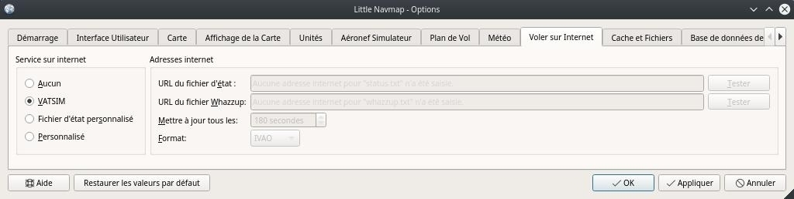

##  Boîte de dialogue Options {#options-dialog}

La plupart des options s'expliquent d'elles-mêmes et les infobulles contiennent des explications plus détaillées, le cas échéant.

Vous pouvez immédiatement vérifier l'effet de vos changements sur l'affichage de la carte en déplaçant la boîte de dialogue `Options` sur le côté et en appuyant sur `Appliquer`.

Le bouton `Restaurer les valeurs par défaut` ne restaure que les options de cette boîte de dialogue. Les autres paramètres tels que l'affichage de la carte, les vues de table ou les positions de la fenêtre d'accueil ne sont pas affectés. Pour réinitialiser complètement tous les paramètres sauvegardés, voir [Dépannage](APPENDIX.md#troubleshoot).

### Démarrage {#startup}

Permet de personnaliser ce qui doit être chargé et affiché au démarrage de l'application _Little Navmap_.

Vous pouvez également configurer la fréquence de la vérification automatique des mises à jour et des canaux. Voir [Vérifier les Mises à Jour](UPDATE.md) pour plus d'informations.

### Interface Utilisateur {#user-interface}

Possède des options pour la taille des textes dans les fenêtres d'information et le plan de vol ainsi que le tableau des résultats de recherche.

Vous pouvez également modifier le style général de l'interface utilisateur graphique. Les styles d'interface utilisateur contiennent un mode ` Night` qui peut être utilisé pour les vols de nuit dans les pièces sombres. Vous pouvez également varier l'intensité de la carte et l'affichage du profil d'élévation.

Un redémarrage n'est pas nécessaire mais recommandé après un changement de style.

Les couleurs des styles `Fusion` et `Night` peuvent être modifiées en éditant les fichiers de configuration. Voir [Personnaliser](CUSTOMIZE.md) pour plus d'informations.

Cet onglet contient également des options pour forcer la langue du programme et les paramètres linguistiques \(nombre, date et heure) à l'anglais si vous ne voulez pas utiliser une interface utilisateur traduite.

_**Image ci-dessus:** Onglet `Interface Utilisateur` en utilisant le style `Night`._

### Carte {#map}

Possède des options de personnalisation liées à la carte. Permet de régler la sensibilité au clic, les distances de zoom et plus encore.

#### Évitez l'affichage flou de la carte en effectuant un zoom arrière pour passer au segment suivant. {#blurred-map}

Cette option permet d'obtenir une image de fond nette pour les cartes en ligne \(par exemple à partir d'OpenStreetMap\) lorsque _Little Navmap_ zoome ou centre des éléments cartographiques tels que les aérodromes, la partie active du plan de vol et autres. Cela fonctionne mieux avec la projection de la carte `Mercator`.

Par conséquent, la carte peut être zoomée plus loin que prévu dans certains cas.

### Afficher la Carte {#map-display}

Cet onglet contient des options pour la taille des symboles et des textes, les couleurs des plans de vol et des trajectoires des aéronefs, etc.

Le côté droit de l'onglet contient une arborescence qui permet de sélectionner les étiquettes de texte qui doivent être affichées dans les aérodromes, les aéronefs utilisateurs et les aéronefs AI/multijoueurs.

_**Image ci-dessus:** Onglet `Affichage de la Carte`._

### Unités {#units}

Vous pouvez changer toutes les unités utilisées par _Little Navmap_ sur cet onglet entre nautique, impérial et métrique.
Des réglages mixtes comme le compteur d'altitude et les miles nautiques pour la distance sont possibles.

Notez que les nombres utilisés dans le programme ne sont pas convertis lors du changement d'unité. Cela signifie que vous allez avoir un tampon d'altitude minimum de 1000 mètres après avoir changé le réglage ` Altitude et Élévation` de pieds en mètres.
Ceci s'applique également à l'altitude du plan de vol. Par conséquent, n'oubliez pas d'adapter ces chiffres après avoir changé d'unité.

### Aéronef Simulateur {#simulator-aircraft}

Permet de changer divers aspects autour de l'affichage de l'aéronef utilisateur en vol. Tous les réglages permettant d'obtenir un affichage plus fluide de l'aéronef utiliseront plus de CPU et peuvent potentiellement induire des bégaiements dans le simulateur.

#### Centrer la carte sur l'aéronef et le prochain waypoint du plan de vol {#simulator-aircraft-center-wp}

La carte est agrandie pour afficher à la fois l'aéronef et le prochain waypoint actif sur le plan de vol si celui-ci est activé en vol. _Little Navmap_ utilise plusieurs critères pour minimiser les mises à jour de la carte dans ce mode.

La carte reviendra au mode par défaut qui consiste simplement à centrer l'aéronef si aucun plan de vol n'est chargé, si l'aéronef est au sol ou si le plan de vol est situé à plus de 50 nm de l'aéronef utilisateur.

#### N'utilisez pas le mode boîte pour suivre l'aéronef. Déplacer la carte en permanence.  {#simulator-aircraft-move-constantly}

La carte suivra l'aéronef constamment lorsqu'elle sera vérifiée. Ceci est également utilisé pour `Centrer la carte sur l'aéronef et le prochain waypoint du plan de vol`.

Cette option fera en sorte que _Little Navmap_ consommera plus de ressources CPU en vol.

#### Taille de la boîte de défilement d'un simulateur d'aéronef (percent of map window size)  {#simulator-aircraft-scroll-box}

Des valeurs plus petites maintiennent l'aéronef centré et déplaceront la carte plus souvent. Des valeurs plus élevées ne mettront à jour la carte à jour que lorsque l'aéronef atteindra la limite de la carte.

Ce réglage est ignoré lorsque l'option `Centrer la carte sur l'aéronef et le prochain waypoint du plan de vol.` est cochée et qu'un plan de vol est défini.

#### Gardez le segment actif sur le dessus de la table du plan de vol {#simulator-aircraft-keep-active}

The active \(magenta\) leg will be shown on top of the flight plan table when a new leg is activated.

#### Permet de faire défiler et de zoomer dans la carte {#simulator-aircraft-allow-scroll-zoom}

La carte cessera de suivre l'aéronef pendant le temps donné si l'utilisateur fait une interaction avec la carte comme le défilement ou le zoom. Vous pouvez rapidement vérifier la destination ou votre progression globale, et après avoir arrêté de vous déplacer, _Little Navmap_ reviendra suivre votre aéronef.

Cette option est également utilisée dans le [Profil d'Élévation du Plan de Vol](PROFILE.md).

**Notez si vous utilisez le mode de centrage d'aéronef par défaut ou si _Little Navmap_ revient à ce mode \(voir ci-dessus\):**

1. L'utilisation de la molette de la souris ou des touches `+` et `-` pour zoomer change et maintient la distance de zoom. L'aéronef est toujours centré mais la nouvelle distance de zoom est utilisée.
2. Commencer à regarder autour de vous en déplaçant la carte à l'aide des touches de déplacement de la souris ou du curseur : Ceci mémorisera la dernière position **et** la distance de zoom. Vous pouvez effectuer n'importe quel mouvement sur la carte et _Little Navmap_ reviendra à la dernière position et à la distance de zoom où vous avez commencé le mouvement lorsque le temps est écoulé

Il en va de même à partir du point 2 si vous sautez aux aérodromes, aides à la navigation ou autres fonctions par double-clic, menu contextuel \(`Afficher sur la carte`\) ou lien cartographique.

Basculer  `Centrer Aéronef` marche et arrêt si vous constatez que la carte saute de nouveau à la mauvaise position.

Cette option est également utilisée dans l'option [Profil d'Élévation du Plan de Vol](PROFILE.md).

#### Sauter de nouveau à l'avion et reprendre le suivi de l'aéronef après ce temps. {#simulator-aircraft-jump-timeout}

Temps jusqu'à ce que le suivi de l'aéronef soit à nouveau activé après une interaction cartographique comme le défilement ou le zoom.

_**Image ci-dessus:** Onglet _`Aéronef Simulateur`_._

### Cache et Fichiers {#cache}

#### Affichage de la Carte {#cache-map-display}

Ici, vous pouvez modifier la taille du cache en RAM et sur le disque. Ces caches sont utilisés pour stocker les images téléchargées à partir des cartes en ligne comme le _OpenStreetMap_, _OpenMapSurfer_ ou _OpenTopoMap_.

Toutes les tuiles d'image expirent après deux semaines et seront rechargées à partir des services en ligne.

Notez qu'une réduction de la taille ou l'effacement du cache disque se fait en arrière-plan et peut prendre un certain temps.

La mémoire cache RAM a une taille minimale de 100 Mo et une taille maximale de 2 Go.

Le cache disque a une taille minimale de 500 Mo et une taille maximale de 8 Go.

#### Profil d'Élévation du Plan de Vol {#cache-elevation}

La partie inférieure de cet onglet permet d'installer les données d'élévation [GLOBE - Global Land One-km Base Elevation Project](https://ngdc.noaa.gov/mgg/topo/globe.html) librement téléchargeables .

Téléchargez l'archive ZIP à partir du lien dans la boîte de dialogue et extrayez-la. Sélectionnez le répertoire extrait à l'aide de `Sélectionnez le reépertoire des fichiers GLOBE ...` de sorte qu'il pointe vers les fichiers `a10g`à `p10g`. L'étiquette dans la boîte de dialogue affichera une erreur si le chemin est invalide.

_**Image ci-dessus:** Onglet `Cache et Fichiers` avec les données d'élévation GLOBE correctement sélectionnées._

### Plan de Vol {#flight-plan}

Si vous pouvez définir des préférences pour le calcul du plan de vol ou ajuster la règle empirique pour l'affichage du haut de la descente.

### Météo {#weather}

Vous pouvez sélectionner les différentes sources météo qui doivent être affichées dans la fenêtre `Informations`  ou dans les infobulles de la carte.

Le type de météo `Flight Simulator` affichera la météo depuis la connexion FSX ou P3D ou depuis le fichier météo X-Planes `METAR.rwx`.

_Active Sky_ ne peut être sélectionné que si _Active Sky Next_, _AS16_ ou _Active Sky pour Prepar3D v4_ sont installés ou si le fichier météo est sélectionné directement. La sélection directe du fichier météo _Active Sky_ peut être utile si vous exécutez une configuration réseau. Utilisez les partages Windows ou un service cloud pour accéder au fichier sur l'ordinateur distant.

Les URLs de la météo NOAA et VATSIM peuvent être modifiées si vous souhaitez utiliser une autre source ou si les services changent les URLs.

Les boutons de test pour les services météorologiques en ligne peuvent également être utilisés pour savoir si _Little Navmap_ peut se connecter à Internet. Vérifiez les paramètres de votre pare-feu si ceux-ci échouent.

_**Image ci-dessus:** Onglet `Météo` avec le fichier météo Active Sky sélectionné manuellement sur un partage réseau._

### Vol Connecté {#online-flying}

Cet onglet permet de modifier les paramètres des réseaux en ligne.

Notez que tous les onglets de fenêtre, les éléments de menu et les boutons de la barre d'outils associés sont masqués si cette option est définie sur  `Aucun`.

Voir [Réseaux connectés](ONLINENETWORKS.md) pour obtenir une vue d'ensemble.

**Tous les réseaux ne peuvent pas être activés en fonction de la version.**

_**Image ci-dessus:** Onglet _`Vol Connecté`_ avec le fichier météo Active Sky sélectionné manuellement sur un partage réseau.._

#### Service Connecté {#online-service}

##### Aucun {#online-service-none}

Désactive tous les services connectés et masque tous les onglets de fenêtre, les éléments de menu et les boutons de la barre d'outils associés. Aucun téléchargement ne sera effectué.

##### VATSIM {#online-service-vatsim}

Utilise la configuration prédéfinie pour le réseau [VATSIM](https://www.vatsim.net). Aucun autre réglage n'est nécessaire.
Le rythme de mise à jour dépend de la configuration et est généralement de trois minutes.

##### IVAO {#online-service-ivao}

Utilise la configuration prédéfinie pour le réseau [IVAO](https://ivao.aero). Aucun autre réglage n'est nécessaire.

Le rythme de mise à jour dépend de la configuration et est généralement de trois minutes.

##### Personnalisé avec Fichier de Statut {#online-service-custom-status}

Cette option permet de se connecter à un réseau privé et téléchargera un fichier `status.txt` au démarrage qui contient d'autres liens vers par exemple le fichier `whazzup.txt`.

##### Personnalisé {#online-service-custom-whazzup}

Cette option permet de se connecter à un réseau privé et téléchargera périodiquement un fichier `whazzup.txt` qui contient des informations sur les clients/aéronefs et centres connectés/ATC.

#### Réglages {#online-service-settings}

##### URL du Fichier de Statut {#online-service-settings-status-url}

URL du fichier `status.txt`. Vous pouvez également utiliser un chemin local comme `C:\Users\YOURUSERNAME\Documents\status.txt`.

Ce fichier n'est téléchargé qu'au démarrage du programme.

Un bouton poussoir `Tester` permet de vérifier si l'URL est valide et affiche les premières lignes du fichier texte téléchargé. Cela ne fonctionne pas avec les chemins locaux.

Le format de fichier d'état est expliqué dans la bibliothèque de documentation IVAO: [Format de fichier de Statut](https://doc.ivao.aero/apidocumentation:whazzup:statusfileformat).

##### URL du fichier Whazzup {#online-service-settings-whazzup-url}

URL du fichier `whazzup.txt`. Vous pouvez également utiliser un chemin local comme `C:\Users\YOURUSERNAME\Documents\whazzup.txt`.

Ce fichier est téléchargé en fonction du taux de mise à jour défini.

Un bouton poussoir `Tester` permet de vérifier si l'URL est valide. Le test ne fonctionne pas avec les chemins locaux.

Le format de fichier whazzup est expliqué dans la bibliothèque de documentation IVAO: [Format de fichier Whazzup](https://doc.ivao.aero/apidocumentation:whazzup:fileformat).

##### Mettre à jour chaque {#online-service-settings-update}

Définit le taux de mise à jour qui définit la fréquence de téléchargement du fichier `whazzup.txt`.

Les valeurs autorisées sont de 30 à 1800 secondes, 180s étant la valeur par défaut.

Vous pouvez utiliser des taux de mise à jour plus faibles pour les réseaux privés en ligne afin d'améliorer l'affichage des mises à jour des cartes.

**N'utilisez pas de taux de mise à jour inférieurs à deux minutes pour les réseaux officiels en ligne. Ils peuvent décider de bloquer l'application si les téléchargements sont excessifs..**

##### Format {#online-service-settings-format}

`IVAO` ou `VATSIM`. Dépend du format utilisé par votre réseau privé. Essayez les deux options en cas de doute.

### Base de Données de la Bibliothèque de Scènes {#scenery-library-database}

Permet de configurer le chargement de la base de données de la bibliothèque de scènes.

Notez que ces trajectoires s'appliquent à tous les simulateurs de vol, FSX, P3D et X-Plane.

Vous devez recharger la base de données de scènes pour que les changements prennent effet.

#### Sélectionner les Chemins à Exclure du Chargement {#scenery-library-database_exclude}

Tous les répertoires y compris les sous-répertoires de cette liste seront omis lors du chargement de la bibliothèque de scènes dans la base de données _Little Navmap_. Vous pouvez également utiliser cette liste pour accélérer le chargement de la base de données si vous excluez les répertoires qui ne contiennent pas d'aérodromes ou de navaids \(classe de terrain, données d'altitude et autres\).

Vous pouvez également exclure les fichiers `BGL` ou `DAT` si nécessaire.

Notez que vous pouvez sélectionner plus d'une entrée dans les boîtes de dialogue des fichiers ou répertoires.

Sélectionnez une ou plusieurs entrées dans la liste et cliquez sur `Supprimer` pour les supprimer de la liste.

#### Sélectionner Chemins pour Exclure la reconnaissance d'Add-on {#scenery-library-database_exclude-add-on}

**FSX/P3D:** Toutes les données de scènes qui se trouvent à l'extérieur du répertoire `Scenery` du simulateur de vol de base sont considérées comme un add-on et seront mises en évidence sur la carte ainsi que prises en compte lors de la recherche d'add-ons.

**X-Plane:** Tous les aérodromes dans le dossier `Custom Scenery` sont considérés comme des aérodromes supplémentaires et seront mis en surbrillance en conséquence.

Vous pouvez utiliser cette liste pour modifier ce comportement.

Ajouts, comme _Orbx FTX Vector_ ou _fsAerodata_ ajoutent des fichiers de scènes qui corrigent certains aspects d'aérodromes comme l'altitude, la variance magnétique ou autres. Tous ces aérodromes seront reconnus comme des aérodromes supplémentaires puisque tous leurs fichiers ne sont pas stockés dans le répertoire `Scènes` du simulateur de vol de base.

Insérez les répertoires ou fichiers correspondants dans cette liste pour éviter de surligner ces aéroports en tant qu'add-ons.

_**Image ci-dessus:** Onglet _`Base de Données de la Bibliothèque de Scènes`_ avec trois répertoires et trois fichiers exclus du chargement et deux répertoires exclus de la reconnaissance des add-on._

#### Exemples

Pourvu que votre simulateur soit installé en  `C:\Games\FSX`.

##### Vecteur ORBX

Exclure les répertoires ci-dessous de la reconnaissance des add-on. Ne les excluez pas du chargement car vous verrez des altitudes aéroportuaires erronées.

* `C:\Games\FSX\ORBX\FTX_VECTOR\FTX_VECTOR_AEC`
* `C:\Games\FSX\ORBX\FTX_VECTOR\FTX_VECTOR_APT`

##### Flight1 Ultimate Terrain Europe

Exclure ces répertoires du chargement pour accélérer le processus :

* `C:\Games\FSX\Scenery\UtEurAirports`
* `C:\Games\FSX\Scenery\UtEurGP`
* `C:\Games\FSX\Scenery\UtEurLights`
* `C:\Games\FSX\Scenery\UtEurRail`
* `C:\Games\FSX\Scenery\UtEurStream`
* `C:\Games\FSX\Scenery\UtEurWater`

##### ORBX Regions

Exclure ces répertoires du chargement :

* `C:\Games\FSX\ORBX\FTX_NZ\FTX_NZSI_07_MESH`
* `C:\Games\FSX\ORBX\FTX_NA\FTX_NA_CRM07_MESH`
* `C:\Games\FSX\ORBX\FTX_NA\FTX_NA_NRM07_MESH`
* `C:\Games\FSX\ORBX\FTX_NA\FTX_NA_PNW07_MESH`
* `C:\Games\FSX\ORBX\FTX_NA\FTX_NA_PFJ07_MESH`
