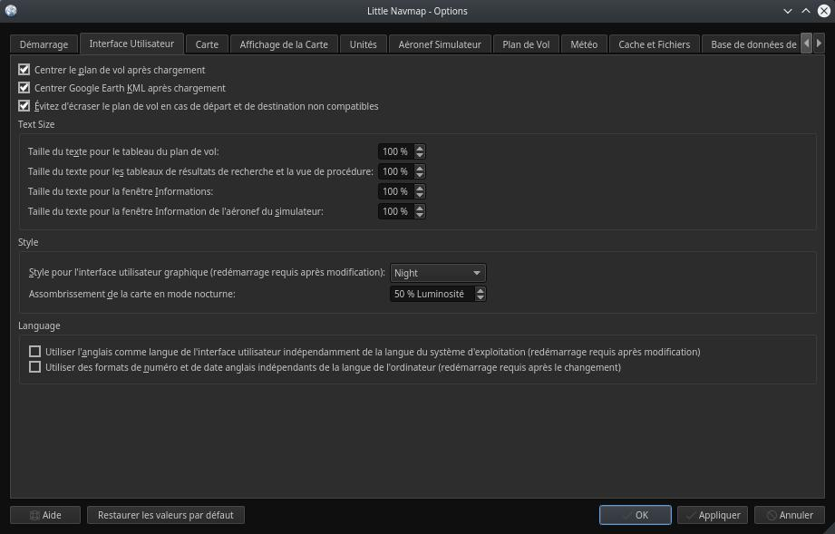
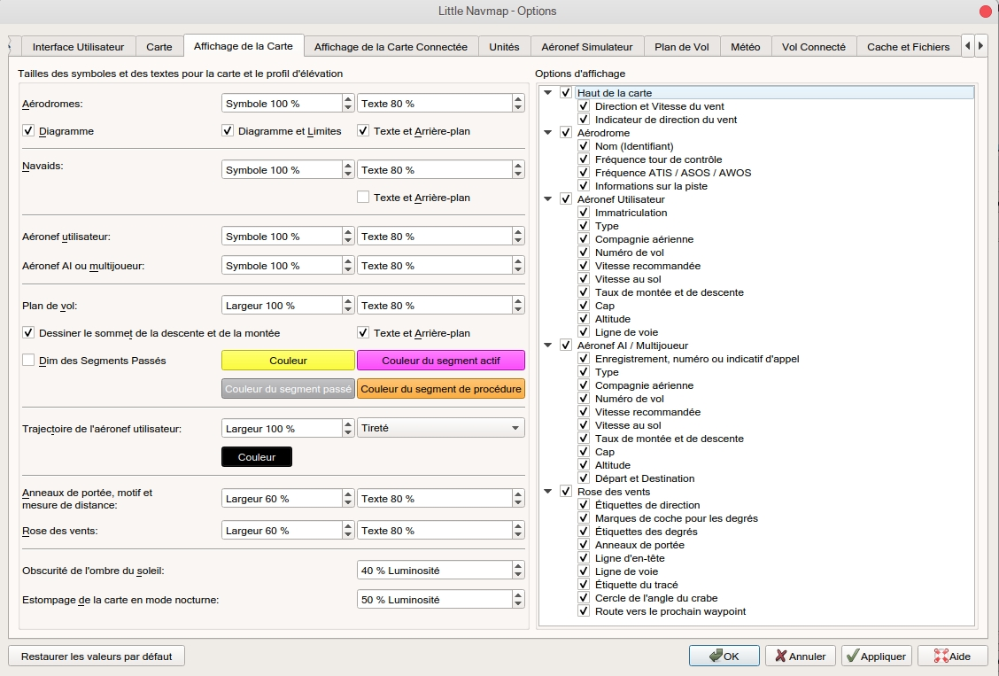
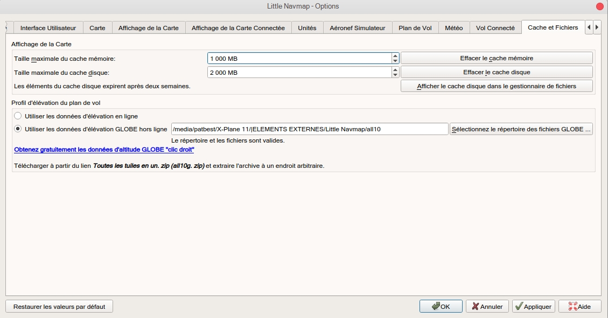
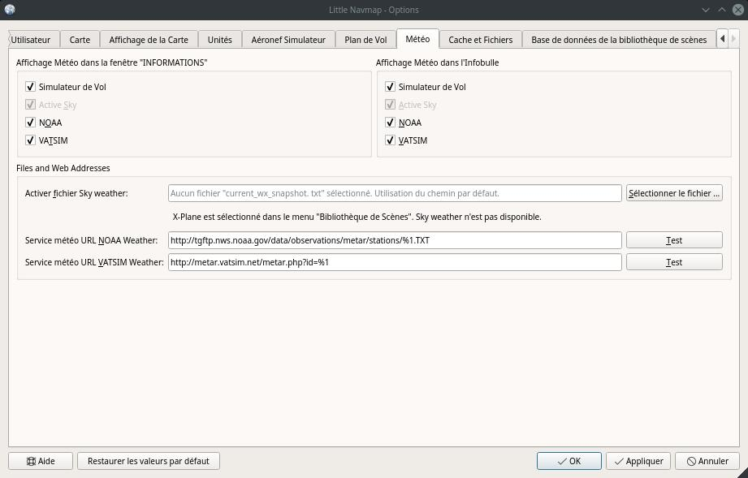

##  Boîte de dialogue Options {#options-dialog}

La plupart des options s'expliquent d'elles-mêmes et les infobulles contiennent des explications plus détaillées, le cas échéant.

Vous pouvez immédiatement vérifier l'effet de vos changements sur l'affichage de la carte en déplaçant la boîte de dialogue `Options` sur le côté et en appuyant sur `Appliquer`.

Le bouton `Restaurer les valeurs par défaut` ne restaure que les options de cette boîte de dialogue. Les autres paramètres tels que l'affichage de la carte, les vues de table ou les positions de la fenêtre d'accueil ne sont pas affectés. Pour réinitialiser complètement tous les paramètres sauvegardés, voir [Dépannage](APPENDIX.md#troubleshoot).

### Démarrage {#startup}

Permet de personnaliser ce qui doit être chargé et affiché au démarrage de l'application _Little Navmap_.

Vous pouvez également configurer la fréquence de la vérification automatique des mises à jour et des canaux. Voir [Vérifier les Mises à Jour](UPDATE.md) pour plus d'informations.

### Interface Utilisateur {#user-interface}

Possède des options pour la taille des textes dans les fenêtres d'information et le plan de vol ainsi que le tableau des résultats de recherche.

Vous pouvez également modifier le style général de l'interface utilisateur graphique. Les styles d'interface utilisateur contiennent un mode ` Nuit` qui peut être utilisé pour les vols de nuit dans les pièces sombres. Vous pouvez également varier l'intensité de la carte et l'affichage du profil d'élévation.

Un redémarrage n'est pas nécessaire mais recommandé après un changement de style.

Les couleurs des styles `Fusion` et `Nuit` peuvent être modifiées en éditant les fichiers de configuration. Voir [Personnaliser](CUSTOMIZE.md) pour plus d'informations.

Cet onglet contient également des options pour forcer la langue du programme et les paramètres linguistiques \(nombre, date et heure) à l'anglais si vous ne voulez pas utiliser une interface utilisateur traduite.

_**Image ci-dessus:** Onglet `Interface utilisateur` en utilisant le style `Nuit`._

### Carte {#map}

Possède des options de personnalisation liées à la carte. Permet de régler la sensibilité au clic, les distances de zoom et plus encore.

### Afficher la Carte {#map-display}

Cet onglet contient des options pour la taille des symboles et des textes, les couleurs des plans de vol et des trajectoires des aéronefs, etc.

Le côté droit de l'onglet contient une arborescence qui permet de sélectionner les étiquettes de texte qui doivent être affichées dans les aérodromes, les aéronefs utilisateurs et les aéronefs AI/multijoueurs.

_**Image ci-dessus:** Onglet `Affichage de la Carte`._

### Unités {#units}

Vous pouvez changer toutes les unités utilisées par _Little Navmap_ sur cet onglet entre nautique, impérial et métrique.
Des réglages mixtes comme le compteur d'altitude et les miles nautiques pour la distance sont possibles.

Notez que les nombres utilisés dans le programme ne sont pas convertis lors du changement d'unité. Cela signifie que vous allez avoir un tampon d'altitude minimum de 1000 mètres après avoir changé le réglage ` Altitude et Élévation` de pieds en mètres.
Ceci s'applique également à l'altitude du plan de vol. Par conséquent, n'oubliez pas d'adapter ces chiffres après avoir changé d'unité.

### Aéronef Simulateur {#simulator-aircraft}

Permet de changer divers aspects autour de l'affichage de l`aéronef utilisateur. Tous les réglages ayant pour résultat un affichage plus fluide de l'aéronef utiliseront plus de CPU et peuvent potentiellement induire des ralentissements dans le simulateur.

### Cache et Fichiers {#cache}

#### Affichage de la Carte {#cache-map-display}

Ici, vous pouvez modifier la taille du cache en RAM et sur le disque. Ces caches sont utilisés pour stocker les images téléchargées à partir des cartes en ligne comme le _OpenStreetMap_, _OpenMapSurfer_ ou _OpenTopoMap_.

Toutes les tuiles d'image expirent après deux semaines et seront rechargées à partir des services en ligne.

Notez qu'une réduction de la taille ou l'effacement du cache disque se fait en arrière-plan et peut prendre un certain temps.

La mémoire cache RAM a une taille minimale de 100 Mo et une taille maximale de 2 Go.

Le cache disque a une taille minimale de 500 Mo et une taille maximale de 8 Go.

#### Profil d'Élévation du Plan de Vol {#cache-elevation}

La partie inférieure de cet onglet permet d'installer les données d'élévation [GLOBE - Global Land One-km Base Elevation Project](https://ngdc.noaa.gov/mgg/topo/globe.html) librement téléchargeables .

Téléchargez l'archive ZIP à partir du lien dans la boîte de dialogue et extrayez-la. Sélectionnez le répertoire extrait à l'aide de `Sélectionnez le reépertoire des fichiers GLOBE ...` de sorte qu'il pointe vers les fichiers `a10g`à `p10g`. L'étiquette dans la boîte de dialogue affichera une erreur si le chemin est invalide.

_**Image ci-dessus:** Onglet `Cache et Fichiers` avec les données d'élévation GLOBE correctement sélectionnées._

### Plan de Vol {#flight-plan}

ci, vous pouvez définir des préférences pour le calcul du plan de vol ou ajuster la règle empirique pour l'affichage du haut de la descente.

### Météo {#weather}

Vous pouvez sélectionner les différentes sources météo qui doivent être affichées dans la fenêtre `Informations`  ou dans les infobulles de la carte.

Le type de météo `Flight Simulator` affichera la météo depuis la connexion FSX ou P3D ou depuis le fichier météo X-Planes `METAR.rwx`.

_Active Sky_ ne peut être sélectionné que si _Active Sky Next_, _AS16_ ou _Active Sky for Prepar3D v4_ sont installés ou si le fichier météo est sélectionné directement. La sélection directe du fichier météo _Active Sky_ peut être utile si vous exécutez une configuration réseau. Utilisez les partages Windows ou un service cloud pour accéder au fichier sur l'ordinateur distant.

Les URLs de la météo NOAA et VATSIM peuvent être modifiées si vous souhaitez utiliser une autre source ou si les services changent les URLs.

Les boutons de test pour les services météorologiques en ligne peuvent également être utilisés pour savoir si _Little Navmap_ peut se connecter à Internet. Vérifiez les paramètres de votre pare-feu si ceux-ci échouent.

_**Image ci-dessus:** Onglet `Météo` avec le fichier météo Active Sky sélectionné manuellement sur un partage réseau._

### Base de Données de la Bibliothèque de Scènes {#scenery-library-database}

Permet de configurer le chargement de la base de données de la bibliothèque de scènes.

Notez que ces trajectoires s'appliquent à tous les simulateurs de vol, FSX, P3D et X-Plane.

Vous devez recharger la base de données de scènes pour que les changements prennent effet.

#### Sélectionner les chemins à exclure du chargement {#scenery-library-database_exclude}

Tous les répertoires y compris les sous-répertoires de cette liste seront omis lors du chargement de la bibliothèque de scènes dans la base de données _Little Navmap_. Vous pouvez également utiliser cette liste pour accélérer le chargement de la base de données si vous excluez les répertoires qui ne contiennent pas d'aérodromes ou des navaids (classe de terrain, données d'élévation et autres).

#### Sélectionnez les chemins pour exclure la reconnaissance des add-on. {#scenery-library-database_exclude-add-on}

Toutes les données de scènes qui se trouvent à l'extérieur du répertoire `Scenery` du simulateur de vol de base sont considérées comme un add-on et seront mises en évidence sur la carte et également prises en compte lors de la recherche d'add-ons.

Vous pouvez utiliser cette liste pour modifier ce comportement.

Les add-ons, comme _Orbx FTX Vector_ ou _fsAerodata_ ajoutent des fichiers de scènes qui corrigent certains aspects. des aérodromes comme l'altitude, la variance magnétique ou autres. Tous ces aérodromes seront reconnus comme des aérodromes supplémentaires. puisque tous leurs fichiers ne sont pas stockés dans le répertoire `Scenery` du simulateur de vol de base.

Insérez le répertoire correspondant dans cette liste pour éviter de surligner ces aérodromes en tant qu'add-ons.

_**Image ci-dessus:** Onglet `Base de données de la bibliothèque des scènes` avec trois répertoires exclus du chargement et deux répertoires exclus de la reconnaissance des add-on._

#### Exemples

Pourvu que votre simulateur soit installé en  `C:\Games\FSX`.

##### Vecteur ORBX

Exclure les répertoires ci-dessous de la reconnaissance des add-on. Ne les excluez pas du chargement car vous verrez des altitudes aéroportuaires erronées.

* `C:\Games\FSX\ORBX\FTX_VECTOR\FTX_VECTOR_AEC`
* `C:\Games\FSX\ORBX\FTX_VECTOR\FTX_VECTOR_APT`

##### Flight1 Ultimate Terrain Europe

Exclure ces répertoires du chargement pour accélérer le processus :

* `C:\Games\FSX\Scenery\UtEurAirports`
* `C:\Games\FSX\Scenery\UtEurGP`
* `C:\Games\FSX\Scenery\UtEurLights`
* `C:\Games\FSX\Scenery\UtEurRail`
* `C:\Games\FSX\Scenery\UtEurStream`
* `C:\Games\FSX\Scenery\UtEurWater`

##### ORBX Regions

Exclure ces répertoires du chargement :

* `C:\Games\FSX\ORBX\FTX_NZ\FTX_NZSI_07_MESH`
* `C:\Games\FSX\ORBX\FTX_NA\FTX_NA_CRM07_MESH`
* `C:\Games\FSX\ORBX\FTX_NA\FTX_NA_NRM07_MESH`
* `C:\Games\FSX\ORBX\FTX_NA\FTX_NA_PNW07_MESH`
* `C:\Games\FSX\ORBX\FTX_NA\FTX_NA_PFJ07_MESH`
