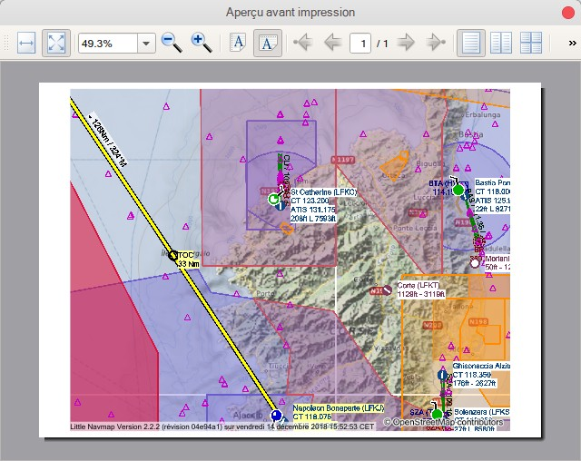

## Impression {#printing}

###  Imprimer Carte {#printing-the-map}

Ouvre la boîte de dialogue d'aperçu avant impression permettant d'imprimer la vue actuelle de la carte.

_**Image ci-dessus:** Dialogue d'aperçu avant impression pour la carte actuelle._

###  Imprimer Plan de Vol {#printing-the-flight-plan}

Permet d'imprimer le plan de vol en cours ainsi que les informations sur l'aérodrome de départ et de destination.

#### Options

* `Imprimer l'en-tête de la table`: Ajoute un en-tête montrant le départ, la destination et d'autres informations comme l'étiquette en haut de l'onglet "Plan" dans la fenêtre flottante "Plan de vol".
* `Imprimer le rapport sur le carburant`: Imprimez le rapport de calcul de carburant à partir de l'onglet ` Aéronef ` dans la fenêtre d'accueil ` Plan de vol `.
* `Nouvelle page après chaque chapitre`: Ajouter un saut de page après l'en-tête, le plan de vol, le rapport sur le carburant et l'information sur l'aérodrome.
* `Taille du texte`: Permet d'augmenter ou de diminuer la taille de tous les textes sauf le tableau du plan de vol.

#### Plan de Vol

* `Imprimer le tableau du plan de vol`: Ajoute le plan de vol à l'impression.
* `Taille du texte`: Augmenter ou diminuer la taille du texte du tableau du plan de vol.
* `Sélectionner les colonnes du plan de vol à imprimer`: Cliquez sur les noms pour inclure ou exclure les colonnes du plan de vol.

#### Options pour le Départ et la Destination

* `Aperçu`: Imprime la vue d'ensemble de l'aérodrome comme indiqué dans la fenêtre `Information` sur l'onglet `Aérodrome`.
* `Pistes / Héliports`: Imprime des informations sur les pistes d'atterrissage et les héliports.
* `Inclure les pistes à surface molle`: Inclut les pistes à surface molle comme l'herbe, gravier et autres.
* `Informations détaillées sur la piste`: Inclure des informations détaillées sur les extrémités de piste, comme pour l'approche, l'éclairage, les types VASI, les informations ILS et plus encore.
* `Fréquences COM`: Inclure les fréquences de communication comme la tour, ATIS, UNICOM et autres.
* `Procédures`: Imprimez les informations de procédure comme indiqué dans l'onglet `Procédures` de la fenêtre `Informations`.
* `Météo`: Imprime la météo décodée pour toutes les sources activées comme indiqué sur l'onglet `Météo` dans la fenêtre `Informations`.

#### Options Générales

* `Imprimer le plan de vol`: Imprimer le plan de vol tel que vu dans le tableau du plan de vol.
* `Taille du texte`: Réduire la taille du texte pour éviter les sauts de ligne inutiles ou l'augmenter pour une meilleure lecture.

_**Image ci-dessus:** Boîte de dialogue d'impression des options du plan de vol._

