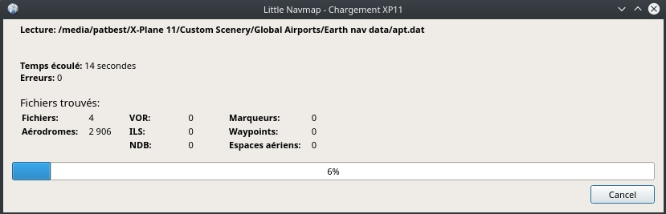

##  Boîte de Dialogue - Charger la Bibliothèque de Scènes {#load-scenery-library-dialog}

Cette boîte de dialogue permet de charger les données de la bibliothèque de scènes des quatre simulateurs de vol pris en charge dans la base de données interne _Little Navmap_. La bibliothèque de scènes à charger peut être sélectionnée dans la liste déroulante `Simulateur:`.

La boîte de dialogue affiche des informations sur la base de données actuellement sélectionnée, y compris le nombre d'aérodromes chargés, la version de la base de données et plus encore.

**FSX et P3D seulement:** Le chemin de base et le chemin `scenery.cfg` seront affichés dans deux champs d'édition de texte pour le simulateur actuellement sélectionné. Ces champs sont remplis automatiquement, mais peuvent être changés à n'importe quel autre endroit valide. Toutes les valeurs sont sauvegardées pour chaque type de simulateur de vol.

**X-Plane seulement:** X-Plane ne peut pas être reconnu automatiquement. Vous devez sélectionner le chemin de base manuellement.
Sous Windows, cela peut être un chemin comme `C:\Simulateurs\X-Plane 11` où l'exécutable est  `C:\Simulateurs\X-Plane 11\X-Plane.exe`.

Le chargement d'une bibliothèque de scènes peut prendre de 2 à 15 minutes selon votre configuration et le nombre d'ajouts de scènes. Vous pouvez accélérer ce processus en excluant les répertoires ne contenant ni les données d'aérodrome ni les données de navigation dans la boîte de dialogue ` Options` de l'onglet ` Base de données de la bibliothèque de scènes`.

Tous les aérodromes qui ne sont pas situés dans le répertoire `Scenery` par défaut de FSX/P3D ou qui sont situés dans le répertoire `Custom Scenery` de X-Plane sont considérés comme des aérodromes complémentaires et seront mis en évidence de façon appropriée. Les répertoires peuvent être exclus de ce comportement dans la boîte de dialogue `Options`de l'onglet `Base de données de la bibliothèque de scènes`. Ceci peut être utile si les ajouts ne font que corriger l'altitude de l'aérodrome et que ces aérodromes ne devraient pas être mis en évidence sur la carte à l'aide de soulignement et de texte en italique.

Voir [Options](OPTIONS.md#scenery-library-database) pour plus d'informations sur l'exclusion des scènes.

La base de données de la bibliothèque de scènes précédente sera restaurée immédiatement si vous annulez le processus de chargement ou si le processus de chargement échoue.

Le menu `Bibliothèque de Scènes` -&gt; `Flight Simulators` est synchronisé avec la sélection du simulateur dans la boîte de dialogue. Une fois qu'une base de données est chargée avec succès, l'affichage, le plan de vol et la recherche passeront aux données du simulateur nouvellement chargées.

Notez que le nombre d'aérodromes, de navaids et d'autres objets affichés dans la `Charger la Bibliothèque de Scènes` sera différent des nombres affichés dans la boîte de dialogue de progression puisqu'un processus séparé supprime les doublons après le chargement.

La boîte de dialogue de progression affiche tous les objets trouvés pendant le chargement. La boîte de dialogue `Charger la Bibliothèque de Scènes` montre le nombre d'objets dans la base de données après avoir supprimé les doublons et supprimé les aérodromes de stock qui ont été remplacés par des add-ons.

**FSX ou P3D only:** Le programme essaie de trouver les chemins de base et les fichiers `Scenery.cfg` automatiquement. Les emplacements typiques du `Scenery.cfg` pour Windows 7/8/10 sont :

* **Flight Simulator X:** `C:\ProgramData\Microsoft\FSX\Scenery.cfg`
* **Flight Simulator - Steam Edition:** `C:\ProgramData\Microsoft\FSX-SE\Scenery.cfg`
* **Prepar3D v2:** `C:\Users\YOUR_ACCOUNT_NAME\AppData\Roaming\Lockheed Martin\Prepar3D v2\Scenery.cfg`
* **Prepar3D v3:** `C:\ProgramData\Lockheed Martin\Prepar3D v3\Scenery.cfg`
* **Prepar3D v4:** `C:\ProgramData\Lockheed Martin\Prepar3D v4\Scenery.cfg`

Une boîte de dialogue d'erreur s'affiche après le chargement si des fichiers n'ont pas pu être lus ou si des répertoires n'ont pas été trouvés. Dans ce cas, vous devez vérifier si les aérodromes des scènes affectées s'affichent correctement et montrent les informations correctes. La boîte de dialogue d'erreur permet de copier et coller du texte formaté, ce qui est utile pour signaler les erreurs.

La boîte de dialogue `Charger la Bibliothèque de Scènes` affiche la dernière fois du chargement \(`Dernière mise à jour:`\), le programme et la version de la base de données. Les principales différences de version de base de données montrent des bases de données incompatibles. Le programme demandera si les bases de données incompatibles peuvent être effacées au démarrage avant que la base de données de scènes puisse être rechargée. Les différences mineures entre les bases de données montrent les changements compatibles lorsqu'une recharge est recommandée mais non requise.

### Les Aérodromes dans X-Plane et Navdata {#load-scenery-library-dialog-xp-apt-navdata}

*Little Navmap* lit les données de l'aérodrome et les données navaid à partir des fichiers `*.dat` de X-Plane. Pour vérifier une version d'un fichier, vous pouvez l'ouvrir dans un éditeur de texte capable de traiter des fichiers volumineux. Les premières lignes du fichier ressembleront à :

```
A
1100 Généré par WorldEditor 1.6.0r1

1   1549 0 0 0A4 Johnson City STOLport
...
```
Le premier chiffre de la deuxième ligne est la version du fichier. Le voici `1100`.

*Little Navmap* peut lire les fichiers de scènes X-Plane suivants:

* **Aérodromes \(**`apt.dat`**\):** Version 850 jusqu'à 1100. Ceci couvre les aérodromes X-Plane 10 et les scènes plus anciennes. Les fichiers plus récents que 1100 peuvent fonctionner mais ne sont pas testés.
* **Navdata \(**`earth_awy.dat`**, **`earth_fix.dat`** et **`earth_nav.dat`**\):** Version 850 jusqu'à 1100. Ceci exclut les fichiers de données de navigation X-Plane 10. Les fichiers plus récents que 1100 peuvent fonctionner mais ne sont pas testés.
* **Procédures \(**`ICAO.dat`** dans le répertoire **`CIFP`**\):** Toutes les procédures de X-Plane 11.
* **Espaces Aériens \(**`*.txt`**\):** Les inclusions `usa.txt` et tous les fichiers au format OpenAir. Voir le chapitre suivant pour plus d'informations.

De plus, les fichiers `user_fix.dat` et `user_nav.dat` dans le répertoire X-Plane `Custom Data` sont lus.

### Espaces Aériens dans X-Plane (Airspaces) {#load-scenery-library-dialog-xp-airspaces}

Tous les fichiers dans [OpenAir airspace format](http://www.winpilot.com/UsersGuide/UserAirspace.asp) sera chargé lors de la lecture de la bibliothèque de scènes X-Plane.

Vous pouvez également copier des espaces aériens à partir d'une base de données FSX ou Prepar3D si vous possédez ces simulateurs. Voir [Copy Airspaces to X-Plane Database](MENUS.md#copy-airspaces-to-xplane).

Notez que les fichiers d'espace aérien peuvent contenir des erreurs qui peuvent empêcher le chargement d'un fichier d'espace aérien. Ces erreurs dures sont signalées après le chargement de la bibliothèque de scènes. Les autres erreurs n'affectant que des espaces aériens individuels ou la géométrie ne sont rapportées que dans le fichier journal.

X-Plane 11 est livré avec un seul fichier d'espace aérien que l'on peut trouver dans le répertoire `VOTRE_RÉPERTOIRE_X-PLANE/Resources/default data/airspaces/usa.txt`.
D'autres fichiers de l'espace aérien peuvent être téléchargés à partir de la page d'accueil [OpenAirspace Directory](http://www.winpilot.com/openair/index.asp), [Soaring Services](http://soaringweb.org/), [openAIP](https://www.openaip.net/) ou [Luftraumdaten Deutschland](https://www.daec.de/fachbereiche/luftraum-flugbetrieb/luftraumdaten) par exemple.

Les fichiers de l'espace aérien doivent avoir une extension `.txt` et sont chargés à partir des répertoires suivants par *Little Navmap*:

* `YOUR_XPLANE_DIRECTORY/Resources/default data/airspaces`
* `YOUR_XPLANE_DIRECTORY/Custom Data/Airspaces`
* `YOUR_ACCOUNT_NAME/Documents/Little Navmap/X-Plane Airspaces` où `Documents` est le répertoire des documents dans votre langue.

Les fichiers peuvent être encodés dans n'importe quel format [UTF](https://en.wikipedia.org/wiki/Unicode#UTF) mais doit avoir un format [BOM](https://en.wikipedia.org/wiki/Byte_order_mark) pour être reconnu correctement. Sinon, le codage ANSI Windows \(`Windows-1252`\) est utilisé. Les caractères spéciaux comme les trémas ou les accents ne sont pas affichés correctement dans les noms si l'encodage n'est pas correct. Toutes les autres fonctionnalités ne sont pas affectées.

Vous pouvez convertir les fichiers en utilisant n'importe quel éditeur avancé comme [Notepad++](https://notepad-plus-plus.org/) par exemple.

Les espaces aériens apparaissent en double sur la carte si un fichier d'espace aérien se trouve dans plus d'un de ces répertoires.

**Placez les fichiers dans les `Documents/Little Navmap/X-Plane Airspaces` si vous constatez que l'aéronef X-Plane s'écrase lors du chargement de certains fichiers de l'espace aérien. De cette façon, les espaces aériens sont au moins disponibles dans *Little Navmap* qui est plus tolérant aux erreurs.**

### Options de la boîte de dialogue du Chargement de la Bibliothèque de Scènes {#load-scenery-library-dialog-options}

* `Simulateur` : Sélectionne le simulateur pour charger et afficher les statistiques de la base de données dans l'étiquette ci-dessus.
* `Réinitialiser tous les chemins`: Réinitialiser tous les chemins d'accès aux valeurs par défaut.
* `Chemin de base du simulateur de vol` et `Sélectionner ...`: Le chemin vers le répertoire de base du simulateur de vol sélectionné. C'est généralement le répertoire contenant le `FSX.exe` ou `Prepar3D.exe`. C'est la base de tous les chemins relatifs trouvés dans le fichier `scenery.cfg`.
* `Fichier de configuration des scènes` et `Sélectionner ...` \(uniquement FSX et P3D\): Le fichier `scenery.cfg` du simulateur. Vous pouvez également créer des copies du fichier original, les modifier en supprimant ou en ajoutant des scènes et les sélectionner ici pour le chargement.
* `Lire les entrées de scènes inactives` \(uniquement FSX et P3D\): Ceci lira toutes les entrées de scènes, même celles qui sont inactives/désactivées. Ceci est utile si vous utilisez un outil pour désactiver les scènes avant de voler mais que vous voulez quand même voir toutes les scènes supplémentaires dans _Little Navmap_ sans recharger.
* `Lire les paquets Prepar3D add-on.xml` \(uniquement P3D v3 et v4\): S'il est activé, lit P3D v4 ou v3 `add-on.xml` paquets. Ceux-ci sont lus à partir des sous-répertoires `C:\Users\YOURUSERNAME\Documents\Prepar3D v4 Files\add-ons` et `C:\Users\YOURUSERNAME\Documents\Prepar3D v4 Add-ons`.
* `Charger`: Démarre le processus de chargement de la base de données. Vous pouvez arrêter le processus de chargement à tout moment et la base de données précédente sera restaurée. La boîte de dialogue sera fermée et le programme passera à l'affichage de la base de données chargée une fois qu'elle a été chargée avec succès.
* `Fermer` : Conserve tous les réglages et changements dans la boîte de dialogue et la ferme sans rien charger.


_**Image ci-dessus:** Boîte de dialogue de chargement de la scène. Les données de scènes sont déjà chargées pour FSX._



_**Image ci-dessus:** Boîte de dialogue Progression affichée lors du chargement de la bibliothèque de scènes dans la base de données interne de Little Navmap._

